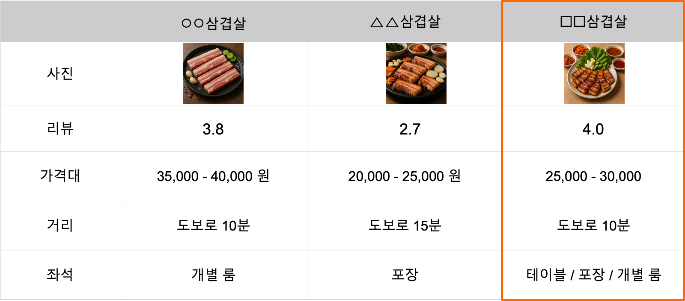
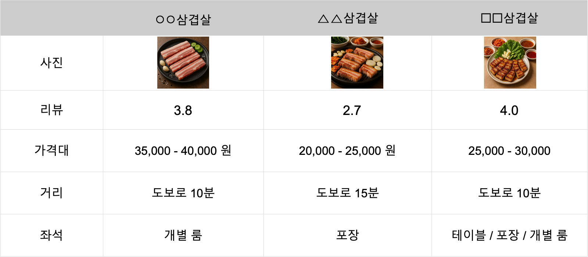

## 학습 목표

- 시각적 분석(Visual Analytics)의 개념을 이해합니다.
- 비즈니스 인텔리전스(Business Intelligence, BI)의 기본 개념을 익힙니다.
- 비즈니스 인텔리전스의 필요성과 활용 가치를 이해합니다.

## 목차

1. 시각적 분석(Visual Analytics)이란?
2. 비즈니스 인텔리전스의 개념과 중요성

## 1. 시각적 분석(Visual Analytics)이란?

### 1-1. 일상 속의 데이터 시각화

우리는 일상생활에서도 이미 다양한 형태의 데이터 시각화를 경험하고 있습니다. 시각화는 특별한 분석 도구 안에서만 존재하는 것이 아니라, 우리가 빠르게 비교하고 판단해야 하는 수많은 상황 속에 자연스럽게 녹아 있습니다.

#### 1. 맛집을 찾을 때

예를 들어 맛집을 찾는 상황을 생각해 보겠습니다. 우리는 검색 결과 화면에서 음식 사진, 리뷰 수, 평점, 가격대, 거리, 영업시간, 좌석 정보 등을 한눈에 비교합니다. 이 과정은 단순한 정보 나열이 아니라, 서로 다른 속성의 데이터를 시각적으로 배열하여 비교 가능한 형태로 보여주는 예입니다.

이때 사용자는 모든 텍스트를 처음부터 끝까지 읽지 않습니다. 대신 눈에 먼저 들어오는 이미지, 별점, 가격 표시, 거리 같은 시각적 단서를 바탕으로 빠르게 후보를 좁혀 갑니다. 즉, 이미 시각화를 기반으로 의사결정을 하고 있는 것입니다.

#### 2. 목적지로 이동할 때

지도 서비스도 대표적인 시각적 분석 사례입니다. 우리는 네이버 지도, 구글맵, 카카오맵 등에 목적지를 입력한 뒤 지도 위에 표시된 경로, 예상 시간, 교통 상황을 보고 이동 경로를 선택합니다.

이 과정 역시 데이터 시각화의 한 형태입니다. 지도 서비스는 방대한 지도 데이터와 실시간 교통 데이터를 시각적으로 표현하고, 사용자는 이를 바탕으로 어떤 경로가 가장 빠르고 효율적인지 판단합니다.

중요한 점은, 데이터가 올바르게 표현되지 않으면 의사결정도 잘못될 수 있다는 사실입니다. 경로 정보가 부정확하거나, 시각적으로 잘못 강조되거나, 핵심 정보가 묻히면 사용자는 잘못된 선택을 할 가능성이 높아집니다.

즉, 시각화는 단순히 예쁘게 보여주는 작업이 아니라, 정보를 올바르게 전달하고 판단을 돕는 과정입니다.

### 1-2. 시각화를 해야 하는 이유

사람이 시각화에 강하게 반응하는 이유는 인간의 인지 구조와도 관련이 있습니다. 눈으로 들어온 시각 정보는 시신경을 거쳐 후두부에 위치한 시각 피질(Visual Cortex)에서 처리됩니다.

시각 피질은 망막에서 전달된 정보를 빠르게 수신하고 통합 처리하는 뇌의 주요 영역입니다. 이 과정에서 정보는 매우 짧은 시간 안에 감각 기억으로 들어오고, 그중 주목할 만한 정보만 선택되어 단기 기억으로 넘어갑니다.

일반적으로 감각 기억은 약 0.2초에서 0.5초 사이의 매우 짧은 시간 동안 정보를 보유합니다. 이후 색상, 크기, 모양, 위치처럼 눈에 잘 띄는 특징을 가진 요소는 단기 기억으로 넘어가며, 단기 기억은 보통 약 7개 안팎의 항목을 10초에서 15초 정도 유지합니다.

이 말은 곧, 시각화에서 어떤 정보를 강조하느냐가 정보 전달 속도와 정확도에 직접적인 영향을 준다는 뜻입니다. 사람이 한 번에 모든 정보를 읽고 이해하는 것은 어렵지만, 특정 패턴이나 색상 차이는 매우 빠르게 감지할 수 있습니다.

다음 예시를 보겠습니다.

예를 들어 여러 숫자 속에서 특정 숫자만 색상으로 강조하면, 사용자는 훨씬 빠르게 해당 정보를 찾아냅니다. 크기, 색상, 모양과 같은 시각적 요소는 단순 장식이 아니라 인지 효율을 높이는 핵심 장치입니다.

정리하면, 시각화를 해야 하는 이유는 사람이 시각 정보를 텍스트보다 더 빠르게 인식하고 비교할 수 있기 때문입니다. 데이터가 많아질수록 이 차이는 더 커집니다.

> Visual Analytics는 인간의 시각적 지각 능력을 활용하여 데이터를 표현하고 분석하는 과정입니다.

## 2. 비즈니스 인텔리전스의 개념과 중요성

### 2-1. 비즈니스 인텔리전스란?

비즈니스 인텔리전스(Business Intelligence, BI)는 조직 내 다양한 비즈니스 데이터를 수집하고, 정리하고, 분석하고, 시각화하여 실행 가능한 통찰을 만드는 기술과 전략, 그리고 프로세스를 의미합니다.

즉, BI의 핵심은 단순히 데이터를 저장하는 것이 아니라, 의사결정에 사용할 수 있는 정보로 가공하는 데 있습니다. 기업은 매출, 고객, 마케팅, 운영, 재고, 인사 등 수많은 데이터를 축적하지만, 이 데이터가 정리되지 않은 상태로 존재하면 실제 업무에는 큰 도움이 되지 않습니다.

BI는 보통 다음과 같은 과정을 포함합니다.

- 데이터 수집
- 데이터 축적
- 데이터 정리 및 변환
- 데이터 분석
- 데이터 시각화
- 보고서 및 대시보드 작성
- 공유와 협업
- 실시간 모니터링

이러한 과정을 통해 조직은 "무슨 일이 일어났는가"를 넘어서 "왜 일어났는가", "무엇을 해야 하는가"에 대한 답을 찾을 수 있습니다.

### 2-2. 대표적인 BI 도구

현재 시장에는 다양한 BI 도구가 존재합니다. 대표적으로 Microsoft의 Power BI, Salesforce의 Tableau, Google의 Looker Studio 등을 들 수 있습니다.

각 도구는 강점이 조금씩 다릅니다.

| 도구 | 제공사 | 특징 |
| --- | --- | --- |
| Tableau | Salesforce | 강력한 시각화, 활발한 커뮤니티, 풍부한 교육 자료 |
| Power BI | Microsoft | Excel 친화적, Microsoft 생태계와 강한 연동 |
| Looker Studio | Google | BigQuery, Google Spreadsheet와 손쉬운 연동 |

이 책에서 다루는 Tableau는 특히 시각화 표현력과 탐색형 분석 경험에서 높은 강점을 가지는 도구입니다. 사용자가 직접 드래그 앤 드롭 방식으로 차트를 만들고, 필터와 계산을 적용하며, 데이터를 여러 관점에서 탐색하기에 적합합니다.

### 2-3. 비즈니스 인텔리전스가 왜 중요한가?

#### 1. 데이터 소비량 증가

오늘날 기업이 다뤄야 하는 데이터의 양은 빠르게 증가하고 있습니다. 온라인 서비스, 모바일 앱, 전자상거래, IoT, 협업 도구 등 거의 모든 활동이 데이터로 남기 때문에, 조직은 과거와 비교할 수 없을 정도로 많은 데이터를 축적하고 있습니다.

데이터가 늘어난다는 것은 곧 분석 가능성이 커진다는 뜻이기도 하지만, 동시에 사람이 원시 데이터를 직접 읽고 해석하기는 점점 더 어려워진다는 의미이기도 합니다. 따라서 데이터를 정리하고, 핵심을 추출하고, 의사결정 가능한 형태로 보여주는 BI의 역할이 더욱 중요해집니다.

#### 2. 기업의 데이터 활용 능력 부족

흥미로운 점은, 데이터가 많아졌다고 해서 모든 기업이 데이터를 잘 활용하는 것은 아니라는 사실입니다. 실제로 많은 조직이 데이터를 보유하고 있음에도 불구하고, 이를 실질적인 인사이트로 연결하지 못합니다.

이 현상은 몇 가지 이유에서 발생합니다.

- 데이터가 여러 시스템에 흩어져 있음
- 실무자가 직접 분석하기 어려운 구조임
- 보고 체계가 수작업 중심으로 운영됨
- 필요한 시점에 필요한 데이터를 빠르게 볼 수 없음

결국 조직은 데이터를 보유하고도 활용하지 못하는 상태에 머무르게 됩니다. 이런 상황에서는 데이터가 많아질수록 오히려 혼란이 커질 수 있습니다.

BI는 이런 문제를 해결하기 위한 실무적 접근입니다. 데이터를 연결하고, 정리하고, 시각화하여, 조직 구성원이 더 빠르고 더 일관된 기준으로 의사결정을 내릴 수 있도록 돕기 때문입니다.

## 정리

이 절에서는 시각적 분석이 왜 중요한지, 그리고 비즈니스 인텔리전스가 무엇인지 살펴보았습니다.

핵심은 두 가지입니다.

첫째, 사람은 시각적으로 표현된 정보를 훨씬 빠르게 이해하고 비교할 수 있습니다.  
둘째, 기업은 방대한 데이터를 단순히 보유하는 것만으로는 충분하지 않으며, 이를 실행 가능한 정보로 전환하는 BI 체계가 필요합니다.

이제 다음 절에서는 BI 도구 중 하나인 Tableau가 어떤 특징을 가진 도구인지 본격적으로 살펴보겠습니다.
