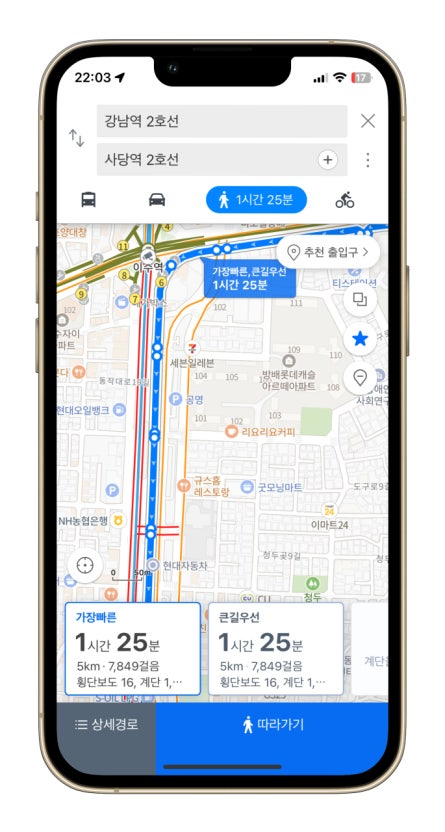
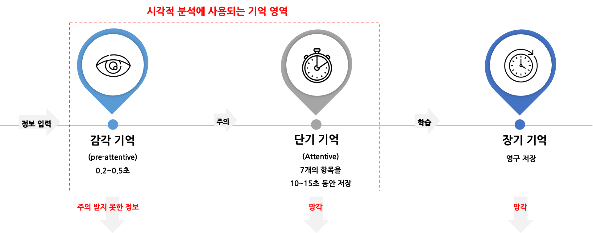
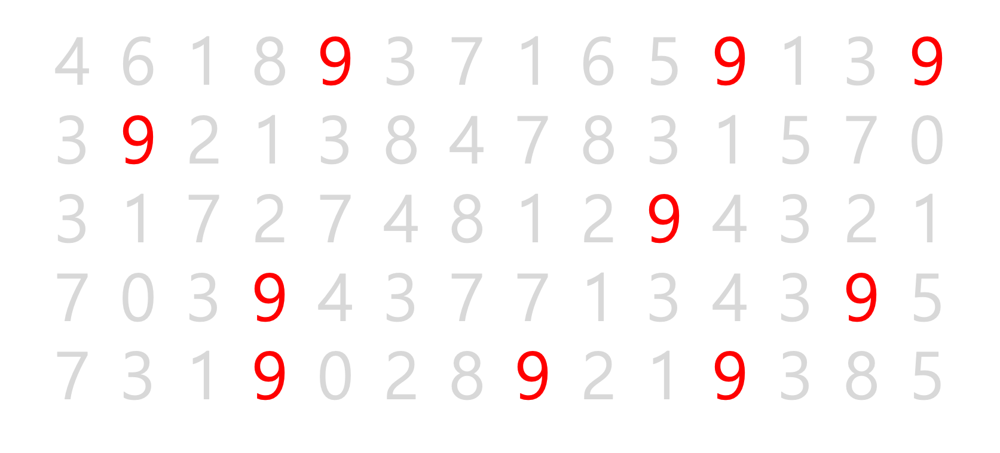

## 학습 목표

- 시각적 분석(Visual Analytics)의 개념을 이해합니다.
- 우리가 일상에서 이미 시각화를 기반으로 판단하고 있다는 점을 이해합니다.
- 시각화가 정보 전달 속도와 정확도에 어떤 영향을 주는지 설명할 수 있습니다.

## 목차

1. 시각적 분석(Visual Analytics)이란?
2. 시각화를 해야 하는 이유

## 1. 시각적 분석(Visual Analytics)이란?

### 1-1. 일상 속의 데이터 시각화

우리는 일상생활에서도 이미 다양한 형태의 데이터 시각화를 경험하고 있습니다. 시각화는 특별한 분석 도구 안에서만 존재하는 것이 아니라, 우리가 빠르게 비교하고 판단해야 하는 수많은 상황 속에 자연스럽게 녹아 있습니다.

#### 1. 맛집을 찾을 때

예를 들어 맛집을 찾는 상황을 생각해 보겠습니다. 우리는 검색 결과 화면에서 음식 사진, 리뷰 수, 평점, 가격대, 거리, 영업시간, 좌석 정보 등을 한눈에 비교합니다. 이 과정은 단순한 정보 나열이 아니라, 서로 다른 속성의 데이터를 시각적으로 배열하여 비교 가능한 형태로 보여주는 예입니다.

이때 사용자는 모든 텍스트를 처음부터 끝까지 읽지 않습니다. 대신 눈에 먼저 들어오는 이미지, 별점, 가격 표시, 거리 같은 시각적 단서를 바탕으로 빠르게 후보를 좁혀 갑니다. 즉, 이미 시각화를 기반으로 의사결정을 하고 있는 것입니다.

#### 2. 목적지로 이동할 때

지도 서비스도 대표적인 시각적 분석 사례입니다. 우리는 네이버 지도, 구글맵, 카카오맵 등에 목적지를 입력한 뒤 지도 위에 표시된 경로, 예상 시간, 교통 상황을 보고 이동 경로를 선택합니다.

이 과정 역시 데이터 시각화의 한 형태입니다. 지도 서비스는 방대한 지도 데이터와 실시간 교통 데이터를 시각적으로 표현하고, 사용자는 이를 바탕으로 어떤 경로가 가장 빠르고 효율적인지 판단합니다.

중요한 점은, 데이터가 올바르게 표현되지 않으면 의사결정도 잘못될 수 있다는 사실입니다. 경로 정보가 부정확하거나, 시각적으로 잘못 강조되거나, 핵심 정보가 묻히면 사용자는 잘못된 선택을 할 가능성이 높아집니다.

즉, 시각화는 단순히 예쁘게 보여주는 작업이 아니라, 정보를 올바르게 전달하고 판단을 돕는 과정입니다.

## 2. 시각화를 해야 하는 이유

### 2-1. 인간은 시각 정보에 빠르게 반응합니다

사람이 시각화에 강하게 반응하는 이유는 인간의 인지 구조와도 관련이 있습니다. 눈으로 들어온 시각 정보는 시신경을 거쳐 후두부에 위치한 시각 피질(Visual Cortex)에서 처리됩니다.

시각 피질은 망막에서 전달된 정보를 빠르게 수신하고 통합 처리하는 뇌의 주요 영역입니다. 이 과정에서 정보는 매우 짧은 시간 안에 감각 기억으로 들어오고, 그중 주목할 만한 정보만 선택되어 단기 기억으로 넘어갑니다.

일반적으로 감각 기억은 약 0.2초에서 0.5초 사이의 매우 짧은 시간 동안 정보를 보유합니다. 이후 색상, 크기, 모양, 위치처럼 눈에 잘 띄는 특징을 가진 요소는 단기 기억으로 넘어가며, 단기 기억은 보통 약 7개 안팎의 항목을 10초에서 15초 정도 유지합니다.

이 말은 곧, 시각화에서 어떤 정보를 강조하느냐가 정보 전달 속도와 정확도에 직접적인 영향을 준다는 뜻입니다. 사람이 한 번에 모든 정보를 읽고 이해하는 것은 어렵지만, 특정 패턴이나 색상 차이는 매우 빠르게 감지할 수 있습니다.

### 2-2. 강조 방식에 따라 해석 속도가 달라집니다

다음 예시를 보겠습니다.

위 두 이미지를 비교해 보면, 같은 숫자 배열이라도 아래처럼 `9`만 색상으로 강조된 경우가 위쪽 일반 배열보다 훨씬 빠르게 `9`를 찾을 수 있습니다. 예를 들어 위 이미지는 숫자를 하나씩 훑어야 하지만, 아래 이미지는 빨간색만 따라가면 되기 때문에 탐색 시간이 짧아집니다. 크기, 색상, 모양과 같은 시각적 요소는 단순 장식이 아니라 인지 효율을 높이는 핵심 장치입니다.

정리하면, 시각화를 해야 하는 이유는 사람이 시각 정보를 텍스트보다 더 빠르게 인식하고 비교할 수 있기 때문입니다. 데이터가 많아질수록 이 차이는 더 커집니다.

> Visual Analytics는 인간의 시각적 지각 능력을 활용하여 데이터를 표현하고 분석하는 과정입니다.
