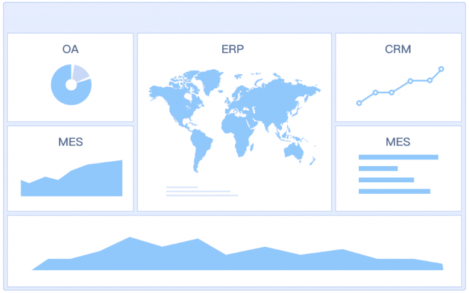
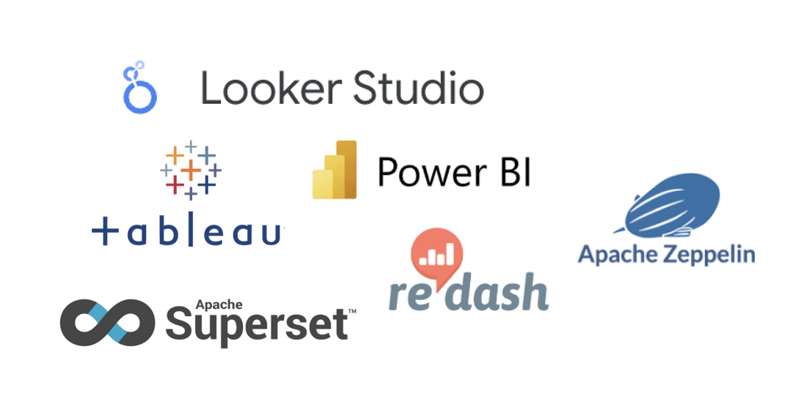
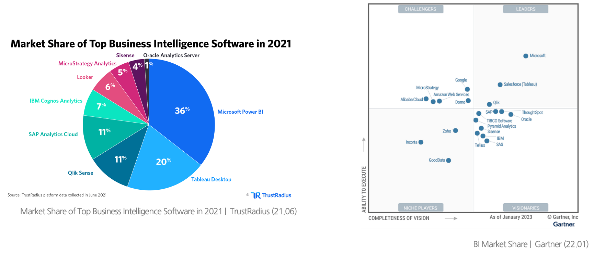
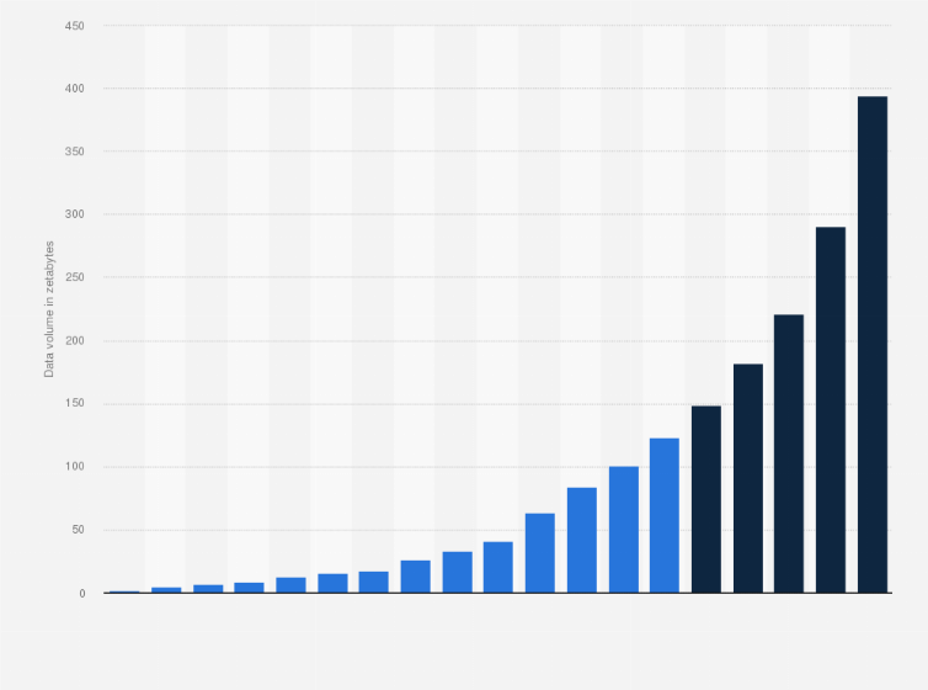
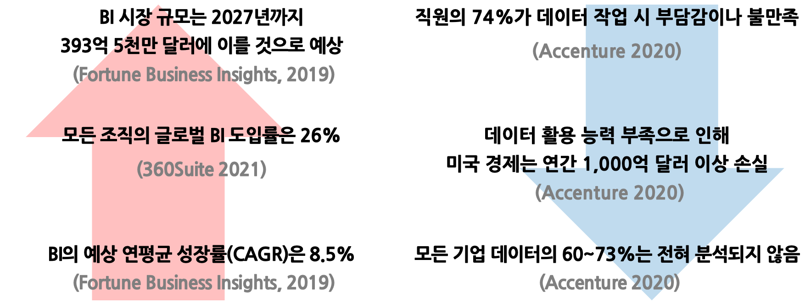

## 학습 목표

- 비즈니스 인텔리전스(Business Intelligence, BI)의 개념을 이해합니다.
- 대표적인 BI 도구와 Tableau의 위치를 설명할 수 있습니다.
- BI가 실무에서 왜 중요한지, 어떤 문제를 해결하는지 이해합니다.

## 목차

1. 비즈니스 인텔리전스란?
2. 대표적인 BI 도구
3. 비즈니스 인텔리전스가 왜 중요한가?

## 1. 비즈니스 인텔리전스란?

비즈니스 인텔리전스(Business Intelligence, BI)는 조직 내 다양한 비즈니스 데이터를 수집하고, 정리하고, 분석하고, 시각화하여 실행 가능한 통찰을 만드는 기술과 전략, 그리고 프로세스를 의미합니다.

즉, BI의 핵심은 단순히 데이터를 저장하는 것이 아니라, 의사결정에 사용할 수 있는 정보로 가공하는 데 있습니다. 기업은 매출, 고객, 마케팅, 운영, 재고, 인사 등 수많은 데이터를 축적하지만, 이 데이터가 정리되지 않은 상태로 존재하면 실제 업무에는 큰 도움이 되지 않습니다.

BI는 보통 다음과 같은 과정을 포함합니다.

- 데이터 수집
- 데이터 축적
- 데이터 정리 및 변환
- 데이터 분석
- 데이터 시각화
- 보고서 및 대시보드 작성
- 공유와 협업
- 실시간 모니터링

이러한 과정을 통해 조직은 "무슨 일이 일어났는가"를 넘어서 "왜 일어났는가", "무엇을 해야 하는가"에 대한 답을 찾을 수 있습니다.

## 2. 대표적인 BI 도구

현재 시장에는 다양한 BI 도구가 존재합니다. 대표적으로 Microsoft의 Power BI, Salesforce의 Tableau, Google의 Looker Studio 등을 들 수 있습니다.

각 도구는 강점이 조금씩 다릅니다.

| 도구 | 제공사 | 특징 |
| --- | --- | --- |
| Tableau | Salesforce | 강력한 시각화, 활발한 커뮤니티, 풍부한 교육 자료 |
| Power BI | Microsoft | Excel 친화적, Microsoft 생태계와 강한 연동 |
| Looker Studio | Google | BigQuery, Google Spreadsheet와 손쉬운 연동 |

이 책에서 다루는 Tableau는 특히 시각화 표현력과 탐색형 분석 경험에서 높은 강점을 가지는 도구입니다. 사용자가 직접 드래그 앤 드롭 방식으로 차트를 만들고, 필터와 계산을 적용하며, 데이터를 여러 관점에서 탐색하기에 적합합니다.

## 3. 비즈니스 인텔리전스가 왜 중요한가?

### 3-1. 데이터 소비량 증가

오늘날 기업이 다뤄야 하는 데이터의 양은 빠르게 증가하고 있습니다. 온라인 서비스, 모바일 앱, 전자상거래, IoT, 협업 도구 등 거의 모든 활동이 데이터로 남기 때문에, 조직은 과거와 비교할 수 없을 정도로 많은 데이터를 축적하고 있습니다.

데이터가 늘어난다는 것은 곧 분석 가능성이 커진다는 뜻이기도 하지만, 동시에 사람이 원시 데이터를 직접 읽고 해석하기는 점점 더 어려워진다는 의미이기도 합니다. 따라서 데이터를 정리하고, 핵심을 추출하고, 의사결정 가능한 형태로 보여주는 BI의 역할이 더욱 중요해집니다.

### 3-2. 기업의 데이터 활용 능력 부족

흥미로운 점은, 데이터가 많아졌다고 해서 모든 기업이 데이터를 잘 활용하는 것은 아니라는 사실입니다. 실제로 많은 조직이 데이터를 보유하고 있음에도 불구하고, 이를 실질적인 인사이트로 연결하지 못합니다.

이 현상은 몇 가지 이유에서 발생합니다.

- 데이터가 여러 시스템에 흩어져 있음
- 실무자가 직접 분석하기 어려운 구조임
- 보고 체계가 수작업 중심으로 운영됨
- 필요한 시점에 필요한 데이터를 빠르게 볼 수 없음

결국 조직은 데이터를 보유하고도 활용하지 못하는 상태에 머무르게 됩니다. 이런 상황에서는 데이터가 많아질수록 오히려 혼란이 커질 수 있습니다.

BI는 이런 문제를 해결하기 위한 실무적 접근입니다. 데이터를 연결하고, 정리하고, 시각화하여, 조직 구성원이 더 빠르고 더 일관된 기준으로 의사결정을 내릴 수 있도록 돕기 때문입니다.
