## 학습 목표

- Tableau Cloud 계정을 생성하고 인증할 수 있습니다.
- Tableau Desktop에서 라이선스를 활성화하여 실습 환경을 구축할 수 있습니다.
- Tableau Cloud와 Desktop을 연동해 정상적으로 작동하는지 확인할 수 있습니다.

## 목차

1. Tableau 라이선스 활성화
2. Tableau Desktop 설치

## 1. Tableau 라이선스 활성화

### 1-1. 태블로 인증 과정

Tableau를 사용하려면 단순히 프로그램만 설치하는 것으로 끝나지 않습니다. 계정 생성, 클라우드 접속, 추가 인증, 라이선스 활성화까지 하나의 흐름으로 이해해야 실제 실습 환경을 안정적으로 구성할 수 있습니다.

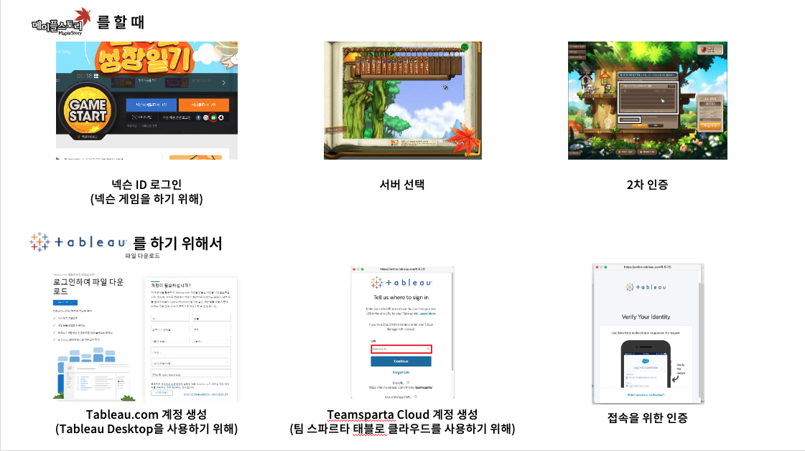

이 과정을 익숙한 게임 로그인 흐름에 비유하면 다음과 같이 이해할 수 있습니다.

| 메이플스토리 | Tableau |
| --- | --- |
| 1. 넥슨 ID 로그인: 게임을 시작하려면 계정이 필요함 | 1. Tableau.com 계정 생성: Tableau Desktop이나 Tableau Cloud를 사용하려면 계정이 필요함 |
| 2. 서버 선택: 원하는 서버에 접속 | 2. Teamsparta Cloud 로그인: 팀스파르타에서 사용하는 Tableau Cloud에 접속 |
| 3. 2차 인증: OTP나 보안카드로 본인 확인 | 3. Auth 인증: Salesforce Authenticator, Google Authenticator 등으로 본인 확인 |
| 4. 캐릭터 접속 완료 | 4. Tableau 사용 시작: Desktop 사용, 대시보드 게시, 협업 기능 활용 |

이 비유의 핵심은 Tableau도 기업 환경에서는 단순 실행형 프로그램이 아니라, 계정과 권한, 보안 인증을 포함한 서비스형 도구라는 점입니다.

### 1-2. [실습] Tableau Cloud 계정 이메일 활성화

처음 Tableau Cloud를 사용하려면 초대 메일을 통해 계정을 활성화해야 합니다.

1. 이메일에서 `You've Been Invited to Tableau Cloud` 메일을 확인합니다.
   안내 메일이 오지 않았다면 담당 매니저에게 문의합니다.

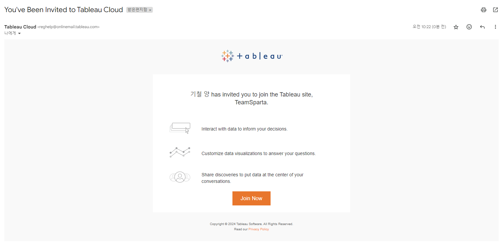

2. 메일 안의 `Join Now` 버튼을 클릭합니다.


3. 이름과 비밀번호를 설정합니다.

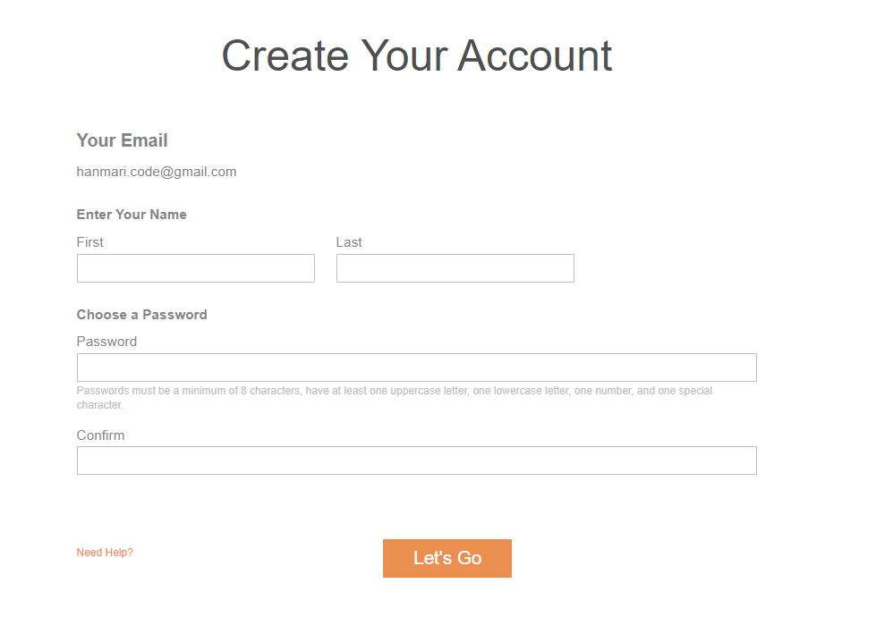

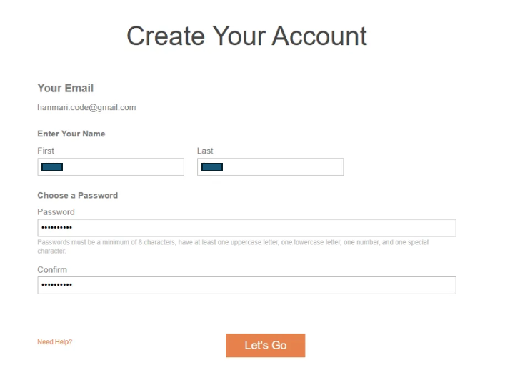

4. 설정이 완료되면 Tableau Cloud 로그인 화면으로 이동합니다.


이 단계가 끝나면 Tableau Cloud 계정 자체는 활성화된 상태가 됩니다. 다만 조직 정책에 따라 추가 인증 수단 등록이 필요할 수 있습니다.

### 1-3. [실습] 추가 인증 방법 등록

조직 보안 정책에 따라 첫 로그인 시 추가 인증(MFA) 설정이 필요할 수 있습니다. 대표적으로 Salesforce Authenticator 또는 Google Authenticator 기반 인증을 사용합니다.

#### 1. Salesforce Authenticator로 인증하는 경우

추가 인증 수단 등록 화면에서 `Salesforce Authenticator`를 선택합니다.

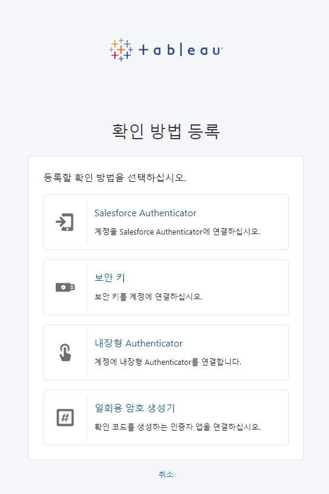

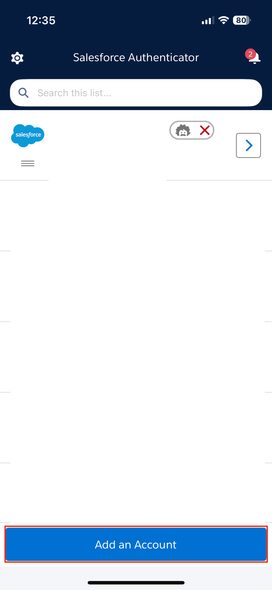

설정 절차는 다음과 같습니다.

1. 휴대폰에 Salesforce Authenticator 앱을 설치합니다.

```text
Google Play:
https://play.google.com/store/apps/details?id=com.salesforce.authenticator

App Store:
https://apps.apple.com/us/app/salesforce-authenticator/id782057975
```

2. 스마트폰에서 앱을 실행합니다.

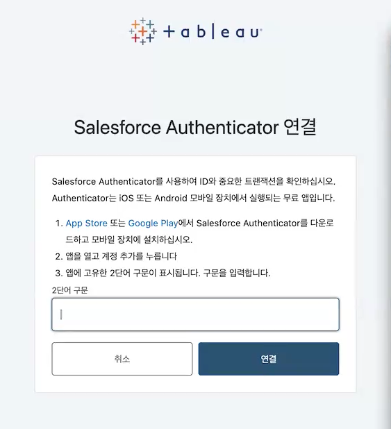

3. `Add an Account` 또는 `계정 추가`를 눌러 계정을 추가합니다.

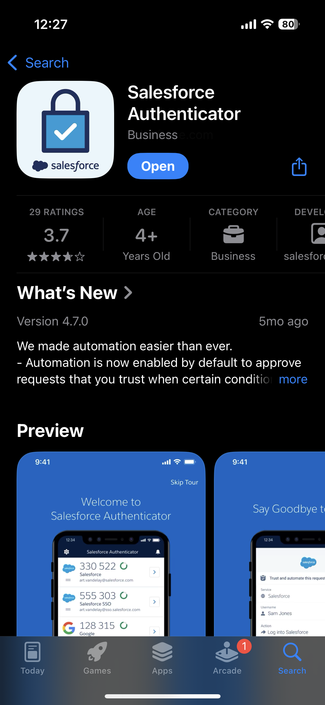

4. 앱 화면에 표시된 두 단어를 PC 인증창에 입력합니다.

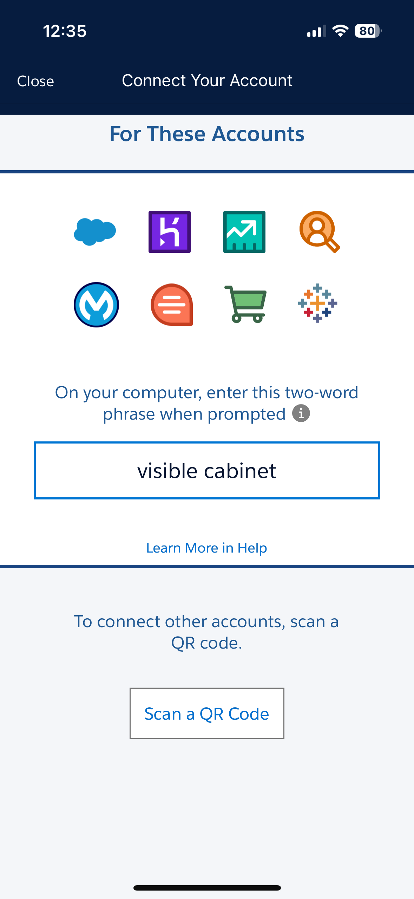

5. 앱에서 갱신되는 확인 코드를 PC 화면에 입력합니다.

6. 확인 코드와 검증 도구 이름을 설정하면 등록이 완료됩니다.

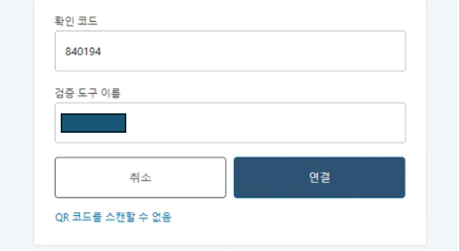

#### 2. Google Authenticator로 인증하는 경우

추가 인증 수단 등록 화면에서 `일회용 암호 생성기`를 선택합니다.


설정 절차는 다음과 같습니다.

1. 휴대폰에 Google Authenticator 앱을 설치합니다.

```text
Google Play:
https://play.google.com/store/apps/details?id=com.google.android.apps.authenticator2&hl=ko&gl=US&pli=1

App Store:
https://apps.apple.com/us/app/google-authenticator/id388497605
```

2. 앱을 실행하고 코드 추가를 선택합니다.

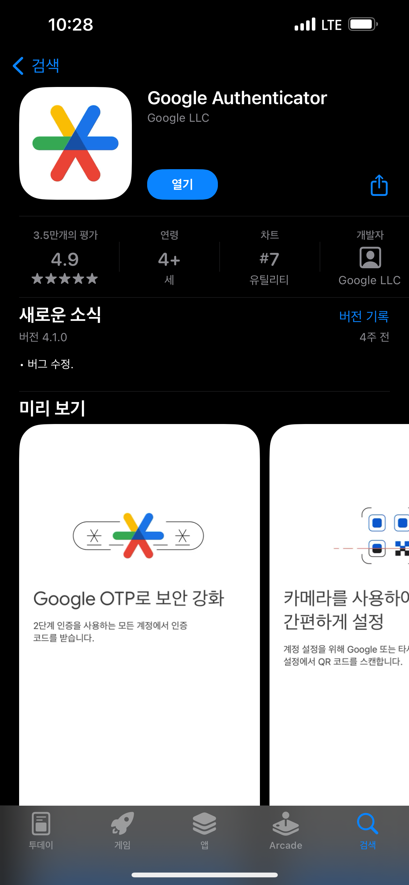

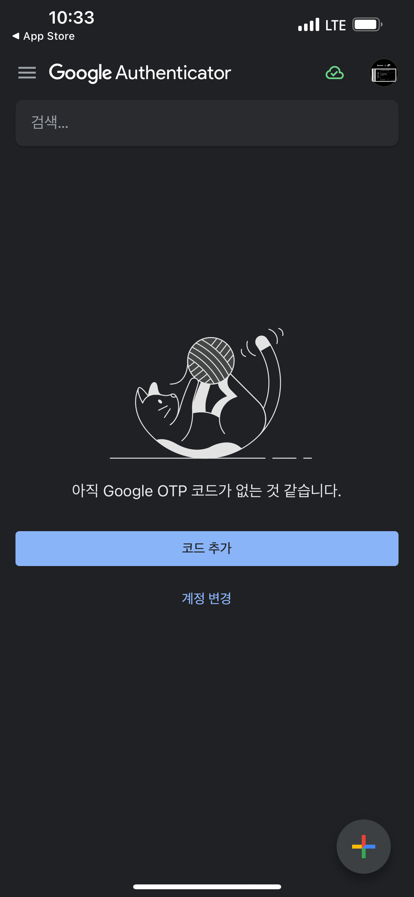

3. `QR 코드 스캔`을 눌러 PC에 표시된 QR 코드를 등록합니다.

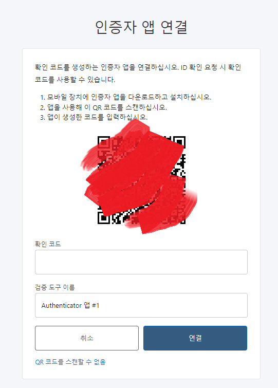

4. 앱에 표시되는 일회용 코드를 PC 화면에 입력합니다.

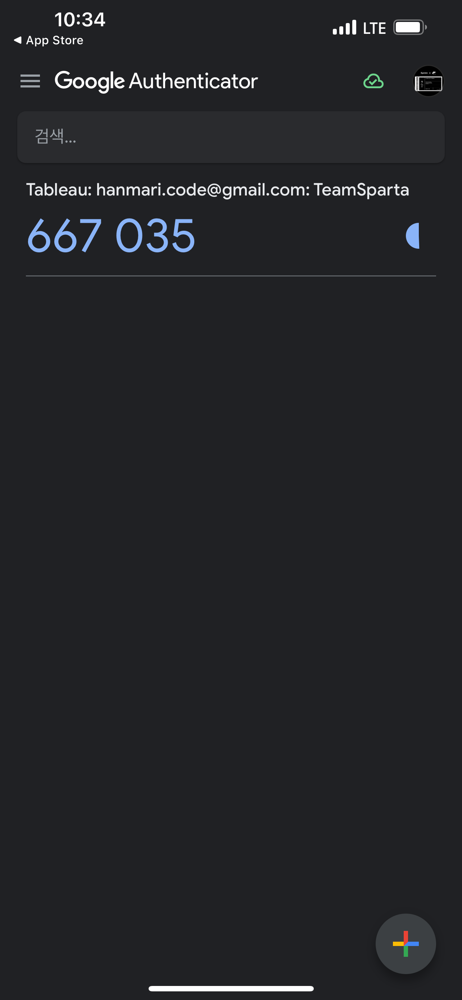

5. 확인 코드와 검증 도구 이름을 설정하면 등록이 완료됩니다.


## 2. Tableau Desktop 설치

### 2-1. [실습] Tableau Desktop 다운로드 및 라이선스 활성화

이제 Tableau Desktop을 설치하고, 조직에서 제공받은 라이선스로 활성화합니다.

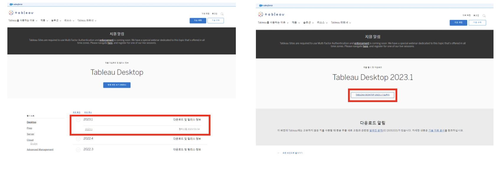

1. Tableau 다운로드 사이트에 접속합니다.

```text
https://www.tableau.com/ko-kr/support/releases
```

2. 최신 버전 또는 실습에 지정된 버전을 선택하고 다운로드 버튼을 클릭합니다.


3. Tableau.com 계정으로 로그인합니다. 계정이 없다면 먼저 계정을 생성합니다.


4. 운영 체제에 맞는 설치 파일을 다운로드합니다.

- Windows: 설치 파일을 실행하고 안내에 따라 진행합니다.
- Mac: `.DMG` 파일을 열고 `.PKG` 패키지를 실행합니다.


5. 설치 동의 후 설치를 진행합니다.


`제품 사용 현황 데이터를 보내지 않음`은 선택 사항입니다.

6. 설치가 끝나면 Tableau 등록 양식을 작성합니다.


7. Tableau 활성화 화면에서 `서버에 로그인하여 활성화`를 선택합니다.

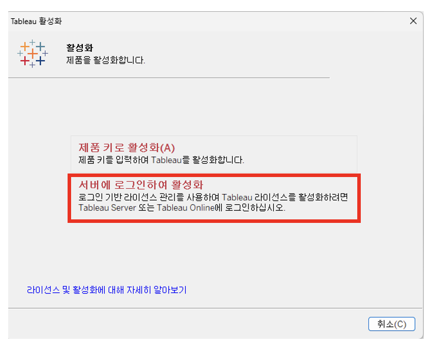

8. Tableau Cloud를 선택합니다.


9. Tableau Cloud에 사용할 사용자 이름을 입력합니다.
이때 1-2에서 활성화한 Tableau Cloud 이메일을 입력합니다.


10. URL 입력창이 나오면 `teamsparta`를 입력합니다.
표시되지 않으면 건너뜁니다.


11. 이메일과 비밀번호를 입력합니다.

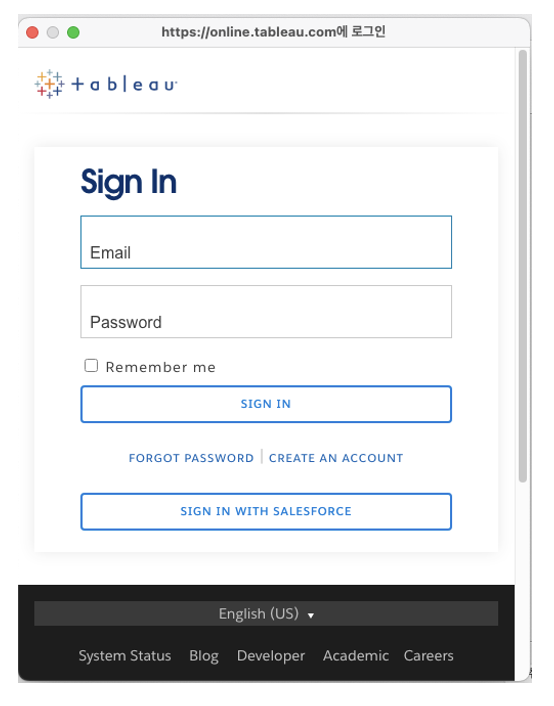

12. Authenticator 인증을 진행합니다.


13. 활성화 프로세스 완료 화면이 나타나면 `계속`을 눌러 마칩니다.

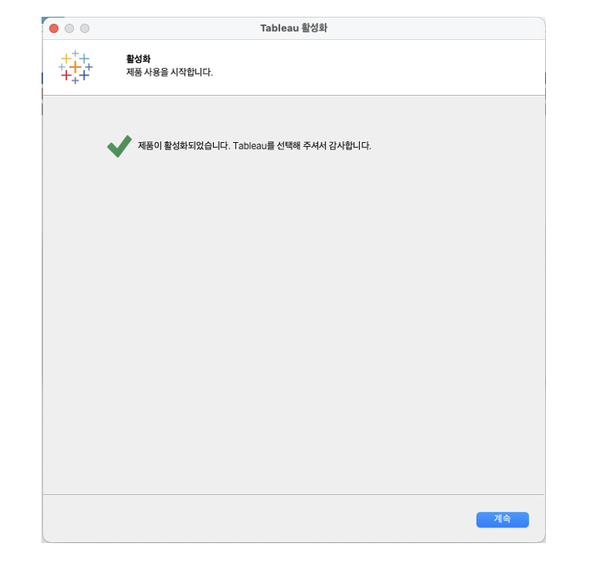

### 2-2. [실습] 활성화 확인 방법

정상적으로 활성화되었는지 확인하려면 Tableau Desktop 내부에서 제품 키 상태를 확인하면 됩니다.

1. Tableau Desktop 상단 메뉴에서 `도움말 > 제품 키 관리`를 클릭합니다.


2. Creator 제품 키가 보이면 정상적으로 활성화된 것입니다.

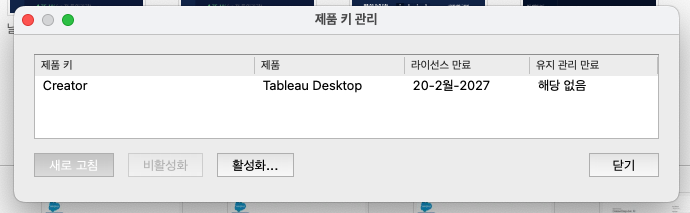

### 2-3. Tableau Desktop Public Edition이란?

Tableau Desktop Public Edition은 Tableau Desktop의 무료 공개 버전입니다. 기본적인 시각화와 대시보드 제작 기능은 제공하지만, 저장과 데이터 연결 측면에서 제약이 있습니다.


핵심 특징은 다음과 같습니다.

- 무료로 제공됩니다.
- 누구나 다운로드해 설치할 수 있습니다.
- 기본적인 데이터 연결과 시각화 기능은 사용할 수 있습니다.
- 결과물은 Tableau Public에 공개 저장해야 합니다.

#### Public Edition과 Desktop의 차이

| 구분 | Tableau Desktop Public Edition | Tableau Desktop |
| --- | --- | --- |
| 가격 | 무료 | 유료, Creator 라이선스 필요 |
| 저장 위치 | Tableau Public에만 저장, 공개됨 | 로컬 PC, Tableau Server, Tableau Cloud 등 |
| 데이터 연결 | Excel, CSV, Google Sheets 등 제한적 | DB와 클라우드 포함 폭넓은 연결 지원 |
| 보안/비공개 | 비공개 저장 불가 | 비공개 저장 가능 |
| 활용 목적 | 학습, 포트폴리오, 커뮤니티 공유 | 기업 분석, 내부 보고, 실무 활용 |

정리하면, Public Edition은 학습과 포트폴리오용으로 적합하고, Desktop 유료 버전은 기업과 실무 환경에 적합합니다.

### 2-4. Tableau Desktop Public Edition 설치 방법

Tableau Public Edition은 Tableau Public 사이트에서 설치할 수 있습니다.


1. Tableau Public 사이트에 접속합니다.

```text
https://public.tableau.com/app/discover
```

2. 화면 왼쪽 상단의 `Tableau Desktop Public Edition 다운로드` 버튼을 클릭합니다.


3. 이동한 페이지에서 필요한 정보를 입력하고 다운로드를 진행합니다.


4. 설치를 진행합니다.


5. Tableau Public이 정상적으로 실행되면 설치가 완료된 것입니다.


## 정리

이 절에서는 Tableau Cloud 계정 활성화, 추가 인증 등록, Tableau Desktop 설치 및 라이선스 활성화, 그리고 Public Edition의 차이까지 살펴보았습니다.

핵심은 다음과 같습니다.

- Tableau는 계정, 클라우드, 보안 인증이 함께 연결된 환경으로 이해해야 합니다.
- Desktop 설치 후에는 Cloud 계정으로 로그인하여 활성화를 완료해야 합니다.
- Public Edition은 학습용으로 유용하지만, 실무 환경에서는 제한이 있습니다.

다음 절에서는 Tableau 화면 구성과 기본 조작 방법을 실제로 익혀 보겠습니다.
