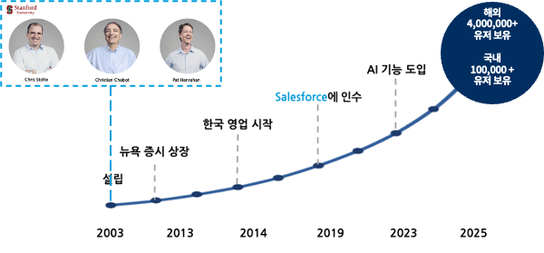
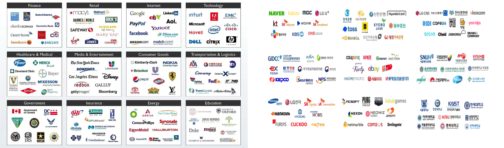
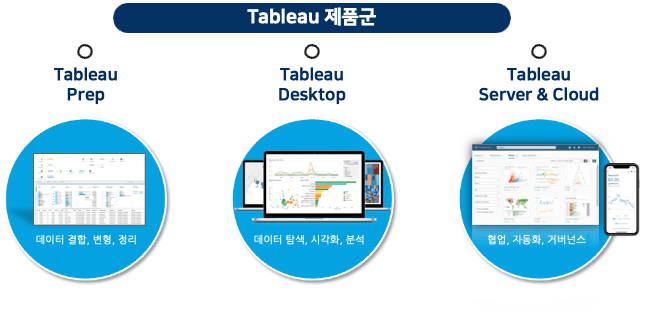
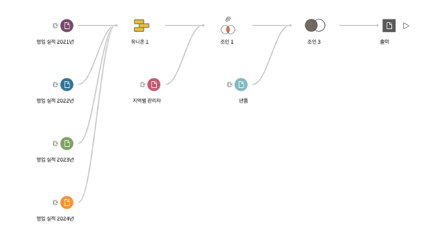
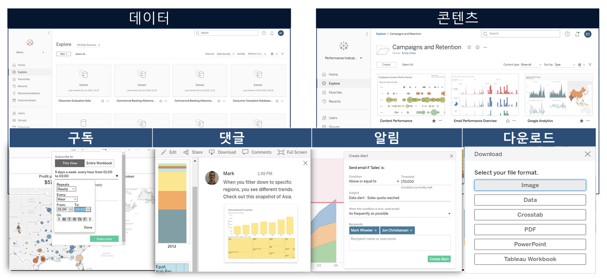
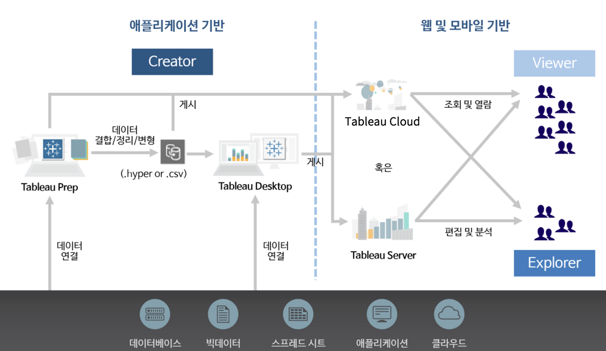

## 학습 목표

- Tableau가 어떤 도구인지 설명할 수 있습니다.
- Tableau의 역사와 활용 기업 사례를 이해합니다.
- Tableau 제품군과 전체 구조를 파악할 수 있습니다.
- Tableau 라이선스 종류와 역할 차이를 구분할 수 있습니다.

## 목차

1. Tableau란?
2. Tableau의 역사
3. Tableau 활용 기업
4. Tableau 제품군
5. Tableau 구조
6. 라이선스 구분

## 1. Tableau란?

Tableau는 데이터를 시각화하고 분석하는 데 특화된 비즈니스 인텔리전스(Business Intelligence, BI) 도구입니다. 복잡한 데이터를 차트, 그래프, 대시보드 형태로 표현해 사용자가 보다 쉽게 이해하고 해석할 수 있도록 돕습니다.

Tableau의 가장 큰 장점은 코드를 많이 작성하지 않아도 된다는 점입니다. 사용자는 드래그 앤 드롭 방식으로 필드를 배치하고, 차트를 만들고, 필터를 조정하면서 데이터를 탐색할 수 있습니다. 이 때문에 데이터 분석가뿐 아니라 현업 사용자, 관리자, 기획자도 비교적 빠르게 활용할 수 있습니다.

정리하면 Tableau는 단순한 시각화 도구가 아니라, 데이터를 탐색하고 해석하며 의사결정까지 연결하는 분석 플랫폼이라고 볼 수 있습니다.

## 2. Tableau의 역사

Tableau는 2003년 Stanford University 출신의 Chris Stolte, Christian Chabot, Pat Hanrahan이 설립했습니다. 초기 목표는 누구나 데이터를 시각적으로 탐색하고, 더 나은 의사결정을 할 수 있도록 만드는 것이었습니다.

주요 흐름은 다음과 같습니다.

- 2003년: Tableau 설립
- 2013년: 뉴욕 증시 상장
- 2014년: 한국 지사 설립 및 국내 영업 본격화
- 2019년: Salesforce에 인수
- 2023년 이후: AI 기반 기능 확대

이 흐름을 보면 Tableau는 단순한 시각화 소프트웨어를 넘어, 분석과 협업, 그리고 AI 기반 인사이트까지 포함하는 플랫폼으로 확장되어 왔음을 알 수 있습니다.

## 3. Tableau 활용 기업

Tableau는 금융, 유통, IT, 헬스케어, 제조, 물류, 공공 부문 등 거의 모든 산업에서 사용되고 있습니다. 이는 Tableau가 특정 업종 전용 도구가 아니라, 다양한 데이터 구조를 공통된 분석 인터페이스로 다룰 수 있기 때문입니다.

대표적인 예시는 다음과 같습니다.

- 해외 기업: Charles Schwab, Bank of America, Walmart, Google, PayPal, Pfizer
- 국내 기관 및 기업: 국세청, 조달청, 교육청, 경찰청, KB국민은행, 하나금융, NH농협, 삼성, 현대, LG, SK, NAVER, 카카오, 쿠팡 등

이처럼 Tableau는 경영 보고, 마케팅 분석, 운영 관리, 고객 분석, 공공 데이터 모니터링 등 매우 다양한 업무에 활용됩니다.

## 4. Tableau 제품군

Tableau는 하나의 단일 프로그램이 아니라, 데이터 준비부터 분석, 배포와 협업까지 이어지는 제품군으로 구성됩니다.

핵심 제품군은 다음과 같습니다.

- Tableau Prep: 데이터 결합, 정리, 변형을 담당
- Tableau Desktop: 시각화와 분석을 수행
- Tableau Server / Tableau Cloud: 콘텐츠 배포, 협업, 권한 관리, 거버넌스를 담당

### 4-1. Tableau Prep

Tableau Prep은 분석 전에 필요한 데이터 준비 작업을 시각적으로 수행할 수 있게 해주는 도구입니다.

주요 특징은 다음과 같습니다.

- 데이터 결합, 변형, 정리 과정을 시각적으로 설계 가능
- 산재된 데이터를 통합하기 쉬움
- 반복적인 정제 작업을 자동화하기 좋음
- 작업 추천 기능을 통해 전처리 흐름 설계를 보조

### 4-2. Tableau Desktop

Tableau Desktop은 Tableau 제품군의 중심이라고 할 수 있는 분석 제작 도구입니다.

주요 기능은 다음과 같습니다.

- 추세와 분포 시각화
- 집계와 비교 분석
- 데이터 필터링
- 정렬과 그룹화
- 특정 값에 대한 드릴다운

### 4-3. Tableau Server와 Tableau Cloud

Tableau Server와 Tableau Cloud는 완성된 콘텐츠를 조직 차원에서 배포하고 공유하는 역할을 담당합니다.

주요 기능은 다음과 같습니다.

- 데이터와 콘텐츠 관리
- 사용자 권한 및 접근 제어
- 구독, 댓글, 알림, 다운로드
- 협업과 거버넌스 지원

## 5. Tableau 구조

Tableau는 데이터 준비, 분석 제작, 배포와 소비가 하나의 흐름으로 연결되는 구조를 가집니다.

일반적인 흐름은 다음과 같습니다.

1. 원천 데이터에 연결합니다.
2. 필요하면 Tableau Prep 등으로 데이터를 정리합니다.
3. Tableau Desktop에서 시각화와 대시보드를 만듭니다.
4. Tableau Server 또는 Tableau Cloud에 게시합니다.
5. 조직 내 사용자가 웹이나 모바일에서 소비하고 협업합니다.

이 구조를 이해하면 Tableau가 단순히 차트를 만드는 소프트웨어가 아니라, 조직의 데이터 활용 체계를 구성하는 플랫폼이라는 점을 더 분명하게 볼 수 있습니다.

## 6. 라이선스 구분

Tableau 라이선스는 사용자의 역할에 따라 크게 Creator, Explorer, Viewer로 나뉩니다.

### 6-1. Creator

- 대상: 데이터 분석가, BI 개발자, 데이터 사이언티스트
- 특징:
    - Tableau Desktop, Prep, Server/Cloud의 작성 권한 포함
    - 다양한 데이터 소스에 직접 연결 가능
    - 데이터 준비, 계산, 분석, 시각화 제작 가능
    - 만든 콘텐츠를 게시하고 배포 가능

### 6-2. Explorer

- 대상: 비즈니스 사용자, 팀 리더, 실무 분석 담당자
- 특징:
    - Server/Cloud 환경에서 웹 브라우저 기반 사용
    - 게시된 데이터 소스를 활용해 분석 가능
    - 기존 대시보드를 수정하고 저장 가능
    - 협업 기능 활용 가능

### 6-3. Viewer

- 대상: 경영진, 보고서 소비자, 일반 사용자
- 특징:
    - 대시보드와 리포트를 보기 중심으로 사용
    - 필터, 하이라이트, 드릴다운 등 기본 상호작용 가능
    - 구독, 알림, 댓글 등 협업 기능 일부 활용 가능

라이선스 가격과 정책은 시점에 따라 바뀔 수 있으므로, 실제 도입 시에는 Tableau 공식 가격 페이지를 기준으로 다시 확인하는 것이 좋습니다.

공식 가격 페이지: [https://www.tableau.com/ko-kr/pricing?gad_source=1&gad_campaignid=23631035424&gbraid=0AAAAA_X6G1InUtPy6myTKsRlUb34dN_oU&gclid=CjwKCAjw-dfOBhAjEiwAq0RwI5-MHE5XavUUt9TpJH6o_Oxi_89ju8nqN-3ppNkyDtCh91km3YLwaRoCgWkQAvD_BwE](https://www.tableau.com/ko-kr/pricing?gad_source=1&gad_campaignid=23631035424&gbraid=0AAAAA_X6G1InUtPy6myTKsRlUb34dN_oU&gclid=CjwKCAjw-dfOBhAjEiwAq0RwI5-MHE5XavUUt9TpJH6o_Oxi_89ju8nqN-3ppNkyDtCh91km3YLwaRoCgWkQAvD_BwE)
