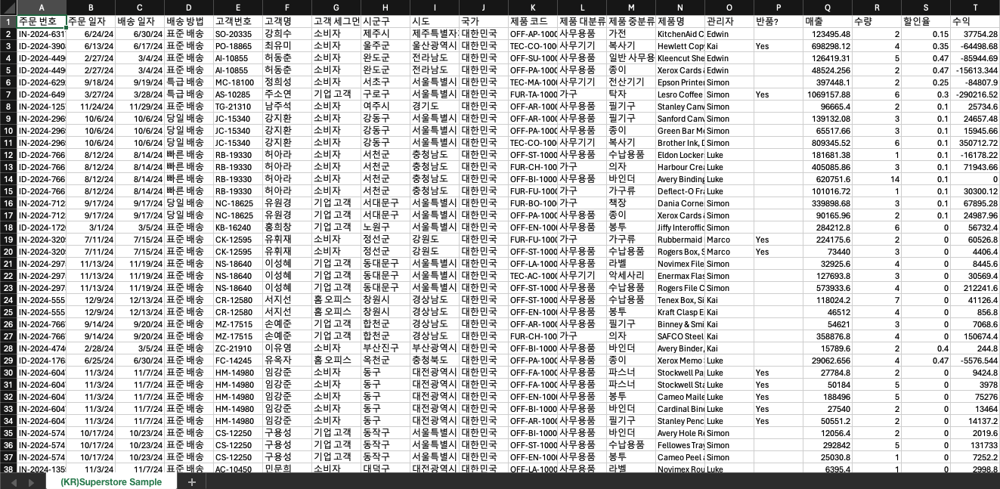
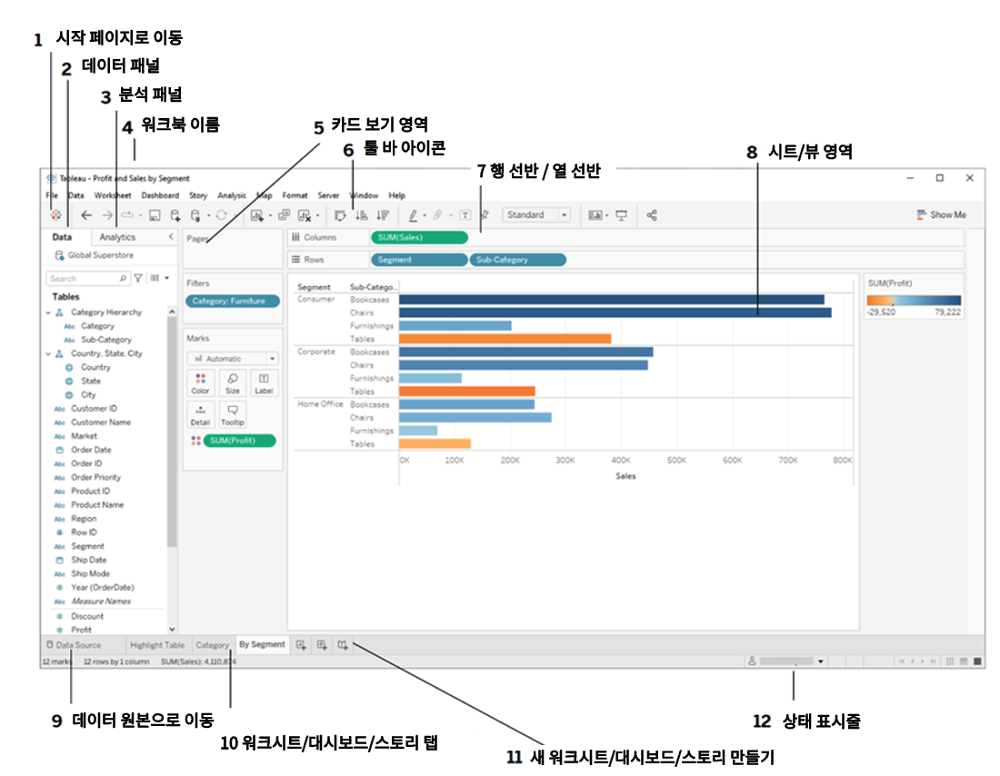
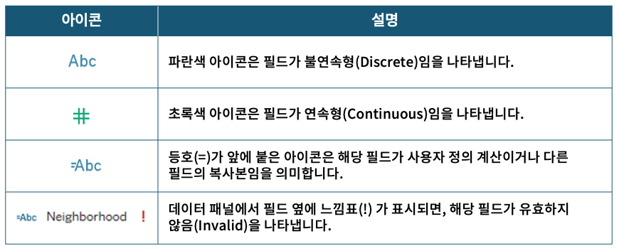
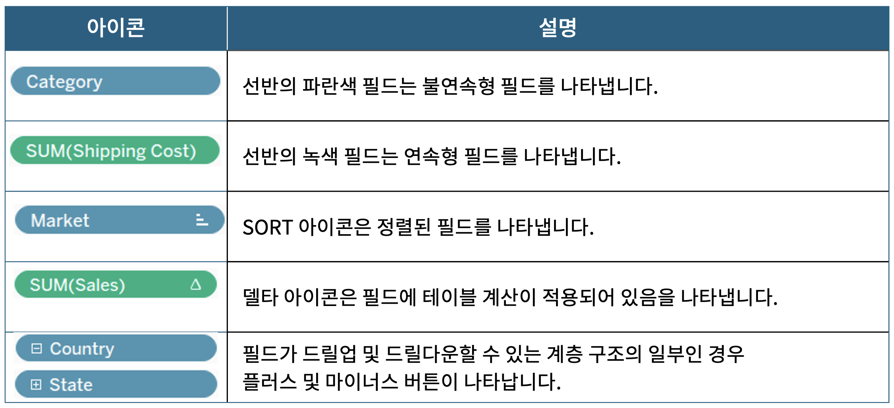
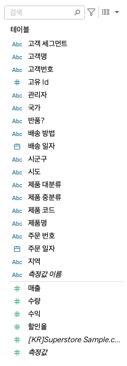

## 학습 목표

- Tableau 인터페이스의 기본 구조를 이해합니다.
- 차원(Dimension)과 측정값(Measure)의 차이를 설명할 수 있습니다.

## 사용 프로그램

- Tableau Desktop

## 사용 데이터 및 실습 파일

실습에는 Superstore 기반 샘플 데이터와 Tableau 통합 문서를 사용합니다.

실습 파일 다운로드:

```text
https://contentslecture.s3.ap-northeast-2.amazonaws.com/resources/%E1%84%89%E1%85%B5%E1%86%AF%E1%84%89%E1%85%B3%E1%86%B8+%E1%84%8C%E1%85%A1%E1%84%85%E1%85%AD+%E1%84%83%E1%85%A1%E1%84%8B%E1%85%AE%E1%86%AB%E1%84%85%E1%85%A9%E1%84%83%E1%85%B3.zip
```

## 목차

1. 데이터 소개 및 연결
2. Tableau UI 설명

## 1. 데이터 소개 및 연결

### 1-1. 실습 데이터 소개

이번 실습에서는 Superstore Dataset을 사용합니다. 이 데이터는 가상의 소매점 판매 데이터를 기반으로 구성된 교육용 표준 데이터셋으로, BI 학습자와 데이터 분석 입문자가 Tableau를 익힐 때 가장 많이 사용하는 예제 중 하나입니다.



이 데이터가 자주 사용되는 이유는 다음과 같습니다.

- 주문, 고객, 제품, 지역, 성과 지표가 함께 들어 있어 분석 연습에 적합합니다.
- 차원과 측정값을 자연스럽게 구분해 볼 수 있습니다.
- 필터링, 집계, 시각화, 대시보드 설계까지 한 흐름으로 실습할 수 있습니다.

#### 데이터 구성

- 주문 관련: 주문 번호, 주문 일자, 배송 일자, 배송 방법
- 고객 관련: 고객 번호, 고객명, 고객 세그먼트, 국가, 시도, 시군구
- 제품 관련: 제품 코드, 제품 대분류, 제품 중분류, 제품명
- 판매 성과 관련: 매출, 수량, 수익, 할인율

| 컬럼명 | 설명 | 예시 |
| --- | --- | --- |
| 주문 번호 | 각 주문을 구분하기 위한 고유 식별 번호 | IN-2024-63178 |
| 주문 일자 | 고객이 주문을 생성한 날짜 | 6/24/24 |
| 배송 일자 | 주문 상품이 실제로 배송된 날짜 | 6/30/24 |
| 배송 방법 | 주문이 고객에게 전달되는 방식 | 표준 배송 |
| 고객번호 | 고객을 구분하기 위한 고유 식별 번호 | SO-20335 |
| 고객명 | 실제 주문을 한 고객의 이름 | 강희수 |
| 고객 세그먼트 | 고객 유형 분류 정보 | 소비자 |
| 시군구 | 고객 주소의 시/군/구 단위 지역 | 제주시 |
| 시도 | 고객 주소의 시/도 단위 지역 | 제주특별자치도 |
| 국가 | 고객이 속한 국가 | 대한민국 |
| 제품 코드 | 특정 상품을 구분하기 위한 고유 코드 | OFF-AP-10002882 |
| 제품 대분류 | 제품이 속하는 큰 카테고리 | 사무용품 |
| 제품 중분류 | 대분류 아래의 세부 카테고리 | 가전, 종이 |
| 제품명 | 실제 판매된 상품의 이름과 속성 | KitchenAid Coffee Grinder |
| 관리자 | 해당 주문을 담당한 직원 | Edwin |
| 반품? | 상품 반품 여부 | Yes |
| 매출 | 해당 주문에서 발생한 총 판매 금액 | 123495 |
| 수량 | 주문된 제품 개수 | 2 |
| 할인율 | 적용된 할인 비율 | 0.15 |
| 수익 | 순이익 값 | 37754 |

### 1-2. [실습] 데이터 연결 방법

Tableau는 파일, 서버, 게시된 데이터 원본 등 다양한 형태로 데이터를 연결할 수 있습니다.

대표적인 연결 유형은 다음과 같습니다.

- 파일에 연결
- 서버에 연결
- 저장되었거나 게시된 데이터 원본에 연결

실습에서는 CSV 파일을 직접 연결합니다.

1. 데이터 패널에서 `연결 > 텍스트 파일` 또는 `자세히...`를 클릭합니다.

2. CSV 파일을 Tableau 통합 문서에 드래그 앤 드롭하거나, 파일 선택 창에서 불러옵니다.

이 과정을 통해 Tableau는 원본 데이터를 인식하고, 이후 워크시트에서 사용할 수 있는 필드 목록을 자동으로 구성합니다.

## 2. Tableau UI 설명

### 2-1. Tableau 상단 탭 메뉴

Tableau를 처음 사용할 때는 화면이 다소 복잡해 보일 수 있습니다. 하지만 각 영역의 역할을 이해하면, 어떤 기능이 어디에 있는지 빠르게 익숙해질 수 있습니다.



| 번호 | 한국어 명칭 | 설명 |
| --- | --- | --- |
| 1 | 시작 페이지로 이동 | Tableau 시작 화면으로 돌아가는 버튼 |
| 2 | 데이터 패널 | 연결된 데이터의 필드가 표시되는 영역 |
| 3 | 분석 패널 | 추세선, 평균선, 예측 등 분석 기능 추가 영역 |
| 4 | 워크북 이름 | 현재 열려 있는 Tableau 파일 이름 표시 |
| 5 | 카드 보기 영역(선반) | 필터, 마크, 색상, 크기, 레이블 등을 조정하는 영역 |
| 6 | 툴바 아이콘 | 저장, 실행 취소, 다시 실행 등 자주 쓰는 명령 모음 |
| 7 | 행/열 선반 | 시각화 축이 되는 필드를 놓는 위치 |
| 8 | 시트/뷰 영역 | 실제 차트를 만들고 보는 메인 작업 영역 |
| 9 | 데이터 소스로 이동 | 데이터 구조와 연결 상태를 확인하는 탭 |
| 10 | 워크시트/대시보드/스토리 탭 | 시트와 대시보드를 생성하고 전환하는 영역 |
| 11 | 새 워크시트/대시보드/스토리 만들기 | 새로운 분석 화면 생성 버튼 |
| 12 | 상태 표시줄 | 로딩 상태, 필터 결과 등 작업 상태 표시 |

### 2-2. 필드 아이콘

Tableau는 데이터 패널과 선반에서 다양한 아이콘을 사용해 필드의 성격을 시각적으로 구분합니다. 이 아이콘을 이해하면 데이터를 훨씬 빠르게 읽을 수 있습니다.

#### 1. 데이터 패널 아이콘



- 파란색 아이콘 `Abc`: 불연속형(Discrete) 필드
- 초록색 아이콘 `#`: 연속형(Continuous) 필드
- `=`가 붙은 아이콘: 계산된 필드 또는 복사본 필드
- `!`가 붙은 아이콘: 유효하지 않은 필드

#### 2. 데이터 타입 아이콘


- `Abc`: 텍스트
- `#`: 숫자
- `T|F`: 부울(Boolean)
- 지구본 아이콘: 지리 데이터
- 클립 모양 아이콘: 그룹
- 달력 아이콘: 날짜 및 날짜시간
- Set 아이콘: 집합

#### 3. 선반 위 필드의 시각적 단서



- 파란색 필드: 불연속형 필드
- 녹색 필드: 연속형 필드
- 정렬 아이콘: 정렬 적용 필드
- 델타 아이콘: 테이블 계산 적용 필드
- 계층 구조 아이콘: 드릴업/드릴다운 가능한 계층 구조

### 2-3. 차원과 측정값

Tableau에서 데이터를 다루는 가장 기본적인 구분은 차원(Dimension)과 측정값(Measure)입니다. 이 둘의 차이를 이해해야 어떤 필드를 축에 놓고, 어떤 필드를 집계해야 하는지 판단할 수 있습니다.



#### 1. 차원(Dimension)

차원은 데이터를 그룹화, 분류, 필터링하는 기준이 되는 값입니다. 일반적으로 정성적 정보에 해당합니다.

예:

- 고객 세그먼트
- 시군구
- 시도
- 제품 대분류

#### 2. 측정값(Measure)

측정값은 합계, 평균, 최대, 최소 등으로 집계할 수 있는 수치형 값입니다. 일반적으로 정량적 정보에 해당합니다.

예:

- 매출
- 수량
- 수익
- 할인율

실무적으로는 차원이 질문의 축을 만들고, 측정값이 그 축 위에 놓일 숫자를 만듭니다.  
예를 들어 `시도별 매출`, `제품 대분류별 수익`, `고객 세그먼트별 주문 수` 같은 분석은 모두 차원과 측정값의 결합으로 이루어집니다.

## 정리

이 절에서는 실습 데이터의 구조를 살펴보고, Tableau에 데이터를 연결하는 방법과 기본 인터페이스, 그리고 차원과 측정값의 개념을 정리했습니다.

핵심은 다음과 같습니다.

- Tableau는 데이터를 연결한 뒤 필드를 자동으로 구조화합니다.
- 화면의 각 영역은 데이터 탐색과 시각화 제작을 위한 고유한 역할을 가집니다.
- 차원은 분류 기준, 측정값은 집계 대상이라는 관점으로 이해하면 Tableau 사용이 훨씬 쉬워집니다.

다음 장부터는 이런 기초 개념을 바탕으로 실제 시각화를 만들어 보게 됩니다.
