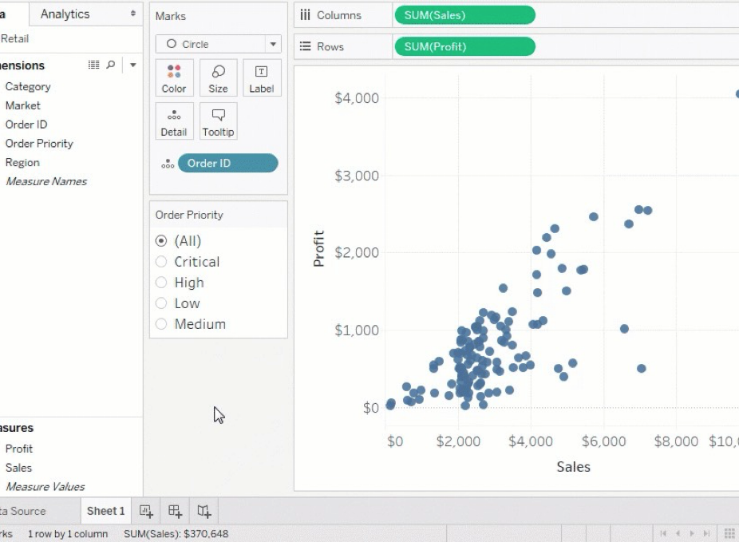
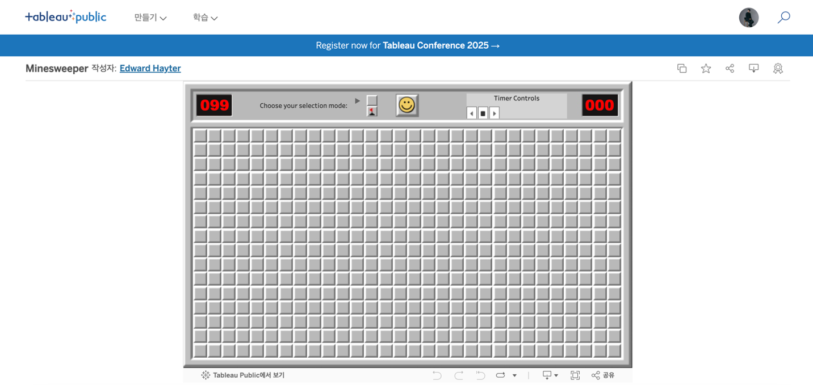
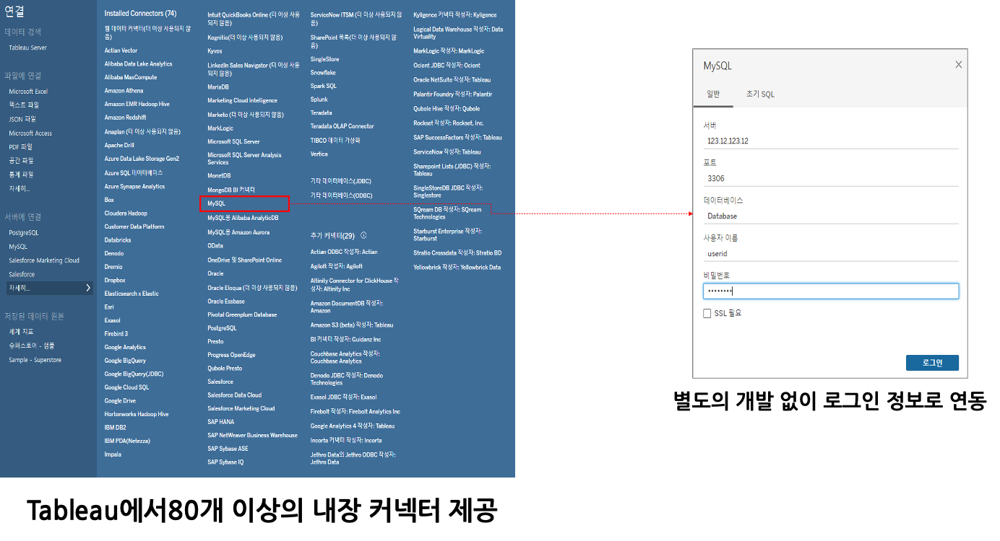
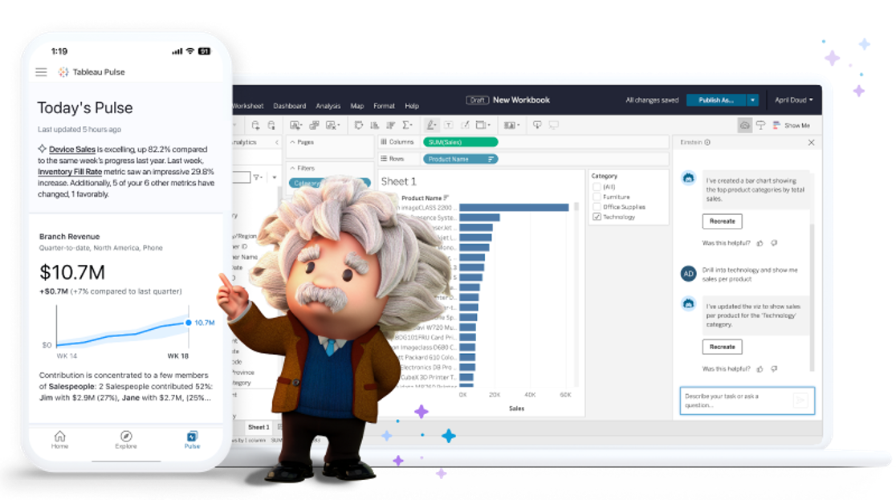

## 학습 목표

- Tableau가 다른 BI 도구 대비 어떤 강점을 가지는지 설명할 수 있습니다.
- Tableau의 사용자 경험, 시각화 자유도, 데이터 연결성, AI 기능, 커뮤니티 강점을 이해합니다.
- 실무에서 왜 Tableau를 선택하는지 판단 기준을 정리할 수 있습니다.

## 목차

1. 사용자 친화적인 인터페이스
2. 자유도 높은 시각화
3. 다양한 데이터 소스 연결
4. AI 기술을 통한 분석
5. 활성화된 커뮤니티

## 1. 사용자 친화적인 인터페이스

Tableau는 복잡한 코드를 직접 작성하지 않아도, 필드를 드래그 앤 드롭하는 방식으로 시각화를 만들 수 있습니다. 이 점은 분석 진입 장벽을 크게 낮춰 줍니다.

즉, Tableau의 강점은 단순히 보기 좋은 차트를 만드는 것이 아니라, 사용자가 빠르게 질문을 만들고 답을 탐색할 수 있는 인터페이스를 제공한다는 데 있습니다.

## 2. 자유도 높은 시각화

Tableau는 막대그래프나 꺾은선그래프 같은 기본 차트만 지원하는 도구가 아닙니다. 레이아웃, 이미지, 필터, 매개변수, 계산식을 조합해 인터랙티브한 분석 경험을 설계할 수 있습니다.

예를 들어 게임처럼 보이는 대시보드, 스토리텔링형 분석 화면, 웹 애플리케이션처럼 동작하는 시각화도 구현할 수 있습니다.

[Minesweeper 예시](https://public.tableau.com/app/profile/edwardhayter/viz/ExpertMinesweeper/Minesweeper)

## 3. 다양한 데이터 소스 연결

Tableau는 다양한 내장 커넥터를 통해 파일, 데이터베이스, 클라우드 데이터 웨어하우스, SaaS 애플리케이션 등 여러 데이터 소스와 쉽게 연결할 수 있습니다.

대표적인 연결 대상은 다음과 같습니다.

- Excel, CSV, Google Sheets
- MySQL, Oracle, SQL Server
- Snowflake, BigQuery, Amazon Redshift
- Salesforce, Google Analytics
- Python, R, JSON, Web API

이런 연결성은 Tableau를 특정 시스템 전용 도구가 아니라, 조직 내 여러 데이터 자산을 통합적으로 분석할 수 있는 도구로 만들어 줍니다.

## 4. AI 기술을 통한 분석

최근 Tableau는 AI 기능도 적극적으로 확장하고 있습니다.

대표적인 예시는 다음과 같습니다.

- Tableau Pulse: KPI 변화에 대한 알림과 요약 제공
- Tableau GPT 계열 기능: 자연어 기반 질의와 분석 보조

이런 기능은 사용자가 수식과 쿼리를 직접 작성하지 않더라도, 질문 중심으로 데이터를 탐색할 수 있게 돕습니다.

## 5. 활성화된 커뮤니티

Tableau는 기능 자체뿐 아니라 커뮤니티 생태계도 매우 강한 편입니다.

대표적인 예시는 다음과 같습니다.

- Tableau Conference: 전 세계 사용자들이 모여 사례와 노하우를 공유하는 행사
- Tableau Public: 누구나 대시보드를 무료로 만들고 공유할 수 있는 플랫폼

커뮤니티가 활성화되어 있다는 것은 학습 자료, 예제, 베스트 프랙티스, 문제 해결 방법을 찾기가 쉽다는 뜻이기도 합니다. 초보자에게도 중요한 장점입니다.
