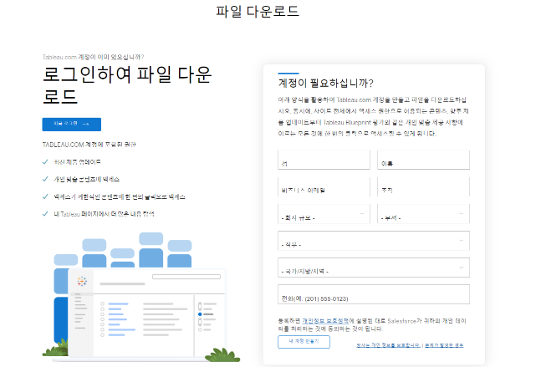
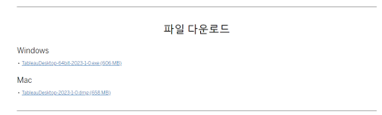
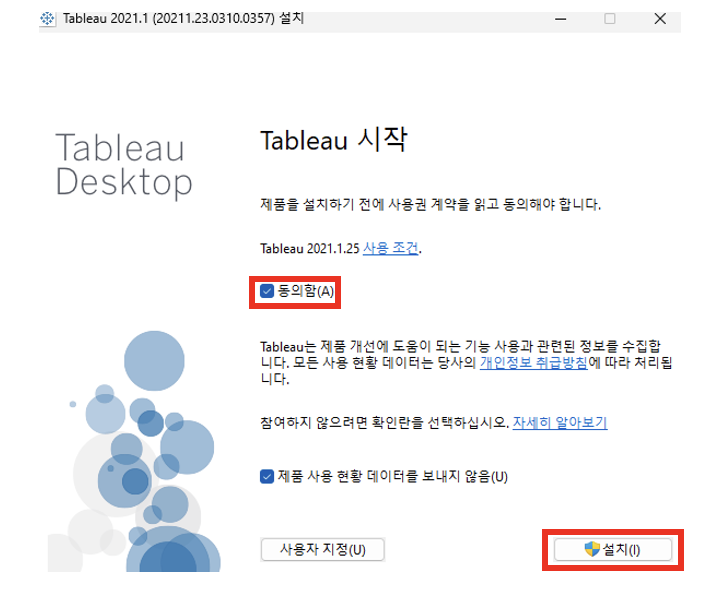
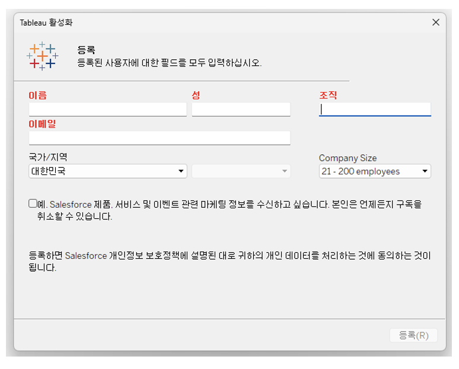

## 학습 목표

- Tableau Desktop 다운로드와 설치 절차를 이해할 수 있습니다.
- 운영체제별 설치 흐름을 구분할 수 있습니다.

## 목차

1. 다운로드 페이지 접속
2. 설치 파일 다운로드
3. Tableau Desktop 설치

## 1. 다운로드 페이지 접속

이제 Tableau Desktop을 설치합니다.

1. Tableau 다운로드 사이트에 접속합니다.

[Tableau Desktop 다운로드 페이지](https://www.tableau.com/ko-kr/support/releases)

2. 최신 버전 또는 회사에서 사용하고 있는 태블로 서버의 버전을 선택하고 다운로드 버튼을 클릭합니다.

3. Tableau.com 계정으로 로그인합니다. 계정이 없다면 먼저 계정을 생성합니다.

## 2. 설치 파일 다운로드

운영 체제에 맞는 설치 파일을 다운로드합니다.

- Windows: 설치 파일을 실행하고 안내에 따라 진행합니다.
- Mac: `.DMG` 파일을 열고 `.PKG` 패키지를 실행합니다.

## 3. Tableau Desktop 설치

1. 설치 동의 후 설치를 진행합니다.

`제품 사용 현황 데이터를 보내지 않음`은 선택 사항입니다.

2. 설치가 끝나면 Tableau 등록 양식을 작성합니다.

여기까지 완료되면 프로그램 설치 자체는 끝난 상태입니다.  
다만 실제로 Tableau를 사용하려면 이후 문서에서 다루는 라이선스 활성화가 이어져야 합니다.
