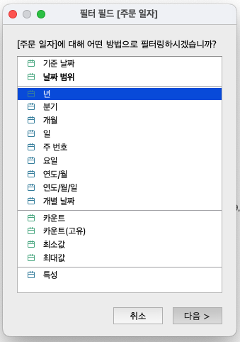
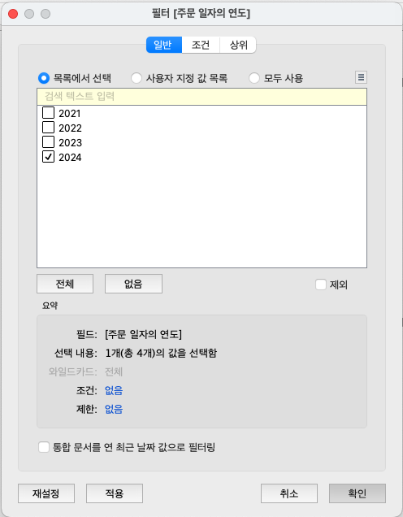
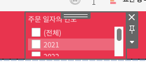
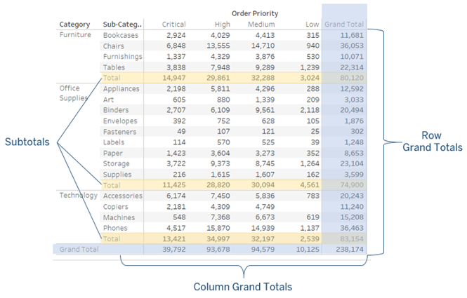
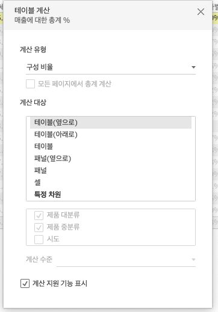
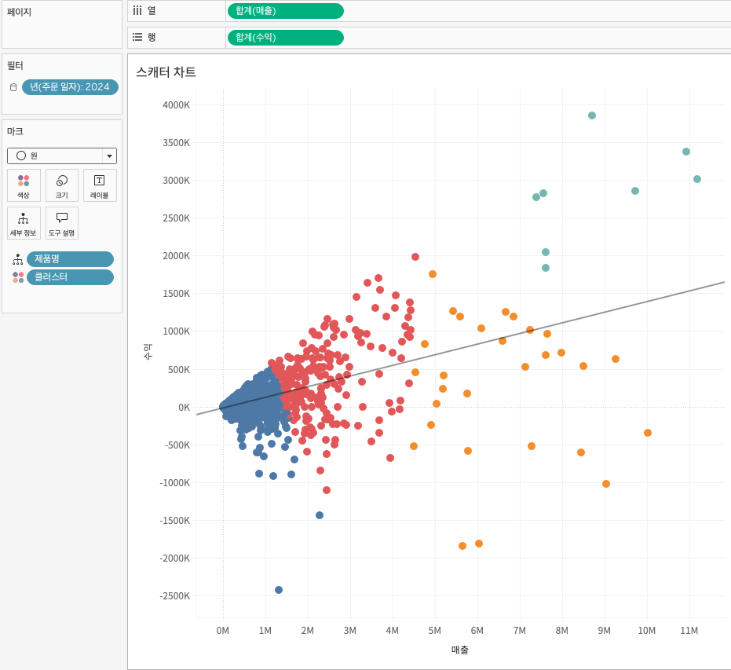
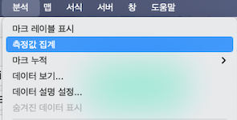

## 학습 목표

- 수동, 사전, 필드, 중첩 정렬 방식의 차이를 이해하고 상황에 맞게 적용할 수 있습니다.
- 동적 필터와 정적 필터의 개념을 이해하고 대시보드 분석에 활용할 수 있습니다.
- 크로스탭과 스캐터 차트를 시각화하고 분석 패널 기능을 활용할 수 있습니다.

## 사용 프로그램

- Tableau Desktop

## 사용 데이터 및 실습 파일

실습에는 Superstore 기반 샘플 데이터와 Tableau 통합 문서를 사용합니다.

실습 파일 다운로드:

```text
https://contentslecture.s3.ap-northeast-2.amazonaws.com/resources/%E1%84%89%E1%85%B5%E1%86%AF%E1%84%89%E1%85%B3%E1%86%B8+%E1%84%8C%E1%85%A1%E1%84%85%E1%85%AD+%E1%84%83%E1%85%A1%E1%84%8B%E1%85%AE%E1%86%AB%E1%84%85%E1%85%A9%E1%84%83%E1%85%B3.zip
```

## 목차

1. 정렬과 필터
2. 테이블 계산과 분석 패널 활용

## 1. 정렬과 필터

### 1-1. 정렬

정렬은 단순히 보기 좋게 만드는 기능이 아닙니다.  
실무에서는 정렬이 곧 우선순위와 패턴을 드러내는 장치입니다.

예를 들어 같은 막대 차트라도 정렬이 없으면 단순 나열에 그치지만, 매출 기준 내림차순 정렬을 적용하면 어떤 범주가 가장 중요한지 즉시 읽을 수 있습니다.

#### 1. 아이콘을 활용한 오름차순/내림차순 정렬


- 툴바 아이콘을 이용하면 빠르게 오름차순 또는 내림차순 정렬을 적용할 수 있습니다.
- 가장 간단하고 자주 사용하는 정렬 방식입니다.

#### 2. 축 정렬


- 축 자체의 정렬 방향을 바꿔 시각적 흐름을 조정할 수 있습니다.
- 값의 비교 순서를 바꾸거나, 사용자가 더 자연스럽게 읽도록 배치할 때 활용합니다.

#### 3. 차원 정렬


차원 정렬은 차원의 순서를 특정 기준에 따라 바꾸는 기능입니다.

| 정렬 기준 | 설명 |
| --- | --- |
| 데이터 원본 순서 | 데이터가 원본에 입력된 순서대로 표시 |
| 사전순 | 텍스트 값 기준 가나다/알파벳 순으로 정렬 |
| 필드 | 다른 필드의 값을 기준으로 정렬 |
| 수동 | 사용자가 원하는 순서를 직접 지정 |
| 중첩 | 상위 차원 안에서 하위 차원을 다시 정렬 |

#### 각 정렬 방식이 중요한 이유

- 사전순 정렬은 텍스트 탐색에는 유용하지만 성과 비교에는 적합하지 않을 수 있습니다.
- 필드 정렬은 매출, 수익, 주문 수처럼 분석 목적에 맞는 기준을 잡을 때 가장 많이 사용합니다.
- 수동 정렬은 비즈니스 흐름이 본질적으로 순서를 가지는 경우에 유용합니다.
  예: `Bronze -> Silver -> Gold`, `초기 -> 성장 -> 성숙`
- 중첩 정렬은 상위 그룹 안에서 하위 항목의 순서를 유지하며 비교할 때 필요합니다.

실무에서는 `중구`처럼 동일한 하위 지명이 여러 상위 지역에 속할 수 있습니다.  
이럴 때 단순 정렬을 쓰면 전체 뷰 기준으로 섞여 보일 수 있으므로, 각 시도 안에서 다시 정렬되는 `중첩 정렬`이 필요합니다.

### 1-2. 워크시트 필터

필터는 관련 정보에 초점을 맞추기 위해 뷰에 표시되는 데이터 범위를 좁히는 기능입니다.

핵심은 필터가 단순히 데이터를 숨기는 것이 아니라, 사용자가 특정 질문에 집중하도록 분석 범위를 재정의한다는 점입니다.

#### 필터의 기본 개념

- 필터 선반에는 현재 사용 중인 필터가 표시됩니다.
- 차원, 측정값, 날짜에 따라 사용할 수 있는 필터 옵션이 달라집니다.
- 같은 필터라도 적용 범위를 어떻게 설정하느냐에 따라 결과 해석이 달라집니다.

#### 차원 필터 옵션

| 필터 옵션 | 설명 |
| --- | --- |
| 일반 | 포함 또는 제외할 멤버를 선택 |
| 와일드카드 | 입력한 패턴과 일치하는 값을 포함/제외 |
| 조건 | 특정 조건 또는 수식 기준으로 필터링 |
| 상위 | 지정 기준에 따라 상위/하위 N개만 필터링 |

#### 측정값 필터 범위

| 필터 옵션 | 설명 |
| --- | --- |
| 값 범위 | 지정한 범위 안의 값만 포함 |
| 최소 | 지정 값 이상만 포함 |
| 최대 | 지정 값 이하만 포함 |
| 특수 | null 또는 null이 아닌 값 기준 필터 |

#### 동적 필터와 정적 필터

- 동적 필터는 선택 값이나 현재 데이터 상태에 따라 결과가 바뀌는 필터입니다.
  예: 매출 범위를 슬라이더로 조정
- 정적 필터는 미리 정한 범위를 고정적으로 적용하는 필터입니다.
  예: `2024년 데이터만 포함`

실무에서는 탐색형 대시보드에는 동적 필터가 유용하고, 보고서형 대시보드에는 정적 필터가 더 안정적일 때가 많습니다.

#### 필터 적용 범위

| 적용 옵션 | 설명 | 예시 |
| --- | --- | --- |
| 관련 데이터 원본을 사용하는 모든 항목 | 같은 데이터 원본을 공유하는 워크시트 전반에 필터 적용 | 같은 Excel/DB 연결을 쓰는 여러 시트 |
| 이 데이터 원본을 사용하는 모든 항목 | 선택된 데이터 원본 기반 워크시트 전체에 적용 | 데이터 원본 단위 공통 필터 |
| 선택한 워크시트 | 사용자가 지정한 워크시트에만 적용 | 대시보드 내 일부 시트만 반영 |
| 이 워크시트만 | 현재 워크시트에만 적용 | 특정 뷰에서만 필터 사용 |

필터는 적용 범위가 넓을수록 편리하지만, 의도하지 않은 시트까지 바뀔 수 있습니다.  
따라서 대시보드 작업에서는 `무엇을 바꾸고 싶은가`보다 `어디까지 바뀌어야 하는가`를 먼저 생각하는 것이 중요합니다.

### 1-3. [실습] 대시보드 필터 표시

대시보드에서 필터를 표시하는 작업은 단순 UI 배치가 아니라, 사용자가 직접 분석 경로를 조절하게 만드는 과정입니다.





`주문 일자` 필드를 필터로 이동시킨 뒤 `년`을 선택하고, 분석할 연도를 하나 선택합니다.


이렇게 설정하면 필터 선반에 연도 필터가 추가됩니다. 이후 `매출 분석 대시보드`로 이동합니다.


총 매출 시트를 클릭한 뒤 `필터 -> 주문 일자의 연도`를 추가합니다.


- 우측에 생성된 필터에서 메뉴를 열어 `단일 값(드롭다운)`을 선택합니다.
- 회색 상단 영역을 드래그하면 대시보드 안 원하는 위치로 이동할 수 있습니다.



이 상태에서는 필터가 특정 워크시트에만 적용되므로, 필터 값을 바꿔도 해당 시트만 반영되는 것을 볼 수 있습니다.


대시보드 전체에 필터를 반영하려면 `워크시트에 적용 -> 이 데이터 원본을 사용하는 모든 항목`을 선택합니다.

## 2. 테이블 계산과 분석 패널 활용

### 2-1. 크로스탭이란?

크로스탭은 특정 숫자 값을 행과 열 구조 안에 표 형태로 보여주는 시각화입니다.  
Tableau에서는 흔히 `텍스트 테이블`이라고도 부릅니다.


#### 크로스탭을 쓰는 이유

- 정확한 수치를 직접 읽어야 할 때 유용합니다.
- 요약 수치뿐 아니라 행과 열 교차 수준의 상세 값 비교에 적합합니다.
- 시각적 임팩트보다는 정밀한 확인이 중요한 경우에 적합합니다.

#### 만드는 방법

- 열에 차원 1개
- 행에 차원 1개
- `Abc` 자리 표시자에 측정값 1개

또는 기존 워크시트 탭을 마우스 오른쪽 버튼으로 클릭해 `크로스탭으로 복제`를 선택할 수 있습니다.



분석 패널을 함께 사용하면 다음과 같은 요소를 추가할 수 있습니다.

- 행 총합계
- 열 총합계
- 소계
- 집계 방식 변경

실무에서는 대시보드에서는 차트로 요약을 보여주고, 상세 탭에서는 크로스탭으로 수치를 검증하는 구성이 자주 쓰입니다.

### 2-2. 테이블 계산

테이블 계산은 뷰에 그려진 결과를 기준으로 계산 방향과 범위를 지정하는 기능입니다.

즉, 원본 데이터 자체를 다시 계산하는 것이 아니라 `현재 화면에 어떻게 배치되어 있는가`를 기준으로 계산이 이루어집니다.



- 테이블(옆으로): 행 단위로, 왼쪽에서 오른쪽으로 계산
- 테이블(아래로): 열 단위로, 위에서 아래로 계산
- 테이블: 전체 테이블을 하나의 단위로 계산
- 패널(옆으로): 패널 단위에서 행 방향으로 계산
- 패널: 패널 전체를 하나의 단위로 계산
- 셀: 개별 마크 단위 계산
- 특정 차원: 지정한 차원을 기준으로 계산

#### 왜 중요한가

같은 `구성 비율`이라도 계산 방향이 다르면 결과는 완전히 달라집니다.

- 전체 대비 비율을 보고 싶은데 `패널 기준`으로 계산하면 각 그룹 내부 비율만 보일 수 있습니다.
- 전년 대비 비교를 하려는데 주소 지정이 잘못되면 다른 범주끼리 비교할 수도 있습니다.

따라서 테이블 계산이 예상과 다르게 나올 때는 계산식보다 먼저 `Compute Using` 방향을 확인해야 합니다.

패널은 두 개 이상의 차원을 사용할 때, 특정 차원을 기준으로 먼저 데이터를 묶어 계산하는 단위라고 이해하시면 됩니다.

### 2-3. [실습] 크로스탭과 히트맵

크로스탭과 히트맵은 같은 데이터를 두 가지 방식으로 보여주는 좋은 예시입니다.

- 크로스탭은 숫자를 정확히 읽는 데 강합니다.
- 히트맵은 값의 크기와 패턴을 한눈에 파악하는 데 강합니다.


- 열: 제품 대분류, 제품 중분류
- 행: 시도
- 마크: 사각형(히트맵) 또는 텍스트(텍스트 테이블)
- 색상: 합계(매출)
- 레이블: 합계(매출) -> 퀵 테이블 계산 `구성 비율`

같은 데이터라도 질문이 `정확한 숫자 확인`인지, `패턴 파악`인지에 따라 표현 방식이 달라져야 합니다.

### 2-4. 스캐터 차트란?

스캐터 차트는 두 개 이상의 연속형 측정값 간 관계를 시각적으로 보여주는 차트입니다.

대표적으로 다음 질문에 적합합니다.

- 매출이 높을수록 수익도 높은가?
- 특정 제품군이 다른 군집과 다른 패턴을 보이는가?
- 이상치(outlier)는 어디에 위치하는가?


#### 만드는 방법

- 열: 연속형 측정값 1개
- 행: 연속형 측정값 1개
- 세부정보, 색상, 모양 등에 차원을 배치해 구분

또는 `표현 방식(Show Me)`에서 스캐터 차트를 선택할 수 있습니다.

#### 활용 방법

- 추세선 추가 -> 두 변수의 관계 확인
- 클러스터링 적용 -> 데이터 그룹 특성 파악
- 크기에 다른 측정값을 넣기 -> 버블 차트로 확장

### 2-5. [실습] 스캐터 차트



- 열: 합계(매출)
- 행: 합계(수익)
- 마크: 도형 또는 원
- 색상: 클러스터

#### 측정값 집계



분석 탭의 `측정값 집계` 옵션은 값을 집계 함수 기준으로 묶어서 보여줄지, 원본 행 단위로 풀어 보여줄지를 제어합니다.

이 기능은 특히 스캐터 차트에서 중요합니다.

- 집계된 상태에서는 요약된 관계가 보입니다.
- 집계를 해제하면 개별 행 수준의 분포와 이상치가 드러납니다.

### 2-6. 분석 패널 기능

분석 패널은 왼쪽 사이드바의 `데이터(Data)` 패널 옆 탭에 있습니다.

데이터 패널이 필드를 배치하는 곳이라면, 분석 패널은 시각화 위에 분석 요소를 얹는 곳이라고 볼 수 있습니다.


#### 1. 요약(Summarize)

- 상수 라인(Constant Line): 목표값 등 고정 기준선 표시
- 평균 라인(Average Line): 평균값 기준선 표시
- 사분위수 및 중앙값: 분포의 중앙 경향과 구간 확인
- 박스 플롯(Box Plot): 분포와 이상치 확인
- 총계(Totals): 합계, 평균 등 요약 정보 표시

#### 2. 모델(Model)

- 평균 + 95% CI: 평균과 신뢰구간 표시
- 중앙값 + 95% CI: 중앙값과 신뢰구간 표시
- 추세선(Trend Line): 회귀선 기반 패턴 설명
- 예측(Forecast): 지수 평활 기반 미래값 예측
- 클러스터(Cluster): K-means 기반 군집화

#### 3. 사용자 지정(Custom)

- 참조선(Reference Line): 특정 기준값을 선으로 표시
- 참조 구간(Reference Band): 상·하한 범위를 음영으로 표시
- 분포 구간(Distribution Band): 분포 기반 구간 강조

#### 4. 박스 플롯(Box Plot)

- 사용자가 직접 기준을 설정해 박스 플롯 생성 가능

#### 실무적으로 중요한 이유

- 참조선은 KPI 기준과 실제 값을 비교할 때 유용합니다.
- 추세선은 관계가 있는지 빠르게 탐색할 때 좋지만, 인과관계를 보장하지는 않습니다.
- 예측은 데이터의 패턴이 안정적일 때 유의미하며, 구조 변화가 큰 데이터에서는 신중해야 합니다.
- 클러스터링은 자동 그룹화에 유용하지만, 군집 수와 변수 선택에 따라 결과가 달라질 수 있습니다.

## 정리

이 절에서는 정렬, 필터, 크로스탭, 스캐터 차트, 분석 패널까지 Tableau의 분석 중심 기능을 정리했습니다.

핵심은 다음과 같습니다.

- 정렬은 보기 좋은 배치가 아니라 패턴을 드러내는 분석 장치입니다.
- 필터는 적용 범위에 따라 해석이 달라지므로, 워크시트 단위인지 데이터 원본 단위인지 구분해야 합니다.
- 테이블 계산은 현재 뷰의 구조에 의존하므로 계산 방향을 이해해야 합니다.
- 크로스탭은 정확한 숫자 확인에, 히트맵과 스캐터 차트는 패턴 탐색에 강합니다.
- 분석 패널은 기준선, 분포, 추세, 예측 같은 해석 장치를 시각화 위에 바로 올릴 수 있게 해줍니다.
