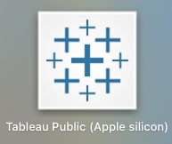
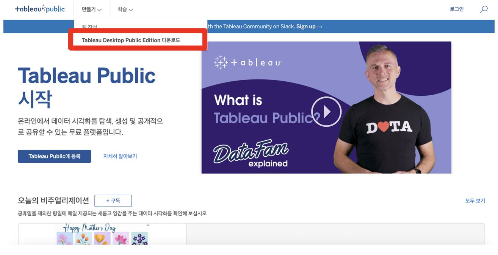
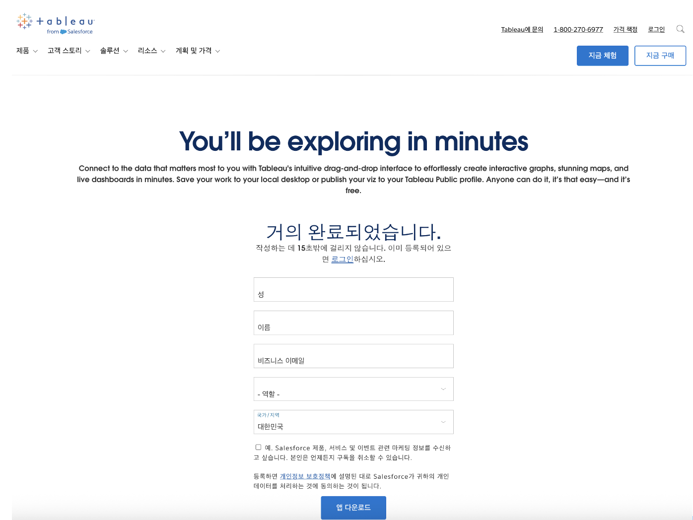
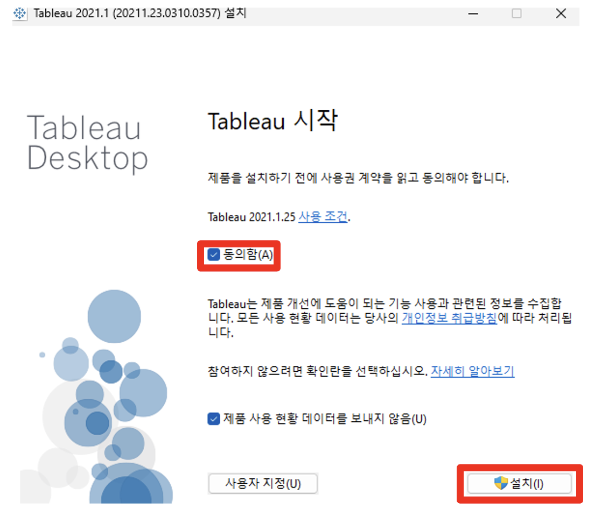
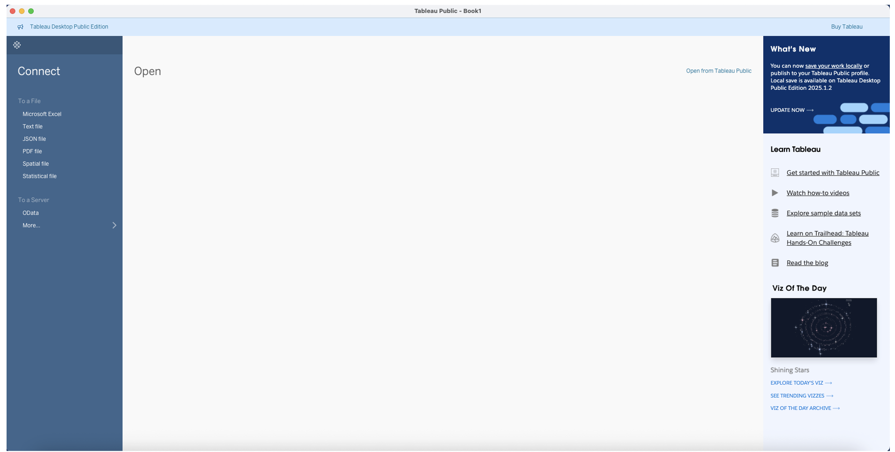

## 학습 목표

- Tableau Desktop Public Edition의 개념을 이해할 수 있습니다.
- Public Edition과 유료 Desktop의 차이를 설명할 수 있습니다.
- Tableau Desktop Public Edition 설치 방법을 따라 할 수 있습니다.

## 목차

1. Tableau Desktop Public Edition이란?
2. Public Edition과 Desktop의 차이
3. Tableau Desktop Public Edition 설치 방법

## 1. Tableau Desktop Public Edition이란?

Tableau Desktop Public Edition은 Tableau Desktop의 무료 공개 버전입니다. 기본적인 시각화와 대시보드 제작 기능은 제공하지만, 저장과 데이터 연결 측면에서 제약이 있습니다.

핵심 특징은 다음과 같습니다.

- 무료로 제공됩니다.
- 누구나 다운로드해 설치할 수 있습니다.
- 기본적인 데이터 연결과 시각화 기능은 사용할 수 있습니다.
- 결과물은 Tableau Public에 공개 저장해야 합니다.

## 2. Public Edition과 Desktop의 차이

| 구분 | Tableau Desktop Public Edition | Tableau Desktop |
| --- | --- | --- |
| 가격 | 무료 | 유료, Creator 라이선스 필요 |
| 저장 위치 | Tableau Public에만 저장, 공개됨 | 로컬 PC, Tableau Server, Tableau Cloud 등 |
| 데이터 연결 | Excel, CSV, Google Sheets 등 제한적 | DB와 클라우드 포함 폭넓은 연결 지원 |
| 보안/비공개 | 비공개 저장 불가 | 비공개 저장 가능 |
| 활용 목적 | 학습, 포트폴리오, 커뮤니티 공유 | 기업 분석, 내부 보고, 실무 활용 |

정리하면, Public Edition은 학습과 포트폴리오용으로 적합하고, Desktop 유료 버전은 기업과 실무 환경에 적합합니다.

## 3. Tableau Desktop Public Edition 설치 방법

Tableau Public Edition은 Tableau Public 사이트에서 설치할 수 있습니다.

1. Tableau Public 사이트에 접속합니다.

[Tableau Public 사이트](https://public.tableau.com/app/discover)

2. 화면 왼쪽 상단의 `Tableau Desktop Public Edition 다운로드` 버튼을 클릭합니다.

3. 이동한 페이지에서 필요한 정보를 입력하고 다운로드를 진행합니다.

4. 설치를 진행합니다.

5. 실행이 완료되면 Tableau Public Edition을 사용할 수 있습니다.

