## 학습 목표

- Tableau 라이선스 활성화 방식의 차이를 이해할 수 있습니다.
- Tableau Cloud 계정 활성화와 추가 인증 과정을 따라 할 수 있습니다.
- Tableau Desktop을 서버 로그인 방식으로 활성화하고 정상 여부를 확인할 수 있습니다.

## 목차

1. 태블로 인증 과정
2. 제품키로 활성화
3. 서버에 로그인하여 활성화
4. 활성화 확인 방법

## 1. 태블로 인증 과정

Tableau는 설치만으로 바로 사용하는 프로그램이 아니라, 계정과 권한, 인증 과정을 함께 거쳐야 정상적으로 사용할 수 있는 서비스형 도구입니다. 실무에서는 보통 아래 흐름으로 활성화가 진행됩니다.

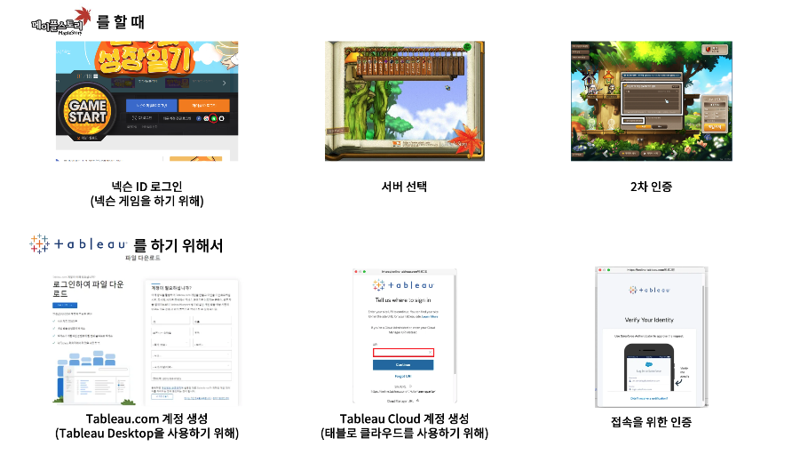

1. Tableau Cloud 초대 메일을 받고 계정을 활성화합니다.
2. 이름과 비밀번호를 설정한 뒤 Cloud에 로그인합니다.
3. 조직 정책에 따라 추가 인증 수단(MFA)을 등록합니다.
4. Tableau Desktop에서 라이선스를 활성화합니다.
5. 마지막으로 제품 키 또는 로그인 상태를 확인합니다.

메이플스토리 흐름에 비유하면 다음과 같이 이해할 수 있습니다.

| 메이플스토리 | Tableau |
| --- | --- |
| 넥슨 ID 로그인 | Tableau.com 계정 생성 |
| 서버 선택 | Tableau Cloud 접속 |
| 2차 인증 | MFA 등록 및 인증 |
| 게임 접속 완료 | Tableau Desktop 활성화 후 사용 시작 |

활성화 방식은 크게 두 가지입니다.

- `제품키로 활성화`: 회사에서 받은 제품 키를 직접 입력하는 방식
- `서버에 로그인하여 활성화`: Tableau Cloud 또는 Server 계정으로 로그인하여 활성화하는 방식

실무에서는 권한 관리와 회수, 운영 편의성 때문에 `서버에 로그인하여 활성화` 방식을 더 많이 사용합니다.

## 2. 제품키로 활성화

조직에 따라 Tableau Desktop을 서버 로그인 방식이 아니라 제품 키(Product Key) 입력 방식으로 활성화하는 경우도 있습니다.

1. Tableau 활성화 화면에서 `제품 키로 활성화`를 클릭합니다.

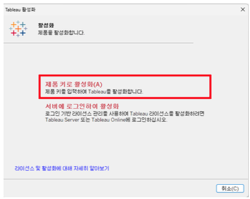

2. 회사에서 할당받은 제품 키를 텍스트 상자에 붙여 넣은 다음 `활성화`를 클릭합니다.

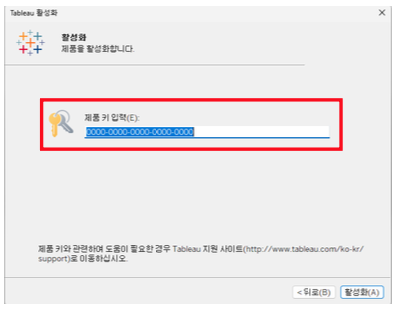

- 제품 키는 보통 관리자나 태블로 서버/클라우드 담당자가 전달합니다.
- 제품 키 방식은 서버 연결 없이도 활성화할 수 있다는 장점이 있습니다.
- 반면 키 배포와 회수, 사용자 변경 관리가 번거로워질 수 있습니다.

## 3. 서버에 로그인하여 활성화

이 방식은 Tableau Cloud 계정이 먼저 활성화되어 있어야 합니다. 따라서 `Cloud 계정 활성화 → 추가 인증 등록 → Desktop 로그인 활성화` 순서로 진행하는 것이 가장 자연스럽습니다.

### 3-1. Tableau Cloud 계정 활성화

처음 Tableau Cloud를 사용하려면 초대 메일을 통해 계정을 활성화해야 합니다.

1. 이메일에서 `You've Been Invited to Tableau Cloud` 메일을 확인합니다.  
   안내 메일이 오지 않았다면 태블로 서버/클라우드 담당자에게 문의합니다.

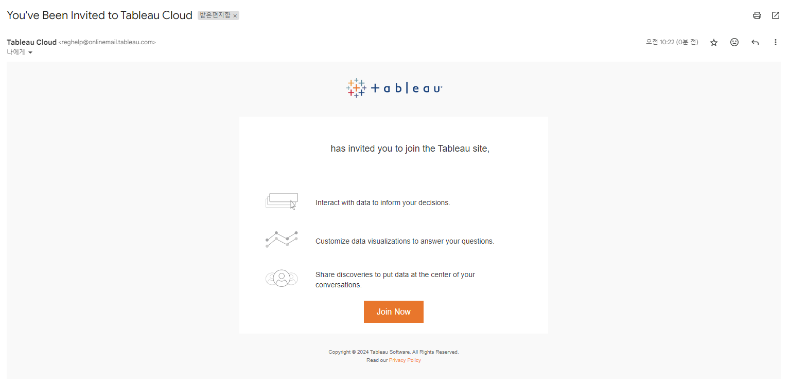

2. 메일 안의 `Join Now` 버튼을 클릭합니다.

3. 이름과 비밀번호를 설정합니다.

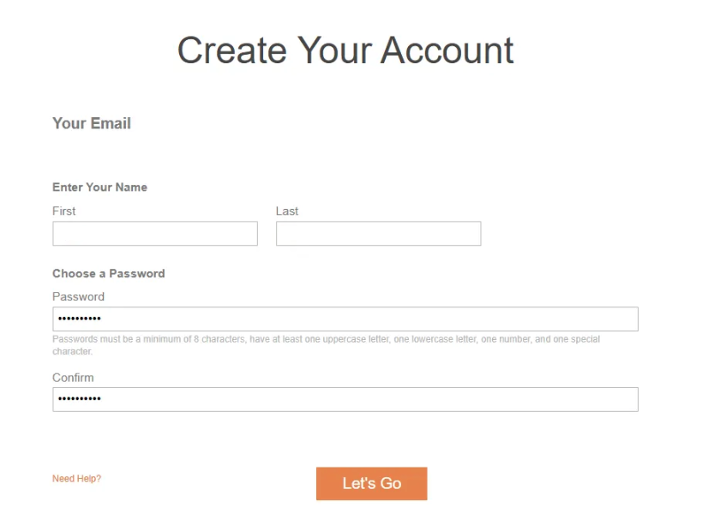

4. 설정이 완료되면 추가 인증 수단 등록 단계로 이동합니다.

이 단계가 끝나면 Tableau Cloud 계정 자체는 활성화된 상태가 되며, 조직 정책에 따라 추가 인증 등록이 이어질 수 있습니다.

### 3-2. 추가 인증 수단 등록

조직 보안 정책에 따라 첫 로그인 시 추가 인증(MFA) 설정이 필요할 수 있습니다. 대표적으로 Salesforce Authenticator 또는 Google Authenticator 기반 인증을 사용합니다.

#### 1. Salesforce Authenticator로 인증하는 경우

설정 절차는 다음과 같습니다.

1. 휴대폰에 Salesforce Authenticator 앱을 설치합니다.

- Google Play: [Salesforce Authenticator](https://play.google.com/store/apps/details?id=com.salesforce.authenticator)
- App Store: [Salesforce Authenticator](https://apps.apple.com/us/app/salesforce-authenticator/id782057975)

2. 스마트폰에서 앱을 실행합니다.

3. `Add an Account` 또는 `계정 추가`를 눌러 계정을 추가합니다.

4. 앱 화면에 표시된 두 단어를 PC 인증창에 입력합니다.

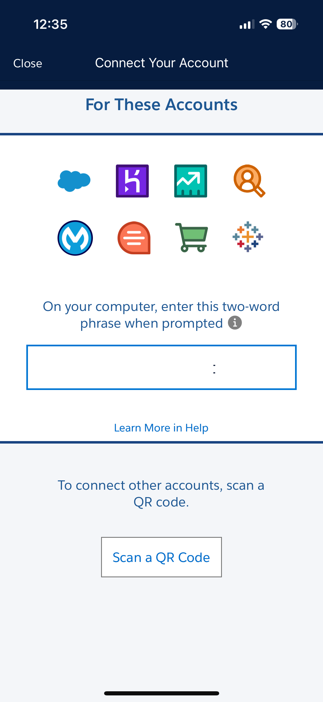

5. 앱에서 갱신되는 확인 코드를 PC 화면에 입력합니다.
6. 확인 코드와 검증 도구 이름을 설정하면 등록이 완료됩니다.

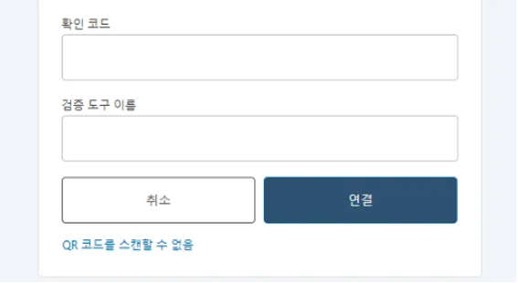

#### 2. Google Authenticator로 인증하는 경우

추가 인증 수단 등록 화면에서 `일회용 암호 생성기`를 선택합니다.

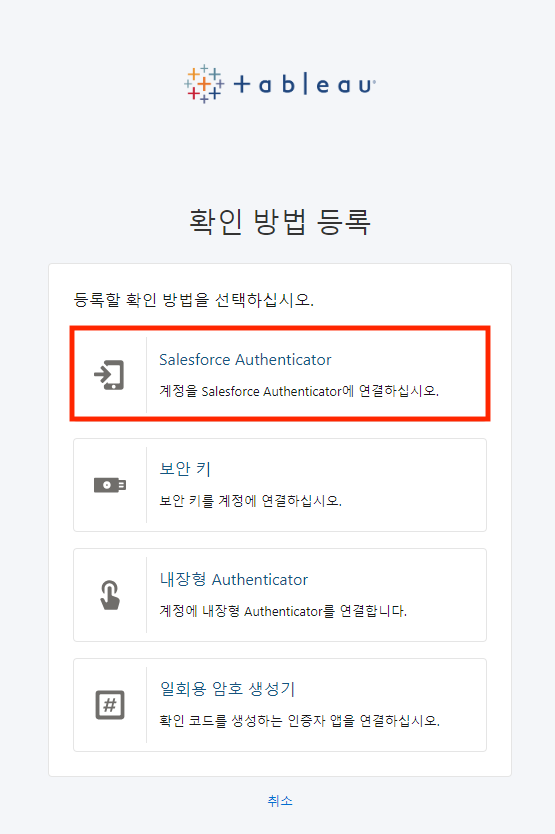

설정 절차는 다음과 같습니다.

1. 휴대폰에 Google Authenticator 앱을 설치합니다.

- Google Play: [Google Authenticator](https://play.google.com/store/apps/details?id=com.google.android.apps.authenticator2&hl=ko&gl=US&pli=1)
- App Store: [Google Authenticator](https://apps.apple.com/us/app/google-authenticator/id388497605)

2. 앱을 실행하고 코드 추가를 선택합니다.

3. `QR 코드 스캔`을 눌러 PC에 표시된 QR 코드를 등록합니다.

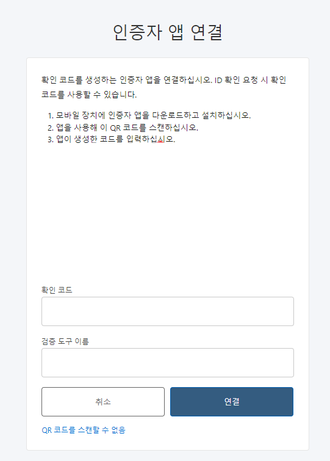

4. 앱에 표시되는 일회용 코드를 PC 화면에 입력합니다.

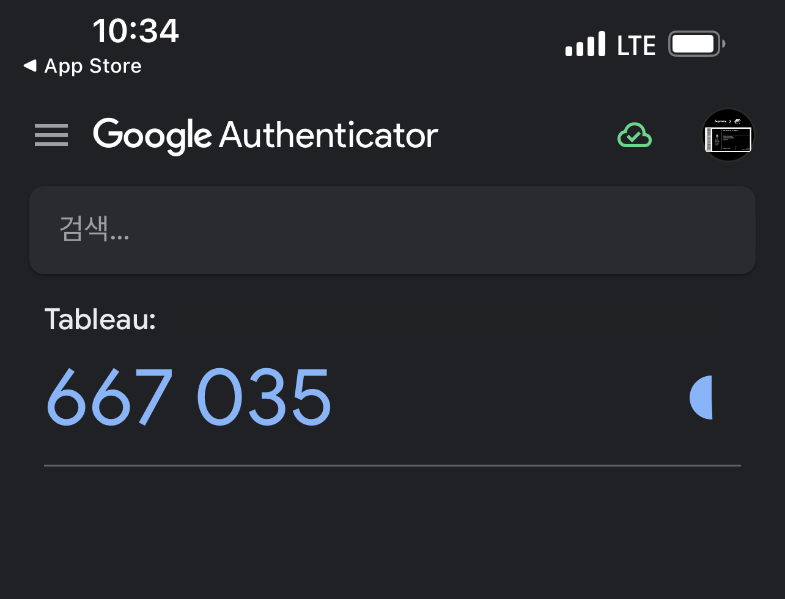

5. 확인 코드와 검증 도구 이름을 설정하면 등록이 완료됩니다.

### 3-3. Tableau Desktop에서 서버 로그인으로 활성화

Tableau Desktop 설치가 끝났다면 이제 조직에서 제공받은 라이선스로 활성화합니다.

1. Tableau 활성화 화면에서 `서버에 로그인하여 활성화`를 선택합니다.

2. Tableau Cloud를 선택합니다.

3. Tableau Cloud에 사용할 사용자 이름을 입력합니다.  
   이때 앞 단계에서 활성화한 Tableau Cloud 이메일을 입력합니다.

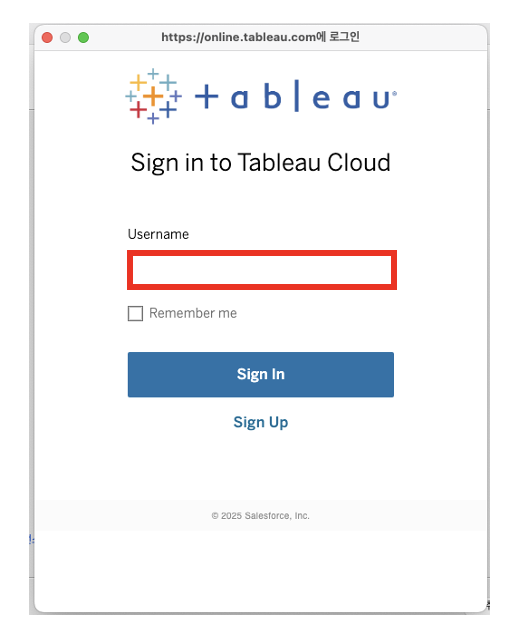

4. URL 입력창이 나오면 본인 Cloud URL의 사이트 이름 부분을 입력합니다.  
   표시되지 않으면 건너뜁니다.

예:

`https://prod-apnortheast-a.online.tableau.com/#/site/``{사이트 이름}``/home`

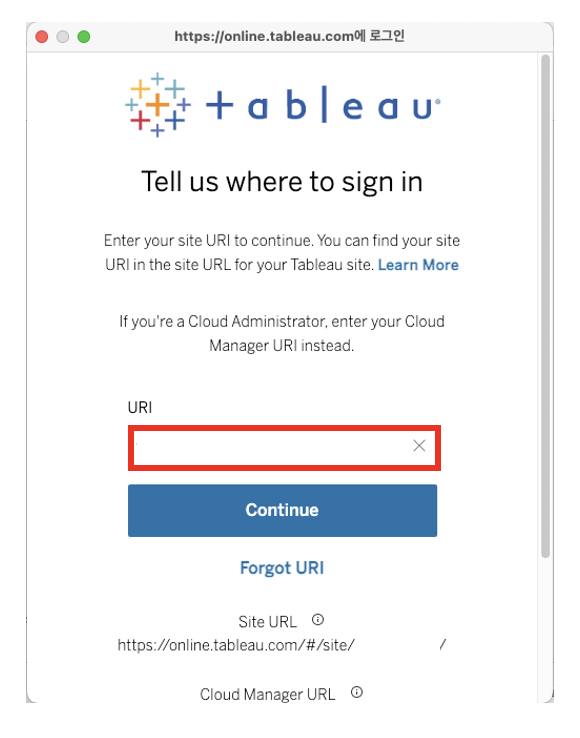

5. 이메일과 비밀번호를 입력합니다.

6. Authenticator 인증을 진행합니다.

7. 활성화 프로세스 완료 화면이 나타나면 `계속`을 눌러 마칩니다.

## 4. 활성화 확인 방법

정상적으로 활성화되었는지 확인하려면 Tableau Desktop 내부에서 제품 키 상태를 확인하면 됩니다.

1. Tableau Desktop 상단 메뉴에서 `도움말 > 제품 키 관리`를 클릭합니다.

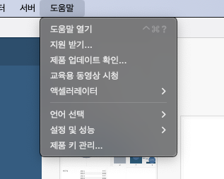

2. Creator 제품 키가 보이면 정상적으로 활성화된 것입니다.

