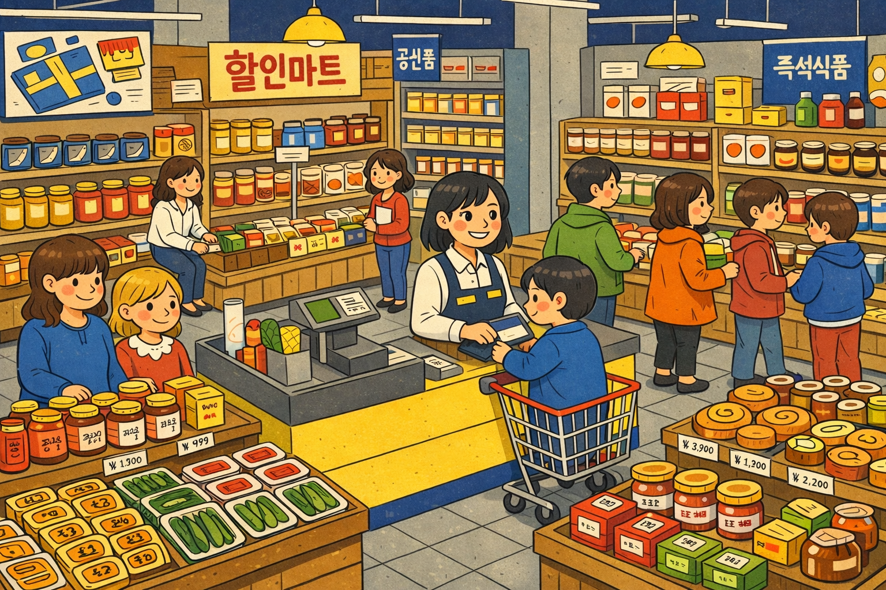

## 학습 목표

- 4장 실습에 사용할 데이터 구성을 이해합니다.
- 실습 데이터의 주요 컬럼과 분석 포인트를 파악할 수 있습니다.

## 목차

1. 실습 데이터 소개

## 1. 실습 데이터 소개

이번 실습에서는 Superstore Dataset을 사용합니다. 이 데이터는 가상의 소매점 판매 데이터를 기반으로 구성된 교육용 표준 데이터셋으로, BI 학습자와 데이터 분석 입문자가 Tableau를 익힐 때 가장 많이 사용하는 예제 중 하나입니다.

실습 데이터는 아래 Kaggle 페이지에서 내려받을 수 있습니다.

[KRSuperstore Sample 2025 데이터 다운로드](https://www.kaggle.com/datasets/heoquixote/krsuperstore-sample-2025/data)

이 데이터가 자주 사용되는 이유는 다음과 같습니다.

- 주문, 고객, 제품, 지역, 성과 지표가 함께 들어 있어 분석 연습에 적합합니다.
- 차원과 측정값을 자연스럽게 구분해 볼 수 있습니다.
- 필터링, 집계, 시각화, 대시보드 설계까지 한 흐름으로 실습할 수 있습니다.

### 1-1. 데이터 구성

- 주문 관련: 주문 번호, 주문 일자, 배송 일자, 배송 방법
- 고객 관련: 고객 번호, 고객명, 고객 세그먼트, 국가, 시도, 시군구
- 제품 관련: 제품 코드, 제품 대분류, 제품 중분류, 제품명
- 판매 성과 관련: 매출, 수량, 수익, 할인율

| 컬럼명 | 설명 | 예시 |
| --- | --- | --- |
| 주문 번호 | 각 주문을 구분하기 위한 고유 식별 번호 | IN-2024-63178 |
| 주문 일자 | 고객이 주문을 생성한 날짜 | 6/24/24 |
| 배송 일자 | 주문 상품이 실제로 배송된 날짜 | 6/30/24 |
| 배송 방법 | 주문이 고객에게 전달되는 방식 | 표준 배송 |
| 고객번호 | 고객을 구분하기 위한 고유 식별 번호 | SO-20335 |
| 고객명 | 실제 주문을 한 고객의 이름 | 강희수 |
| 고객 세그먼트 | 고객 유형 분류 정보 | 소비자 |
| 시군구 | 고객 주소의 시/군/구 단위 지역 | 제주시 |
| 시도 | 고객 주소의 시/도 단위 지역 | 제주특별자치도 |
| 국가 | 고객이 속한 국가 | 대한민국 |
| 제품 코드 | 특정 상품을 구분하기 위한 고유 코드 | OFF-AP-10002882 |
| 제품 대분류 | 제품이 속하는 큰 카테고리 | 사무용품 |
| 제품 중분류 | 대분류 아래의 세부 카테고리 | 가전, 종이 |
| 제품명 | 실제 판매된 상품의 이름과 속성 | KitchenAid Coffee Grinder |
| 관리자 | 해당 주문을 담당한 직원 | Edwin |
| 반품? | 상품 반품 여부 | Yes |
| 매출 | 해당 주문에서 발생한 총 판매 금액 | 123495 |
| 수량 | 주문된 제품 개수 | 2 |
| 할인율 | 적용된 할인 비율 | 0.15 |
| 수익 | 순이익 값 | 37754 |
