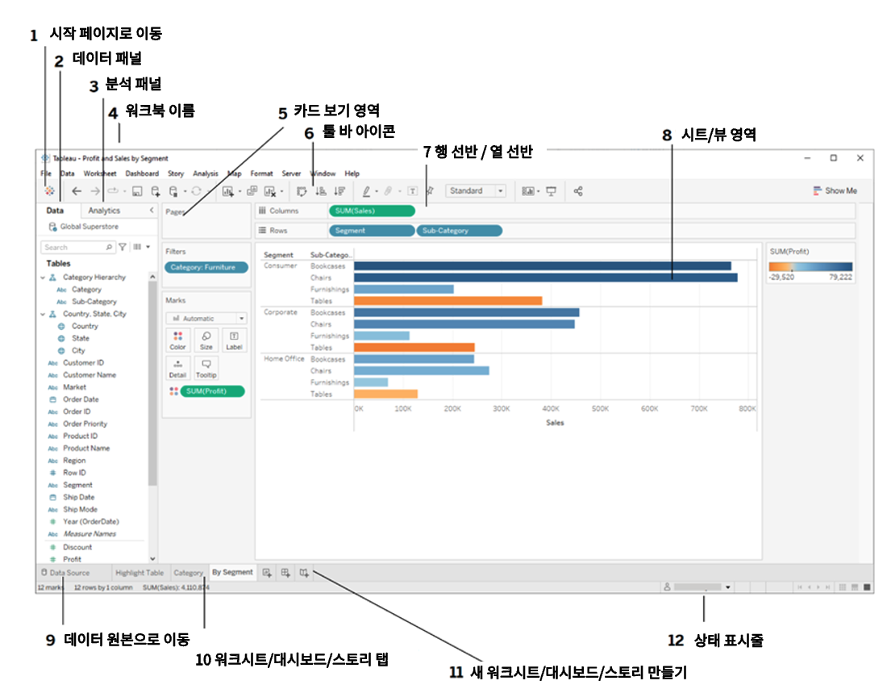

## 학습 목표

- Tableau 인터페이스의 기본 구조를 이해합니다.
- 각 영역이 어떤 역할을 담당하는지 구분할 수 있습니다.

## 목차

1. Tableau 화면 구성

## 1. Tableau 화면 구성

Tableau를 처음 사용할 때는 화면이 다소 복잡해 보일 수 있습니다. 하지만 각 영역의 역할을 이해하면, 어떤 기능이 어디에 있는지 빠르게 익숙해질 수 있습니다.

| 번호 | 한국어 명칭 | 설명 |
| --- | --- | --- |
| 1 | 시작 페이지로 이동 | Tableau 시작 화면으로 돌아가는 버튼 |
| 2 | 데이터 패널 | 연결된 데이터의 필드가 표시되는 영역 |
| 3 | 분석 패널 | 추세선, 평균선, 예측 등 분석 기능 추가 영역 |
| 4 | 워크북 이름 | 현재 열려 있는 Tableau 파일 이름 표시 |
| 5 | 카드 영역 | 마크 카드, 필터 카드, 페이지 카드, 범례가 놓이는 영역 |
| 6 | 툴바 아이콘 | 저장, 실행 취소, 다시 실행 등 자주 쓰는 명령 모음 |
| 7 | 행/열 선반 | 시각화 축이 되는 필드를 놓는 위치 |
| 8 | 시트/뷰 영역 | 실제 차트를 만들고 보는 메인 작업 영역 |
| 9 | 데이터 소스로 이동 | 데이터 구조와 연결 상태를 확인하는 탭 |
| 10 | 워크시트/대시보드/스토리 탭 | 시트와 대시보드를 생성하고 전환하는 영역 |
| 11 | 새 워크시트/대시보드/스토리 만들기 | 새로운 분석 화면 생성 버튼 |
| 12 | 상태 표시줄 | 로딩 상태, 필터 결과 등 작업 상태 표시 |

### 1-1. 선반과 카드는 다릅니다

처음 배울 때 가장 헷갈리는 부분이 `선반(Shelf)`과 `카드(Card)`입니다.

- 선반: 필드를 올려 시각화의 구조를 만드는 자리입니다. 행 선반, 열 선반, 필터 선반, 페이지 선반이 여기에 해당합니다.
- 카드: 올려둔 필드가 어떻게 보일지를 조정하는 자리입니다. 마크 카드의 색상, 크기, 레이블, 세부 정보, 도구 설명이 대표적입니다.

즉, 선반은 `무엇을 어디에 놓을 것인가`를 정하고, 카드는 `그것을 어떻게 보여줄 것인가`를 정합니다.  
이 구분을 잡아두면 이후 장에서 "열에 무엇을 올리고, 색상에 무엇을 넣는다"는 설명이 훨씬 자연스럽게 읽힙니다.
