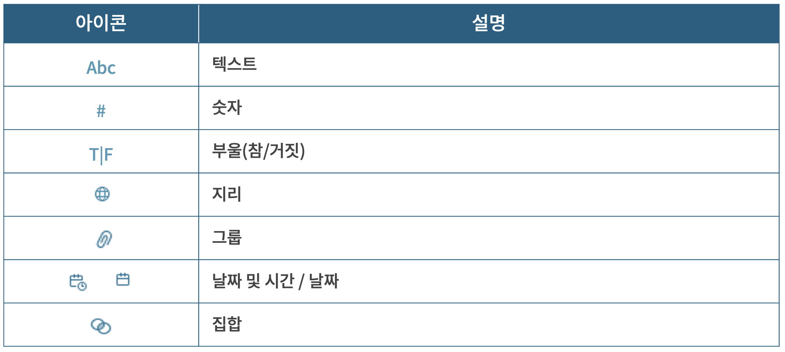

## 학습 목표

- Tableau에서 사용되는 주요 필드 아이콘을 이해합니다.
- 데이터 패널과 선반 위의 시각적 단서를 해석할 수 있습니다.

## 목차

1. 필드 아이콘

## 1. 필드 아이콘

Tableau는 데이터 패널과 선반에서 다양한 아이콘을 사용해 필드의 성격을 시각적으로 구분합니다. 이 아이콘을 이해하면 데이터를 훨씬 빠르게 읽을 수 있습니다.

### 1-1. 데이터 패널 아이콘

- 파란색 아이콘 `Abc`: 불연속형(Discrete) 필드
- 초록색 아이콘 `#`: 연속형(Continuous) 필드
- `=`가 붙은 아이콘: 계산된 필드 또는 복사본 필드
- `!`가 붙은 아이콘: 유효하지 않은 필드

### 1-2. 데이터 타입 아이콘

- `Abc`: 텍스트
- `#`: 숫자
- `T|F`: 부울(Boolean)
- 지구본 아이콘: 지리 데이터
- 클립 모양 아이콘: 그룹
- 달력 아이콘: 날짜 및 날짜시간
- Set 아이콘: 집합

### 1-3. 선반 위 필드의 시각적 단서

- 파란색 필드: 불연속형 필드
- 녹색 필드: 연속형 필드
- 정렬 아이콘: 정렬 적용 필드
- 델타 아이콘: 테이블 계산 적용 필드
- 계층 구조 아이콘: 드릴업/드릴다운 가능한 계층 구조
