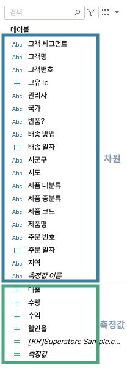

## 학습 목표

- 차원(Dimension)과 측정값(Measure)의 차이를 설명할 수 있습니다.
- 어떤 필드가 분석의 기준축이 되고 어떤 필드가 집계값이 되는지 이해합니다.

## 목차

1. 차원
2. 측정값

Tableau에서 데이터를 다루는 가장 기본적인 구분은 차원(Dimension)과 측정값(Measure)입니다. 이 둘의 차이를 이해해야 어떤 필드를 축에 놓고, 어떤 필드를 집계해야 하는지 판단할 수 있습니다.

## 1. 차원

차원은 데이터를 그룹화, 분류, 필터링하는 기준이 되는 값입니다. 일반적으로 정성적 정보에 해당합니다.

예:

- 고객 세그먼트
- 시군구
- 시도
- 제품 대분류

## 2. 측정값

측정값은 합계, 평균, 최대, 최소 등으로 집계할 수 있는 수치형 값입니다. 일반적으로 정량적 정보에 해당합니다.

예:

- 매출
- 수량
- 수익
- 할인율

실무적으로는 차원이 질문의 축을 만들고, 측정값이 그 축 위에 놓일 숫자를 만듭니다.  
예를 들어 `시도별 매출`, `제품 대분류별 수익`, `고객 세그먼트별 주문 수` 같은 분석은 모두 차원과 측정값의 결합으로 이루어집니다.
