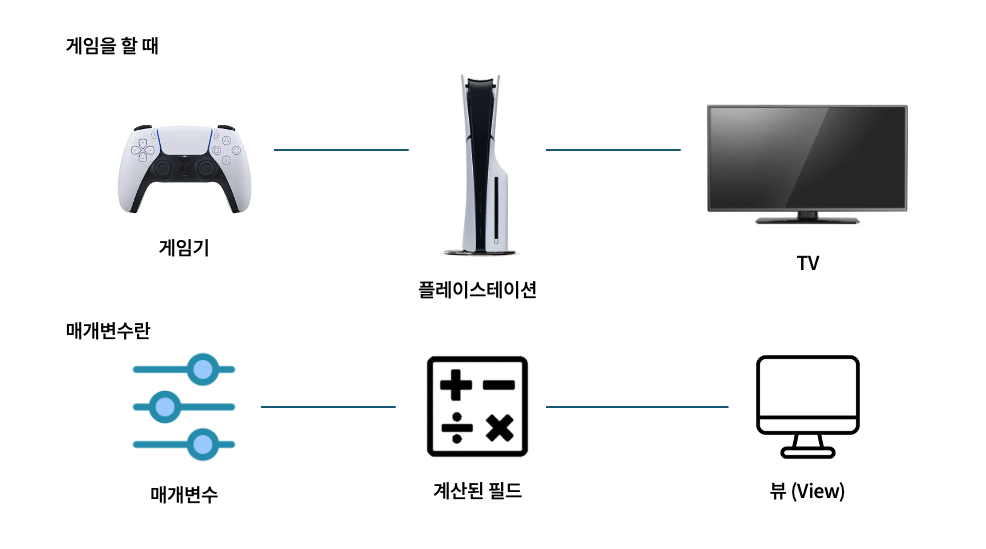
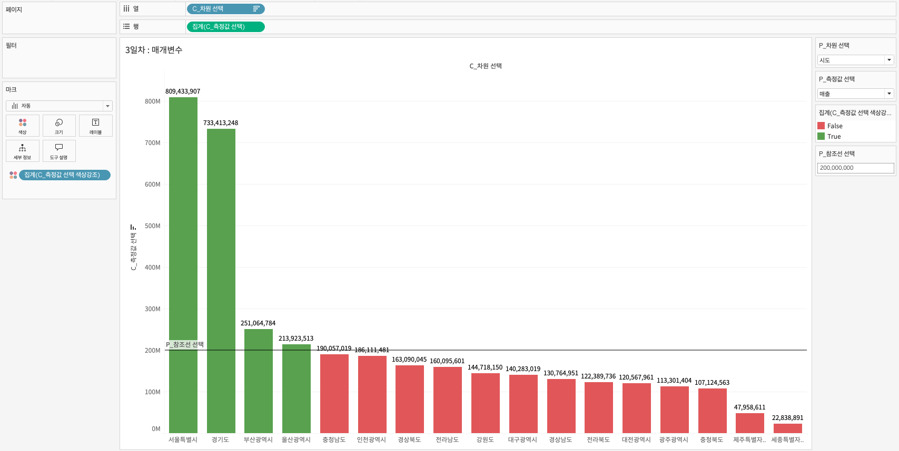
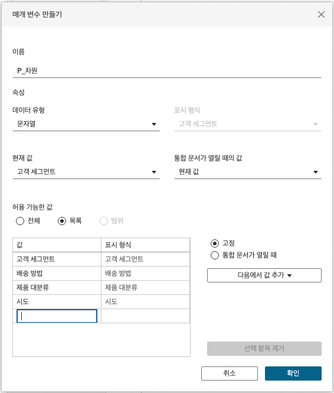
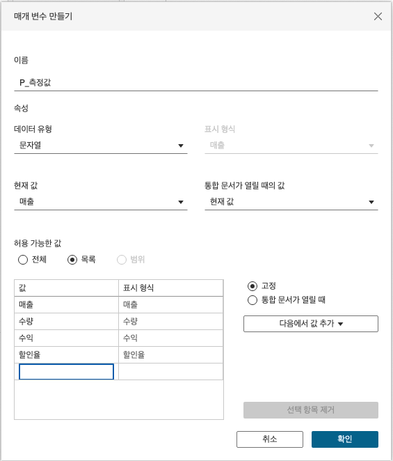
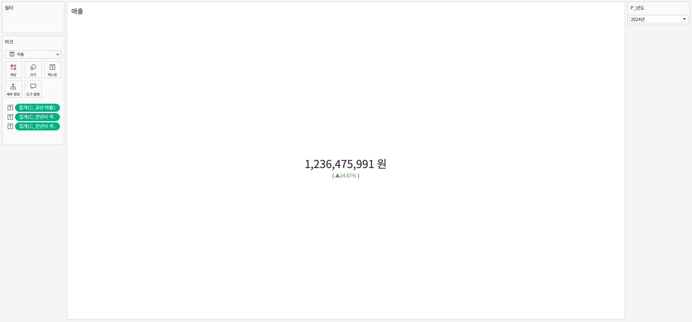
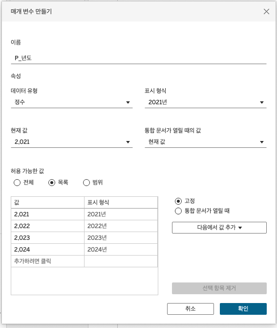
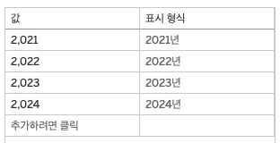

## 학습 목표

- 매개변수(Parameter)의 개념과 활용 목적을 설명할 수 있습니다.
- Top N 분석을 위한 매개변수를 직접 만들어 활용할 수 있습니다.
- 전년 대비 증감 비율을 계산하여 KPI 카드를 만들 수 있습니다.

## 사용 데이터 및 실습 파일

실습에는 Superstore 기반 샘플 데이터와 Tableau 통합 문서를 사용합니다.

실습 파일 다운로드: [Kaggle - KR Superstore Sample 2025](https://www.kaggle.com/datasets/heoquixote/krsuperstore-sample-2025/data)

## 목차

1. 매개변수와 계산식
2. 매개변수 활용

## 1. 매개변수와 계산식

### 1-1. 매개변수란?



매개변수(Parameter)는 사용자가 직접 지정한 하나의 값을 저장하는 변수입니다.

- 정수
- 실수
- 문자열
- 날짜
- 불리언

처럼 하나의 값을 담을 수 있으며, 이 값은 계산식, 필터, 참조선, 표시 조건 등에 연결할 수 있습니다.

즉, 매개변수는 Tableau 뷰를 사용자가 조작할 수 있게 만드는 입력값이라고 이해하시면 됩니다.

#### 매개변수의 핵심 특징

- 사용자가 선택하거나 입력한 단일 값을 저장합니다.
- 데이터 원본의 특정 컬럼과 자동으로 연결되지 않습니다.
- 계산식과 연결해야 실제로 뷰에 영향이 생깁니다.
- 필터보다 더 유연하게 분석 기준을 바꿀 수 있습니다.

이 점이 중요합니다.  
필터는 데이터 안에 있는 값을 제한하는 기능이고, 매개변수는 사용자가 직접 기준값을 주입하는 기능입니다.

예를 들어:

- 필터: `2024년 데이터만 보기`
- 매개변수: `Top N에서 N 값을 5, 10, 20으로 바꾸기`

즉, 필터는 데이터 선택에 가깝고, 매개변수는 분석 규칙 제어에 가깝습니다.

### 1-2. 매개변수와 계산식을 활용한 뷰 구성



이 실습에서는 사용자가 직접:

- 어떤 차원을 볼지
- 어떤 측정값을 볼지
- 기준선을 어디에 둘지

를 바꿀 수 있는 동적 뷰를 만듭니다.

실무에서 이런 방식은 매우 자주 사용됩니다.  
하나의 대시보드에서 여러 시나리오를 수용해야 할 때, 시트를 여러 장 복제하는 대신 매개변수 하나로 기준을 바꾸는 것이 훨씬 효율적이기 때문입니다.

#### 차원 선택 계산식



```tableau
// C_차원 선택

IF [P_차원 선택] = "고객 세그먼트" THEN [고객 세그먼트]
ELSEIF [P_차원 선택] = "배송 방법" THEN [배송 방법]
ELSEIF [P_차원 선택] = "제품 대분류" THEN [제품 대분류]
ELSEIF [P_차원 선택] = "시도" THEN [시도]
END
```

이 계산식은 사용자가 선택한 매개변수 값에 따라 다른 차원을 반환합니다.  
즉, 하나의 시트가 매개변수 값에 따라 완전히 다른 기준의 막대차트로 바뀔 수 있습니다.

#### 측정값 선택 계산식



```tableau
/* CASE문
CASE 필드 또는 매개변수
WHEN 조건1 THEN 값1
WHEN 조건2 THEN 값2
ELSE 값
END
*/

CASE [P_측정값 선택]
WHEN "매출" THEN SUM([매출])
WHEN "수량" THEN AVG([수량])
WHEN "수익" THEN MAX([수익])
WHEN "할인율" THEN MIN([할인율])
END
```

이 계산식은 사용자가 선택한 측정값에 따라 표시할 값을 바꿉니다.

다만 실무적으로는 여기서 한 가지를 주의해야 합니다.  
예제에서는 매개변수에 따라 `SUM`, `AVG`, `MAX`, `MIN`을 혼합해 보여주고 있는데, 실제 업무에서는 집계 방식이 달라지면 사용자가 같은 축에서 동일한 의미로 받아들일 위험이 있습니다.

즉:

- `매출`은 합계
- `수량`은 평균
- `수익`은 최대값
- `할인율`은 최소값

처럼 정의하면, 시각적으로는 같은 차트지만 지표 해석은 완전히 달라집니다.

실무에서는 보통 다음 둘 중 하나가 더 안전합니다.

- 모든 측정값에 동일한 집계 방식을 적용
- 화면에 현재 집계 방식이 무엇인지 명확하게 표시

#### 측정값 선택 색상 강조

```tableau
// C_측정값 선택 색상강조

SUM([C_측정값 선택]) >= [P_참조선 선택]
```

이 계산식은 사용자가 정한 기준값 이상인지 여부를 `True/False`로 반환합니다.  
이를 색상에 놓으면 특정 기준을 넘는 항목만 강조할 수 있습니다.

실무에서 이런 방식은 다음 상황에 특히 유용합니다.

- 목표 매출 이상 달성 항목 강조
- 기준 수익률 이상 제품 강조
- 이상치 후보 구간 강조

즉, 매개변수는 단순히 값을 바꾸는 기능이 아니라, 분석 기준선을 사용자가 직접 조정하게 해주는 장치입니다.

## 2. 매개변수 활용

### 2-1. 증감비란?

증감비는 기준 시점 대비 비교 시점의 변화율을 백분율(%)로 나타낸 값입니다.


일반적인 계산식은 다음과 같습니다.

```text
(비교값 - 기준값) / 기준값
```

#### 결과 해석

- 양수(+): 이전보다 증가
- 음수(-): 이전보다 감소
- 0: 변화 없음

증감비는 절대값보다 변화의 방향과 강도를 빠르게 파악할 수 있다는 장점이 있습니다.  
그래서 KPI 카드, 경영 대시보드, 마케팅 성과 리포트에서 매우 자주 사용됩니다.

#### 주요 유형

1. YoY(Year-over-Year, 전년비)
   - 올해 특정 기간과 작년 같은 기간을 비교합니다.
   - 계절성을 고려한 연간 성장 추세 확인에 적합합니다.
2. MoM(Month-over-Month, 전월비)
   - 이번 달과 지난 달을 비교합니다.
   - 최근 변화 감지에 적합합니다.
3. WoW(Week-over-Week, 전주비)
   - 이번 주와 지난 주를 비교합니다.
   - 단기 캠페인 효과 분석에 적합합니다.
4. DoD(Day-over-Day, 전일비)
   - 오늘과 어제를 비교합니다.
   - 일별 변동성 파악에 적합합니다.

실무에서 어떤 기준을 쓸지는 질문에 따라 달라집니다.

- 계절성 있는 사업: YoY 우선
- 최근 운영 변화 점검: MoM 또는 WoW
- 광고/프로모션 반응: DoD 또는 WoW

즉, 증감비는 하나의 공식이 아니라 "무엇과 비교할 것인가"가 핵심입니다.

### 2-2. KPI 전년비 지표 계산



이 실습에서는 사용자가 `P_년도` 매개변수로 기준 연도를 선택하면, 해당 연도의 매출과 전년도 매출을 비교해 전년비를 계산합니다.

#### 매개변수 표시 형식





매개변수는 내부적으로는 값(value)로 동작하지만, 화면에는 표시 형식(display as)으로 보여줄 수 있습니다.

즉:

- 계산식은 실제 값으로 동작하고
- 사용자는 더 읽기 쉬운 라벨로 보게 됩니다.

실무에서는 이 표시 형식 설정을 잘 해두는 것이 중요합니다.  
내부 값은 단순하고 안정적으로 유지하면서도, 사용자 화면은 친절하게 만들 수 있기 때문입니다.

#### C_금년 매출

```tableau
// C_금년 매출

IF YEAR([주문 일자]) = [P_년도] THEN [매출] END
```

#### C_전년 매출

```tableau
// C_전년 매출

IF YEAR([주문 일자]) = [P_년도] - 1 THEN [매출] END
```

#### C_매출 전년비

```tableau
// C_매출 전년비
// ([현재 년도] - [전년도]) / [전년도]

(SUM([C_금년 매출]) - SUM([C_전년 매출]))
/ SUM([C_전년 매출])
```

이 계산식은 전년 대비 증감 비율을 구하는 가장 기본적인 형태입니다.

다만 실무에서는 분모가 0이 되는 경우를 반드시 고려해야 합니다.  
전년도 값이 없는 신규 카테고리나 신규 고객군에서는 0으로 나누기 문제가 발생할 수 있기 때문입니다.

더 안전하게 쓰려면 다음처럼 방어 로직을 넣는 방식도 자주 사용합니다.

```tableau
IF SUM([C_전년 매출]) != 0 THEN
    (SUM([C_금년 매출]) - SUM([C_전년 매출])) / SUM([C_전년 매출])
END
```

즉, 책에서는 기본 원리를 먼저 이해하고, 실무에서는 0 나눗셈 방어까지 추가하는 것이 좋습니다.

#### C_매출 전년비 색상 양

```tableau
// C_매출 전년비 색상 양

IF [C_전년비] >= 0 THEN [C_전년비] END
```

#### C_매출 전년비 색상 음

```tableau
// C_매출 전년비 색상 음

IF [C_전년비] < 0 THEN ABS([C_전년비]) END
```

이 방식은 양수와 음수를 분리해서 색상이나 막대 방향을 다르게 표현할 때 유용합니다.

실무에서 이런 분리 계산을 쓰는 이유는 단순합니다.

- 증가와 감소를 직관적으로 구분할 수 있고
- 빨강/파랑, 초록/회색 같은 시각 규칙을 명확하게 줄 수 있으며
- KPI 카드에서 상승/하락 상태를 안정적으로 제어할 수 있기 때문입니다.

즉, 증감비 계산 자체와 시각적 표현 계산은 분리해 두는 편이 유지보수에 더 좋습니다.
