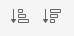
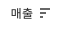
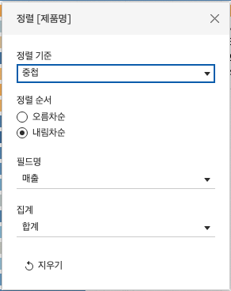

## 학습 목표

- 정렬 방식의 차이를 이해하고 상황에 맞게 적용할 수 있습니다.
- 정렬이 분석 해석에 어떤 영향을 주는지 설명할 수 있습니다.

## 목차

1. 정렬

## 1. 정렬

정렬은 단순히 보기 좋게 만드는 기능이 아닙니다.  
실무에서는 정렬이 곧 우선순위와 패턴을 드러내는 장치입니다.

예를 들어 같은 막대 차트라도 정렬이 없으면 단순 나열에 그치지만, 매출 기준 내림차순 정렬을 적용하면 어떤 범주가 가장 중요한지 즉시 읽을 수 있습니다.

### 1-1. 아이콘을 활용한 오름차순/내림차순 정렬

- 툴바 아이콘을 이용하면 빠르게 오름차순 또는 내림차순 정렬을 적용할 수 있습니다.
- 가장 간단하고 자주 사용하는 정렬 방식입니다.

### 1-2. 축 정렬

- 축 자체의 정렬 방향을 바꿔 시각적 흐름을 조정할 수 있습니다.
- 값의 비교 순서를 바꾸거나, 사용자가 더 자연스럽게 읽도록 배치할 때 활용합니다.

### 1-3. 차원 정렬

차원 정렬은 차원의 순서를 특정 기준에 따라 바꾸는 기능입니다.

| 정렬 기준 | 설명 |
| --- | --- |
| 데이터 원본 순서 | 데이터가 원본에 입력된 순서대로 표시 |
| 사전순 | 텍스트 값 기준 가나다/알파벳 순으로 정렬 |
| 필드 | 다른 필드의 값을 기준으로 정렬 |
| 수동 | 사용자가 원하는 순서를 직접 지정 |
| 중첩 | 상위 차원 안에서 하위 차원을 다시 정렬 |

### 1-4. 각 정렬 방식이 중요한 이유

- 사전순 정렬은 텍스트 탐색에는 유용하지만 성과 비교에는 적합하지 않을 수 있습니다.
- 필드 정렬은 매출, 수익, 주문 수처럼 분석 목적에 맞는 기준을 잡을 때 가장 많이 사용합니다.
- 수동 정렬은 비즈니스 흐름이 본질적으로 순서를 가지는 경우에 유용합니다.
  예: `Bronze -> Silver -> Gold`, `초기 -> 성장 -> 성숙`
- 중첩 정렬은 상위 그룹 안에서 하위 항목의 순서를 유지하며 비교할 때 필요합니다.

실무에서는 `중구`처럼 동일한 하위 지명이 여러 상위 지역에 속할 수 있습니다.  
이럴 때 단순 정렬을 쓰면 전체 뷰 기준으로 섞여 보일 수 있으므로, 각 시도 안에서 다시 정렬되는 `중첩 정렬`이 필요합니다.
