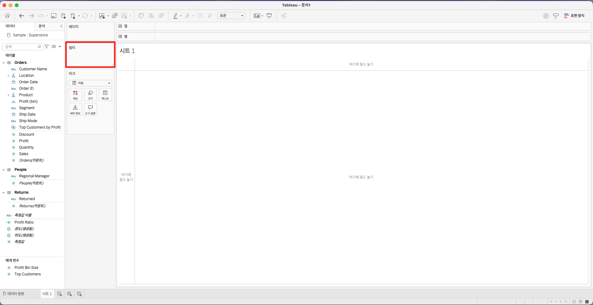
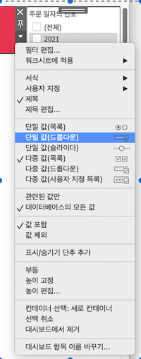
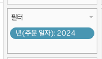
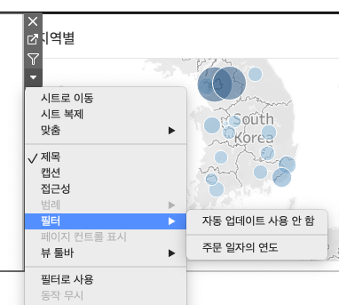
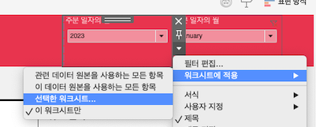

## 학습 목표

- 동적 필터와 정적 필터의 차이를 이해할 수 있습니다.
- 워크시트와 대시보드에서 필터를 적절히 적용할 수 있습니다.

## 목차

1. 워크시트 필터
2. 대시보드 필터 표시

필터는 관련 정보에 초점을 맞추기 위해 뷰에 표시되는 데이터 범위를 좁히는 기능입니다.

핵심은 필터가 단순히 데이터를 숨기는 것이 아니라, 사용자가 특정 질문에 집중하도록 분석 범위를 재정의한다는 점입니다.

## 1. 워크시트 필터

#### 필터의 기본 개념

- 필터 선반에는 현재 사용 중인 필터가 표시됩니다.
- 차원, 측정값, 날짜에 따라 사용할 수 있는 필터 옵션이 달라집니다.
- 같은 필터라도 적용 범위를 어떻게 설정하느냐에 따라 결과 해석이 달라집니다.

#### 차원 필터 옵션

| 필터 옵션 | 설명 |
| --- | --- |
| 일반 | 포함 또는 제외할 멤버를 선택 |
| 와일드카드 | 입력한 패턴과 일치하는 값을 포함/제외 |
| 조건 | 특정 조건 또는 수식 기준으로 필터링 |
| 상위 | 지정 기준에 따라 상위/하위 N개만 필터링 |

#### 측정값 필터 범위

| 필터 옵션 | 설명 |
| --- | --- |
| 값 범위 | 지정한 범위 안의 값만 포함 |
| 최소 | 지정 값 이상만 포함 |
| 최대 | 지정 값 이하만 포함 |
| 특수 | null 또는 null이 아닌 값 기준 필터 |

#### 동적 필터와 정적 필터

- 동적 필터는 선택 값이나 현재 데이터 상태에 따라 결과가 바뀌는 필터입니다.
  예: 매출 범위를 슬라이더로 조정
- 정적 필터는 미리 정한 범위를 고정적으로 적용하는 필터입니다.
  예: `2024년 데이터만 포함`

실무에서는 탐색형 대시보드에는 동적 필터가 유용하고, 보고서형 대시보드에는 정적 필터가 더 안정적일 때가 많습니다.

#### 필터 적용 범위

| 적용 옵션 | 설명 | 예시 |
| --- | --- | --- |
| 관련 데이터 원본을 사용하는 모든 항목 | 같은 데이터 원본을 공유하는 워크시트 전반에 필터 적용 | 같은 Excel/DB 연결을 쓰는 여러 시트 |
| 이 데이터 원본을 사용하는 모든 항목 | 선택된 데이터 원본 기반 워크시트 전체에 적용 | 데이터 원본 단위 공통 필터 |
| 선택한 워크시트 | 사용자가 지정한 워크시트에만 적용 | 대시보드 내 일부 시트만 반영 |
| 이 워크시트만 | 현재 워크시트에만 적용 | 특정 뷰에서만 필터 사용 |

필터는 적용 범위가 넓을수록 편리하지만, 의도하지 않은 시트까지 바뀔 수 있습니다.  
따라서 대시보드 작업에서는 `무엇을 바꾸고 싶은가`보다 `어디까지 바뀌어야 하는가`를 먼저 생각하는 것이 중요합니다.

## 2. 대시보드 필터 표시

대시보드에서 필터를 표시하는 작업은 단순 UI 배치가 아니라, 사용자가 직접 분석 경로를 조절하게 만드는 과정입니다.

`주문 일자` 필드를 필터로 이동시킨 뒤 `년`을 선택하고, 분석할 연도를 하나 선택합니다.

이렇게 설정하면 필터 선반에 연도 필터가 추가됩니다. 이후 `매출 분석 대시보드`로 이동합니다.

총 매출 시트를 클릭한 뒤 `필터 -> 주문 일자의 연도`를 추가합니다.

- 우측에 생성된 필터에서 메뉴를 열어 `단일 값(드롭다운)`을 선택합니다.
- 회색 상단 영역을 드래그하면 대시보드 안 원하는 위치로 이동할 수 있습니다.

이 상태에서는 필터가 특정 워크시트에만 적용되므로, 필터 값을 바꿔도 해당 시트만 반영되는 것을 볼 수 있습니다.

대시보드 전체에 필터를 반영하려면 `워크시트에 적용 -> 이 데이터 원본을 사용하는 모든 항목`을 선택합니다.
