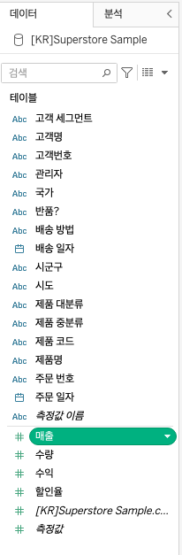
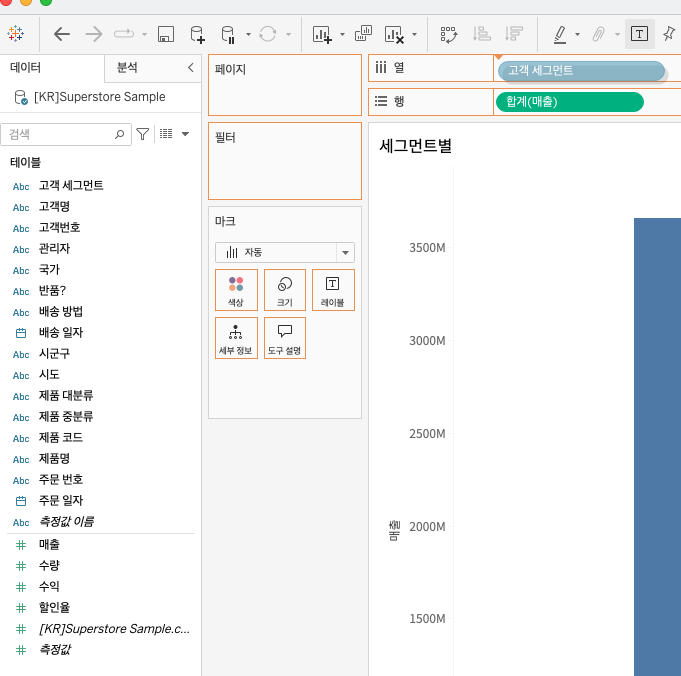

## 학습 목표

- Tableau에서 차트를 만드는 대표적인 방법을 이해합니다.
- 더블클릭, 드래그 앤 드롭, 표현 방식(Show Me)의 차이를 설명할 수 있습니다.

## 목차

1-1. 더블클릭
1-2. 드래그 앤 드롭
1-3. 표현 방식(Show Me)

Tableau에서 차트를 만드는 대표적인 방법은 세 가지입니다.  
핵심은 같은 데이터라도 어떤 방식으로 필드를 배치하느냐에 따라 전혀 다른 시각화를 만들 수 있다는 점입니다.

### 1-1. 더블클릭

- 필드 특성에 맞춰 Tableau가 적절한 기본 차트를 자동으로 생성합니다.
- 빠르게 결과를 확인할 때 유용합니다.
- 초보자에게는 가장 쉬운 시작점이지만, 의도한 분석 구조를 정확하게 만들기에는 한계가 있을 수 있습니다.

### 1-2. 드래그 앤 드롭

- 필드를 행, 열, 색상, 크기, 레이블, 세부정보 등에 직접 배치해 원하는 차트를 만듭니다.
- 사용자의 분석 의도를 가장 잘 반영할 수 있는 방식입니다.
- 실무에서는 대부분 이 방식을 중심으로 작업하게 됩니다.

예를 들어:

- 색상에 범주형 필드를 넣으면 카테고리별 구분이 생깁니다.
- 크기에 측정값을 넣으면 값의 크기에 따라 마크 크기가 달라집니다.

### 1-3. 표현 방식(Show Me)

- 현재 선택한 차원과 측정값 조합을 기준으로 만들 수 있는 차트 유형을 보여줍니다.
- 사용자는 `표현 방식(Show Me)` 패널에서 원하는 차트를 클릭해 바로 적용할 수 있습니다.
- 빠르게 차트 후보를 탐색할 때 유용하지만, 최종 결과는 직접 선반을 조정하며 다듬는 경우가 많습니다.

