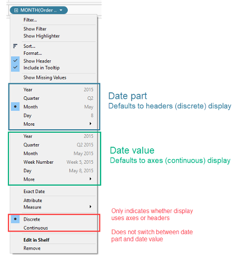

## 학습 목표

- 연속형과 불연속형의 차이를 이해합니다.
- 날짜 필드를 어떤 방식으로 표현할지 판단할 수 있습니다.

## 목차

1. 연속형과 불연속형

## 1. 연속형과 불연속형

날짜 필드는 Tableau에서 특히 중요합니다.  
같은 날짜라도 `불연속형`으로 쓸지 `연속형`으로 쓸지에 따라 차트의 구조가 완전히 달라집니다.

### 1-1. 불연속형 날짜(Discrete Date)

- 파란색으로 표시됩니다.
- 날짜를 구간별로 끊어서 보여줍니다.
- 각 값이 독립적인 카테고리처럼 취급됩니다.
- 시각화에서는 주로 헤더로 표시됩니다.

### 1-2. 연속형 날짜(Continuous Date)

- 초록색으로 표시됩니다.
- 날짜를 하나의 연속된 시간 축으로 보여줍니다.
- 시각화에서는 축으로 표시됩니다.
- 추세나 흐름을 자연스럽게 보여줄 때 적합합니다.

### 1-3. 실무적으로 중요한 이유

- 월별 비교처럼 카테고리 단위 비교가 목적이면 불연속형이 이해하기 쉽습니다.
- 시간 흐름 자체가 핵심이면 연속형이 더 적합합니다.
- 같은 데이터를 두 방식으로 바꿔 보며 질문에 더 잘 맞는 표현을 선택하는 습관이 중요합니다.
