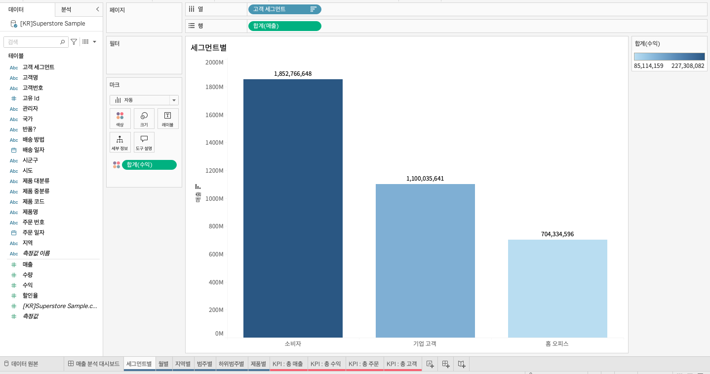

## 학습 목표

- 막대 차트의 목적과 활용 상황을 이해합니다.
- 범주 비교 관점에서 막대 차트가 왜 기본 차트인지 설명할 수 있습니다.
- Tableau에서 막대 차트를 만들고 정렬, 레이블, 행/열 전환 기능을 함께 활용할 수 있습니다.

## 목차

1. 막대 차트
2. 막대 차트를 자주 쓰는 이유
3. 실무 팁
4. 상단 아이콘 활용

## 1. 막대 차트

막대 차트는 범주별 값을 비교할 때 가장 자주 사용하는 차트입니다.

예를 들어, `고객 세그먼트별 매출이 얼마나 다른가?` 같은 질문에 가장 직관적으로 답할 수 있습니다.  
범주 간 크기 비교가 핵심일 때는 막대 차트가 기본 선택이라고 생각하시면 됩니다.

- 세그먼트별 막대 차트
- 열: 고객 세그먼트
- 행: 합계(매출)
- 색상: 합계(수익)

## 2. 막대 차트를 자주 쓰는 이유

- 길이 비교는 사람이 가장 정확하게 읽기 쉬운 시각 인코딩 중 하나입니다.
- 범주 수가 적당할 때 차이와 순위를 빠르게 보여줄 수 있습니다.
- 색상을 보조적으로 쓰면 수익성, 증감 여부 같은 추가 정보도 함께 전달할 수 있습니다.

## 3. 실무 팁

- 비교가 목적이면 가급적 정렬을 함께 적용하는 것이 좋습니다.
- 범주가 너무 많으면 가독성이 급격히 떨어지므로 상위 N개만 보여주거나 그룹화하는 것이 좋습니다.
- 색상은 의미가 있을 때만 사용하고, 단순 장식용 다색 사용은 피하는 편이 좋습니다.

## 4. 상단 아이콘 활용

1. 행과 열 바꾸기: 행/열 선반의 필드 위치를 변경합니다.
2. 오름차순/내림차순 정렬: 측정값 기준으로 정렬합니다.
3. 마크 레이블 표시: 각 범주의 값을 화면에 표시합니다.
4. 표준/너비 맞추기/높이 맞추기/전체보기: 시트가 화면에 맞는 방식을 조정합니다.
