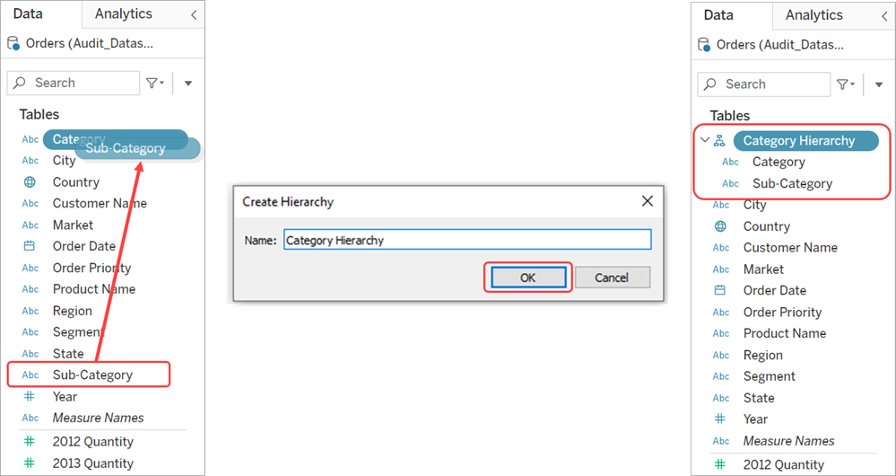
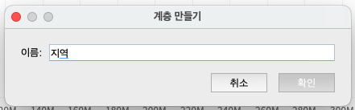
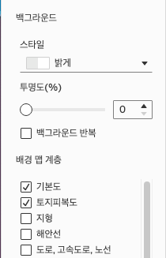
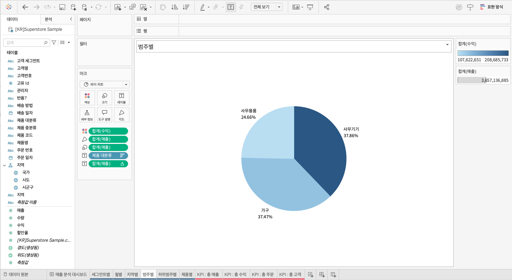
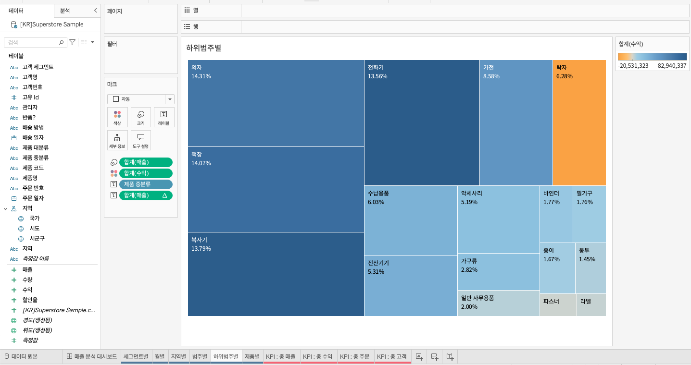
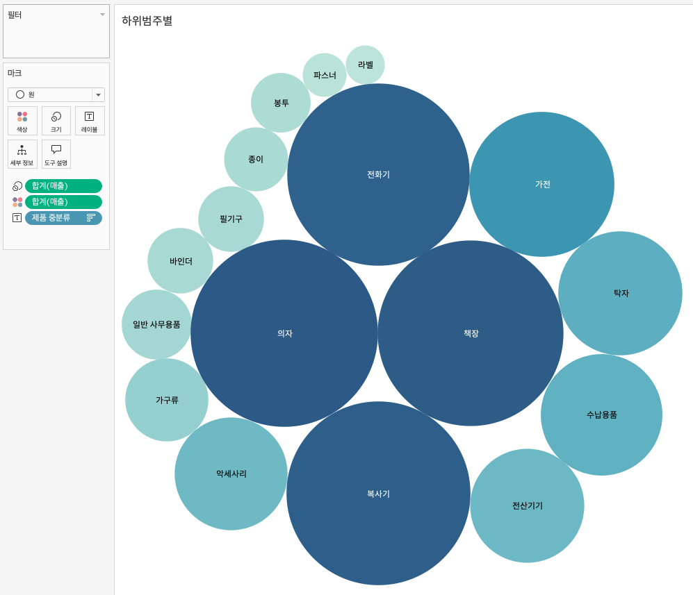
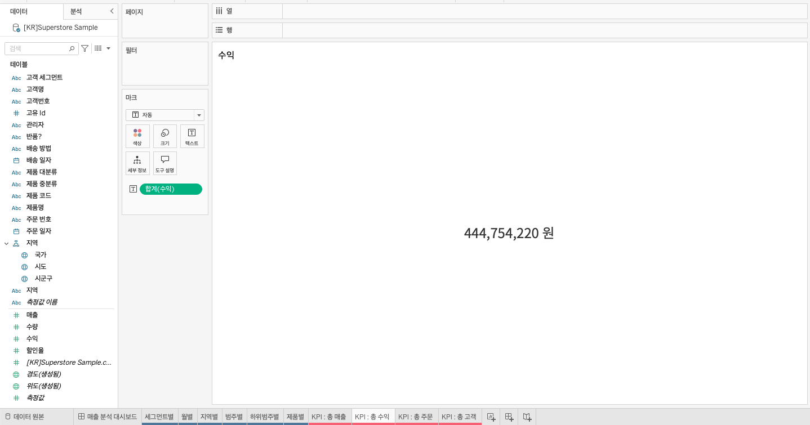
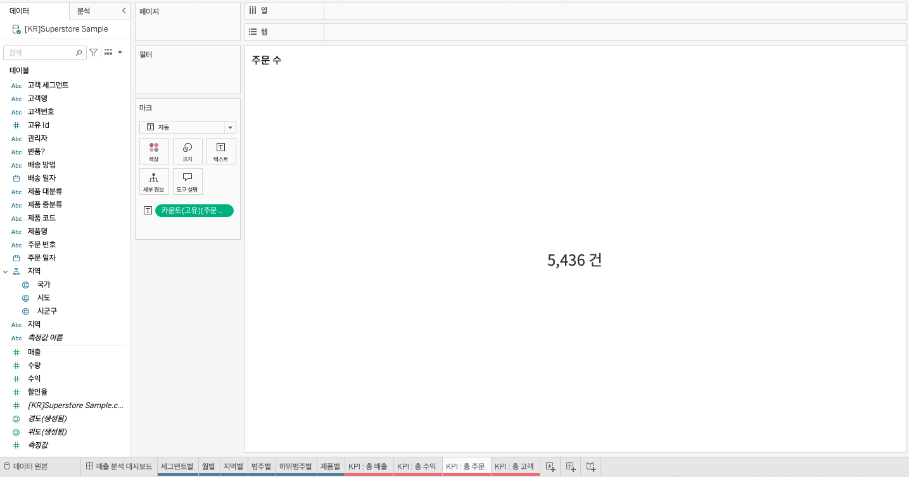

## 학습 목표

- 다양한 차트 유형의 특성과 활용 상황을 이해합니다.
- 데이터에 적합한 차트를 선택하여 시각화할 수 있습니다.
- Tableau에서 기본 차트를 직접 만들고 전달력을 높이는 방법을 익힙니다.

## 목차

1. 다양한 차트 시각화
2. KPI 시각화

## 1. 다양한 차트 시각화

### 1-1. 막대 차트

막대 차트는 범주별 값을 비교할 때 가장 자주 사용하는 차트입니다.

예를 들어, `고객 세그먼트별 매출이 얼마나 다른가?` 같은 질문에 가장 직관적으로 답할 수 있습니다.  
범주 간 크기 비교가 핵심일 때는 막대 차트가 기본 선택이라고 생각하시면 됩니다.

- 세그먼트별 막대 차트
- 열: 고객 세그먼트
- 행: 합계(매출)
- 색상: 합계(수익)

#### 막대 차트를 자주 쓰는 이유

- 길이 비교는 사람이 가장 정확하게 읽기 쉬운 시각 인코딩 중 하나입니다.
- 범주 수가 적당할 때 차이와 순위를 빠르게 보여줄 수 있습니다.
- 색상을 보조적으로 쓰면 수익성, 증감 여부 같은 추가 정보도 함께 전달할 수 있습니다.

#### 실무 팁

- 비교가 목적이면 가급적 정렬을 함께 적용하는 것이 좋습니다.
- 범주가 너무 많으면 가독성이 급격히 떨어지므로 상위 N개만 보여주거나 그룹화하는 것이 좋습니다.
- 색상은 의미가 있을 때만 사용하고, 단순 장식용 다색 사용은 피하는 편이 좋습니다.

#### 상단 아이콘 활용

1. 행과 열 바꾸기: 행/열 선반의 필드 위치를 변경합니다.
2. 오름차순/내림차순 정렬: 측정값 기준으로 정렬합니다.
3. 마크 레이블 표시: 각 범주의 값을 화면에 표시합니다.
4. 표준/너비 맞추기/높이 맞추기/전체보기: 시트가 화면에 맞는 방식을 조정합니다.

### 1-2. 라인 차트

라인 차트는 시간의 흐름에 따른 변화와 추세를 파악할 때 가장 자주 사용합니다.

예를 들어, `월별 매출이 어떻게 변하고 있는가?`, `계절성이 존재하는가?`, `최근 증가 추세가 유지되고 있는가?` 같은 질문에 적합합니다.

- 월별 라인 차트
- 열: 년(주문일자), 월(주문일자)
- 행: 합계(매출)

#### 라인 차트가 적합한 경우

- 시간 순서가 중요한 경우
- 추세, 계절성, 변동성 확인이 필요한 경우
- 기간별 비교가 핵심인 경우

#### 주의할 점

- 시간 축이 아닌 범주형 데이터를 라인으로 연결하면 잘못된 연속성 인상을 줄 수 있습니다.
- 누락된 기간이 있으면 해석이 왜곡될 수 있으므로 데이터 완전성을 함께 확인해야 합니다.

### 1-3. 맵 차트

맵 차트는 지역에 따른 값의 차이를 보여줄 때 사용합니다.

예를 들어 `지역별 매출이 어디에서 높고 낮은가?`, `수익이 좋은 지역과 손실 지역은 어디인가?` 같은 질문에 적합합니다.

- 지역별 맵 차트
- 열: 경도(생성됨)
- 행: 위도(생성됨)
- 색상: 합계(수익)
- 크기: 합계(매출)
- 세부정보: 국가, 시도

#### 지리적 역할 부여

데이터 타입 아이콘을 클릭해 지리적 역할을 지정할 수 있습니다.

- 국가 -> 국가/지역
- 시도 -> 주/시/도
- 시군구 -> 시군구

지리적 역할이 올바르게 지정되지 않으면 지도에서 위치를 정확히 인식하지 못할 수 있습니다.

### 1-4. 계층 만들기

계층(Hierarchy)은 일반적인 수준에서 구체적인 수준으로 데이터를 탐색할 수 있도록 구조화한 것입니다.

예:

- 국가 -> 시도 -> 시군구

이 구조를 만들면 같은 차트 안에서 드릴다운과 드릴업이 가능해집니다.

#### 계층 만들기 방법

1. 계층으로 묶고 싶은 필드를 겹친 상태로 드롭합니다.
2. 계층 이름을 입력합니다.
3. 필드를 끌어 순서를 조정합니다.

Tableau는 위에서 아래 순서를 계층 순서로 인식합니다.

계층이 생성되면 데이터 패널에서 관련 필드가 하나의 계층 구조로 묶여 표시됩니다.

#### 맵 옵션

1. 검색 아이콘: 특정 지역이나 주소를 검색합니다.
2. 확대: 지도를 더 자세히 봅니다.
3. 축소: 지도를 더 넓게 봅니다.
4. 핀 아이콘: 현재 위치와 확대 수준을 고정합니다.
5. 손바닥 모양: 지도를 드래그해 이동합니다.
6. 사각형 선택: 직사각형 영역을 선택합니다.
7. 원 선택: 원형 영역을 선택합니다.
8. 자유형 선택: 자유로운 모양으로 영역을 선택합니다.

#### 백그라운드 레이어

1. 백그라운드 스타일: 맵의 기본 테마를 설정합니다.
2. 투명도: 맵 배경의 투명도를 조정합니다.
3. 배경 맵 계층: 표시할 지리적 요소를 선택합니다.

### 1-5. 파이 차트

파이 차트는 전체 대비 각 범주가 차지하는 비율을 보여줄 때 사용합니다.

다만 파이 차트는 범주 수가 많아질수록 비교가 어려워집니다.  
따라서 범주 수가 적고, 전체 대비 구성비를 강조하고 싶을 때만 쓰는 것이 좋습니다.

- 범주별 파이 차트
- 색상: 합계(수익)
- 각도: 합계(매출)
- 크기: 합계(매출)
- 레이블: 제품 대분류, 합계(매출) -> 퀵 테이블 계산 `구성 비율`

#### 파이 차트를 쓸 때 주의할 점

- 작은 각도 차이는 사람이 정확히 비교하기 어렵습니다.
- 범주 수가 많아지면 레이블이 겹치고 가독성이 떨어집니다.
- 단순 비교가 목적이면 막대 차트가 더 나은 경우가 많습니다.

### 1-6. 퀵 테이블 계산

퀵 테이블 계산은 Tableau가 자주 사용하는 계산을 빠르게 적용할 수 있도록 제공하는 기능입니다.

핵심은 별도의 계산식을 직접 만들지 않아도, 현재 뷰를 기준으로 즉시 계산 결과를 보여준다는 점입니다.

- 누계(Running Total)
- 차이(Difference)
- 비율 차이(Percent Difference)
- 구성 비율(Percent of Total)
- 순위(Rank)
- 백분위수(Percentile)
- 이동 평균(Moving Average)
- YTD 총계
- 통합 성장률(CAGR)
- 전년 대비 성장률
- YTD 성장률

| 계산 종류 | 설명 |
| --- | --- |
| 누계 | 처음부터 현재 행까지 값을 누적 합으로 계산 |
| 차이 | 현재 값과 이전 값의 차이를 계산 |
| 비율 차이 | 현재 값과 기준 값의 차이를 비율로 계산 |
| 구성 비율 | 전체 합계 대비 각 항목이 차지하는 비율 |
| 순위 | 특정 기준으로 정렬한 뒤 순위를 부여 |
| 백분위수 | 데이터 분포 내 상대적 위치를 백분위로 표현 |
| 이동 평균 | 지정한 구간 기준 평균을 계산 |
| YTD 총계 | 해당 연도 시작일부터 현재까지 누적합 |
| 통합 성장률 | 일정 기간 동안의 연평균 성장률 |
| 전년 대비 성장률 | 같은 기간의 전년도 값과 비교한 성장률 |
| YTD 성장률 | 해당 연도의 YTD와 전년도 YTD를 비교한 성장률 |

#### 실무적으로 중요한 점

- 퀵 테이블 계산은 편리하지만, 계산 기준이 현재 뷰에 의존합니다.
- 따라서 주소 지정과 파티셔닝이 어떻게 잡히는지 이해하지 못하면 예상과 다른 값이 나올 수 있습니다.
- 결과가 이상해 보일 때는 계산식 자체보다도 `어떤 방향으로 계산하고 있는가`를 먼저 확인하는 것이 좋습니다.

### 1-9. 트리맵

트리맵은 계층적 데이터를 직사각형의 크기와 색상으로 표현하는 차트입니다.

- 면적: 값의 크기
- 색상: 추가 비교 지표

많은 범주를 한 화면에 압축해서 보여줄 수 있다는 장점이 있지만, 항목이 너무 많아지면 작은 블록은 읽기 어려워집니다.

- 하위 범주별 트리맵
- 크기: 합계(매출)
- 색상: 합계(수익)
- 레이블: 제품 중분류, 합계(매출) -> 퀵 테이블 계산 `구성 비율`

#### 응용

- 마크 타입을 `원`으로 바꾸면 버블 차트로 확장할 수 있습니다.
- 마크 타입을 `텍스트`로 바꾸면 워드 클라우드처럼 활용할 수 있습니다.

## 2. KPI 시각화

### 2-1. KPI란?

KPI(Key Performance Indicator, 핵심성과지표)는 조직, 부서, 개인이 목표를 얼마나 달성하고 있는지를 측정하는 핵심 지표입니다.

중요한 점은 KPI가 단순한 숫자가 아니라는 것입니다.  
좋은 KPI는 `목표와 직접 연결`되어 있어야 하고, `행동을 유도`해야 하며, `시간 안에서 해석 가능`해야 합니다.

#### KPI의 종류

| 속성 | KPI 항목 | 설명 |
| --- | --- | --- |
| 재무적 지표 | 손익액 | 어느 정도의 성과를 창출하고 있는지에 대한 지표 |
| 재무적 지표 | 손익률 | 한 단위당 어느 정도의 이익이 있는지에 대한 지표 |
| 재무적 지표 | 영업이익률 | 본업에서 얼마만큼의 이익을 내는지에 대한 지표 |
| 재무적 지표 | 총자산이익률 | 총자산 대비 이익 수준을 보여주는 지표 |
| 재무적 지표 | 자기자본이익률 | 자기자본을 투입한 결과 이익이 얼마나 났는지에 대한 지표 |
| 고객 지표 | 고객만족도 | 고객 만족 수준을 나타내는 지표 |
| 고객 지표 | 고객충성도 | 고객의 재구매 가능성을 보여주는 지표 |
| 고객 지표 | 고객불만건수 | 고객 불만 발생 수준을 보여주는 지표 |
| 고객 지표 | 고객유지율 | 기존 고객이 얼마나 유지되는지를 나타내는 지표 |
| 업무 프로세스 지표 | 시장 점유율 | 특정 시장 내 점유 비율 |
| 업무 프로세스 지표 | 프로젝트 진행 건수 | 프로젝트 진행 수준을 보여주는 지표 |
| 업무 프로세스 지표 | 제품 생산량 | 생산 규모를 나타내는 지표 |
| 업무 프로세스 지표 | 제품 불량률 | 생산된 제품 중 불량 비율 |
| 학습·성장 지표 | 신규고객 발굴률 | 신규 고객 확보 수준 |
| 학습·성장 지표 | 직원 이직률 | 직원 이직 수준 |
| 학습·성장 지표 | 직원 만족도 | 직원 만족 수준 |
| 학습·성장 지표 | 직원 교육참여율 | 교육 참여 수준 |
| 사회적 책임 지표 | 사회공헌 | 사회적 가치 창출과 공헌 활동 수준 |
| 사회적 책임 지표 | 친환경활동 | 친환경 경영 노력 수준 |
| 사회적 책임 지표 | 법규준수 | 법적·윤리적 규제 준수 수준 |

#### KPI 설정 방법: SMART 원칙

- Specific: 무엇을 측정하는지 구체적이어야 합니다.
- Measurable: 수치로 확인 가능해야 합니다.
- Achievable: 현실적으로 달성 가능해야 합니다.
- Relevant: 조직 목표와 직접 연결되어야 합니다.
- Time-bound: 특정 기간 안에 판단 가능해야 합니다.

예:

- 나쁜 KPI: `매출을 늘린다`
- 좋은 KPI: `올해 4분기까지 온라인 매출을 전년 동기 대비 15% 성장시킨다`

### 2-2. KPI 카드 시각화

KPI 카드는 핵심 숫자를 가장 빠르게 전달하는 시각화입니다.

대시보드에서 사용자가 가장 먼저 봐야 하는 숫자가 있다면, 차트보다 먼저 KPI 카드로 배치하는 것이 일반적입니다.

대표적으로 다음 네 가지 지표를 자주 사용합니다.

- 총 매출
- 총 수익
- 총 주문
- 총 고객

- KPI 총 매출
- 레이블: 합계(매출)

- KPI 총 수익
- 레이블: 합계(수익)

- KPI 총 주문
- 레이블: 카운트(고유)(주문 번호)

`주문 번호`는 주문 건을 식별하는 키이므로 `카운트(고유)`를 사용해야 실제 주문 건수가 계산됩니다.

- KPI 총 고객
- 레이블: 카운트(고유)(고객 번호)

고객 수를 계산할 때는 `고객명`보다 `고객 번호`를 쓰는 것이 안전합니다.  
이름은 동명이인 문제가 있지만, 고객 번호는 식별자로서 중복 없이 고객을 세기 때문입니다.
