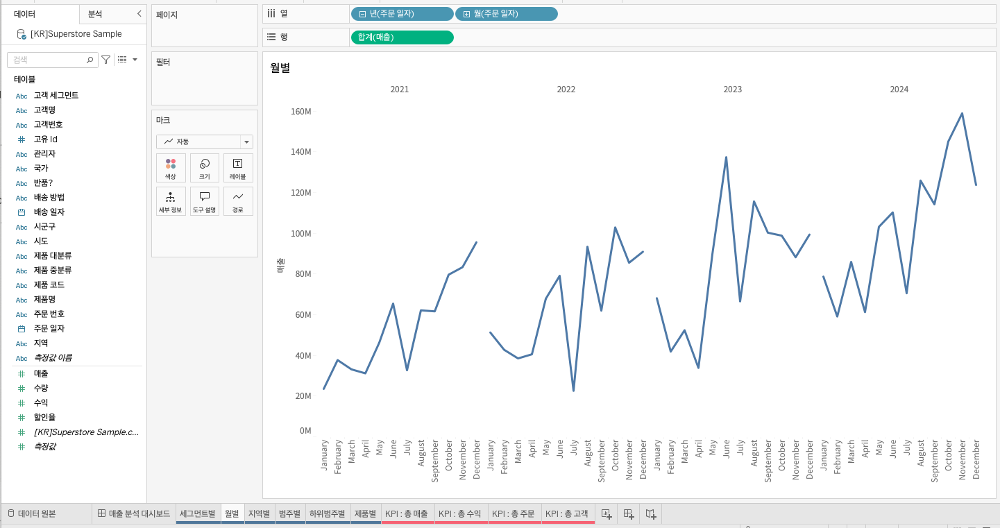

## 학습 목표

- 라인 차트의 목적과 활용 상황을 이해합니다.
- 시계열 데이터에서 추세와 변동성을 읽는 방법을 익힙니다.
- Tableau에서 월별 매출 같은 기본 시계열 라인 차트를 만들 수 있습니다.

## 목차

1. 라인 차트

## 1. 라인 차트

라인 차트는 시간의 흐름에 따른 변화와 추세를 파악할 때 가장 자주 사용합니다.

예를 들어, `월별 매출이 어떻게 변하고 있는가?`, `계절성이 존재하는가?`, `최근 증가 추세가 유지되고 있는가?` 같은 질문에 적합합니다.

- 월별 라인 차트
- 열: 년(주문일자), 월(주문일자)
- 행: 합계(매출)

### 1-1. 라인 차트가 적합한 경우

- 시간 순서가 중요한 경우
- 추세, 계절성, 변동성 확인이 필요한 경우
- 기간별 비교가 핵심인 경우

### 1-2. 주의할 점

- 시간 축이 아닌 범주형 데이터를 라인으로 연결하면 잘못된 연속성 인상을 줄 수 있습니다.
- 누락된 기간이 있으면 해석이 왜곡될 수 있으므로 데이터 완전성을 함께 확인해야 합니다.
- 값의 크기보다 방향과 변화가 중요할 때 라인 차트가 더 적합합니다.
