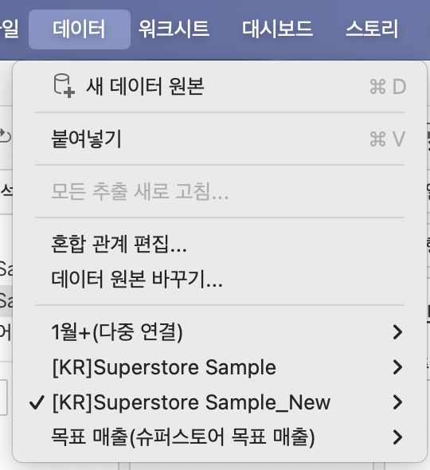
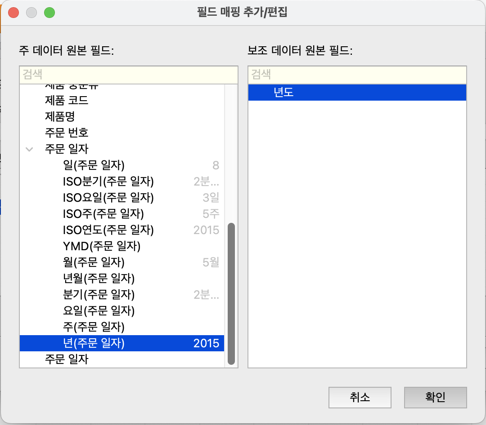
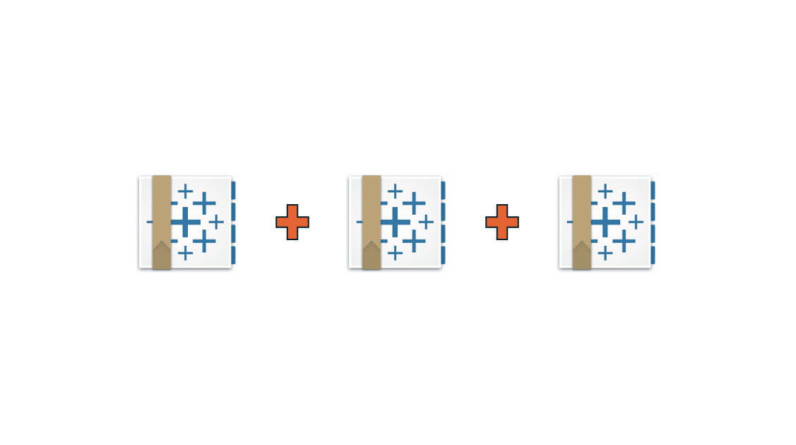
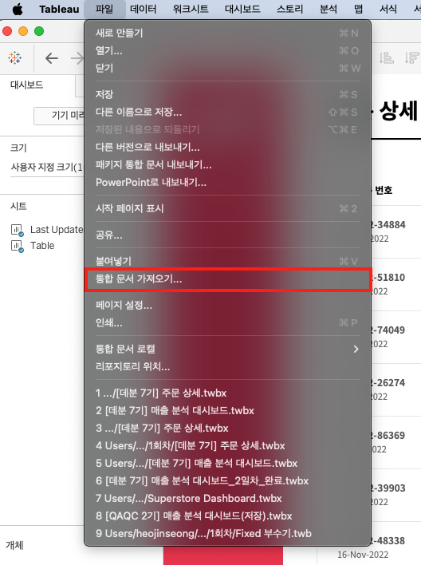
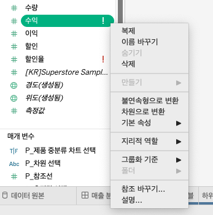

## 학습 목표

- 데이터 관계(Relationship), 조인(Join), 유니온(Union), 블렌딩(Blending)의 개념과 차이를 이해할 수 있습니다.
- 논리적 계층(Logical Layer)과 물리적 계층(Physical Layer)의 역할 차이를 설명할 수 있습니다.
- 기존 시각화를 유지한 채 데이터 원본을 교체하거나 필드 참조를 변경하는 방법을 익힐 수 있습니다.

## 사용 데이터 및 실습 파일

실습에서는 `KR Superstore Sample` 기반 데이터와 목표 매출 파일, 여러 개의 Tableau 통합 문서를 사용합니다.

실습 파일 다운로드: [Kaggle - KR Superstore Sample 2025](https://www.kaggle.com/datasets/heoquixote/krsuperstore-sample-2025/data)

## 목차

1. 데이터 결합
2. 통합 문서 합치기와 데이터 원본 교체

## 1. 데이터 결합

Tableau에서 데이터를 결합하는 방법은 하나가 아닙니다.  
겉으로 보면 모두 “테이블을 합치는 기능”처럼 보이지만, 실제로는 `언제 결합되는지`, `어느 레벨에서 결합되는지`, `집계가 어떻게 달라지는지`가 서로 다릅니다.

이 차이를 이해하지 못하면 다음과 같은 문제가 반복됩니다.

- 조인을 했더니 매출 합계가 갑자기 커짐
- 월별 목표 테이블을 붙였더니 주문 건수가 중복됨
- 서로 다른 파일을 합치고 싶은데 조인과 유니온을 혼동함
- 기존 시트는 유지한 채 데이터만 바꾸고 싶은데 전체 뷰가 깨짐

즉, 데이터 결합은 단순 연결 기능이 아니라 `집계 결과와 성능을 함께 결정하는 모델링 선택`입니다.

### 1-1. 논리적 계층과 물리적 계층


Tableau의 데이터 모델은 크게 두 계층으로 나뉩니다.

- `논리적 계층(Logical Layer)`: 테이블 간 관계(Relationship)를 정의하는 상위 레이어
- `물리적 계층(Physical Layer)`: 조인(Join), 유니온(Union)으로 실제 테이블을 결합하는 하위 레이어

이 둘의 핵심 차이는 `테이블을 언제 하나로 보느냐`입니다.

- 논리적 계층은 테이블을 일단 분리해 둔 채, 시트에서 필드를 사용할 때 필요한 방식으로 연결합니다.
- 물리적 계층은 데이터 원본 단계에서 테이블을 실제로 합쳐, 이후 분석에서 하나의 테이블처럼 다룹니다.

| 구분 | 논리적 계층 (Logical Layer) | 물리적 계층 (Physical Layer) |
| --- | --- | --- |
| 개념 | 데이터 모델의 상위 레이어 | 데이터 모델의 하위 레이어 |
| 결합 방식 | 관계(Relationship) | 조인(Join), 유니온(Union) |
| 결합 시점 | 뷰에서 필드를 사용할 때 동적으로 결합 | 데이터 원본 단계에서 즉시 결합 |
| 테이블 상태 | 각 테이블을 논리 테이블로 유지 | 하나의 물리 테이블로 결합 |
| 장점 | 집계 수준 보존, 중복 최소화, 유연한 분석 | 결과 구조가 명확하고 전통적 SQL 방식과 동일 |
| 주의점 | 행 단위 계산이 필요한 경우 기대와 다를 수 있음 | 조인 중복, Null, 성능 저하 가능 |

왜 이 구분이 중요할까요?

예를 들어 `주문 테이블`은 주문 행 단위이고, `고객 테이블`은 고객 단위라고 가정해 보겠습니다.

- 관계로 연결하면 Tableau는 각 테이블의 집계 수준을 최대한 유지한 채 필요한 시점에만 결합합니다.
- 조인으로 바로 붙이면 고객 정보가 주문 행마다 반복되어 들어가므로, 필드에 따라 중복 집계가 발생할 수 있습니다.

즉, `서로 다른 LOD(Level of Detail)를 그대로 살리고 싶다면 관계`, `처음부터 한 장짜리 테이블이 필요하다면 조인/유니온`이라고 이해하시면 됩니다.

### 1-2. 데이터 결합 방식 비교


Tableau에서 자주 쓰는 데이터 결합 방식은 네 가지입니다.

| 방법 | 설명 | 생성 위치 |
| --- | --- | --- |
| 관계 (Relationship) | 여러 테이블의 필드를 논리적으로 연결합니다. | 논리 계층(Logical Layer) |
| 조인 (Join) | 공통 키를 기준으로 테이블을 열(Column) 방향으로 물리 결합합니다. | 물리 계층(Physical Layer) |
| 유니온 (Union) | 같은 구조의 테이블을 행(Row) 방향으로 물리 결합합니다. | 물리 계층(Physical Layer) |
| 블렌딩 (Blending) | 기본 데이터 원본과 보조 데이터 원본을 시각화 단계에서 연결합니다. | 워크시트(Worksheet) |

겉보기에는 모두 결합이지만, 실제 원리는 다음처럼 다릅니다.

- 관계: “필요할 때 연결”
- 조인: “미리 옆으로 붙이기”
- 유니온: “미리 아래로 쌓기”
- 블렌딩: “시트에서 나중에 합쳐 보기”

### 1-3. 관계 (Relationship)

관계는 Tableau 2020.2 이후의 기본 데이터 모델링 방식입니다.  
핵심은 `테이블을 바로 합치지 않고, 연결 규칙만 정의해 둔다`는 점입니다.

#### 관계의 원리

- 테이블 간 연결 키를 지정합니다.
- 실제 쿼리는 시트에서 어떤 필드를 사용하는지에 따라 동적으로 생성됩니다.
- 필요하지 않은 테이블은 아예 쿼리에 포함되지 않을 수 있습니다.

즉, 관계는 SQL의 고정 조인을 미리 만드는 것이 아니라, `분석 맥락에 따라 가장 적절한 조인 쿼리를 나중에 생성하는 방식`입니다.

#### 관계가 유리한 경우

- 주문, 고객, 제품처럼 서로 다른 집계 수준의 테이블을 함께 분석할 때
- 한 워크북에서 다양한 질문을 다뤄야 할 때
- 데이터 중복 없이 모델을 유연하게 유지하고 싶을 때

#### 실무에서 자주 생기는 오해

- “관계는 조인보다 약한 연결이다”라고 오해하기 쉽지만, 그렇지 않습니다.
- 관계는 덜 결합하는 방식이 아니라 `더 늦게, 더 상황에 맞게 결합하는 방식`입니다.

#### 주의할 점

- 행 단위 계산을 전제로 한 모델에서는 결과가 직관과 다를 수 있습니다.
- 모든 필드를 하나의 상세 테이블처럼 다뤄야 하는 분석이라면 조인이 더 예측 가능할 수 있습니다.

즉, 관계는 기본 선택지로 매우 강력하지만, `반드시 단일 행 레벨 테이블이 필요할 때`는 조인이 더 적합합니다.

### 1-4. 조인 (Join)

조인은 두 테이블을 공통 키 기준으로 하나의 테이블로 합치는 방식입니다.  
SQL의 `INNER JOIN`, `LEFT JOIN`, `RIGHT JOIN`, `FULL OUTER JOIN`과 같은 개념으로 이해하시면 됩니다.

#### 조인의 원리

- 결합하는 순간 하나의 물리 테이블이 생성됩니다.
- 이후 분석에서는 원래 두 테이블이 아니라, 합쳐진 결과만 다루게 됩니다.

#### 조인이 유리한 경우

- 분석 전에 반드시 단일 테이블 구조가 필요할 때
- 행 단위 계산이나 사용자 지정 SQL 관점으로 명확한 결과 테이블이 필요할 때
- 고객 속성, 제품 속성처럼 기준 정보 컬럼을 옆으로 붙일 때

#### 조인 시 주의할 점

- `1:N` 또는 `N:N` 관계를 잘못 조인하면 레코드가 불어나며 집계가 왜곡될 수 있습니다.
- 매출, 주문건수 같은 측정값이 중복되어 실제보다 크게 보일 수 있습니다.
- 키가 맞지 않으면 Null이 생기고, 조인 타입에 따라 누락 행이 발생할 수 있습니다.

예를 들어 주문 테이블에 주문번호별 여러 행이 있고, 반품 테이블에도 주문번호가 여러 번 등장한다면, 단순 조인 시 행 수가 곱처럼 늘어날 수 있습니다.  
이때 문제는 조인 문법이 아니라 `조인 전에 키의 유일성(granularity)을 확인하지 않은 것`입니다.

실무에서 조인을 쓸 때 가장 먼저 확인할 질문은 다음입니다.

> 이 키는 양쪽 테이블에서 각각 몇 번 등장하는가?

이 질문에 답하지 못하면, 조인은 기술적으로 성공해도 분석적으로 실패할 수 있습니다.

### 1-5. 유니온 (Union)

유니온은 구조가 같은 여러 테이블을 행 방향으로 이어 붙이는 방식입니다.

#### 유니온의 원리

- 같은 의미의 컬럼을 기준으로 데이터를 아래로 쌓습니다.
- SQL 기준으로는 `UNION ALL`에 가깝습니다.
- 컬럼 구조가 다르면 필드가 분리되거나 Null이 생길 수 있습니다.

#### 유니온이 유리한 경우

- 월별, 분기별, 연도별 파일을 하나로 합칠 때
- 지역별로 따로 저장된 동일 양식 파일을 통합할 때
- 여러 시트/파일을 장기 추세 분석용 테이블로 만들 때

#### 실무에서 자주 생기는 문제

- 컬럼명이 조금만 달라도 서로 다른 필드로 인식됩니다.
- 데이터 타입이 다르면 후속 계산에서 오류가 날 수 있습니다.
- 어떤 파일은 컬럼이 빠져 있고 어떤 파일은 추가 컬럼이 있으면 Null이 발생합니다.

즉, 유니온의 핵심 체크포인트는 조인 키가 아니라 `스키마 일관성`입니다.

- 조인은 “무엇으로 연결할까”가 핵심
- 유니온은 “열 구조가 같은가”가 핵심

### 1-6. 블렌딩 (Blending)

블렌딩은 서로 다른 데이터 원본을 시각화 단계에서 연결하는 방식입니다.

#### 블렌딩의 원리

- 기본 데이터 원본(Primary)을 먼저 집계합니다.
- 보조 데이터 원본(Secondary)을 연결 필드 기준으로 맞춰 가져옵니다.
- 즉, 데이터 원본 자체를 하나로 합치는 것이 아니라 `집계된 결과를 시트에서 매칭`합니다.

이 점이 조인과 가장 큰 차이입니다.

- 조인: 행 레벨에서 먼저 결합
- 블렌딩: 시각화 집계 이후 연결

#### 블렌딩이 유용한 경우

- 서로 다른 데이터 원본을 빠르게 함께 써야 할 때
- 이미 별도 데이터 원본으로 만들어 둔 자산을 다시 모델링하기 어려울 때
- 목표값, 예산값, 외부 기준값을 비교용으로 붙일 때

#### 블렌딩 사용 시 주의할 점

- 보조 데이터 원본은 연결 필드 기준으로 집계되어 들어오기 때문에 행 레벨 상세 분석에는 한계가 있습니다.
- 기본 데이터 원본에 없는 차원은 보조 데이터 원본만으로 자유롭게 확장하기 어렵습니다.
- 최신 Tableau에서는 가능한 경우 관계를 우선 검토하는 것이 일반적입니다.

즉, 블렌딩은 “예전 방식이라서 무조건 피해야 하는 기능”은 아니지만, `데이터 모델 수준에서 통합할 수 있다면 관계를 먼저 고려하고`, `시트 단계에서 빠르게 비교해야 할 때 블렌딩을 선택`하는 것이 실무적으로 더 자연스럽습니다.

### 1-7. 언제 무엇을 써야 할까?

| 상황 | 추천 방식 | 이유 |
| --- | --- | --- |
| 주문, 고객, 제품처럼 서로 다른 상세 수준 테이블을 함께 분석 | 관계 | 집계 수준을 보존하면서 유연하게 분석 가능 |
| 속성 정보를 한 테이블에 명확히 붙여야 함 | 조인 | 결과 구조가 명확하고 행 단위 계산에 유리 |
| 연도별/월별 파일을 하나로 합쳐야 함 | 유니온 | 동일 스키마 데이터를 행 기준으로 결합 |
| 서로 다른 데이터 원본의 집계 결과를 비교 | 블렌딩 | 시각화 단계에서 빠르게 연결 가능 |

관계, 조인, 유니온, 블렌딩을 한 줄로 정리하면 다음과 같습니다.

- 관계: 기본 선택지
- 조인: 단일 물리 테이블이 필요할 때
- 유니온: 같은 형식 파일을 쌓을 때
- 블렌딩: 별도 데이터 원본을 시트에서 비교할 때

### 1-8. [실습] 블렌딩으로 목표 매출과 실제 매출 비교


블렌딩은 `데이터` 메뉴에서 혼합 관계를 설정해 사용할 수 있습니다.

예를 들어 `실제 매출 데이터`와 `연도별 목표 매출 데이터`가 별도 원본이라면, 연도 필드를 공통 키로 연결해 달성 여부를 분석할 수 있습니다.



이때 다음처럼 연도 필드를 연결합니다.

- 기본 데이터 원본: `KR Superstore Sample`
- 보조 데이터 원본: `목표 매출`
- 연결 필드: `년(주문 일자)` = `년도`



시트 구성 예시는 다음과 같습니다.

- 열: `SUM([매출])`, `SUM([목표 매출])`
- 행: `YEAR([주문 일자])`
- 색상: `목표 매출 달성 여부`

계산식 예시는 다음과 같습니다.

```tableau
// C_목표 매출 달성 여부
SUM([매출]) >= SUM([목표 매출].[목표 매출])
```

이 실습의 핵심은 두 데이터 원본을 하나로 합치지 않아도, `공통 기준(연도)`으로 집계 비교가 가능하다는 점입니다.

## 2. 통합 문서 합치기와 데이터 원본 교체

실무에서는 데이터를 새로 붙이는 것만큼이나, `이미 만들어 둔 시각화를 유지하면서 연결만 바꾸는 작업`이 중요합니다.

대표적인 상황은 다음과 같습니다.

- 팀원별로 만든 Tableau 통합 문서를 하나로 합쳐야 할 때
- 샘플 Excel 데이터로 만들던 분석을 실제 DB 연결로 교체할 때
- 전처리팀이 수정한 새 파일로 원본만 교체해야 할 때
- 컬럼명이 바뀌어 깨진 필드 참조를 빠르게 복구해야 할 때

이럴 때 사용하는 기능이 `통합 문서 가져오기`, `데이터 원본 바꾸기`, `참조 바꾸기`입니다.

### 2-1. 통합 문서 합치기


대시보드를 여러 명이 나눠 작업하면 각각 `.twb` 또는 `.twbx` 파일이 생깁니다.  
이때 결과를 하나의 통합 문서로 모으고 싶다면, 시트를 다시 만드는 대신 기존 통합 문서를 가져와 시트 단위로 복사하면 됩니다.

#### 1. 통합 문서 가져오기



`파일(File)` 메뉴의 `통합 문서 가져오기(Import Workbook)`를 사용하면 다른 Tableau 통합 문서를 현재 파일 안으로 불러올 수 있습니다.

이 단계의 의미는 단순 파일 열기가 아니라, `다른 워크북의 시트와 대시보드를 현재 워크북 안에서 사용할 수 있게 만드는 것`입니다.

#### 2. 시트 복사



가져온 통합 문서의 시트 탭에서 원하는 워크시트나 대시보드를 복사합니다.

#### 3. 현재 통합 문서에 붙여넣기


붙여넣기를 하면 해당 시트가 현재 통합 문서로 들어옵니다.

실무적으로 이 방식이 유용한 이유는 다음과 같습니다.

- 이미 완성된 시트를 재사용할 수 있습니다.
- 대시보드 레이아웃을 다시 만들 필요가 없습니다.
- 팀원별 작업 결과를 하나의 배포 파일로 쉽게 정리할 수 있습니다.

다만 주의할 점도 있습니다.

- 이름이 같은 데이터 원본이 여러 개 생기면 관리가 복잡해질 수 있습니다.
- 복사된 시트가 원본 데이터 구조에 의존하면, 이후 `데이터 원본 바꾸기` 작업이 함께 필요할 수 있습니다.

즉, 통합 문서 합치기는 시트를 모으는 작업이고, 그 다음 단계에서 데이터 원본 정리가 뒤따르는 경우가 많습니다.

### 2-2. 데이터 원본 바꾸기


데이터 원본 바꾸기는 기존 시트를 최대한 유지한 채, 연결된 데이터 소스만 다른 원본으로 교체하는 기능입니다.

예를 들어:

- 샘플 Excel 기반 시각화를 실제 운영 DB로 전환할 때
- 테스트용 추출 파일을 최신 추출 파일로 바꿀 때
- 팀원이 만든 워크북을 공용 데이터 원본에 연결해야 할 때

같은 상황에서 매우 유용합니다.

#### 작업 순서

1. 현재 워크북에 새 데이터 원본을 추가로 연결합니다.
2. 상단 메뉴에서 `데이터(Data) > 데이터 원본 바꾸기(Replace Data Source)`를 선택합니다.
3. 현재 사용 중인 데이터 원본과 새로 교체할 데이터 원본을 지정합니다.
4. 확인을 누르면 기존 시트가 새 데이터 원본 기준으로 다시 연결됩니다.


#### 왜 유용할까요?

이 기능의 핵심은 `시트를 다시 만들지 않아도 된다`는 점입니다.

- 차트
- 계산된 필드
- 대시보드 배치
- 필터
- 서식

을 최대한 유지한 채, 데이터 연결만 바꿀 수 있습니다.

#### 언제 문제가 생길까요?

다음 조건이 맞지 않으면 일부 시트가 깨질 수 있습니다.

- 필드명 불일치
- 데이터 타입 불일치
- 차원/측정값 역할 차이
- 날짜/지리 역할 차이

즉, 데이터 원본 바꾸기는 단순 치환이 아니라 `스키마 호환성`이 전제되는 기능입니다.

실무에서는 교체 전에 최소한 다음을 먼저 점검하는 것이 좋습니다.

- 컬럼명이 동일한가
- 데이터 타입이 같은가
- 계산식에서 참조하는 핵심 필드가 모두 존재하는가
- 기존 필터와 매개변수가 새 원본에서도 의미를 유지하는가

### 2-3. 참조 바꾸기


참조 바꾸기는 데이터 원본 전체를 바꾸는 기능이 아니라, `특정 필드가 참조하는 대상을 다른 필드로 교체하는 기능`입니다.

대표적인 사용 상황은 다음과 같습니다.

- 전처리 이후 컬럼명이 바뀌었을 때
- 기존 필드가 삭제되어 에러가 발생할 때
- 비슷한 의미의 새 필드로 계산식과 시트를 빠르게 전환하고 싶을 때

예를 들어 기존에 `[매출액]`을 쓰던 시트를, 이름만 달라진 `[매출]` 필드로 연결하고 싶다면 전체 뷰를 다시 만들 필요 없이 참조만 바꾸면 됩니다.

#### 작업 순서

1. 에러가 나는 필드 또는 교체하려는 필드를 마우스 오른쪽으로 클릭합니다.
2. `참조 바꾸기(Replace References)`를 선택합니다.
3. 대체할 필드를 선택한 뒤 확인합니다.



#### 데이터 원본 바꾸기와 무엇이 다를까요?

- 데이터 원본 바꾸기: 데이터 소스 전체를 교체
- 참조 바꾸기: 특정 필드의 연결만 교체

즉, 범위가 다릅니다.

- 워크북 전체 연결을 바꿀 때는 데이터 원본 바꾸기
- 일부 컬럼명 변경이나 깨진 필드 복구는 참조 바꾸기

#### 실무에서 특히 유용한 이유

전처리팀이 데이터를 수정하면, 가장 흔한 변경이 “컬럼명 변경”입니다.

예를 들어:

- `주문일` → `주문 일자`
- `Sales` → `매출`
- `Profit_amt` → `수익`

처럼 이름만 바뀌는 경우가 많습니다.

이때 참조 바꾸기를 쓰면 기존 계산식, 시트, 대시보드 구조를 최대한 유지하면서 빠르게 복구할 수 있습니다.

반대로 필드 의미 자체가 달라졌다면 단순 참조 바꾸기로 끝내면 안 됩니다.  
이 경우에는 계산식 로직, 집계 방식, 필터 의미까지 함께 검토해야 합니다.

## 정리

이번 절의 핵심은 “데이터를 합치는 방법은 하나가 아니다”라는 점입니다.

- 관계는 서로 다른 집계 수준을 유연하게 연결하는 기본 모델링 방식입니다.
- 조인은 하나의 물리 테이블이 필요할 때 사용하지만, 중복과 Null에 특히 주의해야 합니다.
- 유니온은 같은 구조의 데이터를 아래로 쌓는 방식입니다.
- 블렌딩은 별도 데이터 원본을 시각화 단계에서 연결할 때 유용합니다.

그리고 실무에서는 데이터를 새로 붙이는 것만큼이나 `기존 시각화를 깨지 않고 유지하는 편집 기술`이 중요합니다.

- 통합 문서 합치기: 여러 작업 결과를 하나의 워크북으로 모으기
- 데이터 원본 바꾸기: 워크북 전체 연결 교체
- 참조 바꾸기: 깨진 필드 또는 변경된 컬럼명 빠르게 복구

결국 중요한 것은 기능 이름을 외우는 것이 아니라, `지금 내가 바꾸려는 대상이 행 수준 데이터 구조인지, 데이터 원본 전체인지, 특정 필드 참조인지`를 구분하는 것입니다.  
이 기준이 잡히면 Tableau의 데이터 편집 기능을 훨씬 안정적으로 사용할 수 있습니다.
