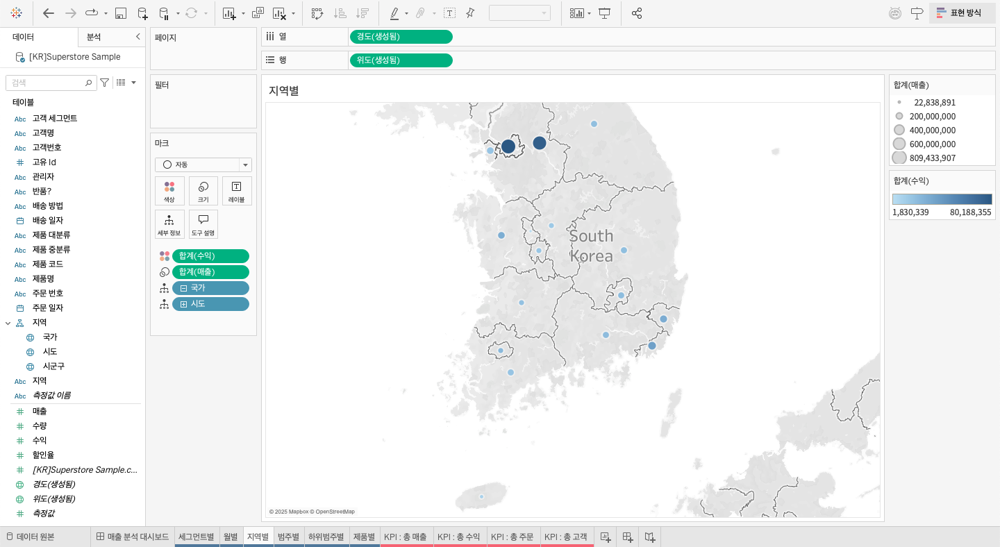
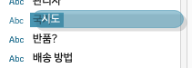
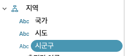
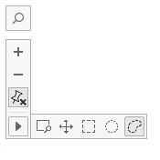

## 학습 목표

- 맵 차트의 목적과 활용 상황을 이해합니다.
- 지리적 역할과 계층 구조가 지도 분석에 왜 중요한지 설명할 수 있습니다.
- Tableau에서 지역별 매출/수익 맵을 만들고 드릴다운 가능한 계층을 구성할 수 있습니다.

## 목차

1. 맵 차트
2. 계층 만들기

## 1. 맵 차트

맵 차트는 지역에 따른 값의 차이를 보여줄 때 사용합니다.

예를 들어 `지역별 매출이 어디에서 높고 낮은가?`, `수익이 좋은 지역과 손실 지역은 어디인가?` 같은 질문에 적합합니다.

- 지역별 맵 차트
- 열: 경도(생성됨)
- 행: 위도(생성됨)
- 색상: 합계(수익)
- 크기: 합계(매출)
- 세부정보: 국가, 시도

### 1-1. 지리적 역할 부여

데이터 타입 아이콘을 클릭해 지리적 역할을 지정할 수 있습니다.

- 국가 -> 국가/지역
- 시도 -> 주/시/도
- 시군구 -> 시군구

지리적 역할이 올바르게 지정되지 않으면 지도에서 위치를 정확히 인식하지 못할 수 있습니다.

## 2. 계층 만들기

계층(Hierarchy)은 일반적인 수준에서 구체적인 수준으로 데이터를 탐색할 수 있도록 구조화한 것입니다.

예:

- 국가 -> 시도 -> 시군구

이 구조를 만들면 같은 차트 안에서 드릴다운과 드릴업이 가능해집니다.

### 2-1. 계층 만들기 방법

1. 계층으로 묶고 싶은 필드를 겹친 상태로 드롭합니다.
2. 계층 이름을 입력합니다.
3. 필드를 끌어 순서를 조정합니다.

Tableau는 위에서 아래 순서를 계층 순서로 인식합니다.

계층이 생성되면 데이터 패널에서 관련 필드가 하나의 계층 구조로 묶여 표시됩니다.

### 2-2. 맵 옵션

1. 검색 아이콘: 특정 지역이나 주소를 검색합니다.
2. 확대: 지도를 더 자세히 봅니다.
3. 축소: 지도를 더 넓게 봅니다.
4. 핀 아이콘: 현재 위치와 확대 수준을 고정합니다.
5. 손바닥 모양: 지도를 드래그해 이동합니다.
6. 사각형 선택: 직사각형 영역을 선택합니다.
7. 원 선택: 원형 영역을 선택합니다.
8. 자유형 선택: 자유로운 모양으로 영역을 선택합니다.

### 2-3. 백그라운드 레이어

1. 백그라운드 스타일: 맵의 기본 테마를 설정합니다.
2. 투명도: 맵 배경의 투명도를 조정합니다.
3. 배경 맵 계층: 표시할 지리적 요소를 선택합니다.
