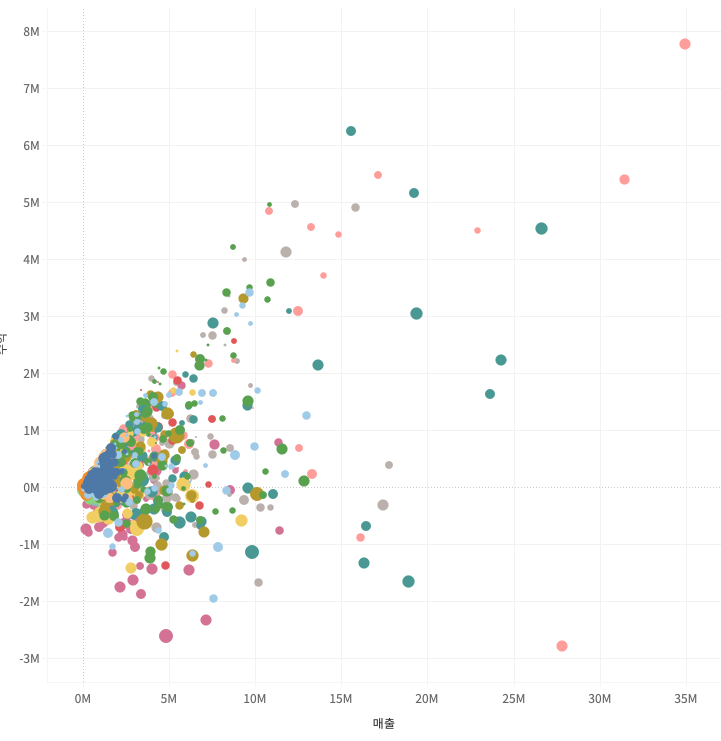
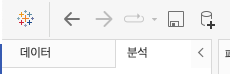

## 학습 목표

- 스캐터 차트의 목적과 활용 상황을 이해합니다.
- 측정값 집계와 분석 패널 기능을 함께 활용할 수 있습니다.

## 목차

1. 스캐터 차트

## 1. 스캐터 차트

### 1-1. 스캐터 차트란?

스캐터 차트는 두 개 이상의 연속형 측정값 간 관계를 시각적으로 보여주는 차트입니다.

대표적으로 다음 질문에 적합합니다.

- 매출이 높을수록 수익도 높은가?
- 특정 제품군이 다른 군집과 다른 패턴을 보이는가?
- 이상치(outlier)는 어디에 위치하는가?

#### 만드는 방법

- 열: 연속형 측정값 1개
- 행: 연속형 측정값 1개
- 세부정보, 색상, 모양 등에 차원을 배치해 구분

또는 `표현 방식(Show Me)`에서 스캐터 차트를 선택할 수 있습니다.

#### 활용 방법

- 추세선 추가 -> 두 변수의 관계 확인
- 클러스터링 적용 -> 데이터 그룹 특성 파악
- 크기에 다른 측정값을 넣기 -> 버블 차트로 확장

### 1-2. 스캐터 차트 예시

- 열: 합계(매출)
- 행: 합계(수익)
- 마크: 도형 또는 원
- 색상: 클러스터

### 1-3. 측정값 집계

분석 탭의 `측정값 집계` 옵션은 값을 집계 함수 기준으로 묶어서 보여줄지, 원본 행 단위로 풀어 보여줄지를 제어합니다.

이 기능은 특히 스캐터 차트에서 중요합니다.

- 집계된 상태에서는 요약된 관계가 보입니다.
- 집계를 해제하면 개별 행 수준의 분포와 이상치가 드러납니다.

### 1-4. 분석 패널 기능

분석 패널은 왼쪽 사이드바의 `데이터(Data)` 패널 옆 탭에 있습니다.

데이터 패널이 필드를 배치하는 곳이라면, 분석 패널은 시각화 위에 분석 요소를 얹는 곳이라고 볼 수 있습니다.

#### 1. 요약(Summarize)

- 상수 라인(Constant Line): 목표값 등 고정 기준선 표시
- 평균 라인(Average Line): 평균값 기준선 표시
- 사분위수 및 중앙값: 분포의 중앙 경향과 구간 확인
- 박스 플롯(Box Plot): 분포와 이상치 확인
- 총계(Totals): 합계, 평균 등 요약 정보 표시

#### 2. 모델(Model)

- 평균 + 95% CI: 평균과 신뢰구간 표시
- 중앙값 + 95% CI: 중앙값과 신뢰구간 표시
- 추세선(Trend Line): 회귀선 기반 패턴 설명
- 예측(Forecast): 지수 평활 기반 미래값 예측
- 클러스터(Cluster): K-means 기반 군집화

#### 3. 사용자 지정(Custom)

- 참조선(Reference Line): 특정 기준값을 선으로 표시
- 참조 구간(Reference Band): 상·하한 범위를 음영으로 표시
- 분포 구간(Distribution Band): 분포 기반 구간 강조

#### 4. 박스 플롯(Box Plot)

- 사용자가 직접 기준을 설정해 박스 플롯 생성 가능

#### 실무적으로 중요한 이유

- 참조선은 KPI 기준과 실제 값을 비교할 때 유용합니다.
- 추세선은 관계가 있는지 빠르게 탐색할 때 좋지만, 인과관계를 보장하지는 않습니다.
- 예측은 데이터의 패턴이 안정적일 때 유의미하며, 구조 변화가 큰 데이터에서는 신중해야 합니다.
- 클러스터링은 자동 그룹화에 유용하지만, 군집 수와 변수 선택에 따라 결과가 달라질 수 있습니다.
