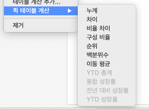

## 학습 목표

- 파이 차트의 목적과 한계를 이해합니다.
- 구성 비율 중심 질문에서 파이 차트를 적절히 사용할 수 있습니다.
- 퀵 테이블 계산을 이용해 비율 정보를 빠르게 표현할 수 있습니다.

## 목차

1. 파이 차트
2. 퀵 테이블 계산

## 1. 파이 차트

파이 차트는 전체 대비 각 범주가 차지하는 비율을 보여줄 때 사용합니다.

다만 파이 차트는 범주 수가 많아질수록 비교가 어려워집니다.  
따라서 범주 수가 적고, 전체 대비 구성비를 강조하고 싶을 때만 쓰는 것이 좋습니다.

- 범주별 파이 차트
- 색상: 합계(수익)
- 각도: 합계(매출)
- 크기: 합계(매출)
- 레이블: 제품 대분류, 합계(매출) -> 퀵 테이블 계산 `구성 비율`

### 1-1. 파이 차트를 쓸 때 주의할 점

- 작은 각도 차이는 사람이 정확히 비교하기 어렵습니다.
- 범주 수가 많아지면 레이블이 겹치고 가독성이 떨어집니다.
- 단순 비교가 목적이면 막대 차트가 더 나은 경우가 많습니다.

## 2. 퀵 테이블 계산

퀵 테이블 계산은 Tableau가 자주 사용하는 계산을 빠르게 적용할 수 있도록 제공하는 기능입니다.

핵심은 별도의 계산식을 직접 만들지 않아도, 현재 뷰를 기준으로 즉시 계산 결과를 보여준다는 점입니다.

- 누계(Running Total)
- 차이(Difference)
- 비율 차이(Percent Difference)
- 구성 비율(Percent of Total)
- 순위(Rank)
- 백분위수(Percentile)
- 이동 평균(Moving Average)
- YTD 총계
- 통합 성장률(CAGR)
- 전년 대비 성장률
- YTD 성장률

| 계산 종류 | 설명 |
| --- | --- |
| 누계 | 처음부터 현재 행까지 값을 누적 합으로 계산 |
| 차이 | 현재 값과 이전 값의 차이를 계산 |
| 비율 차이 | 현재 값과 기준 값의 차이를 비율로 계산 |
| 구성 비율 | 전체 합계 대비 각 항목이 차지하는 비율 |
| 순위 | 특정 기준으로 정렬한 뒤 순위를 부여 |
| 백분위수 | 데이터 분포 내 상대적 위치를 백분위로 표현 |
| 이동 평균 | 지정한 구간 기준 평균을 계산 |
| YTD 총계 | 해당 연도 시작일부터 현재까지 누적합 |
| 통합 성장률 | 일정 기간 동안의 연평균 성장률 |
| 전년 대비 성장률 | 같은 기간의 전년도 값과 비교한 성장률 |
| YTD 성장률 | 해당 연도의 YTD와 전년도 YTD를 비교한 성장률 |

### 2-1. 실무적으로 중요한 점

- 퀵 테이블 계산은 편리하지만, 계산 기준이 현재 뷰에 의존합니다.
- 따라서 주소 지정과 파티셔닝이 어떻게 잡히는지 이해하지 못하면 예상과 다른 값이 나올 수 있습니다.
- 결과가 이상해 보일 때는 계산식 자체보다도 `어떤 방향으로 계산하고 있는가`를 먼저 확인하는 것이 좋습니다.
