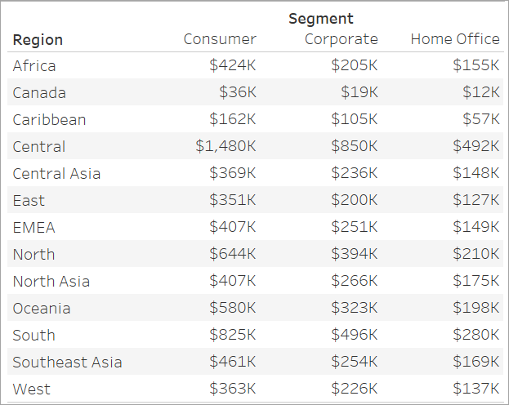
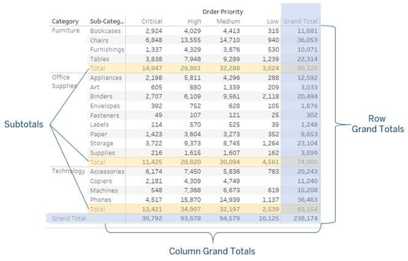
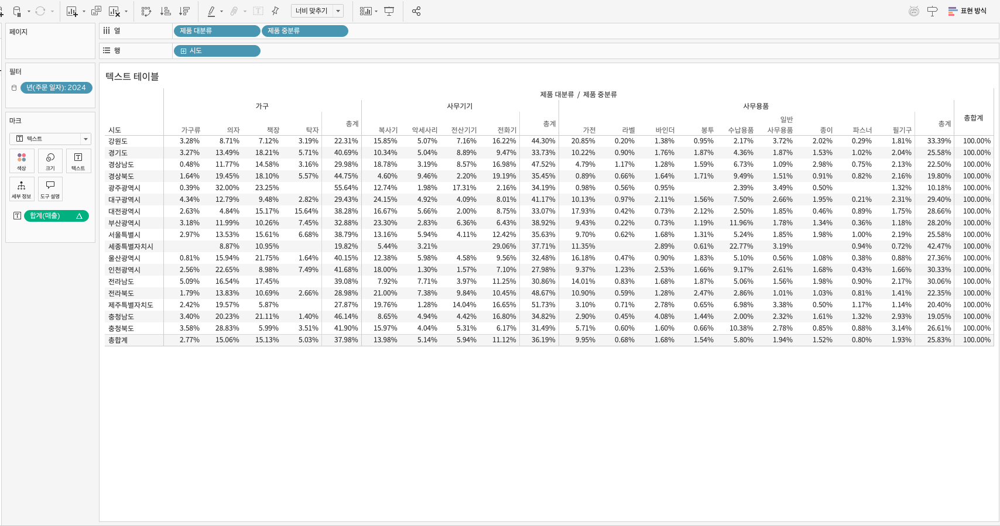
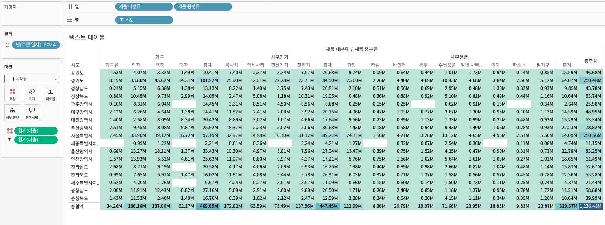

## 학습 목표

- 크로스탭의 역할과 활용 목적을 이해합니다.
- 크로스탭, 히트맵, 테이블 계산을 함께 해석할 수 있습니다.

## 목차

1. 크로스탭이란?
2. 테이블 계산
3. 히트맵

## 1. 크로스탭이란?

크로스탭은 특정 숫자 값을 행과 열 구조 안에 표 형태로 보여주는 시각화입니다.  
Tableau에서는 흔히 `텍스트 테이블`이라고도 부릅니다.

#### 크로스탭을 쓰는 이유

- 정확한 수치를 직접 읽어야 할 때 유용합니다.
- 요약 수치뿐 아니라 행과 열 교차 수준의 상세 값 비교에 적합합니다.
- 시각적 임팩트보다는 정밀한 확인이 중요한 경우에 적합합니다.

#### 만드는 방법

- 열에 차원 1개
- 행에 차원 1개
- `Abc` 자리 표시자에 측정값 1개

또는 기존 워크시트 탭을 마우스 오른쪽 버튼으로 클릭해 `크로스탭으로 복제`를 선택할 수 있습니다.

분석 패널을 함께 사용하면 다음과 같은 요소를 추가할 수 있습니다.

- 행 총합계
- 열 총합계
- 소계
- 집계 방식 변경

실무에서는 대시보드에서는 차트로 요약을 보여주고, 상세 탭에서는 크로스탭으로 수치를 검증하는 구성이 자주 쓰입니다.

## 2. 테이블 계산

테이블 계산은 뷰에 그려진 결과를 기준으로 계산 방향과 범위를 지정하는 기능입니다.

즉, 원본 데이터 자체를 다시 계산하는 것이 아니라 `현재 화면에 어떻게 배치되어 있는가`를 기준으로 계산이 이루어집니다.

- 테이블(옆으로): 행 단위로, 왼쪽에서 오른쪽으로 계산
- 테이블(아래로): 열 단위로, 위에서 아래로 계산
- 테이블: 전체 테이블을 하나의 단위로 계산
- 패널(옆으로): 패널 단위에서 행 방향으로 계산
- 패널: 패널 전체를 하나의 단위로 계산
- 셀: 개별 마크 단위 계산
- 특정 차원: 지정한 차원을 기준으로 계산

#### 왜 중요한가

같은 `구성 비율`이라도 계산 방향이 다르면 결과는 완전히 달라집니다.

- 전체 대비 비율을 보고 싶은데 `패널 기준`으로 계산하면 각 그룹 내부 비율만 보일 수 있습니다.
- 전년 대비 비교를 하려는데 주소 지정이 잘못되면 다른 범주끼리 비교할 수도 있습니다.

따라서 테이블 계산이 예상과 다르게 나올 때는 계산식보다 먼저 `Compute Using` 방향을 확인해야 합니다.

패널은 두 개 이상의 차원을 사용할 때, 특정 차원을 기준으로 먼저 데이터를 묶어 계산하는 단위라고 이해하시면 됩니다.

## 3. 히트맵

크로스탭과 히트맵은 같은 데이터를 두 가지 방식으로 보여주는 좋은 예시입니다.

- 크로스탭은 숫자를 정확히 읽는 데 강합니다.
- 히트맵은 값의 크기와 패턴을 한눈에 파악하는 데 강합니다.

- 열: 제품 대분류, 제품 중분류
- 행: 시도
- 마크: 사각형(히트맵) 또는 텍스트(텍스트 테이블)
- 색상: 합계(매출)
- 레이블: 합계(매출) -> 퀵 테이블 계산 `구성 비율`

같은 데이터라도 질문이 `정확한 숫자 확인`인지, `패턴 파악`인지에 따라 표현 방식이 달라져야 합니다.
