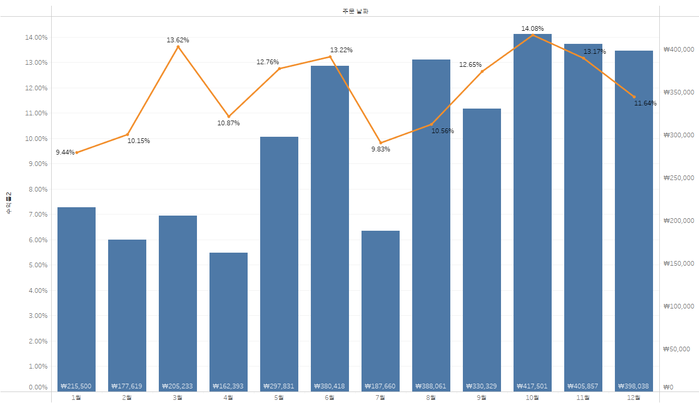
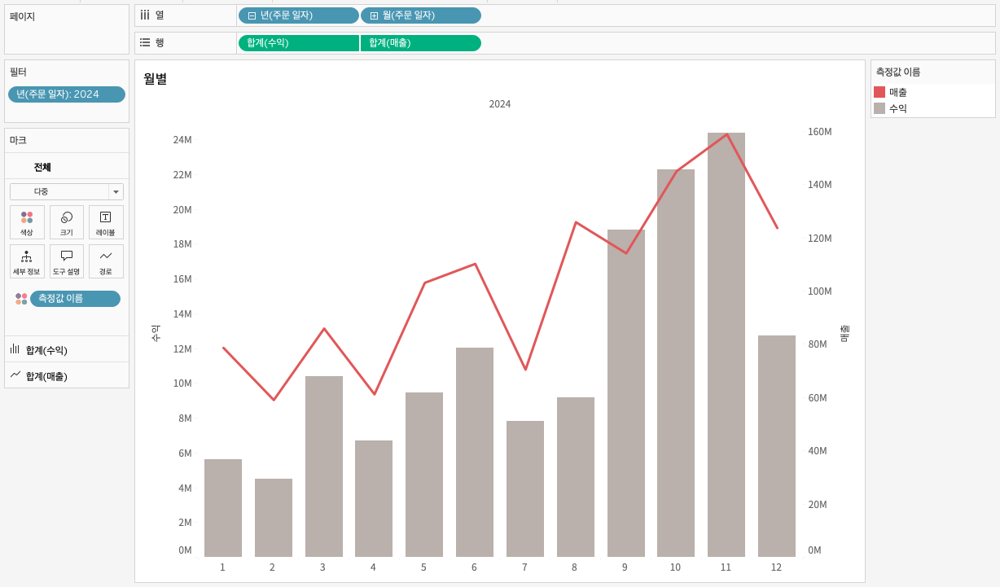
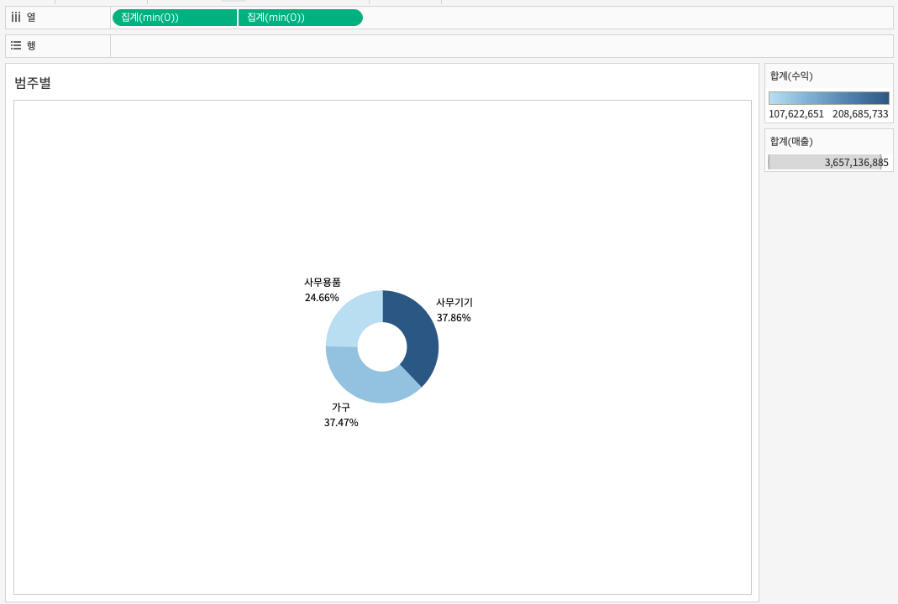
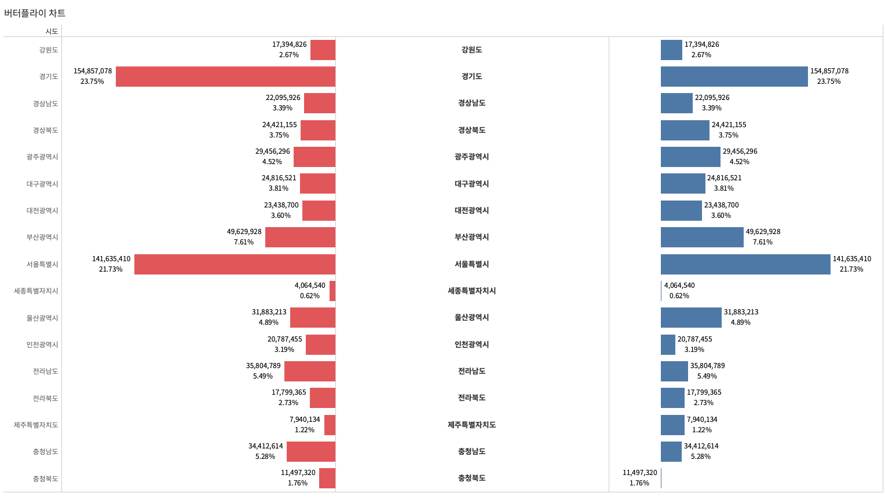

## 학습 목표

- 이중축 차트의 개념과 필요성을 이해합니다.
- 서로 다른 지표를 하나의 뷰에서 비교하고 해석하는 방법을 익힙니다.
- 월별 매출·수익 이중축, 도넛차트, 버터플라이 차트를 직접 구성할 수 있습니다.

## 목차

1. 이중축이란?
2. 월별 매출, 수익 이중축
3. 도넛차트
4. 버터플라이 차트

## 1. 이중축이란?

이중축은 두 개의 축을 하나의 뷰에 겹쳐서 표시하는 방식입니다.

핵심은 서로 다른 두 지표를 같은 차원 위에서 동시에 보여줄 수 있다는 점입니다.  
예를 들어 월별 `매출`과 `수익`을 한 차트 안에서 함께 보여주면, 시계열 흐름과 두 지표의 차이를 동시에 읽을 수 있습니다.

이중축의 특징은 다음과 같습니다.

- 두 개의 축을 하나의 뷰에 겹쳐 표시할 수 있습니다.
- 서로 다른 단위의 데이터를 함께 비교할 수 있습니다.
- 필요하면 축을 동기화(Synchronized Axis)할 수 있습니다.
- 각 축에 서로 다른 차트 유형을 적용할 수 있습니다.
  예: 막대 + 라인
- 색상과 마크 유형을 각각 독립적으로 지정할 수 있어 구분이 쉽습니다.

#### 이중축을 만드는 기본 순서

이후에 나오는 도넛차트, 버터플라이 차트도 모두 이 순서를 응용합니다.

1. 같은 축(행 또는 열)에 측정값을 두 번 올립니다.
2. 마크 카드가 측정값별로 나뉘는 것을 확인합니다.
3. 두 번째 측정값 알약을 마우스 오른쪽 버튼으로 클릭한 뒤 `이중 축(Dual Axis)`을 선택합니다.
4. 두 축의 눈금 기준을 맞춰야 하면, 오른쪽 축을 우클릭해 `축 동기화(Synchronize Axis)`를 선택합니다.
5. 필요하면 축을 우클릭해 `머리글 표시(Show Header)`를 해제해 눈금을 숨깁니다.

#### 이중축이 유용한 경우

- 같은 차원 위에서 두 지표를 동시에 비교해야 할 때
- 절대값과 추세를 함께 보여주고 싶을 때
- 한 지표는 막대, 다른 지표는 선처럼 시각적 역할을 다르게 주고 싶을 때

#### 주의할 점

이중축은 강력하지만, 잘못 쓰면 해석을 왜곡할 수 있습니다.

- 축 범위가 다르면 두 값의 차이가 과장되거나 축소되어 보일 수 있습니다.
- 서로 단위가 전혀 다른 값을 한 화면에 넣을 때는 설명이 부족하면 오해를 부를 수 있습니다.
- 비교 자체보다 디자인 효과를 위해 쓰면 오히려 가독성이 떨어질 수 있습니다.

실무에서는 `이중축이 필요한가`를 먼저 묻는 습관이 중요합니다.  
단순 비교라면 별도 차트를 나란히 배치하는 편이 더 명확한 경우도 많습니다.

## 2. 월별 매출, 수익 이중축

월별 매출과 수익은 함께 자주 비교되는 지표입니다.

- 매출은 얼마나 팔렸는가를 보여줍니다.
- 수익은 얼마나 남겼는가를 보여줍니다.

둘을 함께 보면 `많이 팔렸는데 수익은 낮은 시점`, `매출은 높지 않지만 수익성이 좋은 시점` 같은 해석이 가능해집니다.

- 월별 매출·수익 이중축
- 열: 년(주문 일자), 월(주문 일자)
- 행: 합계(수익), 합계(매출)
- 마크: 수익 -> 막대, 매출 -> 라인

#### 왜 막대 + 라인을 함께 쓰는가

- 막대는 값의 크기를 직관적으로 비교하기 좋습니다.
- 라인은 흐름과 변화 추세를 읽기 좋습니다.
- 따라서 수익을 막대로, 매출을 라인으로 두면 두 지표의 역할을 구분하면서 동시에 해석할 수 있습니다.

#### 실무 팁

- 두 축의 단위 차이가 크면 동기화 여부를 신중하게 판단해야 합니다.
- 축을 숨길 때는 무엇을 기준으로 읽어야 하는지 사용자가 혼동하지 않도록 색상과 레이블을 명확히 구분해야 합니다.
- KPI 보고용 차트라면 범례와 축 라벨을 최소한으로라도 유지하는 편이 안전합니다.

## 3. 도넛차트

도넛차트는 파이차트의 변형으로, 가운데가 비어 있는 원형 차트입니다.

기본 목적은 파이차트와 같습니다.  
즉, 전체 대비 각 범주가 차지하는 구성 비율을 보여주는 데 사용합니다.

다만 도넛차트는 가운데 공간을 활용할 수 있다는 점이 가장 큰 차이입니다.

- 총합
- 핵심 KPI
- 강조 문구
- 기준 값

같은 정보를 중앙에 배치해 더 많은 메시지를 담을 수 있습니다.

- 도넛차트
- 열: `MIN(0)`, `MIN(0)`
- 마크 1: 파이차트
  색상: 합계(수익)
  각도: 합계(매출)
  크기: 합계(매출)
  레이블: 제품 대분류, 합계(매출) -> 구성 비율
- 마크 2: 원
  색상: 흰색

#### Dummy Measure란?

Dummy Measure(더미 측정값)는 실제 데이터에 없는 가짜 측정값을 만들어, 시각화의 구조나 배치를 제어할 때 쓰는 기법입니다.

도넛차트에서는 `MIN(0)` 같은 값을 두 번 사용해 두 개의 마크 레이어를 만들고,

- 바깥쪽은 파이차트
- 안쪽은 흰색 원

이 되도록 구성합니다.  
즉, 도넛차트는 사실상 `이중축 기반 파이차트 응용`이라고 볼 수 있습니다.

#### 만드는 순서

`MIN(0)`을 두 번 올리는 것만으로는 두 원이 겹치지 않습니다.  
아래 이중 축과 크기 조정 단계까지 마쳐야 도넛 모양이 완성됩니다.

1. 열 선반을 더블클릭해 `MIN(0)`을 입력합니다. 같은 방식으로 `MIN(0)`을 한 번 더 올립니다.
2. 첫 번째 `MIN(0)` 마크 카드를 선택하고 마크 유형을 `파이 차트`로 바꿉니다.
   - 각도: `합계(매출)`
   - 색상: `제품 대분류` 또는 `합계(수익)`
   - 레이블: `제품 대분류`, `합계(매출)` -> 퀵 테이블 계산 `구성 비율`
   - `크기` 슬라이더로 파이를 충분히 크게 키웁니다.
3. 두 번째 `MIN(0)` 마크 카드를 선택하고 마크 유형을 `원`으로 바꿉니다.
   - 색상: 흰색(대시보드 배경색과 같은 색)
   - `크기` 슬라이더로 파이보다 작게 줄입니다. 이 원이 도넛의 가운데 구멍이 됩니다.
4. 두 번째 `MIN(0)` 알약을 우클릭해 `이중 축`을 선택합니다.
   - 이 단계를 거쳐야 흰색 원이 파이 위에 겹쳐집니다.
5. 위쪽 축을 우클릭해 `축 동기화`를 선택합니다.
6. 두 축 모두 우클릭해 `머리글 표시`를 해제하고, 서식에서 격자선과 0 기준선을 제거합니다.
7. 가운데 흰색 원 위에 총합이나 KPI 텍스트를 표시하려면, 두 번째 마크 카드의 `레이블`에 원하는 측정값을 올립니다.

#### 실무적으로 언제 좋은가

- 구성 비율과 총합을 동시에 보여주고 싶을 때
- KPI 카드와 구성비 차트를 하나로 합치고 싶을 때
- 범주 수가 너무 많지 않을 때

반대로 범주가 많으면 파이차트 계열 특성상 비교가 어려워지므로 막대 차트를 고려하는 것이 더 낫습니다.

## 4. 버터플라이 차트

버터플라이 차트는 양쪽으로 마주 보는 형태의 막대차트입니다.

보통 두 집단을 같은 기준에서 비교할 때 사용합니다.  
대표적으로 인구 피라미드가 가장 잘 알려진 형태입니다.

예:

- 남성 vs 여성
- 지역 A vs 지역 B
- 매출 vs 수익
- 계획 vs 실적

- 열: 합계(매출), `MIN(0)`, 합계(수익)
- 행: 시도
- 합계(매출) 마크: 막대
  색상: 빨강
  레이블: 합계(매출), 합계(매출) -> 구성 비율
- `MIN(0)` 마크: 텍스트
  레이블: 시도
- 합계(수익) 마크: 막대
  색상: 파랑
  레이블: 합계(수익), 합계(수익) -> 구성 비율

#### 만드는 순서

버터플라이 차트는 이중 축이 아니라, 축 세 개를 나란히 두고 왼쪽 축만 뒤집어 만듭니다.  
왼쪽 막대의 축을 반전하지 않으면 두 막대가 같은 방향으로 뻗어 나비 모양이 되지 않습니다.

1. 행에 `시도`를 올립니다.
2. 열에 `합계(매출)`, `MIN(0)`, `합계(수익)` 순서로 세 개를 올립니다.
3. `합계(매출)` 마크는 막대, `MIN(0)` 마크는 텍스트, `합계(수익)` 마크는 막대로 각각 바꿉니다.
4. 왼쪽의 `합계(매출)` 축을 우클릭해 `축 편집(Edit Axis)`을 연 뒤, `크기 조정` 항목의 `반전됨(Reversed)`을 체크합니다.
   - 이 단계에서 왼쪽 막대가 오른쪽에서 왼쪽 방향으로 뻗게 됩니다.
5. `MIN(0)` 마크 카드의 `레이블`에 `시도`를 올려 가운데 축을 항목 이름 영역으로 사용합니다.
6. `MIN(0)` 축을 우클릭해 `머리글 표시`를 해제하고, 행 머리글도 숨겨 가운데 레이블만 남깁니다.
7. 양쪽 막대에 서로 다른 색을 지정하고, 열 너비를 조정해 좌우 균형을 맞춥니다.

#### 버터플라이 차트가 좋은 이유

- 두 지표의 크기를 같은 중심선 기준으로 비교할 수 있습니다.
- 좌우 균형이 맞아 해석이 직관적입니다.
- 단순 표보다 차이를 훨씬 빠르게 읽을 수 있습니다.

#### 주의할 점

- 왼쪽 축과 오른쪽 축이 같은 기준으로 해석되는지 확인해야 합니다.
- 음수 방향을 일부러 활용하는 경우, 사용자가 헷갈리지 않도록 레이블과 축 표현을 신중히 설정해야 합니다.
- 범주가 너무 많으면 세로 공간이 길어져 가독성이 떨어질 수 있습니다.
- 매출과 수익처럼 자릿수가 크게 다른 지표를 좌우에 두면 막대 길이가 한쪽으로 쏠립니다. 필요하면 두 축의 범위를 같은 기준으로 고정하거나, 구성 비율로 바꿔 비교하는 편이 안전합니다.
