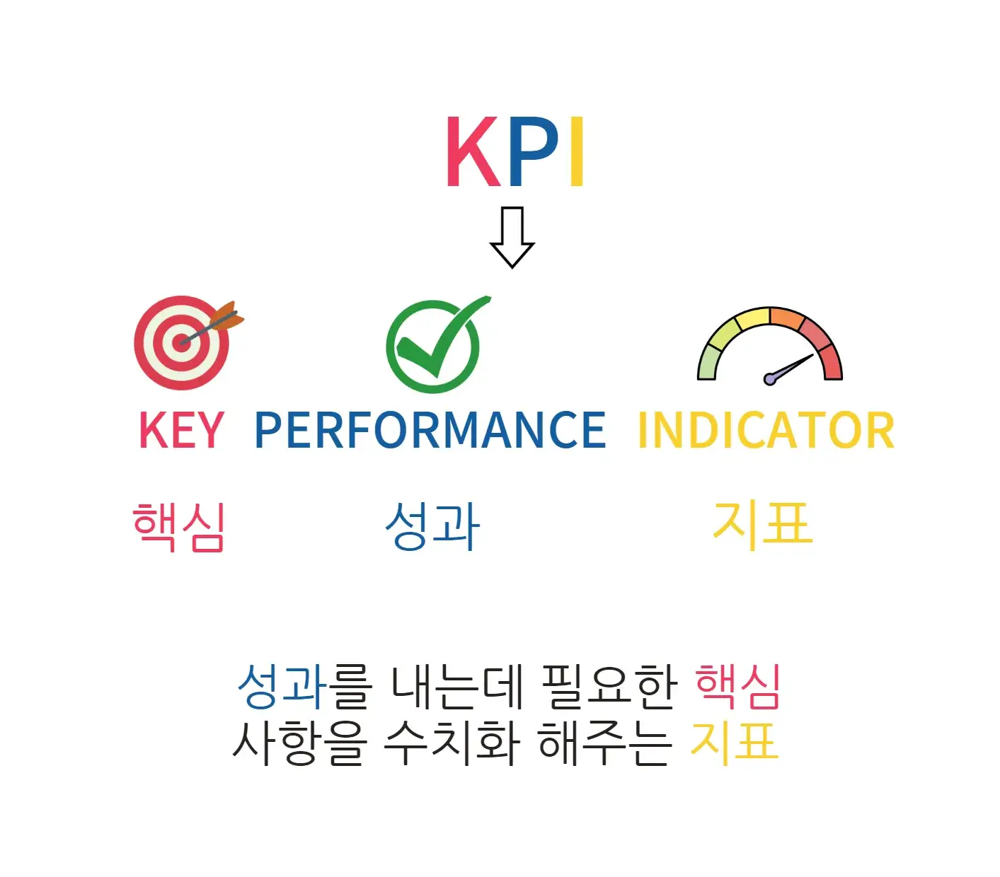
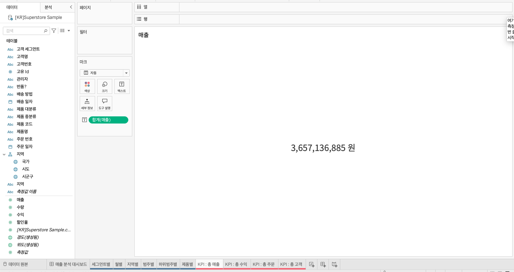
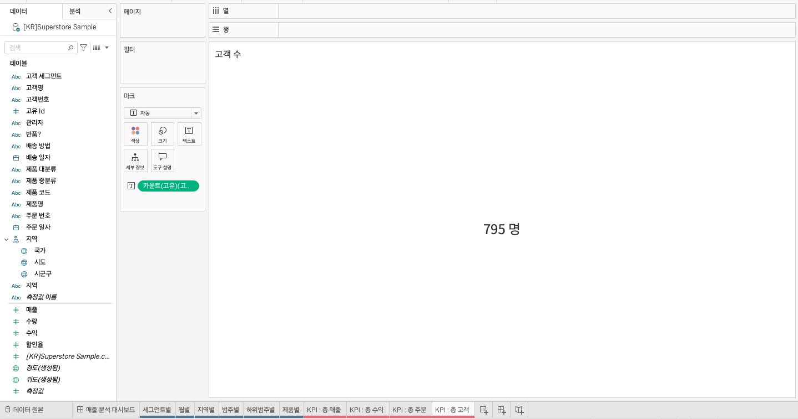

## 학습 목표

- KPI의 개념과 역할을 이해합니다.
- 좋은 KPI가 어떤 조건을 만족해야 하는지 설명할 수 있습니다.
- Tableau에서 핵심 숫자를 KPI 카드 형태로 시각화할 수 있습니다.

## 목차

1. KPI란?
2. KPI 카드 시각화

## 1. KPI란?

KPI(Key Performance Indicator, 핵심성과지표)는 조직, 부서, 개인이 목표를 얼마나 달성하고 있는지를 측정하는 핵심 지표입니다.

중요한 점은 KPI가 단순한 숫자가 아니라는 것입니다.  
좋은 KPI는 `목표와 직접 연결`되어 있어야 하고, `행동을 유도`해야 하며, `시간 안에서 해석 가능`해야 합니다.

### 1-1. KPI의 종류

| 속성 | KPI 항목 | 설명 |
| --- | --- | --- |
| 재무적 지표 | 손익액 | 어느 정도의 성과를 창출하고 있는지에 대한 지표 |
| 재무적 지표 | 손익률 | 한 단위당 어느 정도의 이익이 있는지에 대한 지표 |
| 재무적 지표 | 영업이익률 | 본업에서 얼마만큼의 이익을 내는지에 대한 지표 |
| 재무적 지표 | 총자산이익률 | 총자산 대비 이익 수준을 보여주는 지표 |
| 재무적 지표 | 자기자본이익률 | 자기자본을 투입한 결과 이익이 얼마나 났는지에 대한 지표 |
| 고객 지표 | 고객만족도 | 고객 만족 수준을 나타내는 지표 |
| 고객 지표 | 고객충성도 | 고객의 재구매 가능성을 보여주는 지표 |
| 고객 지표 | 고객불만건수 | 고객 불만 발생 수준을 보여주는 지표 |
| 고객 지표 | 고객유지율 | 기존 고객이 얼마나 유지되는지를 나타내는 지표 |
| 업무 프로세스 지표 | 시장 점유율 | 특정 시장 내 점유 비율 |
| 업무 프로세스 지표 | 프로젝트 진행 건수 | 프로젝트 진행 수준을 보여주는 지표 |
| 업무 프로세스 지표 | 제품 생산량 | 생산 규모를 나타내는 지표 |
| 업무 프로세스 지표 | 제품 불량률 | 생산된 제품 중 불량 비율 |
| 학습·성장 지표 | 신규고객 발굴률 | 신규 고객 확보 수준 |
| 학습·성장 지표 | 직원 이직률 | 직원 이직 수준 |
| 학습·성장 지표 | 직원 만족도 | 직원 만족 수준 |
| 학습·성장 지표 | 직원 교육참여율 | 교육 참여 수준 |
| 사회적 책임 지표 | 사회공헌 | 사회적 가치 창출과 공헌 활동 수준 |
| 사회적 책임 지표 | 친환경활동 | 친환경 경영 노력 수준 |
| 사회적 책임 지표 | 법규준수 | 법적·윤리적 규제 준수 수준 |

### 1-2. KPI 설정 방법: SMART 원칙

- Specific: 무엇을 측정하는지 구체적이어야 합니다.
- Measurable: 수치로 확인 가능해야 합니다.
- Achievable: 현실적으로 달성 가능해야 합니다.
- Relevant: 조직 목표와 직접 연결되어야 합니다.
- Time-bound: 특정 기간 안에 판단 가능해야 합니다.

예:

- 나쁜 KPI: `매출을 늘린다`
- 좋은 KPI: `올해 4분기까지 온라인 매출을 전년 동기 대비 15% 성장시킨다`

## 2. KPI 카드 시각화

KPI 카드는 핵심 숫자를 가장 빠르게 전달하는 시각화입니다.

대시보드에서 사용자가 가장 먼저 봐야 하는 숫자가 있다면, 차트보다 먼저 KPI 카드로 배치하는 것이 일반적입니다.

대표적으로 다음 네 가지 지표를 자주 사용합니다.

- 총 매출
- 총 수익
- 총 주문
- 총 고객

- KPI 총 매출
- 레이블: 합계(매출)

- KPI 총 수익
- 레이블: 합계(수익)

- KPI 총 주문
- 레이블: 카운트(고유)(주문 번호)

`주문 번호`는 주문 건을 식별하는 키이므로 `카운트(고유)`를 사용해야 실제 주문 건수가 계산됩니다.

- KPI 총 고객
- 레이블: 카운트(고유)(고객 번호)

고객 수를 계산할 때는 `고객명`보다 `고객 번호`를 쓰는 것이 안전합니다.  
이름은 동명이인 문제가 있지만, 고객 번호는 식별자로서 중복 없이 고객을 세기 때문입니다.
