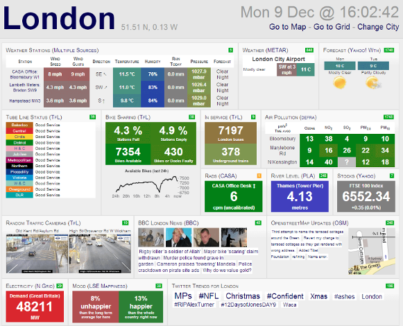
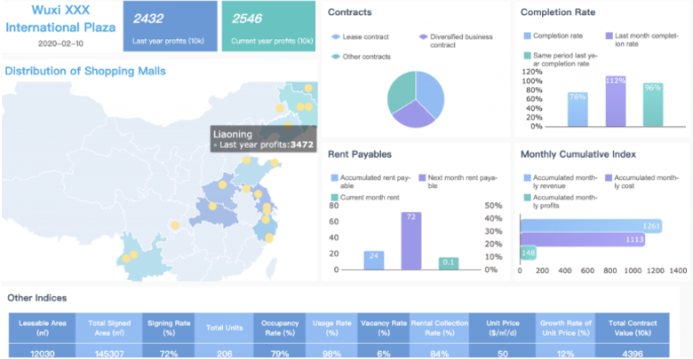
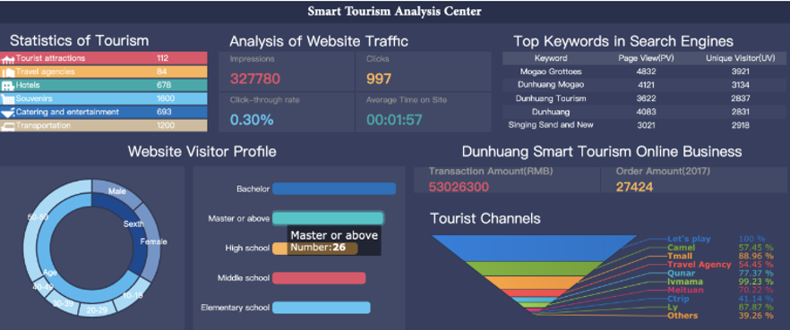
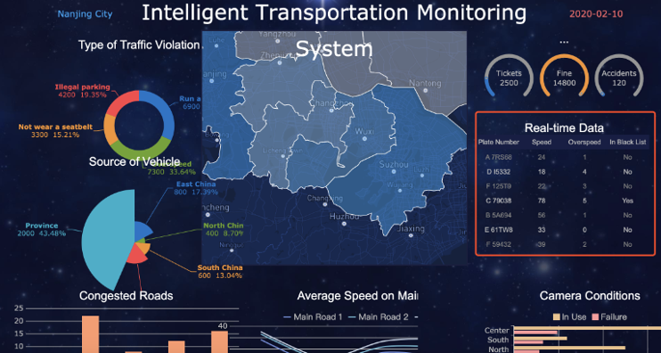

## 학습 목표

- 대시보드의 개념과 목적을 이해할 수 있습니다.
- 대시보드의 사용 목적에 따라 전략 대시보드, 분석 대시보드, 운영 대시보드를 구분할 수 있습니다.
- 산업군별 대시보드 활용 예시를 통해 실무 적용 아이디어를 얻을 수 있습니다.

## 사용 프로그램

`Tableau Desktop`

## 목차

1. 대시보드 소개
2. 대시보드 목적 구분
3. 산업군별 대시보드 활용 예시

## 1. 대시보드 소개

### 1-1. 대시보드란?

대시보드(Dashboard)라는 말은 원래 자동차나 비행기 운전석 앞에 있는 `계기판`에서 출발한 개념입니다.  
운전자는 계기판을 통해 속도, 연료, 엔진 상태 같은 핵심 정보를 한눈에 보고 즉시 판단합니다.

이 개념이 비즈니스 인텔리전스(BI) 분야로 확장되면서, 대시보드는 `여러 데이터와 지표를 하나의 화면에 시각적으로 통합하여 빠른 판단을 돕는 도구`를 의미하게 되었습니다.

즉, 대시보드는 단순히 차트를 여러 개 모아 둔 화면이 아닙니다.  
더 정확히 말하면, `의사결정에 필요한 핵심 정보를 가장 짧은 시간 안에 이해할 수 있도록 구성한 시각화된 작업 화면`입니다.

대시보드의 핵심 역할은 다음과 같습니다.

- 중요한 지표를 빠르게 파악하게 합니다.
- 이상 징후나 변화 신호를 조기에 발견하게 합니다.
- 여러 시트를 오가며 따로 보던 정보를 하나의 맥락으로 묶어 줍니다.
- 보고, 모니터링, 분석, 협업을 더 짧은 시간 안에 수행하게 합니다.

실무에서는 “시각화가 예쁘다”보다 “결정을 빨리 내릴 수 있다”가 더 중요합니다.  
그래서 좋은 대시보드는 정보량이 많은 화면이 아니라, `판단에 필요한 정보만 적절한 순서로 보여주는 화면`에 가깝습니다.

#### 대시보드에 정보가 많다고 좋은 것은 아닙니다

대시보드는 한 화면에 많은 정보를 담을 수 있지만, 많이 담는다고 항상 좋은 것은 아닙니다.

- 차트가 너무 많으면 어디부터 봐야 할지 모르기 쉽습니다.
- KPI, 상세표, 필터, 범례가 한꺼번에 몰리면 시선이 분산됩니다.
- 사용자가 필요한 질문보다 제공자가 보여주고 싶은 정보를 더 많이 넣게 되면 화면이 무거워집니다.

결국 대시보드는 “무엇을 더 넣을까”보다 “무엇을 빼야 할까”가 더 중요한 작업인 경우가 많습니다.

즉, 대시보드 설계는 시각화 기술 문제이기도 하지만, 동시에 `정보 우선순위 설계 문제`이기도 합니다.

### 1-2. 워크시트와 대시보드의 차이

Tableau에서 `워크시트(Worksheet)`는 하나의 차트나 표를 만드는 단위입니다.  
반면 `대시보드(Dashboard)`는 여러 워크시트, 텍스트, 필터, 이미지, 버튼 등을 하나의 화면으로 묶는 단위입니다.

쉽게 비유하면 다음과 같습니다.

- 워크시트: 개별 부품
- 대시보드: 부품을 목적에 맞게 조립한 완성 화면

예를 들어:

- 월별 매출 추이를 보여주는 선그래프 1개
- 지역별 매출을 보여주는 막대 차트 1개
- 올해 누적 매출 KPI 카드 1개

가 각각 워크시트라면, 이 세 가지를 한 화면에 배치해 경영 보고용으로 묶은 것이 대시보드입니다.

즉, 워크시트는 `하나의 질문에 답하는 시각화`, 대시보드는 `여러 질문을 하나의 의사결정 흐름으로 연결한 화면`이라고 이해하면 좋습니다.

### 1-3. 대시보드는 왜 필요한가?

대시보드는 데이터를 보기 위해서가 아니라, `데이터를 보고 행동하기 위해` 필요합니다.

예를 들어 다음 상황을 생각해 볼 수 있습니다.

- 경영진은 목표 대비 실적이 좋은지 나쁜지를 빠르게 알고 싶습니다.
- 마케팅 담당자는 어떤 캠페인이 성과를 만들었는지 분석하고 싶습니다.
- 운영 담당자는 오늘 주문 처리에 병목이 생겼는지 즉시 확인하고 싶습니다.

세 경우 모두 데이터를 본다는 점은 같지만, 필요한 화면 구조는 완전히 다릅니다.

즉, 대시보드의 본질은 차트 제작이 아니라 `사용자의 질문을 화면 구조로 번역하는 일`입니다.

그래서 대시보드를 만들기 전에 가장 먼저 해야 할 일은 차트 선택이 아니라 `문제 정의`입니다.

## 2. 대시보드 목적 구분

### 2-1. 좋은 대시보드는 먼저 “누가 보는가”를 묻습니다

대시보드 설계에서 가장 중요한 질문은 “어떤 차트를 쓸까?”가 아닙니다.  
먼저 확인해야 하는 것은 다음과 같습니다.

- 누가 보는가?
- 언제 보는가?
- 얼마나 자주 보는가?
- 혼자 보는가, 회의에서 함께 보는가?
- 지금 사용자는 빠른 확인이 필요한가, 깊은 분석이 필요한가?
- 어떤 데이터는 보여줄 수 있고, 어떤 데이터는 숨겨야 하는가?

이 질문들에 따라 다음이 달라집니다.

- 어떤 KPI를 가장 위에 둘지
- 상세 데이터까지 열어볼 수 있게 할지
- 필터를 많이 줄지, 최소화할지
- 텍스트 설명을 많이 넣을지
- 경고/이상 징후 중심으로 설계할지

즉, 대시보드는 데이터보다 먼저 `사용 맥락(context)`을 설계해야 합니다.

실무에서 많은 대시보드가 실패하는 이유도 여기에 있습니다.  
차트는 잘 만들었지만, 정작 사용자가 어떤 상황에서 무엇을 판단해야 하는지가 반영되지 않으면 “보기는 좋은데 안 쓰는 대시보드”가 되기 쉽습니다.

### 2-2. 전략 대시보드

전략 대시보드는 경영진이나 리더십이 조직의 장기 목표와 핵심 KPI를 모니터링하기 위해 사용하는 대시보드입니다.

#### 목적

- 장기 목표 달성 현황 파악
- 핵심 KPI 추적
- 조직 성과 점검과 방향성 판단

#### 특징

- 복잡한 상세 데이터보다 핵심 지표 요약이 중심입니다.
- 실시간 변화보다 월간, 분기, 연간 추세가 중요합니다.
- 한눈에 이해할 수 있는 단순한 구조가 유리합니다.
- 조직 전체 성과를 비교하거나 목표 대비 달성 여부를 보는 경우가 많습니다.

#### 사용 예시

- 연간 매출 성장률
- 시장 점유율 변화
- 부서별 목표 달성률
- 전사 KPI 현황

전략 대시보드는 “왜 그랬는가?”를 깊게 파고드는 화면이라기보다, `현재 어디에 와 있는가?`, `목표 대비 괜찮은가?`를 빠르게 확인하는 화면에 가깝습니다.

### 2-3. 분석 대시보드

분석 대시보드는 과거 데이터를 심층적으로 탐색하고 원인을 파악하기 위해 사용하는 대시보드입니다.

#### 목적

- 성과 변화의 원인 분석
- 패턴 탐색
- 세그먼트 비교
- 가설 검증과 인사이트 도출

#### 특징

- 드릴다운, 필터, 하이라이트 같은 탐색 기능이 중요합니다.
- 단순 요약보다 비교와 분해가 핵심입니다.
- 사용자가 스스로 질문을 확장할 수 있어야 합니다.
- 정의된 KPI 외에도 다양한 각도로 데이터를 탐색할 수 있어야 합니다.

#### 사용 예시

- 마케팅 캠페인 효과 분석
- 고객 이탈 패턴 분석
- 지역/채널/상품별 매출 차이 원인 분석
- 구매 전환율 저하 구간 탐색

분석 대시보드는 “무슨 일이 일어났는가?”에서 더 나아가 `왜 일어났는가?`, `어디를 더 파야 하는가?`를 지원해야 합니다.

그래서 전략 대시보드보다 더 많은 상호작용 요소가 들어가는 경우가 많습니다.

### 2-4. 운영 대시보드

운영 대시보드는 실무자나 중간 관리자가 현재 업무 상태를 빠르게 확인하고 즉시 대응하기 위해 사용하는 대시보드입니다.

#### 목적

- 실시간 또는 근실시간 상태 모니터링
- 이상 상황 조기 발견
- 업무 병목 파악과 즉각 대응

#### 특징

- 최신성이 매우 중요합니다.
- 사용자, 팀, 프로세스 단위의 상세 지표가 자주 필요합니다.
- 알림, 임계값, 색상 경고 같은 운영형 요소가 중요합니다.
- 보고용보다 행동 유도성이 더 강합니다.

#### 사용 예시

- 콜센터 실시간 응답률
- 생산 설비 가동 현황
- 당일 주문/출하 처리 현황
- 물류 지연 건수 모니터링

운영 대시보드는 예쁜 화면보다 `문제가 생겼을 때 바로 알아차릴 수 있는가`가 더 중요합니다.  
즉, 운영 대시보드는 설명보다 신속한 대응에 최적화되어야 합니다.

### 2-5. 목적별 대시보드 비교

| 구분 | 전략 대시보드 | 분석 대시보드 | 운영 대시보드 |
| --- | --- | --- | --- |
| 주요 사용자 | 경영진, 리더십 | 분석가, 기획자, 실무 담당자 | 운영 담당자, 중간 관리자 |
| 핵심 질문 | 지금 목표 대비 어떤가? | 왜 이런 결과가 나왔는가? | 지금 당장 문제가 있는가? |
| 데이터 성격 | 요약, 집계, 장기 추세 | 과거 데이터, 비교 분석 | 실시간 또는 근실시간 |
| 화면 구조 | 단순, 핵심 KPI 중심 | 필터/드릴다운 중심 | 경고/상태 모니터링 중심 |
| 대표 목적 | 방향 판단 | 원인 분석 | 즉시 대응 |

실무에서는 이 세 유형이 완전히 분리되지 않을 수도 있습니다.  
하지만 어떤 목적이 더 중요한지에 따라 화면 우선순위는 분명히 달라집니다.

예를 들어 같은 “매출 대시보드”라도:

- 경영진용이면 KPI 카드와 추세 중심
- 분석가용이면 채널/상품/지역 필터와 비교 분석 중심
- 운영팀용이면 오늘 주문 처리 현황과 이상 건 알림 중심

으로 완전히 다른 구조가 됩니다.

## 3. 산업군별 대시보드 활용 예시

대시보드는 산업군이 달라지면 보는 지표도, 중요하게 여기는 시간 단위도 달라집니다.  
즉, 좋은 대시보드는 업종별 언어와 운영 구조를 반영해야 합니다.

### 3-1. 유통·이커머스

주요 관심사는 보통 다음과 같습니다.

- 매출
- 주문 수
- 객단가
- 전환율
- 반품률
- 재고 회전

활용 예시는 다음과 같습니다.

- 오늘 주문 추이와 시간대별 매출 모니터링
- 카테고리별 매출 비중 분석
- 광고 유입 대비 구매 전환율 분석
- 반품 증가 상품 탐지

이커머스 대시보드는 `속도`와 `세분화`가 중요합니다.  
채널, 상품, 캠페인, 기기, 지역별로 바로 쪼개 볼 수 있어야 실제 운영 개선으로 연결되기 쉽습니다.

### 3-2. 제조·생산

제조 현장에서는 다음 지표가 자주 중요합니다.

- 설비 가동률
- 불량률
- 생산량
- 공정별 병목
- 납기 준수율

활용 예시는 다음과 같습니다.

- 라인별 생산 실적 비교
- 시간대별 불량률 모니터링
- 설비 다운타임 추적
- 공정별 재공품(WIP) 현황 확인

제조 대시보드는 단순 성과 요약보다 `문제가 어디서 발생하는지`를 빠르게 찾는 구조가 중요합니다.

### 3-3. 마케팅·CRM

마케팅 영역에서는 고객 획득부터 전환, 유지까지의 흐름을 많이 봅니다.

- 유입 수
- 광고비
- CAC(Customer Acquisition Cost)
- ROAS(Return On Ad Spend)
- 전환율
- 재구매율

활용 예시는 다음과 같습니다.

- 캠페인별 성과 비교
- 퍼널 단계별 이탈 분석
- 세그먼트별 구매 행동 비교
- 채널별 고객 생애가치(LTV) 추적

이 영역의 대시보드는 단순 집계보다 `퍼널 구조`와 `세그먼트 비교`가 핵심이 되는 경우가 많습니다.

### 3-4. 영업·세일즈

영업 조직은 다음과 같은 질문을 자주 던집니다.

- 목표 대비 실적은 어떤가?
- 파이프라인은 충분한가?
- 어떤 영업사원이 어떤 단계에서 막히는가?
- 지역별, 제품별 성과 차이는 무엇인가?

활용 예시는 다음과 같습니다.

- 파이프라인 단계별 딜 수량과 금액
- 담당자별 목표 달성률
- 리드에서 계약까지의 전환 흐름
- 지역별 매출 편차 분석

영업 대시보드는 결과 KPI만 보여주면 부족한 경우가 많습니다.  
`현재 실적`과 `앞으로 닫힐 기회`를 함께 보여줘야 실제 액션으로 이어집니다.

### 3-5. 고객 지원·운영

고객 지원이나 운영 부서는 서비스 품질과 응답 속도가 중요합니다.

- 응답 시간
- 해결 시간
- 미처리 건수
- 고객 만족도
- SLA 준수율

활용 예시는 다음과 같습니다.

- 채널별 문의 유입량 추적
- 상담사별 처리 속도 비교
- 유형별 이슈 집중도 분석
- SLA 초과 건수 모니터링

이 영역의 대시보드는 `실시간 운영 상태`와 `품질 개선 인사이트`를 동시에 담아야 할 때가 많습니다.

## 정리

대시보드는 여러 차트를 한 화면에 배치한 결과물이 아니라, `의사결정을 돕기 위해 정보를 구조화한 화면`입니다.

핵심은 다음과 같습니다.

- 먼저 차트가 아니라 사용자와 목적을 정의해야 합니다.
- 전략, 분석, 운영 대시보드는 질문 자체가 다르므로 구조도 달라져야 합니다.
- 산업군이 달라지면 중요 지표와 시간 단위, 화면 우선순위도 달라집니다.

결국 좋은 대시보드는 예쁜 대시보드가 아니라, `누가 언제 무엇을 판단해야 하는지에 정확히 맞는 대시보드`입니다.
