## 학습 목표

- 데이터 그룹과 집합을 생성하여 여러 차원을 묶어 관리할 수 있습니다.
- 구간 차원의 개념을 이해하고, 데이터를 범위별로 나누어 시각화할 수 있습니다.
- 여러 측정값을 동시에 활용하여 시각화를 구성할 수 있습니다.

## 목차

1. 데이터 그룹과 집합
2. 집합
3. 구간 차원과 히스토그램
4. 측정값과 측정값 이름

## 1. 데이터 그룹과 집합

### 1-1. 데이터 그룹

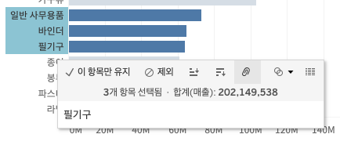

그룹(Group)은 원래 차원의 멤버를 사용자가 지정한 기준으로 묶어 새로운 범주를 만드는 기능입니다.

- 원래 차원의 멤버(예: 국가, 제품명, 고객명 등)를 사용자가 원하는 기준으로 묶을 수 있습니다.
- 그룹을 만들면 원본 데이터가 바뀌는 것이 아니라, 새로운 계산된 차원 필드가 생성됩니다.
- 특정 항목들을 실무 기준에 맞게 다시 묶어 보고 싶을 때 유용합니다.

즉, 그룹은 데이터 원본을 수정하지 않고도 분석용 분류 체계를 새로 만드는 기능이라고 이해하시면 됩니다.

### 1-2. 권역 그룹 만들기

실무에서는 데이터가 시도 단위로 정리되어 있어도, 보고는 권역 단위로 요구되는 경우가 많습니다.  
예를 들어 상사가 "권역별 매출을 보고 싶다"고 요청했는데 데이터가 시도별로만 정리되어 있다면, 이때 그룹 기능이 유용합니다.

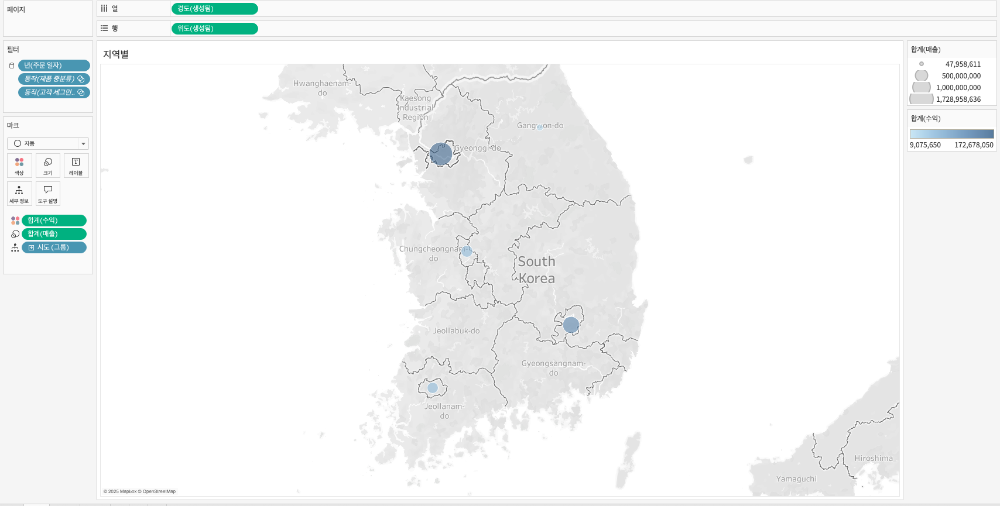

이번 실습에서는 다음과 같이 `권역` 그룹을 생성합니다.

- 강원: 강원도
- 경기: 경기도, 서울특별시, 인천광역시
- 경상: 경상남도, 경상북도, 대구광역시, 부산광역시, 울산광역시
- 전라: 광주광역시, 전라남도, 전라북도
- 충청: 대전광역시, 세종특별자치시, 충청남도, 충청북도
- 제주: 제주특별자치도

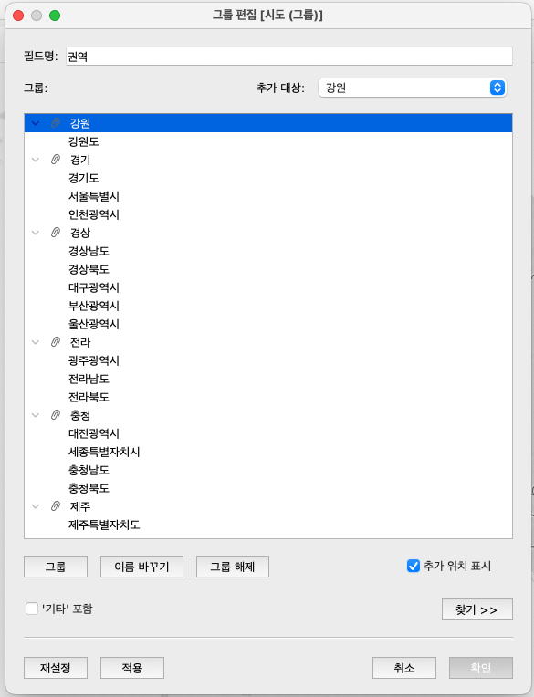

이후 기존 `시도` 필드 대신 새로 만든 `권역` 그룹으로 시각화를 바꾸면, 같은 데이터를 더 상위 수준에서 비교할 수 있습니다.


#### 알 수 없는 항목이 보일 때

권역 그룹을 세부 정보에 넣었을 때 화면 하단에 `알 수 없는 항목`이 표시될 수 있습니다.

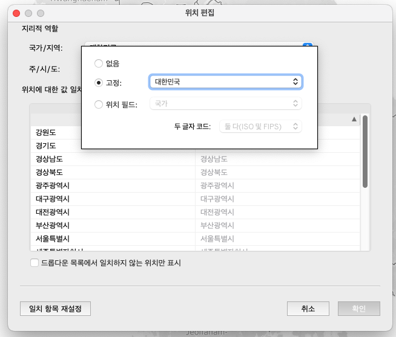

이 경우 `위치 편집`에서 국가/지역을 `대한민국`으로 맞추면 해결되는 경우가 많습니다.

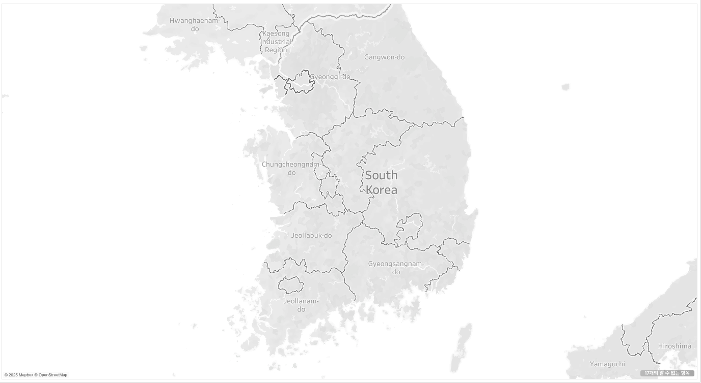

이 문제는 Tableau가 지리적 역할을 해석하는 과정에서 지역 매핑 기준이 맞지 않을 때 자주 발생합니다.  
실무에서도 지도 시각화가 어긋날 때는 계산식보다 먼저 지리적 역할과 국가 설정을 점검하는 것이 좋습니다.

#### 계산식으로 그룹 구현하기

그룹은 메뉴 기능으로 만들 수도 있지만, 계산식을 통해 직접 구현할 수도 있습니다.

예: `C_권역`

```tableau
IF [시도] IN ('경기도','서울특별시','인천광역시') THEN '경기'
ELSEIF [시도] IN ('강원도') THEN '강원'
ELSEIF [시도] IN ('경상남도','경상북도','대구광역시','부산광역시','울산광역시') THEN '경상'
ELSEIF [시도] IN ('광주광역시','전라남도','전라북도') THEN '전라'
ELSEIF [시도] IN ('제주특별자치도') THEN '제주'
ELSEIF [시도] IN ('대전광역시','세종특별자치시','충청남도','충청북도') THEN '충청'
END
```

실무에서는 메뉴 기반 그룹보다 계산식 기반 그룹이 더 관리하기 쉬운 경우도 많습니다.

- 분류 기준을 문서처럼 남길 수 있습니다.
- 데이터 원본이 바뀌거나 멤버가 추가될 때 수정 포인트가 명확합니다.
- 다른 계산식이나 파라미터와 조합하기 좋습니다.

즉, 일회성 분석이면 그룹 기능이 빠르고, 반복 활용이나 유지보수가 중요하면 계산식 기반 분류가 더 안정적입니다.

## 2. 집합

### 2-1. 집합

집합(Set)은 차원의 멤버를 조건에 따라 포함(True) 또는 제외(False)로 나누는 기능입니다.

- 집합은 하나의 Boolean 차원처럼 동작합니다.
- 필터, 색상 구분, 강조, 드릴다운 제어에 활용할 수 있습니다.
- 수동 선택뿐 아니라 조건, 상위 N, 계산식으로도 만들 수 있습니다.


#### 정적 집합

정적 집합은 사용자가 멤버를 직접 선택해 만드는 방식입니다.

- 데이터 패널에서 차원 필드를 우클릭합니다.
- `집합 만들기`를 선택합니다.
- 포함할 멤버를 직접 고릅니다.

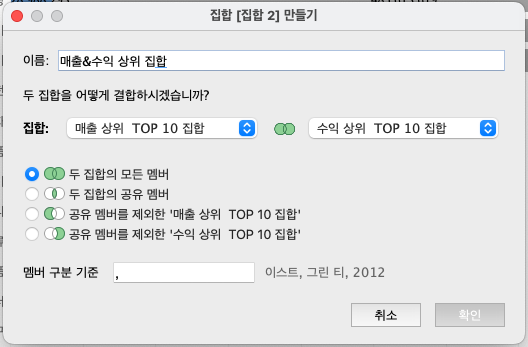

정적 집합은 기준이 자주 바뀌지 않는 경우에 적합합니다.  
예를 들어 "핵심 고객군", "주요 제품군", "관리 대상 지역"처럼 사람이 명시적으로 정한 집합을 만들 때 유용합니다.

#### 동적 집합

동적 집합은 필드 값이나 조건을 기준으로 자동으로 구성됩니다.

- 필드 값 기준으로 조건을 설정할 수 있습니다.
- 예를 들어 매출 기준 상위 10개 제품을 자동으로 포함시킬 수 있습니다.

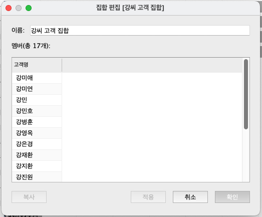

동적 집합은 데이터가 갱신될 때 결과도 함께 바뀐다는 점에서 실무 활용도가 높습니다.  
다만 "어제의 상위 10개"와 "오늘의 상위 10개"가 달라질 수 있기 때문에, 보고 기준 시점을 명확히 관리해야 합니다.

#### 결합된 집합

두 개 이상의 집합은 결합해서 사용할 수도 있습니다.

- 교집합
- 합집합
- 차집합

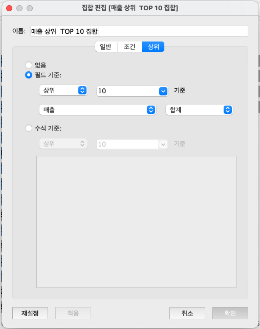

이 기능은 예를 들어 "상위 매출 제품이면서 동시에 손실이 나는 제품"처럼 더 정교한 분석 조건을 만들 때 유용합니다.

### 2-2. 집합을 활용한 드릴다운 분석

집합은 단순 필터링을 넘어 드릴다운 구조를 만드는 데도 활용할 수 있습니다.


- 열: 합계(매출)
- 행: `제품 대분류`, `C_제품 대분류 집합 드릴다운`
- 색상: 합계(수익)
- 레이블: 합계(매출)

드릴다운용 계산식 예시는 다음과 같습니다.

```tableau
IF [제품 대분류 집합] THEN [제품 중분류]
ELSE '>'
END
```

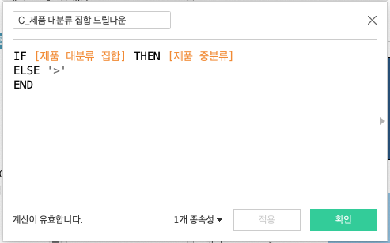

이 구조의 핵심은 "집합에 포함된 항목만 하위 수준으로 펼친다"는 점입니다.  
즉, 모든 항목을 무조건 세분화하는 것이 아니라, 사용자가 관심 있는 범주만 더 깊게 보게 만드는 방식입니다.

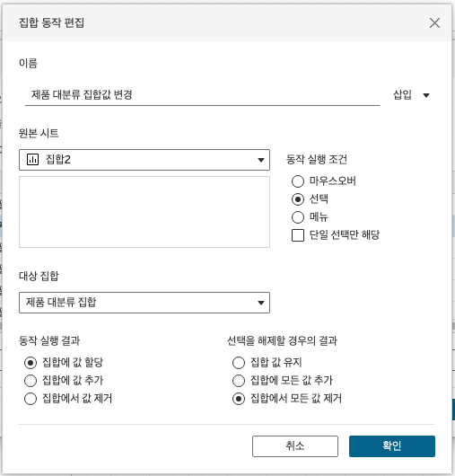

실무에서는 이 방식이 화면 복잡도를 줄이는 데 매우 유용합니다.  
처음부터 모든 하위 범주를 보여주면 대시보드가 과밀해지기 쉽기 때문입니다.

## 3. 구간 차원과 히스토그램

### 3-1. 구간 차원의 개념

구간 차원(Bin)은 연속형 수치 데이터를 일정 간격으로 나누어 분포를 파악하기 위한 기능입니다.

- 가격, 연령, 점수, 매출처럼 연속적인 값을 일정 간격으로 자를 수 있습니다.
- 각 값은 자신이 속한 구간으로 배정됩니다.
- 이 구간은 새로운 차원처럼 동작하며, 분포 분석에 활용됩니다.

활용 예시는 다음과 같습니다.

- 연령 데이터를 10세 단위 구간으로 나누기
- 매출 금액을 5만 원 단위로 나누어 주문 건수 비교하기
- 점수를 20점 단위로 나누어 성취도 분포 보기

#### 구간 차원 크기 제안

Tableau는 데이터 분포를 기반으로 너무 세밀하거나 너무 거친 구간이 되지 않도록 적절한 구간 크기를 제안하기도 합니다.

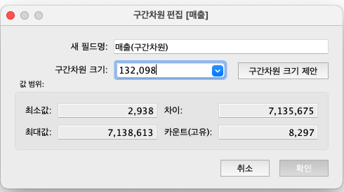

실무에서 구간 차원은 해석의 단위이기도 합니다.  
구간이 너무 넓으면 분포의 차이가 사라지고, 너무 좁으면 잡음이 많아져 패턴이 잘 보이지 않습니다.  
즉, bin size는 단순 옵션이 아니라 해석 품질을 결정하는 중요한 설정입니다.

### 3-2. 히스토그램

히스토그램은 연속형 수치 데이터의 분포를 확인할 때 사용하는 대표적인 차트입니다.

- X축에는 구간(Bin)이 들어갑니다.
- Y축에는 각 구간에 속하는 데이터 개수 또는 빈도가 들어갑니다.

즉, "값이 얼마나 큰가"보다 "값이 어느 구간에 얼마나 많이 몰려 있는가"를 보는 차트입니다.

예를 들어 주문 건별 매출이 어떤 구간에 가장 많이 분포하는지를 확인할 수 있습니다.


- 열: `매출(구간 차원)`
- 행: `카운트(매출)`

#### 막대 차트와 히스토그램의 차이

| 구분 | 막대 차트 | 히스토그램 |
| --- | --- | --- |
| 데이터 타입 | 범주형 | 연속형 |
| 보여주는 것 | 범주별 크기 비교 | 값의 분포와 빈도 |
| X축 | 범주 | 구간(Bin) |
| 예시 | 지역별 매출 | 주문별 매출 분포 |

실무에서 이 둘을 혼동하면 잘못된 해석으로 이어질 수 있습니다.  
예를 들어 "고객 세그먼트"는 막대 차트가 맞지만, "주문 금액"은 연속형 값이므로 히스토그램이 더 적절합니다.

### 3-3. 구간 차원을 활용하여 히스토그램 만들기

데이터 패널에서 연속형 필드를 우클릭한 뒤 `구간 만들기(Create Bins)`를 선택합니다.

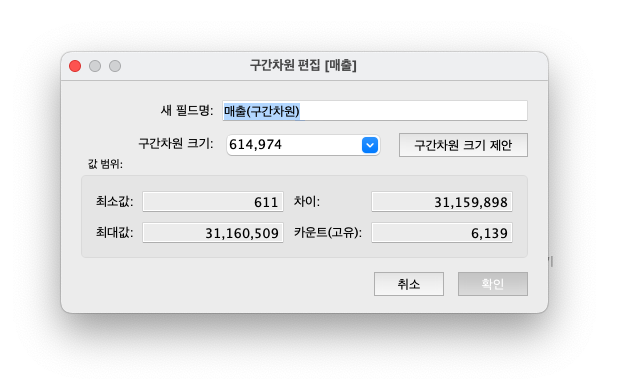

이후 원하는 `구간 크기(Bin Size)`를 입력합니다.


그러면 새 구간 필드가 데이터 패널에 생성되고, 이를 활용해 히스토그램을 만들 수 있습니다.

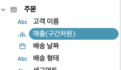

마지막으로 다음과 같이 시각화하면 됩니다.

- 열: `매출(구간 차원)`
- 행: `카운트(매출)`


## 4. 측정값과 측정값 이름

### 4-1. 측정값 이름(Measure Names)과 측정값(Measure Values)


#### 측정값 이름(Measure Names)

측정값 이름은 데이터 소스의 모든 측정값 필드 이름을 모아둔 가상 차원입니다.

- 어떤 측정값을 사용할지를 식별하는 라벨 역할을 합니다.
- 자동 생성되는 필드이며 삭제할 수 없습니다.
- 필터로 사용하면 특정 측정값만 선택적으로 표시할 수 있습니다.

#### 측정값(Measure Values)

측정값은 선택된 여러 측정값의 실제 값을 담는 가상 측정값입니다.

- 측정값 이름과 함께 사용됩니다.
- 여러 지표를 하나의 뷰에서 동시에 보여줄 때 유용합니다.
- 예를 들어 매출, 수익, 주문 수, 고객 수를 한 화면에 나란히 비교할 수 있습니다.

이 둘은 항상 함께 이해하셔야 합니다.

- `Measure Names`는 "무슨 지표인가"
- `Measure Values`는 "그 지표의 실제 값은 얼마인가"

즉, 이름과 값을 분리해서 다루기 때문에 다중 지표 비교가 가능해집니다.

### 4-2. 측정값과 측정값 이름 활용 예시

여러 KPI를 한 화면에 나란히 보여주고 싶을 때 `측정값 이름`과 `측정값` 조합이 매우 유용합니다.

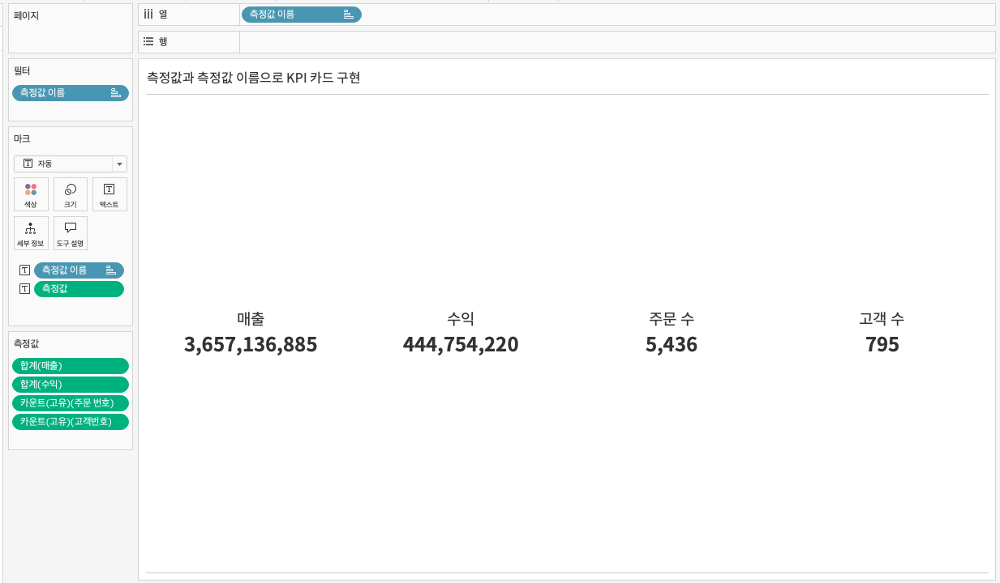

- 열: `측정값 이름`
- 텍스트: `측정값 이름`, `측정값`
- 측정값 마크: `합계(매출)`, `합계(수익)`, `카운트 고유(주문 번호)`, `카운트 고유(고객 번호)`

이 방식은 KPI 카드, 요약 테이블, 비교형 대시보드의 기본 재료가 됩니다.  
실무적으로는 각각의 지표를 따로 만들기보다, `Measure Names/Measure Values` 구조를 잘 활용하면 훨씬 효율적으로 여러 수치를 관리할 수 있습니다.
