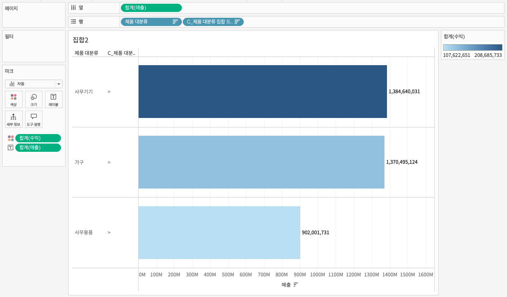

## 학습 목표

- 집합의 개념과 역할을 이해합니다.
- 정적 집합, 동적 집합, 결합된 집합의 차이를 설명할 수 있습니다.
- 집합을 활용해 드릴다운 분석 구조를 만들 수 있습니다.

## 목차

1. 집합

## 1. 집합

### 1-1. 집합

집합(Set)은 차원의 멤버를 조건에 따라 포함(True) 또는 제외(False)로 나누는 기능입니다.

- 집합은 하나의 Boolean 차원처럼 동작합니다.
- 필터, 색상 구분, 강조, 드릴다운 제어에 활용할 수 있습니다.
- 수동 선택뿐 아니라 조건, 상위 N, 계산식으로도 만들 수 있습니다.


#### 정적 집합

정적 집합은 사용자가 멤버를 직접 선택해 만드는 방식입니다.

- 데이터 패널에서 차원 필드를 우클릭합니다.
- `집합 만들기`를 선택합니다.
- 포함할 멤버를 직접 고릅니다.


정적 집합은 기준이 자주 바뀌지 않는 경우에 적합합니다.  
예를 들어 "핵심 고객군", "주요 제품군", "관리 대상 지역"처럼 사람이 명시적으로 정한 집합을 만들 때 유용합니다.

#### 동적 집합

동적 집합은 필드 값이나 조건을 기준으로 자동으로 구성됩니다.

- 필드 값 기준으로 조건을 설정할 수 있습니다.
- 예를 들어 매출 기준 상위 10개 제품을 자동으로 포함시킬 수 있습니다.


동적 집합은 데이터가 갱신될 때 결과도 함께 바뀐다는 점에서 실무 활용도가 높습니다.  
다만 "어제의 상위 10개"와 "오늘의 상위 10개"가 달라질 수 있기 때문에, 보고 기준 시점을 명확히 관리해야 합니다.

#### 결합된 집합

두 개 이상의 집합은 결합해서 사용할 수도 있습니다.

- 교집합
- 합집합
- 차집합


이 기능은 예를 들어 "상위 매출 제품이면서 동시에 손실이 나는 제품"처럼 더 정교한 분석 조건을 만들 때 유용합니다.

### 1-2. 집합을 활용한 드릴다운 분석

집합은 단순 필터링을 넘어 드릴다운 구조를 만드는 데도 활용할 수 있습니다.



- 열: 합계(매출)
- 행: `제품 대분류`, `C_제품 대분류 집합 드릴다운`
- 색상: 합계(수익)
- 레이블: 합계(매출)

드릴다운용 계산식 예시는 다음과 같습니다.

```tableau
IF [제품 대분류 집합] THEN [제품 중분류]
ELSE '>'
END
```


이 구조의 핵심은 "집합에 포함된 항목만 하위 수준으로 펼친다"는 점입니다.  
즉, 모든 항목을 무조건 세분화하는 것이 아니라, 사용자가 관심 있는 범주만 더 깊게 보게 만드는 방식입니다.


실무에서는 이 방식이 화면 복잡도를 줄이는 데 매우 유용합니다.  
처음부터 모든 하위 범주를 보여주면 대시보드가 과밀해지기 쉽기 때문입니다.
