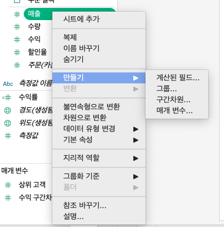
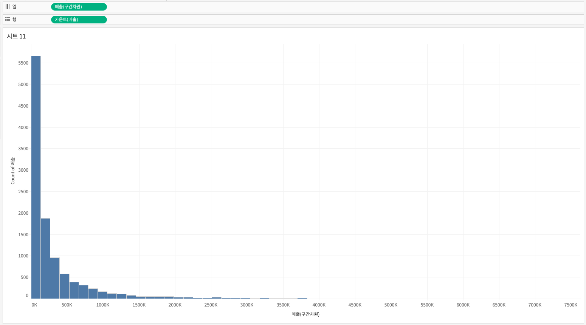

## 학습 목표

- 구간 차원의 개념과 목적을 이해합니다.
- 히스토그램이 막대 차트와 어떻게 다른지 설명할 수 있습니다.
- 구간 차원을 활용해 히스토그램을 만들 수 있습니다.

## 목차

1. 구간 차원
2. 히스토그램
3. 구간 차원을 활용하여 히스토그램 만들기

## 1. 구간 차원

### 1-1. 구간 차원의 개념

구간 차원(Bin)은 연속형 수치 데이터를 일정 간격으로 나누어 분포를 파악하기 위한 기능입니다.

- 가격, 연령, 점수, 매출처럼 연속적인 값을 일정 간격으로 자를 수 있습니다.
- 각 값은 자신이 속한 구간으로 배정됩니다.
- 이 구간은 새로운 차원처럼 동작하며, 분포 분석에 활용됩니다.

활용 예시는 다음과 같습니다.

- 연령 데이터를 10세 단위 구간으로 나누기
- 매출 금액을 5만 원 단위로 나누어 주문 건수 비교하기
- 점수를 20점 단위로 나누어 성취도 분포 보기

#### 구간 차원 크기 제안

Tableau는 데이터 분포를 기반으로 너무 세밀하거나 너무 거친 구간이 되지 않도록 적절한 구간 크기를 제안하기도 합니다.

실무에서 구간 차원은 해석의 단위이기도 합니다.  
구간이 너무 넓으면 분포의 차이가 사라지고, 너무 좁으면 잡음이 많아져 패턴이 잘 보이지 않습니다.  
즉, bin size는 단순 옵션이 아니라 해석 품질을 결정하는 중요한 설정입니다.

## 2. 히스토그램

히스토그램은 연속형 수치 데이터의 분포를 확인할 때 사용하는 대표적인 차트입니다.

- X축에는 구간(Bin)이 들어갑니다.
- Y축에는 각 구간에 속하는 데이터 개수 또는 빈도가 들어갑니다.

즉, "값이 얼마나 큰가"보다 "값이 어느 구간에 얼마나 많이 몰려 있는가"를 보는 차트입니다.

예를 들어 주문 건별 매출이 어떤 구간에 가장 많이 분포하는지를 확인할 수 있습니다.

- 열: `매출(구간 차원)`
- 행: `카운트(매출)`

#### 막대 차트와 히스토그램의 차이

| 구분 | 막대 차트 | 히스토그램 |
| --- | --- | --- |
| 데이터 타입 | 범주형 | 연속형 |
| 보여주는 것 | 범주별 크기 비교 | 값의 분포와 빈도 |
| X축 | 범주 | 구간(Bin) |
| 예시 | 지역별 매출 | 주문별 매출 분포 |

실무에서 이 둘을 혼동하면 잘못된 해석으로 이어질 수 있습니다.  
예를 들어 "고객 세그먼트"는 막대 차트가 맞지만, "주문 금액"은 연속형 값이므로 히스토그램이 더 적절합니다.

## 3. 구간 차원을 활용하여 히스토그램 만들기

데이터 패널에서 연속형 필드를 우클릭한 뒤 `구간 만들기(Create Bins)`를 선택합니다.

이후 원하는 `구간 크기(Bin Size)`를 입력합니다.

그러면 새 구간 필드가 데이터 패널에 생성되고, 이를 활용해 히스토그램을 만들 수 있습니다.

마지막으로 다음과 같이 시각화하면 됩니다.

- 열: `매출(구간 차원)`
- 행: `카운트(매출)`

