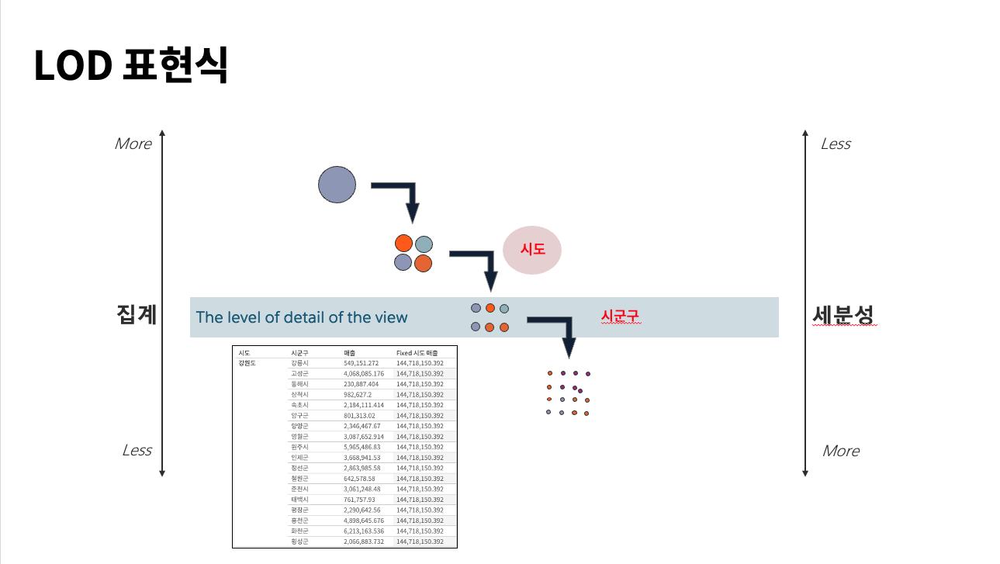
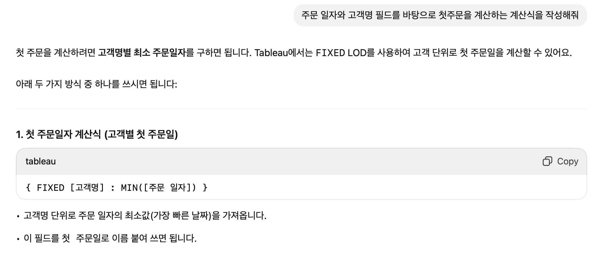

## 학습 목표

- Tableau에서 제공하는 주요 함수(문자열, 숫자열, Rank, 날짜 함수)의 특징과 사용법을 익힙니다.
- 다양한 분석 시나리오에 맞게 적절한 함수를 선택하고 적용할 수 있습니다.
- LOD(Level of Detail) 계산식의 개념을 이해하고 집계 수준을 제어하는 방법을 학습합니다.

## 목차

1. 계산식 주요 함수
2. LOD 표현식이란?

## 1. 계산식 주요 함수

Tableau 함수는 단순히 수식을 완성하는 도구가 아니라, 데이터를 어떤 관점으로 해석할지 결정하는 수단입니다.  
같은 데이터라도 문자열 함수를 쓰느냐, 날짜 함수를 쓰느냐, 순위 함수를 쓰느냐에 따라 완전히 다른 분석 질문에 답하게 됩니다.

즉, 함수 학습의 핵심은 "문법 암기"보다 "어떤 상황에서 어떤 함수를 꺼내야 하는가"를 익히는 데 있습니다.

### 1-1. 문자열 함수

문자열 함수는 텍스트를 결합하거나, 일부를 추출하거나, 검색하거나, 형식을 바꿀 때 사용합니다.  
실무에서는 고객명 정리, 코드 분해, 익명화, 제품명 탐색 같은 작업에서 자주 쓰입니다.

#### 지역 결합

```tableau
// C_지역 결합

[시도] + " " + [시군구]
// 예: 서울특별시 강남구
```

분리된 지역 컬럼을 하나의 라벨로 합치고 싶을 때 유용합니다.  
지도 툴팁, 고객 주소 요약, 레이블 표시에서 자주 사용합니다.

#### 고객 이름 길이 확인

```tableau
// C_고객 이름 길이 확인

LEN([고객명])
// 예: 2, 3, 4
```

이 함수는 문자열 길이를 반환합니다.  
실무에서는 이상치 탐지에 유용합니다. 예를 들어 이름 길이가 지나치게 짧거나 긴 경우 데이터 품질 이슈를 의심할 수 있습니다.

#### 고객번호 추출

```tableau
// C_고객번호 추출

LEFT([고객번호], 2)
RIGHT([고객번호], 5)
```

고객 코드의 앞자리, 뒷자리를 잘라 분류 기준으로 활용할 수 있습니다.  
코드 체계가 접두어(prefix)나 접미어(suffix)에 의미를 담고 있을 때 특히 유용합니다.

#### 중간 부분 추출

```tableau
// C_중간 부분 추출

MID([고객번호], 2, 3)
```

문자열 중간 일부만 떼어내는 함수입니다.  
코드 안에 부서, 채널, 구역 정보가 포함된 경우 이 함수로 별도 필드를 만들 수 있습니다.

#### 고객 익명화

```tableau
// C_고객 익명화

LEFT([고객명], 1) + "**"
```

개인정보 보호가 필요한 보고서에서 자주 쓰입니다.  
실무에서는 이름, 이메일, 전화번호 일부 마스킹에도 비슷한 패턴을 응용합니다.

#### 대문자 전환, 소문자 전환

```tableau
// C_대문자 전환
UPPER([제품명])

// C_소문자 전환
LOWER([제품명])
```

텍스트 비교를 표준화할 때 중요합니다.  
예를 들어 `Samsung`, `SAMSUNG`, `samsung`을 동일하게 다루려면 대소문자 정규화가 먼저 필요합니다.

#### 특정 문자열 찾기

```tableau
// C_특정 문자열 찾기
CONTAINS([제품명], "Samsung")

// True or False
```

텍스트 안에 특정 키워드가 포함되어 있는지 검사합니다.  
브랜드별 제품 필터링, 캠페인명 포함 여부 확인, 태그 탐색에 자주 씁니다.

#### 시작하는 글자 찾기

```tableau
// 시작하는 글자 찾기
STARTSWITH([제품 코드], "OFF")

// True or False
```

문자열이 특정 접두어로 시작하는지 확인합니다.  
제품 코드 체계가 카테고리 기반일 때 분류 계산식으로 자주 사용됩니다.

#### 구분 기호로 문자열 잘라오기

```tableau
// C_구분 기호로 문자열 잘라오기
SPLIT([제품 코드], "-", 1)
```

구분 기호 기준으로 토큰을 분리합니다.  
예를 들어 `OFF-AP-10002882` 같은 코드에서 첫 번째 조각만 추출해 대분류 코드로 활용할 수 있습니다.

#### 문자열 함수가 실무에서 중요한 이유

- 코드형 텍스트를 분석 가능한 범주로 변환할 수 있습니다.
- 개인정보나 민감정보를 가공해 공유 가능한 뷰를 만들 수 있습니다.
- 데이터 정제 없이도 Tableau 내부에서 1차 전처리를 수행할 수 있습니다.

즉, 문자열 함수는 "텍스트를 보기 좋게 만드는 기능"이 아니라, 비정형에 가까운 값을 분석용 구조로 바꾸는 도구입니다.

### 1-2. 숫자 함수

숫자 함수는 수치값을 정규화하거나, 반올림하거나, 비교하기 쉬운 형태로 바꿀 때 사용합니다.

#### 절대값

```tableau
// 절대값

ABS(-7)
// 7
```

손실 규모처럼 부호보다 크기가 중요한 경우에 유용합니다.  
예를 들어 `-50000원 손실`과 `50000원 차이`를 같은 크기 기준으로 비교할 수 있습니다.

#### 올림

```tableau
// 올림

CEILING(3.14)
// 4
```

최소 단위 이상으로 반영해야 할 때 사용합니다.  
좌석 수, 박스 수, 인원 수처럼 소수점이 허용되지 않는 경우 자주 씁니다.

#### 버림

```tableau
// 버림

FLOOR(3.14)
// 3
```

보수적으로 하한값을 잡아야 할 때 사용합니다.  
예를 들어 구간화 전에 수치를 정수 단위로 잘라내고 싶을 때 유용합니다.

#### 반올림

```tableau
// 반올림

ROUND(3.14)
// 3
```

표시값을 정리할 때 가장 많이 쓰입니다.  
다만 실무에서는 "표시용 반올림"과 "계산용 반올림"을 구분해야 합니다. 너무 이른 단계에서 반올림하면 집계 오차가 누적될 수 있기 때문입니다.

즉, 숫자 함수는 보기 좋은 숫자를 만드는 동시에, 해석 기준을 맞추는 역할도 합니다.

### 1-3. 날짜 함수

날짜 함수는 시계열 분석에서 핵심입니다.  
전년비, 전월비, 평균 배송일, 고객 첫 구매일, 재구매 주기 같은 대부분의 실무 분석은 날짜 함수 위에서 돌아갑니다.

#### 주문일자 1년 더하기

```tableau
// C_주문일자 1년 더하기

DATEADD('year', 1, [주문 일자])
DATEADD('hour', 9, [주문 일자])
```

기준 날짜에서 일정 기간을 더하거나 빼는 함수입니다.  
실무에서는 비교 시점을 만들거나, 타임존 보정, 기준 기간 생성에 자주 사용합니다.

#### 주문일, 배송일 차이 계산

```tableau
// C_주문일, 배송일 차이 계산

DATEDIFF('day', [주문 일자], [배송 일자])
```

두 날짜 사이의 차이를 계산합니다.  
배송 리드타임, 가입 후 구매까지 걸린 시간, 문의 후 처리 시간 분석에 자주 쓰입니다.

#### 날짜 함수가 실무에서 중요한 이유

- 시간 간격을 기준으로 성과를 비교할 수 있습니다.
- 운영 효율성과 리드타임을 수치화할 수 있습니다.
- 특정 시점 기준의 파생 변수를 쉽게 만들 수 있습니다.

즉, 날짜 함수는 단순 날짜 계산이 아니라 "분석의 시간 축"을 만드는 역할을 합니다.

### 1-4. 순위 함수

순위 함수는 값의 상대적 위치를 계산할 때 사용합니다.  
Top N, 하위 성과군, 백분위 구간, 우선순위 분석에서 자주 사용됩니다.

| 함수 | 설명 |
| --- | --- |
| `RANK()` | 동점이 있으면 같은 순위를 부여하고, 다음 순위는 건너뜁니다. |
| `RANK_DENSE()` | 동점이 있어도 순위를 건너뛰지 않고 연속적으로 부여합니다. |
| `RANK_MODIFIED()` | 동점 집합의 마지막 순위를 공유합니다. |
| `RANK_PERCENTILE()` | 0~1 범위의 백분위 순위를 반환합니다. |
| `INDEX()` | 현재 파티션 안에서 행의 순서를 반환합니다. |

#### 실무에서 어떤 함수를 써야 하는가

- 순위 숫자 자체가 중요하면 `RANK()` 또는 `RANK_DENSE()`
- 백분위 구간이 중요하면 `RANK_PERCENTILE()`
- 테이블 계산상의 위치 번호가 필요하면 `INDEX()`

특히 `RANK()`와 `RANK_DENSE()`의 차이는 실무에서 자주 헷갈립니다.

예를 들어 값이 `100, 90, 90, 80`이면:

- `RANK()` 결과: `1, 2, 2, 4`
- `RANK_DENSE()` 결과: `1, 2, 2, 3`

즉, "공동 2등 다음이 4등이어야 하는가, 3등이어야 하는가"에 따라 함수가 달라집니다.

## 2. LOD 표현식이란?

### 2-1. LOD 표현식



LOD Expressions(Level of Detail Expressions)은 Tableau에서 집계 수준을 직접 제어할 수 있게 해주는 기능입니다.

- 차트에 보이는 현재 집계 수준과 무관하게
- 사용자가 지정한 수준에서
- 별도의 계산 결과를 만들 수 있습니다

즉, LOD는 "현재 뷰가 아니라 내가 지정한 기준으로 먼저 집계하겠다"는 선언입니다.

이 개념이 중요한 이유는, 일반 집계 함수만으로는 해결되지 않는 질문이 많기 때문입니다.

예를 들어:

- 고객별 첫 구매일은?
- 시도별 총매출은?
- 현재 뷰가 제품 중분류여도 시도 기준 매출을 고정해서 보고 싶다

이런 질문은 현재 차트의 세부 수준과 별도로 계산 기준을 고정해야 하므로 LOD가 필요합니다.

### 2-2. LOD 표현식 활용

#### FIXED 시도별 매출

```tableau
// C_FIXED 시도별 매출

{ FIXED [시도] : SUM([매출]) }
```

이 계산식은 현재 뷰가 무엇이든 상관없이 `시도` 단위로 매출 합계를 계산합니다.

즉:

- 차트에 제품 중분류가 보이더라도
- 계산은 먼저 시도 수준으로 고정됩니다

실무에서는 지역 단위 KPI를 고정해 비교할 때 자주 사용합니다.

#### 고객별 첫 구매 일자

```tableau
// C_고객별 첫 구매 일자

{ FIXED [고객명] : MIN([주문 일자]) }
```

이 계산식은 각 고객의 첫 구매일을 고정해서 계산합니다.

실무에서는 이를 바탕으로:

- 신규 고객 판별
- 고객 가입 후 첫 구매까지 걸린 시간
- 코호트 분석 기준일 생성

같은 확장 분석을 할 수 있습니다.

### 2-3. LOD가 실무에서 중요한 이유

LOD를 이해하지 못하면 다음 같은 문제가 자주 생깁니다.

- 차트 레벨이 바뀔 때 KPI 값이 함께 흔들림
- 고객 단위로 계산해야 할 값이 주문 단위로 중복 집계됨
- 지역 평균, 고객 평균, 제품 평균이 서로 다른 집계 수준에서 섞여 해석 오류 발생

즉, LOD는 단순 고급 기능이 아니라 "집계 기준이 흔들리는 문제"를 통제하는 핵심 도구입니다.

### 2-4. GPT를 활용한 계산식 작성



Tableau 계산식이 익숙하지 않을 때는 GPT 같은 생성형 AI를 활용해 초안을 만들 수도 있습니다.

예를 들어 다음처럼 요청할 수 있습니다.

- "고객별 첫 구매일을 구하는 Tableau FIXED 계산식을 만들어줘"
- "전년비 계산식에서 0 나눗셈 방어까지 넣어줘"
- "제품 코드 앞 3자리 추출하는 계산식을 Tableau 문법으로 써줘"

다만 실무에서는 반드시 검증이 필요합니다.

- 집계 수준이 맞는지
- 필드명이 실제 데이터와 일치하는지
- `SUM`과 `FIXED`가 혼용될 때 의도한 결과가 나오는지

를 직접 확인해야 합니다.

즉, GPT는 계산식 작성 속도를 높여주지만, 집계 수준과 비즈니스 정의까지 대신 판단해주지는 않습니다.
