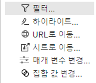
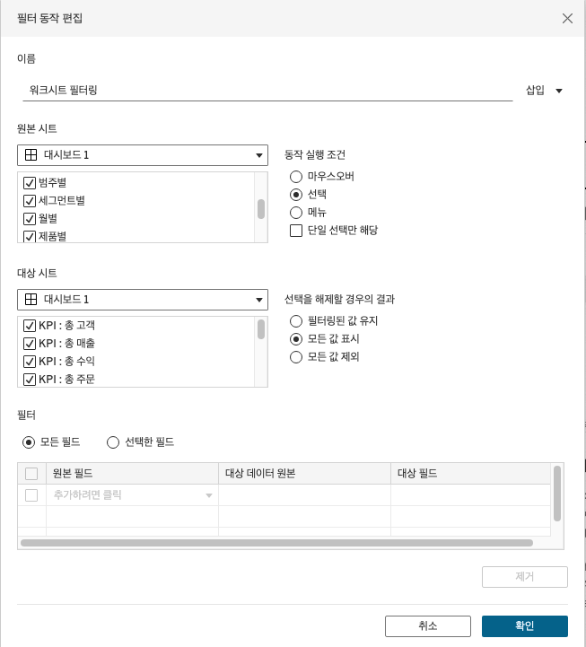
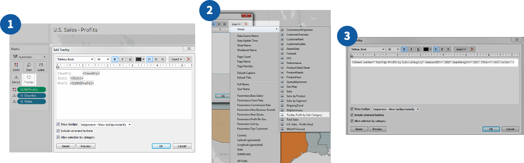
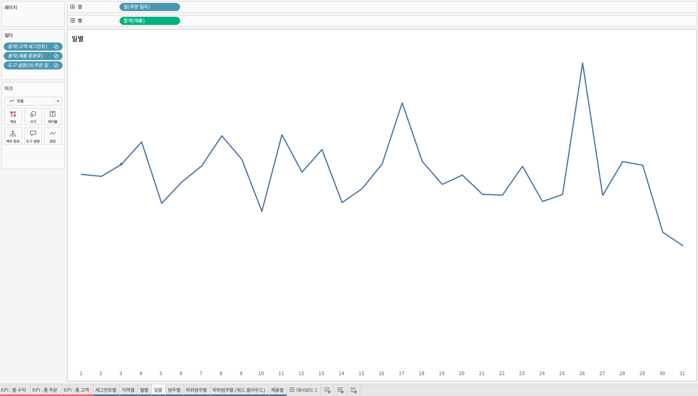
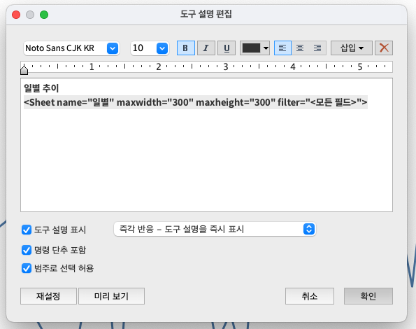
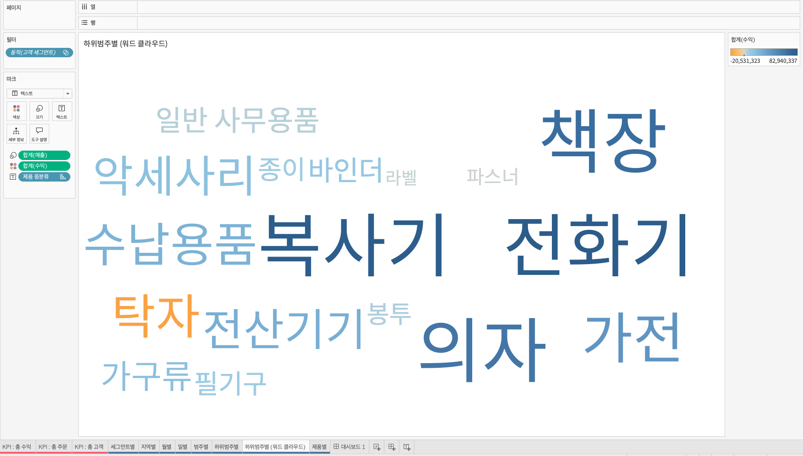
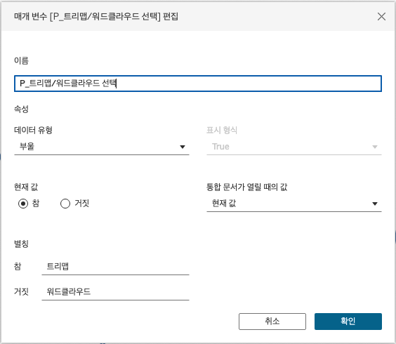
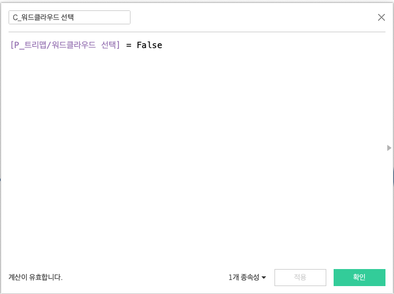
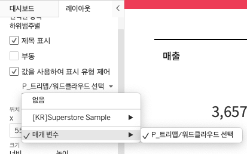

## 학습 목표

- Tableau에서 대시보드 동작(Action)의 종류를 이해하고 상황에 맞게 활용할 수 있습니다.
- 도구 설명(Tooltip)과 Viz in Tooltip을 활용해 데이터 포인트에 추가 맥락을 제공할 수 있습니다.
- 동적 영역 표시(Dynamic Zone Visibility)를 활용해 조건부로 시트와 개체를 표시/숨김 처리하는 인터랙티브 대시보드를 설계할 수 있습니다.

## 사용 프로그램

`Tableau Desktop`

## 사용 데이터 및 실습 파일

실습에는 `Teamsparta 매출 분석 대시보드 (레이아웃 실습)` 파일을 사용합니다.

## 목차

1. 대시보드 동작 및 도구 설명

## 1. 대시보드 동작 및 도구 설명

대시보드는 정적인 보고 화면에서 끝나지 않습니다.  
사용자가 마우스를 올리고, 클릭하고, 선택을 바꾸는 순간 화면이 반응해야 비로소 `탐색 가능한 분석 도구`가 됩니다.

이때 핵심이 되는 기능이 다음 세 가지입니다.

- 액션(Action)
- 도구 설명(Tooltip)
- 동적 영역 표시(Dynamic Zone Visibility)

이 기능들을 잘 활용하면 같은 차트라도 훨씬 더 유연한 경험을 만들 수 있습니다.

- 클릭하면 다른 시트가 필터링되고
- 마우스를 올리면 추가 설명과 작은 차트가 보이며
- 특정 조건에서는 숨겨져 있던 분석 영역이 나타나게 만들 수 있습니다.

즉, 이 절의 핵심은 차트를 더 만드는 것이 아니라, `기존 차트가 서로 반응하게 만드는 방법`을 익히는 것입니다.

### 1-1. 대시보드 동작(Action)



Tableau의 동작(Action)은 사용자의 상호작용을 기준으로 다른 시트, 필드, 매개변수, 외부 링크가 반응하도록 연결하는 기능입니다.

쉽게 말하면:

- 한 차트에서 무엇인가를 하면
- 다른 차트나 화면이 반응하는

구조를 만드는 것이 액션입니다.

즉, 액션은 개별 시트를 `하나의 대시보드 경험`으로 묶는 연결 장치라고 볼 수 있습니다.

#### 1. 동작 종류

대표적인 액션 유형은 다음과 같습니다.

- 필터(Filter)
- 하이라이트(Highlight)
- URL로 이동(URL)
- 시트로 이동(Navigation)
- 매개 변수 변경(Change Parameter)
- 집합 값 변경(Change Set Values)

각각의 역할은 다음과 같습니다.

##### 필터

한 뷰의 선택 결과를 기준으로 다른 뷰의 데이터를 필터링합니다.

예를 들어:

- 지역 차트에서 `서울`을 클릭하면
- 제품별 매출 시트가 서울 데이터만 보여주도록

구성할 수 있습니다.

이 방식은 가장 많이 사용되는 액션입니다.  
왜냐하면 사용자가 `전체 → 일부`로 자연스럽게 드릴다운하기 좋기 때문입니다.

##### 하이라이트

특정 마크를 강조하고 나머지는 흐리게 표시합니다.

필터처럼 데이터를 제거하지 않기 때문에, 전체 맥락을 유지하면서 특정 항목만 눈에 띄게 하고 싶을 때 적합합니다.

예를 들어:

- 범례에서 특정 고객 세그먼트를 마우스 오버하면
- 모든 차트에서 해당 세그먼트만 강조

하는 식으로 사용할 수 있습니다.

즉, 하이라이트는 `맥락은 유지하고 강조만 하고 싶을 때` 유리합니다.

##### URL로 이동

외부 웹 페이지, 파일, 또는 다른 Tableau 리소스로 연결되는 링크를 만듭니다.

예를 들어:

- 고객명 클릭 시 CRM 상세 페이지 열기
- 제품 클릭 시 상품 상세 URL 열기
- 리포트 클릭 시 외부 문서 또는 Notion 페이지 연결

이 가능합니다.

즉, Tableau 대시보드를 독립 화면이 아니라 `업무 시스템의 진입점`으로 사용할 수 있습니다.

##### 시트로 이동

다른 워크시트, 대시보드, 스토리로 이동하게 합니다.

이 기능은 메뉴 버튼, 상세 페이지 이동, 화면 전환형 대시보드에서 유용합니다.

예를 들어:

- KPI 카드를 클릭하면 상세 분석 대시보드로 이동
- 요약 페이지에서 세그먼트별 상세 페이지로 이동

하는 식입니다.

즉, 시트로 이동 액션은 `탭 구조 없는 화면 전환 UX`를 만드는 데 유리합니다.

##### 매개 변수 변경

사용자가 특정 마크를 클릭했을 때 매개 변수 값이 바뀌도록 설정하는 기능입니다.

이 기능은 다음과 같은 상황에서 강력합니다.

- 선택한 기준에 따라 KPI 계산 로직 변경
- 차트 유형 전환
- Top N 기준 변경
- 동적 영역 표시 조건 제어

즉, 매개 변수 변경 액션은 단순 반응이 아니라 `화면 상태 자체를 바꾸는 기능`에 가깝습니다.

##### 집합 값 변경

사용자가 비주얼리제이션에서 직접 집합(Set)에 포함될 값을 바꾸게 하는 기능입니다.

예를 들어:

- 특정 고객을 선택해 집합에 넣고
- 그 집합과 나머지를 비교 분석

하는 식으로 활용할 수 있습니다.

이 기능은 고급 분석 시나리오에서 특히 유용합니다.

#### 2. 필터 액션이 가장 많이 쓰이는 이유

실무에서는 다양한 액션 중에서도 `필터 액션`이 가장 자주 쓰입니다.

이유는 간단합니다.

- 사용자가 이해하기 쉽고
- 데이터 드릴다운 경험이 자연스럽고
- 다른 시트 반응이 즉각적으로 보이며
- 별도 설명 없이도 의미를 파악하기 쉽기 때문입니다.

즉, 액션 설계의 출발점은 보통 `필터 액션이 필요한가?`부터 검토하는 것이 합리적입니다.

#### 3. 필터 동작 편집 시 알아야 할 요소



필터 액션을 만들 때는 다음 요소를 이해해야 합니다.

- 원본 시트(Source Sheet)
- 대상 시트(Target Sheet)
- 동작 실행 조건(Run action on)
- 선택 해제 시 결과(Clearing the selection)

##### 원본 시트

사용자가 클릭 또는 마우스 오버할 기준 시트입니다.

##### 대상 시트

원본 시트의 선택 결과에 따라 값이 바뀔 시트입니다.

##### 동작 실행 조건

어떤 상호작용에서 액션을 실행할지 정합니다.

| 실행 조건 | 동작 방식 | 적합한 활용 |
| --- | --- | --- |
| 마우스 오버 (Hover) | 마크 위에 포인터를 올리면 실행 | 빠른 하이라이트, 가벼운 필터링 |
| 선택 (Select) | 마크를 클릭하면 실행 | 대부분의 액션 유형 |
| 메뉴 (Menu) | 마크 클릭 후 메뉴에서 실행 | 필터, URL, 선택적 실행 |

##### 선택 해제 시 결과

사용자가 선택을 지웠을 때 대상 시트를 어떻게 처리할지 정하는 옵션입니다.

예를 들어:

- 전체 값을 다시 보여줄지
- 빈 화면으로 둘지

를 결정합니다.

이 설정은 생각보다 중요합니다.  
왜냐하면 선택 해제 이후 화면이 갑자기 비어 버리면 사용자 입장에서 오류처럼 느껴질 수 있기 때문입니다.

즉, 액션은 만드는 것보다 `해제되었을 때도 자연스럽게 동작하는지`가 중요합니다.

#### 4. 언제 어떤 액션을 써야 할까요?

- 비교 맥락을 유지한 채 강조만 하고 싶으면 `하이라이트`
- 클릭한 항목 기준으로 상세 분석을 보고 싶으면 `필터`
- 외부 시스템이나 상세 문서로 보내고 싶으면 `URL`
- 요약 페이지와 상세 페이지를 나누고 싶으면 `시트로 이동`
- 화면 로직이나 상태를 바꾸고 싶으면 `매개 변수 변경`
- 사용자 선택 집단을 따로 관리하고 싶으면 `집합 값 변경`

즉, 액션 선택 기준은 기능 이름이 아니라 `사용자가 다음에 무엇을 하게 만들고 싶은가`입니다.

### 1-2. 도구 설명(Tooltip)

도구 설명(Tooltip)은 사용자가 마크에 마우스를 올렸을 때 나타나는 정보창입니다.

겉으로 보면 작은 말풍선처럼 보이지만, 실제로는 대시보드 해석 경험을 크게 개선하는 기능입니다.

#### 1. 도구 설명이란?

Tooltip의 핵심 역할은 다음과 같습니다.

- 차트에 보이지 않는 추가 정보를 제공
- 데이터 포인트의 맥락 설명
- 숫자 해석 보조
- 필요할 때만 추가 정보 노출

즉, 화면을 과도하게 복잡하게 만들지 않으면서도 상세 정보를 숨겨 둘 수 있다는 점이 강점입니다.

#### 2. Tooltip의 구성

Tooltip은 다음 요소를 자유롭게 조합할 수 있습니다.

- 동적 텍스트: 매출, 수익, 비율, 날짜 등 실제 데이터 값
- 정적 텍스트: 설명 문장, 제목, 해석 가이드
- 서식 요소: 줄바꿈, 굵게, 색상, 정렬

예를 들어:

- `2024년 3월 매출: 1.2억 원`
- `전월 대비 +8.4%`
- `상위 세그먼트: 기업 고객`

같은 정보를 조합할 수 있습니다.

즉, Tooltip은 단순 숫자 표시가 아니라 `차트의 숨은 설명 레이어`입니다.

#### 3. 왜 중요한가요?

차트에 모든 정보를 직접 레이블로 넣으면 화면이 매우 복잡해집니다.  
반대로 정보가 너무 적으면 사용자는 정확한 의미를 이해하기 어렵습니다.

Tooltip은 이 두 문제 사이의 균형점입니다.

- 화면은 깔끔하게 유지하면서
- 필요한 순간에만 상세 정보를 보여줄 수 있습니다.

즉, Tooltip은 `단순성과 정보량`을 동시에 챙길 수 있는 기능입니다.

#### 4. Tooltip 설계 시 주의할 점

- 너무 많은 정보를 넣지 않기
- 해석에 꼭 필요한 정보만 남기기
- 줄바꿈과 순서를 정리해 읽기 쉽게 만들기
- 차트에서 이미 보이는 내용은 중복하지 않기

즉, Tooltip도 작은 화면이므로 `작은 대시보드처럼 설계해야 한다`고 생각하면 좋습니다.

### 1-3. 도구 설명에 시트 넣기: Viz in Tooltip



Tooltip에는 텍스트만 넣는 것이 아니라, 다른 워크시트를 삽입할 수도 있습니다.  
이 기능을 `Viz in Tooltip`이라고 합니다.

즉, 사용자가 마우스를 올렸을 때 단순 숫자 대신 `작은 미니 차트`를 보여줄 수 있습니다.

#### 1. 왜 유용할까요?

예를 들어 월별 매출 차트가 있다고 가정해 보겠습니다.

- 메인 시트에서는 월별 흐름만 보여주고
- 특정 월에 마우스를 올렸을 때
- Tooltip 안에서 해당 월의 일별 매출 추이를 작은 차트로 보여줄 수 있습니다.

이렇게 하면 메인 화면은 단순하게 유지하면서도, 필요할 때만 추가 분석을 열어볼 수 있습니다.

즉, Viz in Tooltip은 `상세 분석을 숨겨 두는 가장 우아한 방법 중 하나`입니다.

#### 2. 기본 삽입 방식

일반적인 흐름은 다음과 같습니다.

1. 원본 시트에서 `도구 설명` 편집기를 엽니다.
2. `삽입(Insert)` 메뉴에서 `시트(Sheet)`를 선택합니다.
3. Tooltip 안에 넣을 대상 시트를 선택합니다.

삽입된 형태는 대략 다음과 같습니다.

```text
<Sheet name="Tooltip: Profit by Sub-Category" maxwidth="300" maxheight="300" filter="<All Fields>">
```

#### 3. 중요한 옵션

- `maxwidth`: 툴팁 안에 삽입될 시트의 최대 가로 크기
- `maxheight`: 툴팁 안에 삽입될 시트의 최대 세로 크기
- `filter="<All Fields>"`: 원본 시트의 관련 필드를 기준으로 자동 필터링

기본적으로는 모든 관련 필드에 대해 필터가 전달되기 때문에, 원본 마크에 따라 Tooltip 시트 내용이 바뀌게 됩니다.

#### 4. 실무 활용 예시





`월별 그래프에 마우스 오버 시 일별 그래프 표시`는 가장 대표적인 예시입니다.

예를 들어:

- 원본 시트: 월별 매출
- Tooltip용 시트: 일별 매출

으로 구성하면,

- 메인 시트는 월별 흐름을 단순하게 보여주고
- Tooltip에서는 선택한 월의 일별 분포를 추가로 확인할 수 있습니다.

이 방식은 공간 효율이 매우 좋습니다.  
상세 차트를 본문에 항상 둘 필요가 없기 때문입니다.

#### 5. 언제 쓰면 좋을까요?

- 상세 추이를 보조적으로 보여주고 싶을 때
- 메인 화면은 단순하게 유지하고 싶을 때
- 사용자가 필요할 때만 더 깊은 맥락을 보게 하고 싶을 때

즉, Viz in Tooltip은 `상세 차트를 메인 화면 밖으로 밀어내는 기능`이라고 이해하면 쉽습니다.

### 1-4. 동적 영역 표시(Dynamic Zone Visibility)

Dynamic Zone Visibility는 조건에 따라 특정 시트나 개체를 자동으로 보이거나 숨기게 하는 기능입니다.

이 기능이 등장하면서 Tableau 대시보드의 인터랙션 설계 범위가 크게 넓어졌습니다.

이전에는 같은 자리에 다른 시트를 겹쳐 두고 버튼으로 교체하는 방식이 복잡했지만, 이제는 조건 기반으로 더 자연스럽게 화면을 제어할 수 있습니다.

#### 1. 역할

Dynamic Zone Visibility의 핵심 역할은 다음과 같습니다.

- 조건이 만족되면 특정 영역 표시
- 조건이 바뀌면 특정 영역 숨김
- 사용자 선택에 따라 다른 시트 노출
- 복잡한 대시보드를 필요한 순간에만 확장

즉, 화면을 항상 다 보여주지 않고 `필요할 때만 보여주는 대시보드`를 만들 수 있습니다.

#### 2. 왜 중요한가요?

실무 대시보드는 점점 복잡해집니다.

- 보고용 요약도 필요하고
- 상세 분석도 필요하고
- 사용자별 맞춤 영역도 필요하고
- 차트 유형 전환도 원합니다.

이 모든 것을 한 화면에 다 올려두면 과밀해집니다.  
Dynamic Zone Visibility는 이 문제를 `조건부 표시`로 해결하게 해 줍니다.

즉, 이 기능은 더 많은 정보를 넣기 위한 기능이 아니라 `불필요한 순간에는 숨기기 위한 기능`입니다.

#### 3. 활용 예시

- 사용자 그룹별 맞춤 뷰
- 요약 차트와 상세 차트 전환
- 트리맵과 워드클라우드 같은 차트 유형 전환
- 버튼 없이 선택 조건에 따라 상세 시트 자동 표시

즉, Dynamic Zone Visibility는 `레이아웃 자체를 동적으로 바꾸는 UX 도구`입니다.

#### 4. 기본 구성 절차









일반적인 흐름은 다음과 같습니다.

1. Bool 매개변수 또는 계산식 생성
2. 조건을 판단할 계산 필드 작성
3. 필요한 경우 매개변수 동작으로 값 변경
4. 숨기거나 보일 시트에 표시 조건 연결

예를 들어 `트리맵 / 워드클라우드` 전환을 만들고 싶다면:

- 매개변수: `P_트리맵/워드클라우드 선택`
- 계산식: `C_워드클라우드 선택`

처럼 구성할 수 있습니다.

예시 계산식:

```tableau
[P_트리맵/워드클라우드 선택] = False
```

이후:

- 트리맵 시트는 매개변수 값이 `True`일 때 보이게
- 워드클라우드 시트는 계산식 결과가 `True`일 때 보이게

연결하면, 같은 위치에서 두 시트가 조건에 따라 번갈아 표시됩니다.

#### 5. 실무에서 특히 좋은 이유

Dynamic Zone Visibility를 쓰면 다음 장점이 있습니다.

- 한 화면에 모든 것을 다 넣지 않아도 됨
- 사용자가 필요한 순간에만 상세 정보를 열 수 있음
- 대시보드 구조가 더 단순해 보임
- 화면 전환 없이도 다층적 분석이 가능함

즉, 이 기능은 복잡한 분석 요구를 `단순한 화면 경험`으로 바꾸는 데 매우 효과적입니다.

#### 6. 주의할 점

- 조건 로직이 너무 많으면 유지보수가 어려워질 수 있습니다.
- 무엇이 왜 나타났는지 사용자가 이해하지 못하면 혼란이 생길 수 있습니다.
- 조건 전환이 많아질수록 설명 텍스트나 레이블이 더 중요해집니다.

즉, Dynamic Zone Visibility는 강력하지만, `화면 상태가 왜 바뀌는지 사용자가 예측할 수 있게 설계해야` 잘 작동합니다.

### 1-5. 언제 무엇을 써야 할까?

이 절에서 다룬 기능을 목적 기준으로 정리하면 다음과 같습니다.

- 다른 차트를 클릭해 상세 분석으로 좁혀 가고 싶으면 `필터 액션`
- 맥락을 유지하면서 특정 항목만 강조하고 싶으면 `하이라이트`
- 외부 시스템 또는 상세 문서로 보내고 싶으면 `URL 액션`
- 화면 안에서 세부 페이지를 이동시키고 싶으면 `시트로 이동`
- 추가 설명만 보여주고 싶으면 `Tooltip`
- 작은 보조 차트까지 보여주고 싶으면 `Viz in Tooltip`
- 조건에 따라 차트나 영역을 아예 바꾸고 싶으면 `Dynamic Zone Visibility`

즉, 인터랙션 설계의 핵심은 기능을 많이 넣는 것이 아니라, `사용자가 다음에 무엇을 하고 싶어 할지 미리 설계하는 것`입니다.

## 정리

이번 절에서는 Tableau 대시보드의 인터랙션을 만드는 핵심 기능을 정리했습니다.

핵심은 다음과 같습니다.

- 액션은 여러 시트를 하나의 탐색 경험으로 연결합니다.
- Tooltip은 화면을 복잡하게 만들지 않으면서 추가 정보를 제공하는 수단입니다.
- Viz in Tooltip은 메인 화면 밖에서 상세 차트를 보여주는 효율적인 방법입니다.
- Dynamic Zone Visibility는 조건에 따라 시트와 영역을 동적으로 제어해 더 유연한 UX를 만듭니다.

결국 좋은 인터랙션은 기능이 많은 대시보드가 아니라, `사용자의 다음 질문에 자연스럽게 답해 주는 대시보드`를 만드는 것입니다.
