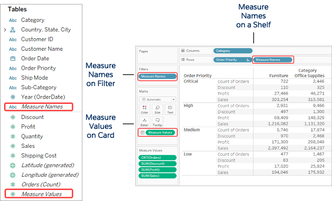

## 학습 목표

- 측정값 이름과 측정값의 역할을 이해합니다.
- 여러 측정값을 한 화면에 함께 배치하는 원리를 이해합니다.
- KPI 카드나 요약 테이블에 이 구조를 활용할 수 있습니다.

## 목차

1. 측정값과 측정값 이름
2. 측정값과 측정값 이름 활용 예시

## 1. 측정값과 측정값 이름

### 1-1. 측정값 이름(Measure Names)과 측정값(Measure Values)

#### 측정값 이름(Measure Names)

측정값 이름은 데이터 소스의 모든 측정값 필드 이름을 모아둔 가상 차원입니다.

- 어떤 측정값을 사용할지를 식별하는 라벨 역할을 합니다.
- 자동 생성되는 필드이며 삭제할 수 없습니다.
- 필터로 사용하면 특정 측정값만 선택적으로 표시할 수 있습니다.

#### 측정값(Measure Values)

측정값은 선택된 여러 측정값의 실제 값을 담는 가상 측정값입니다.

- 측정값 이름과 함께 사용됩니다.
- 여러 지표를 하나의 뷰에서 동시에 보여줄 때 유용합니다.
- 예를 들어 매출, 수익, 주문 수, 고객 수를 한 화면에 나란히 비교할 수 있습니다.

이 둘은 항상 함께 이해하셔야 합니다.

- `Measure Names`는 "무슨 지표인가"
- `Measure Values`는 "그 지표의 실제 값은 얼마인가"

즉, 이름과 값을 분리해서 다루기 때문에 다중 지표 비교가 가능해집니다.

## 2. 측정값과 측정값 이름 활용 예시

여러 KPI를 한 화면에 나란히 보여주고 싶을 때 `측정값 이름`과 `측정값` 조합이 매우 유용합니다.

- 열: `측정값 이름`
- 텍스트: `측정값 이름`, `측정값`
- 측정값 마크: `합계(매출)`, `합계(수익)`, `카운트 고유(주문 번호)`, `카운트 고유(고객 번호)`

이 방식은 KPI 카드, 요약 테이블, 비교형 대시보드의 기본 재료가 됩니다.  
실무적으로는 각각의 지표를 따로 만들기보다, `Measure Names/Measure Values` 구조를 잘 활용하면 훨씬 효율적으로 여러 수치를 관리할 수 있습니다.
