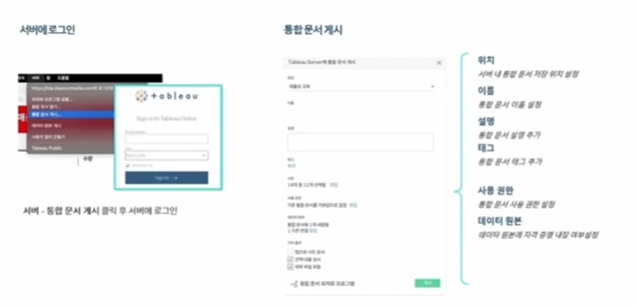
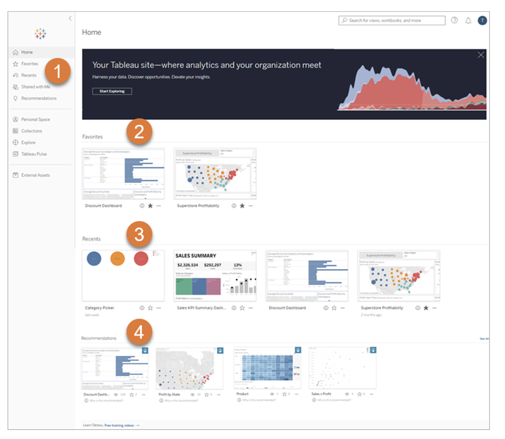
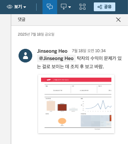
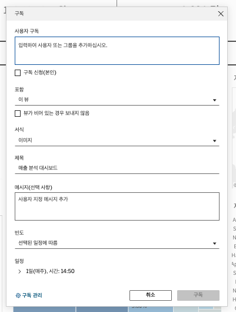
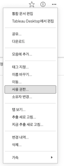
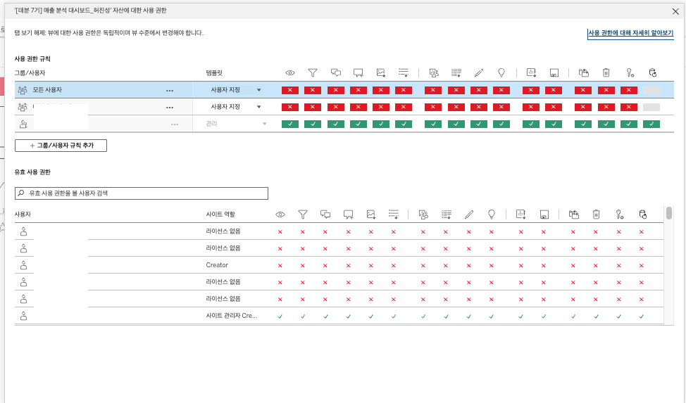

## 학습 목표

- 완성된 대시보드를 Tableau Server 또는 Tableau Cloud에 게시할 수 있습니다.
- Tableau Cloud의 주요 화면과 콘텐츠 구조를 이해할 수 있습니다.
- Tableau Cloud에서 공유, 권한, 버전 관리 등 협업 기능을 활용할 수 있습니다.

## 사용 프로그램

`Tableau Desktop`, `Tableau Cloud`

## 목차

1. Tableau Cloud를 통한 대시보드 공유

## 1. Tableau Cloud를 통한 대시보드 공유

대시보드를 만들었다고 해서 분석이 끝나는 것은 아닙니다.  
실무에서는 오히려 그다음 단계인 `게시`, `공유`, `권한 설정`, `운영`이 더 중요할 때가 많습니다.

왜냐하면 대시보드는 혼자 보는 파일이 아니라:

- 동료와 함께 보고
- 팀 단위로 활용하고
- 최신 상태를 유지하며
- 피드백과 수정 이력을 쌓아 가는

협업 자산이기 때문입니다.

이때 핵심 플랫폼 역할을 하는 것이 `Tableau Server`와 `Tableau Cloud`입니다.

### 1-1. Tableau Cloud에 대시보드 게시

조직에서 Tableau를 함께 사용한다면, 대시보드를 파일로 주고받는 대신 서버나 클라우드에 게시하는 방식이 가장 일반적입니다.

특히 Tableau Cloud는 별도 인프라를 직접 운영하지 않고도, 웹 기반으로 콘텐츠를 게시하고 공유할 수 있다는 점에서 실무 활용도가 높습니다.

#### Tableau Server와 Tableau Cloud

- `Tableau Server`: 조직이 자체적으로 구축하고 운영하는 온프레미스 또는 사내 서버 환경
- `Tableau Cloud`: Tableau에서 호스팅하는 클라우드 기반 서비스

둘은 운영 주체와 환경은 다르지만, 사용자 입장에서는 모두 `게시된 대시보드를 웹에서 보고 협업하는 플랫폼`이라는 공통점을 가집니다.

즉, 이 절에서는 두 환경을 함께 이해하되, 설명은 Tableau Cloud 중심으로 보면 됩니다.

#### 왜 게시가 중요한가요?

파일 공유 방식은 다음 문제가 자주 생깁니다.

- 최신 버전이 무엇인지 헷갈림
- 누가 어떤 파일을 수정했는지 추적 어려움
- 권한 통제가 약함
- 댓글, 구독, 알림 같은 협업 기능 부재

반면 Cloud/Server 게시 방식은 다음 장점이 있습니다.

- 최신 버전이 한 곳에 유지됨
- 웹 링크 기반으로 쉽게 접근 가능
- 사용자/그룹 권한 관리 가능
- 댓글, 구독, 알림, 버전 복구 지원

즉, 게시란 단순 업로드가 아니라 `대시보드를 운영 가능한 협업 자산으로 전환하는 과정`입니다.

### 1-2. Tableau Cloud UI 이해하기

Tableau Cloud를 제대로 쓰려면, 먼저 콘텐츠가 어떻게 구성되는지 이해해야 합니다.  
그래야 사용자가 어디에서 무엇을 찾고, 어떤 단위로 공유하고 관리하는지 감이 잡힙니다.

#### 1. 홈 화면

Cloud 홈 화면에서는 보통 다음 영역을 보게 됩니다.

- 내비게이션 패널
- 즐겨찾기
- 최근 조회
- 추천 콘텐츠

이 구조는 단순히 보기 좋은 홈 화면이 아니라, 사용자가 자주 쓰는 콘텐츠에 빠르게 접근하게 해 주는 탐색 허브입니다.

즉, 실무적으로는 홈 화면이 `분석 시작점` 역할을 합니다.

#### 2. 탐색 화면과 콘텐츠 단위

Tableau Cloud에서 자주 보는 콘텐츠 단위는 다음과 같습니다.

| 유형 | 설명 |
| --- | --- |
| 프로젝트 (Project) | 사이트 내 콘텐츠를 정리하는 폴더 역할. 하위 프로젝트를 포함할 수 있음 |
| 통합 문서 (Workbook) | 여러 개의 뷰(View)를 담는 상위 패키지 |
| 뷰 (View) | 단일 워크시트, 대시보드, 또는 스토리 |
| 데이터 원본 (Data Source) | 게시된 라이브 또는 추출 데이터 원본 |
| 플로우 (Flow) | Tableau Prep에서 만든 데이터 준비 흐름 |

이 구조를 이해하는 것이 중요한 이유는 권한과 공유 범위가 이 단위들에 따라 달라지기 때문입니다.

예를 들어:

- 프로젝트 권한을 잠그면 하위 콘텐츠 전체에 영향을 줄 수 있고
- 워크북 단위 공유와 뷰 단위 공유는 사용자 경험이 다를 수 있으며
- 데이터 원본 권한은 대시보드 편집 가능 여부에도 영향을 줄 수 있습니다.

즉, Cloud UI는 단순 폴더 구조가 아니라 `운영 단위와 권한 단위의 구조`이기도 합니다.

### 1-3. 대시보드 공유 방식

Tableau Cloud에서는 대시보드를 여러 방식으로 공유할 수 있습니다.  
공유 방식마다 목적이 다르기 때문에, 상황에 맞는 선택이 중요합니다.

#### 1. 직접 공유

직접 공유는 특정 사용자나 그룹을 지정해서 권한과 함께 공유하는 방식입니다.

주로 다음 상황에 적합합니다.

- 팀원 몇 명에게만 우선 검토를 요청할 때
- 특정 부서만 볼 수 있게 제한해야 할 때
- 보기/편집/다운로드 권한을 세부적으로 조정해야 할 때

즉, 직접 공유는 `권한 제어가 중요한 협업 공유 방식`입니다.

#### 2. 링크 공유

링크 공유는 현재 워크북 또는 뷰의 URL을 복사해서 전달하는 방식입니다.

이 방식은 다음과 같은 경우에 유용합니다.

- 메신저나 이메일로 빠르게 전달할 때
- 회의 자료에 링크를 붙일 때
- 사내 포털이나 문서에 임베드할 때

다만 중요한 점이 있습니다.  
링크를 안다고 해서 누구나 볼 수 있는 것은 아니고, 실제 접근 가능 여부는 `권한 설정`에 따라 결정됩니다.

즉, 링크 공유는 전달 방식일 뿐이고, 접근 가능성은 여전히 권한 정책이 결정합니다.

#### 3. 다운로드

Cloud에서는 대시보드를 직접 보는 것 외에도 다양한 형식으로 결과를 내려받을 수 있습니다.

대표적인 활용은 다음과 같습니다.

- PNG: 문서 첨부, 슬라이드 삽입
- PDF: 인쇄 및 배포용
- PowerPoint: 발표 자료용
- CSV / Excel: 데이터 검토 및 추가 분석용
- Crosstab: 표 형태 숫자 전달용

즉, Tableau Cloud는 웹 열람 플랫폼이면서 동시에 `결과물 전달 플랫폼`이기도 합니다.

#### 4. 댓글

댓글 기능은 단순 메모가 아니라 `분석 맥락을 남기는 협업 기록`입니다.

특히 다음 상황에서 유용합니다.

- 특정 필터 상태를 기준으로 피드백 남기기
- 특정 뷰에 대한 해석 차이 논의
- 수정 요청, 검토 의견, 확인 코멘트 기록

댓글은 단순 채팅보다 강점이 있습니다.  
왜냐하면 그 의견이 `어떤 대시보드 상태를 보고 남긴 것인지` 맥락이 함께 보존되기 때문입니다.

즉, 댓글은 대시보드 중심 협업의 핵심 도구입니다.

#### 5. 구독

구독(Subscriptions)은 최신 상태의 뷰나 워크북을 정기적으로 이메일로 받아보는 기능입니다.

예를 들어:

- 매주 월요일 오전 9시에 주간 실적 대시보드 수신
- 매일 아침 전일 매출 요약 이미지 수신

같은 시나리오가 가능합니다.

이 기능은 “사용자가 직접 들어와 보지 않아도 최신 상태를 받게 한다”는 점에서 중요합니다.

즉, 구독은 `대시보드를 찾아오게 하는 기능`이 아니라 `대시보드를 사용자에게 보내는 기능`입니다.

#### 6. 알림

Data-Driven Alerts는 특정 지표가 임계값을 넘거나 조건을 만족했을 때 알림을 보내는 기능입니다.

예를 들어:

- 매출이 목표치 미만일 때
- 재고 부족 지표가 기준 이하로 내려갔을 때
- 응답률이 특정 수준을 하회할 때

알림을 받을 수 있습니다.

즉, 구독이 정기 전달이라면, 알림은 `이벤트 기반 반응`입니다.

실무에서는 이 차이를 구분하는 것이 중요합니다.

- 구독: 정기적으로 확인해야 하는 정보
- 알림: 조건 발생 시 즉시 반응해야 하는 정보

### 1-4. 사용 권한 관리

Tableau에서 권한은 콘텐츠를 누가 어떻게 다룰 수 있는지를 정의하는 규칙입니다.

즉, 단순히 “볼 수 있나 없나”만 정하는 것이 아니라:

- 보기
- 다운로드
- 웹 편집
- 게시
- 삭제
- 권한 변경

같은 개별 capability를 세분화해서 제어하는 체계입니다.

#### 1. 왜 권한이 중요한가요?

대시보드는 단순 시각화가 아니라 종종 민감한 데이터 접근 창구가 됩니다.

예를 들어:

- 경영 KPI는 일부만 봐야 할 수 있고
- 원본 데이터 다운로드는 제한해야 할 수 있으며
- 편집 권한은 소수에게만 열어야 할 수 있습니다.

즉, 권한 설계는 보안 문제이자 운영 안정성 문제입니다.

#### 2. 권한 평가 순서

권한은 보통 다음 순서로 평가됩니다.

1. 사이트 역할(Site Role)
2. 특수 권한(관리자, 프로젝트 리더, 소유자 등)
3. 사용자 규칙
4. 그룹 규칙
5. 프로젝트 권한 상속 여부

여기서 중요한 원리는 다음 두 가지입니다.

- 사이트 역할은 가능한 권한의 최대치를 제한합니다.
- 충돌이 있을 경우 대체로 `거부(Deny)`가 우선하는 구조를 가집니다.

즉, 개별 콘텐츠 권한만 봐서는 안 되고, 상위 역할과 프로젝트 상속 구조까지 함께 봐야 정확한 판단이 가능합니다.

#### 3. 자주 보는 권한 유형

| 권한 | 설명 |
| --- | --- |
| 보기(View) | 워크북 및 시트 열람 |
| 필터(Filter) | Keep Only / Exclude 등 필터 동작 사용 |
| 요약 데이터 다운로드 | 집계 수준 데이터 다운로드 |
| 전체 데이터 다운로드 | 행 수준 데이터 다운로드 |
| 웹 편집(Web Edit) | 브라우저에서 직접 편집 |
| 워크북 다운로드/사본 저장 | `.twbx` 등으로 사본 저장 |
| 덮어쓰기 저장 | 기존 콘텐츠 수정 후 저장 |
| 게시(Publish) | 새 콘텐츠 게시 |
| 삭제(Delete) | 콘텐츠 삭제 |
| 권한 설정(Set Permissions) | 권한 변경 가능 |
| 이동(Move) | 프로젝트 간 이동 |
| 데이터 설명(Explain Data) | Explain Data 기능 사용 |

실무에서는 특히 다음 구분이 중요합니다.

- 보기만 가능한가
- 다운로드 가능한가
- 편집 가능한가
- 다시 게시 가능한가

즉, 권한 관리의 핵심은 기능 이름을 외우는 것이 아니라 `누구에게 어디까지 허용할 것인가`를 역할별로 구분하는 것입니다.

### 1-5. 버전 관리

Tableau Cloud 또는 Server에 게시된 통합 문서는 수정될 때마다 새로운 버전이 자동 저장됩니다.

이 기능은 협업에서 매우 중요합니다.  
왜냐하면 실무에서는 언제든 다음 상황이 생기기 때문입니다.

- 누군가 잘못 덮어씀
- 기존 계산이 깨짐
- 대시보드 레이아웃이 수정 중 망가짐
- 원래 상태로 되돌아가야 함

이때 버전 관리 기능이 있으면 특정 시점으로 돌아가거나, 변경 이력을 추적할 수 있습니다.

즉, 버전 관리는 단순 백업이 아니라 `협업 환경에서의 안전장치`입니다.

#### 1. 무엇이 좋은가요?

- 누가 언제 수정했는지 추적 가능
- 과거 상태 확인 가능
- 필요 시 특정 버전으로 롤백 가능
- 운영 중 사고 복구에 유용

#### 2. 실무적으로 기억할 점

- 일반적으로 최신 버전이 계속 누적되며 자동 관리됩니다.
- 오래된 버전은 일정 개수 이후 자동 정리될 수 있습니다.
- 수정이 잦은 협업 문서일수록 버전 관리 중요성이 커집니다.

즉, Cloud에서의 수정은 “현재 상태만 저장되는 것”이 아니라, `이력과 함께 운영되는 변경`으로 이해하는 것이 맞습니다.

## 정리

이번 절에서는 Tableau Cloud를 통해 대시보드를 게시하고 협업하는 흐름을 정리했습니다.

핵심은 다음과 같습니다.

- 게시를 통해 대시보드는 파일이 아니라 운영 가능한 공유 자산이 됩니다.
- Tableau Cloud는 프로젝트, 워크북, 뷰, 데이터 원본, 플로우 단위로 콘텐츠를 관리합니다.
- 공유 방식은 직접 공유, 링크, 다운로드, 댓글, 구독, 알림 등 목적에 따라 달라집니다.
- 권한 관리는 보안과 운영 안정성을 좌우하므로 구조적으로 이해해야 합니다.
- 버전 관리는 협업 환경에서 변경 이력 추적과 복구를 가능하게 합니다.

결국 Tableau Cloud는 단순히 대시보드를 올려두는 공간이 아니라, `대시보드를 실제 업무와 협업 흐름 속에서 운영하게 만드는 플랫폼`입니다.
