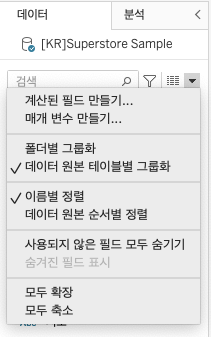

## 학습 목표

- Tableau에서 계산된 필드의 개념과 작성 방법을 이해하고 직접 만들 수 있습니다.
- 임시 계산과 정식 계산된 필드의 차이를 설명할 수 있습니다.
- 계산된 필드 편집기에서 자주 쓰는 개념과 규칙을 이해합니다.

## 목차

1. 계산된 필드 만들기

## 1. 계산된 필드 만들기

계산된 필드(Calculated Field)는 기존 데이터 값을 바탕으로 사용자가 직접 새로운 필드를 만드는 기능입니다.

- 집계
- 데이터 변환
- 조건 분기
- 사용자 정의 KPI 생성
- 분석용 파생 변수 생성

즉, 계산된 필드는 Tableau 안에서 분석 관점에 맞는 새 컬럼을 만든다고 이해하시면 됩니다.

### 1-1. 계산된 필드란?

- 기존 데이터의 값을 바탕으로 수식을 작성해 새로운 값을 생성합니다.
- 원본 데이터 테이블을 직접 수정하지 않고도 분석용 필드를 만들 수 있습니다.
- SQL의 `SELECT ... AS`, Excel의 수식 열 생성과 비슷한 역할을 합니다.

### 1-2. 계산된 필드를 만드는 방법

계산된 필드는 크게 두 가지 방식으로 만들 수 있습니다.

1. 열, 행 또는 마크 카드에 직접 입력하는 임시 계산
2. 데이터 패널에서 `계산된 필드 만들기`를 선택해 정식 필드를 생성하는 방식

실무에서는 재사용성과 유지보수 때문에 대부분 두 번째 방식이 더 적합합니다.  
임시 계산은 빠른 탐색에는 좋지만, 이후 대시보드나 다른 시트에서 다시 쓰기 어렵기 때문입니다.

### 1-3. 계산된 필드 관련 용어

| 구성 요소 | 설명 |
| --- | --- |
| 필드 | 데이터 원본 필드와 계산된 필드를 포함합니다. |
| 함수 | 수식 작성에 사용하는 함수입니다. 드롭다운 메뉴에서 카테고리별로 확인할 수 있습니다. |
| 연산자 | `+`, `-`, `*`, `/`, `%`, `>`, `<`, `=` 같은 기호입니다. |
| 매개변수 | 상수 값을 대체하는 변수로, 계산식에 삽입할 수 있는 자리 표시자입니다. |
| 주석 | 계산식에 설명을 달기 위한 텍스트입니다. `//` 또는 `/* ... */` 형태로 작성합니다. |

### 1-4. 계산된 필드 편집기 규칙

- `ENTER`, `RETURN`, `SPACE`는 계산 로직에 영향을 주지 않습니다.
- 필드명을 제외하면 대소문자 차이도 대부분 무시됩니다.
- 문자열은 큰따옴표 또는 작은따옴표로 감싸 작성합니다.

| 색상 또는 기호 | 설명 |
| --- | --- |
| 빨간 물결선 | 구문 오류가 있다는 뜻입니다. |
| 회색 텍스트 | 주석입니다. 계산에는 포함되지 않습니다. |
| 주황색 텍스트 | 필드명입니다. |
| 파란색 텍스트 | 함수입니다. |
| 보라색 텍스트 | 매개변수입니다. |
| 굵은 텍스트 | 집계된 결과를 기반으로 Tableau 내부에서 계산되는 식입니다. |
| 일반 텍스트 | 데이터베이스 수준에서 계산되는 식입니다. |

### 1-5. 필드명 네이밍 규칙

실무에서는 계산식, 매개변수, 필터를 구분하기 위해 접두어를 붙여 관리하면 편리합니다.

- `C_`: 계산식(Calculation)
- `P_`: 매개변수(Parameter)
- `FLTR_`: 필터(Filter)

예를 들어 `C_수익률`, `P_기준연도`, `FLTR_지역선택`처럼 관리하면 검색과 유지보수가 쉬워집니다.

이 규칙은 필수는 아니지만, 계산식이 많아질수록 효과가 큽니다.  
실무에서는 필드 수가 수십, 수백 개로 늘어나기 때문에 처음부터 이름 규칙을 잡아두는 편이 훨씬 유리합니다.
