## 학습 목표

- Tableau Prep의 역할과 Tableau Desktop과의 차이를 이해할 수 있습니다.
- 유니온, 조인, 정리, 출력 단계를 활용해 전처리 흐름을 설계할 수 있습니다.
- 필드 불일치, 조인 누락, 불필요 필드 제거 같은 실무형 전처리 이슈를 해결할 수 있습니다.

## 목차

1. Tableau Prep 소개 및 다운로드
2. Tableau Prep을 활용한 데이터 전처리 실습

## 1. Tableau Prep 소개 및 다운로드

### 1-1. Tableau Prep이란?

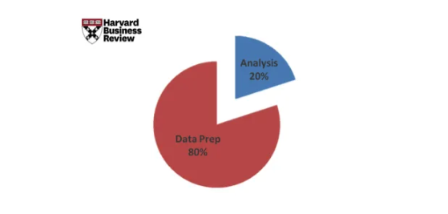

하버드 비즈니스 리뷰에서는 데이터 분석 업무 시간의 약 80%가 전처리에 쓰이고, 실제 분석에 투입되는 시간은 약 20% 수준이라고 이야기합니다.  
실무에서도 이 비율은 크게 다르지 않습니다.

- 원본 파일 형식이 제각각이고
- 컬럼명이 맞지 않으며
- 반품, 담당자, 기준정보가 따로 관리되고
- 분석 전에 먼저 붙이고 정리해야 하는 경우가 많기 때문입니다

즉, 분석 자체보다 "분석 가능한 데이터셋을 만드는 일"이 더 오래 걸리는 경우가 많습니다.

이처럼 "전처리를 하느라 분석을 못 하는 상황"을 줄이기 위해 나온 도구가 Tableau Prep입니다.

Tableau Prep은 Tableau Desktop 사용자 경험을 바탕으로 2018년에 출시된 데이터 준비 도구입니다.

- 데이터 연결
- 데이터 정리
- 데이터 결합
- 분석용 구조 변형

을 시각적인 흐름(flow)으로 구성할 수 있습니다.

즉, SQL을 직접 쓰지 않거나 Python 전처리 파이프라인을 별도로 만들지 않아도, 드래그 앤 드롭 중심으로 데이터 연결, 정제, 통합 과정을 설계할 수 있습니다.

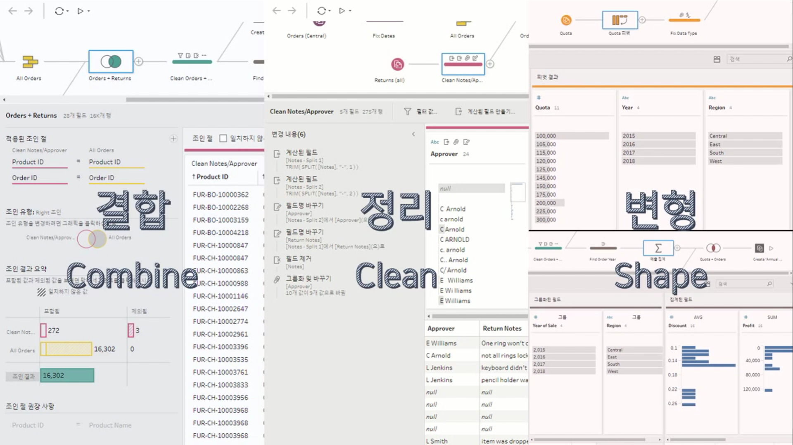

Prep의 핵심 작업은 보통 다음 세 가지로 정리할 수 있습니다.

- 결합(Combine): 서로 다른 데이터 소스를 조인(Join) 또는 유니온(Union)
- 정리(Clean): 불필요하거나 불일치하는 값을 정제
- 변형(Shape): 피벗, 집계, 필터링 등 분석 목적에 맞는 형태로 변환

실무적으로 보면, Tableau Prep은 "전처리를 코드 없이 대신해주는 툴"이라기보다 "전처리 로직을 시각적으로 문서화하는 툴"에 가깝습니다.  
즉, 누가 봐도 현재 데이터가 어떤 순서로 합쳐지고 정리되는지 흐름이 남는다는 점이 큰 장점입니다.

### 1-2. Tableau Prep 다운로드 및 라이선스 활성화

#### 1. Tableau Prep 다운로드 페이지 접속

- Tableau Prep은 아래 페이지에서 다운로드할 수 있습니다.

[Tableau Prep 다운로드 페이지](https://www.tableau.com/ko-kr/support/releases/prep)

이 단계에서 Tableau.com 계정 로그인이 필요할 수 있습니다.

#### 2. 운영 체제에 맞는 설치 파일 다운로드

- Windows: 설치 프로그램 실행 후 안내에 따라 진행
- Mac: `.dmg` 파일을 연 뒤 `.pkg` 설치 패키지 실행

설치 과정은 Tableau Desktop과 거의 동일합니다.

#### 3. 사용권 동의 및 설치
설치 단계에서는 사용권 동의 후 제품 설치를 진행합니다.  
제품 사용 현황 데이터 전송 여부는 선택 사항입니다.

#### 4. 등록 양식 작성

설치 후 최초 실행 시 Tableau 등록 양식을 입력할 수 있습니다.

#### 5. 서버 로그인 기반 활성화 선택

라이선스 활성화는 제품 키 방식이 아니라 서버 로그인 기반으로 진행할 수 있습니다.

#### 6. Tableau Cloud 선택 및 접속 정보 입력

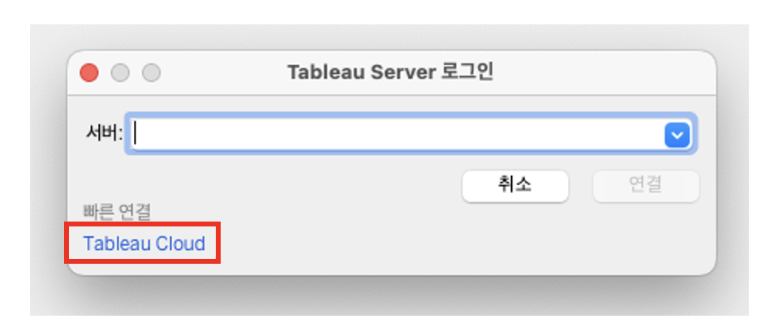

URL 입력창이 나타나면 `teamsparta`를 입력하고, 나타나지 않으면 다음 단계로 넘어갑니다.

#### 7. 이메일/비밀번호 입력 및 인증

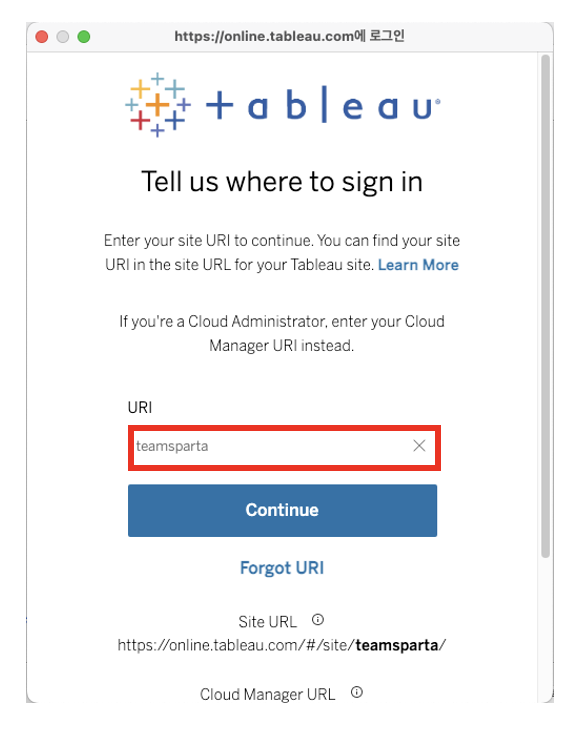

#### 8. 활성화 완료

이 단계까지 마치면 Tableau Prep 실습 환경이 준비됩니다.

## 2. Tableau Prep을 활용한 데이터 전처리 실습

### 2-1. 실습 상황 설명

이번 실습에서는 상사가 다음을 요청했다고 가정합니다.

- 4개년 매출 현황 확인
- 반품 현황 확인
- 관리자별 매출 현황 확인

문제는 필요한 데이터가 한 파일에 정리되어 있지 않다는 점입니다.

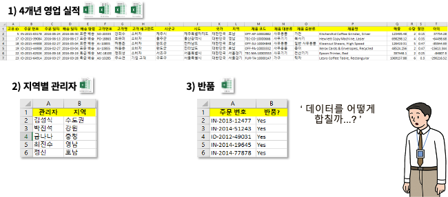

- 영업 실적 4개년 파일이 각각 따로 존재하고
- 지역별 관리자 파일이 따로 있으며
- 반품 주문번호 파일도 별도로 존재합니다

이 경우 Excel이라면:

- 여러 파일을 아래로 붙이고
- `VLOOKUP`이나 `XLOOKUP`으로 기준정보를 붙이고
- 수작업 정리를 반복하게 됩니다

Python이라면:

- `concat`
- `merge`
- 전처리 스크립트

를 만들어야 합니다.

SQL 환경이라면:

- `UNION`
- `JOIN`

으로 해결할 수 있습니다.

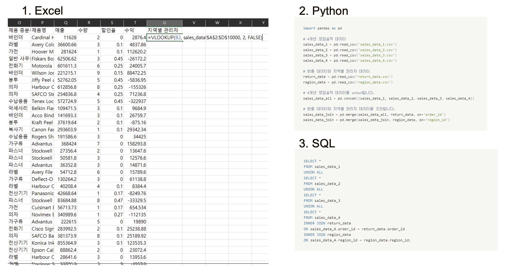

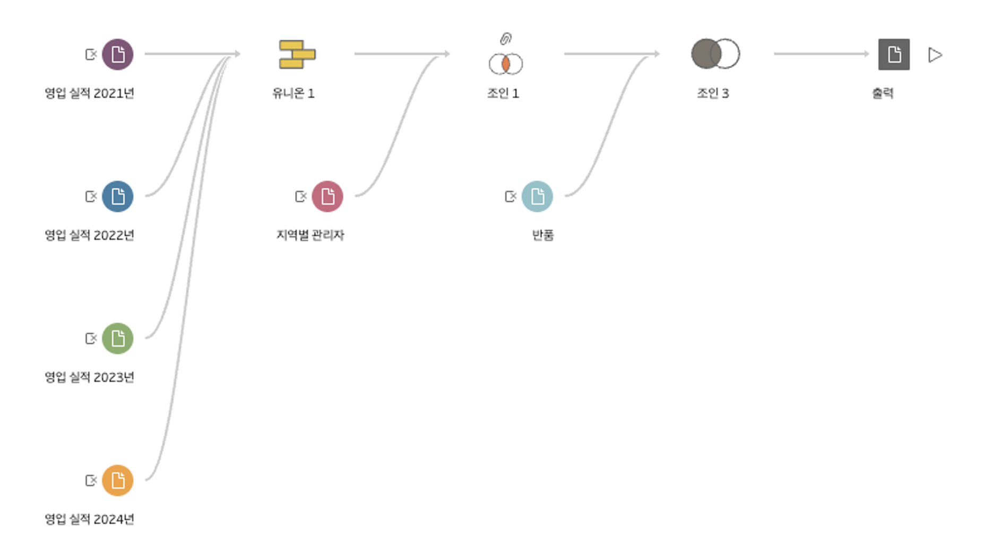

Tableau Prep은 이 과정을 시각적 흐름으로 구성합니다.

#### 유니온과 조인의 차이

> 유니온(Union): 데이터를 수직으로 결합합니다.  
> 조인(Join): 데이터를 수평으로 결합합니다.

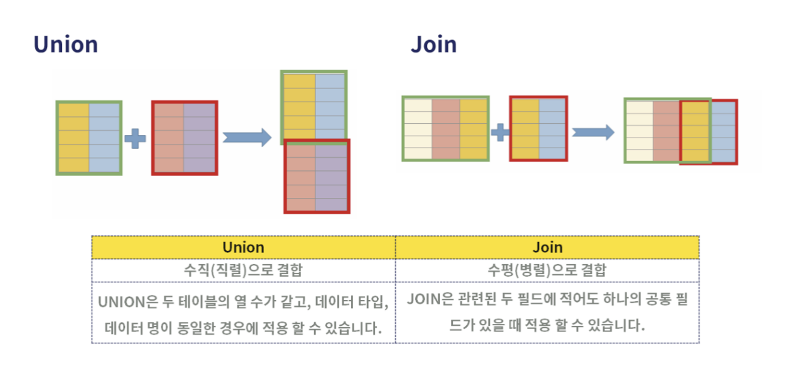

실무에서는 이 둘을 자주 혼동합니다.

- 유니온: 같은 구조의 연도별 파일을 아래로 쌓을 때 사용
- 조인: 관리자 정보나 반품 여부처럼 옆으로 붙일 때 사용

즉, "행을 늘릴 것인가" 아니면 "열을 늘릴 것인가"를 먼저 생각하면 구분이 쉽습니다.

### 2-2. 데이터 유니온

#### 1. 2021년과 2022년 유니온

`영업 실적 2022년` 파일을 드래그해 `영업 실적 2021년` 위에 올리면 유니온과 조인 중 하나를 선택할 수 있습니다.
이때 유니온 위에 드롭하면 두 파일이 세로 방향으로 결합됩니다.

#### 2. 유니온 추가

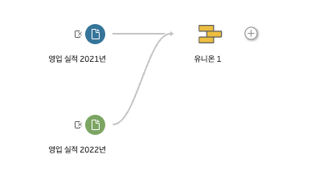

이 상태에서 `영업 실적 2023년`을 같은 방식으로 `유니온 1`에 추가합니다.

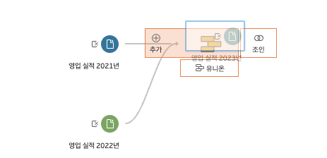

이제 `영업 실적 2024년`도 같은 방식으로 추가하면 4개년 데이터가 하나의 유니온 흐름으로 정리됩니다.

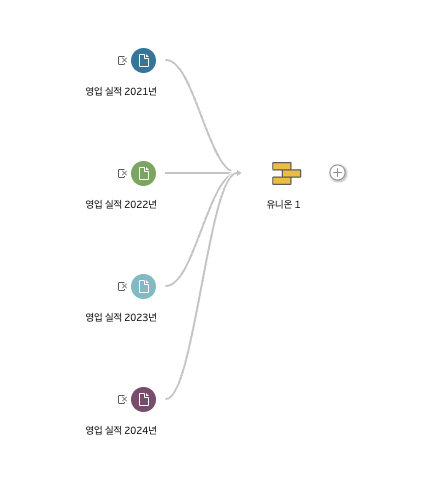

이렇게 하면 연도별로 분리된 4개 파일을 하나의 테이블처럼 다룰 수 있습니다.
다음 단계에서는 유니온 결과에서 불일치한 컬럼을 정리합니다.

### 2-3. 불일치 컬럼 정리

유니온 결과를 보면 특정 연도 파일의 필드명이 다른 경우 불일치 경고가 나타날 수 있습니다.

예를 들어:

- 다른 파일은 `할인율`, `수익`
- 2024년 파일은 `할인`, `이익`

처럼 이름이 다르면 같은 의미의 컬럼이어도 별도 필드로 인식됩니다.

#### 불일치 필드 병합

`할인율`과 `할인`을 하나로 합치고,

`수익`과 `이익`도 같은 방식으로 합칩니다.

실무에서 이 단계는 매우 중요합니다.  
컬럼 이름 불일치를 그대로 두면 이후 Desktop에서 같은 의미의 값이 서로 다른 필드로 나뉘어 집계 오류가 생기기 때문입니다.

### 2-4. 조인

#### 1. 지역별 관리자 조인

`지역별 관리자` 파일을 `유니온 1` 위에 드래그해 조인합니다.

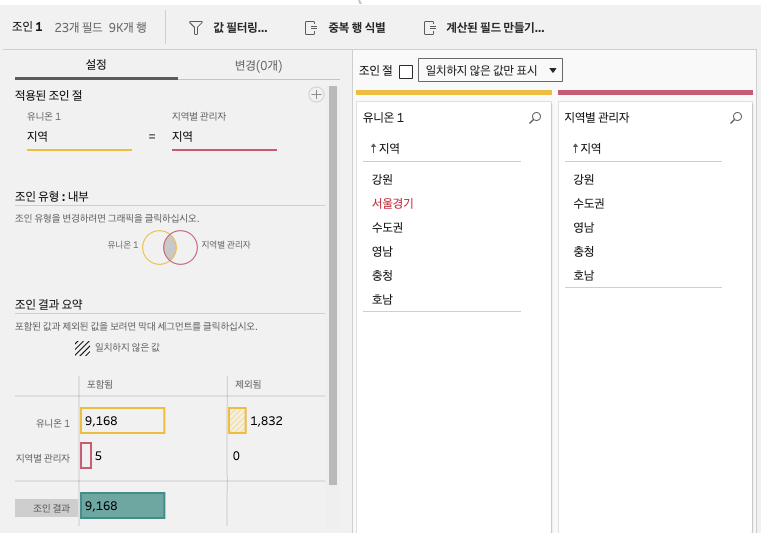

처음에는 일부 값이 조인되지 않을 수 있습니다.  
예를 들어 `서울경기`와 `수도권`처럼 사실상 같은 의미인데 표기가 달라서 생기는 문제입니다.

#### 2. 조인 키 값 보정

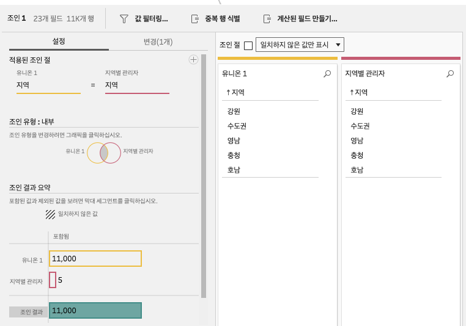

값을 `수도권`으로 통일하면 조인 누락이 해소됩니다.

이 단계는 실무에서 매우 자주 발생합니다.

- 동의어 사용
- 띄어쓰기 차이
- 대소문자 차이
- 코드 체계 변경

때문에 조인 누락이 생기기 때문입니다.

즉, 조인이 안 된다고 해서 바로 조인 조건부터 의심하기보다, 먼저 키 값 표준화 여부를 확인하는 습관이 중요합니다.

#### 3. 반품 현황 조인

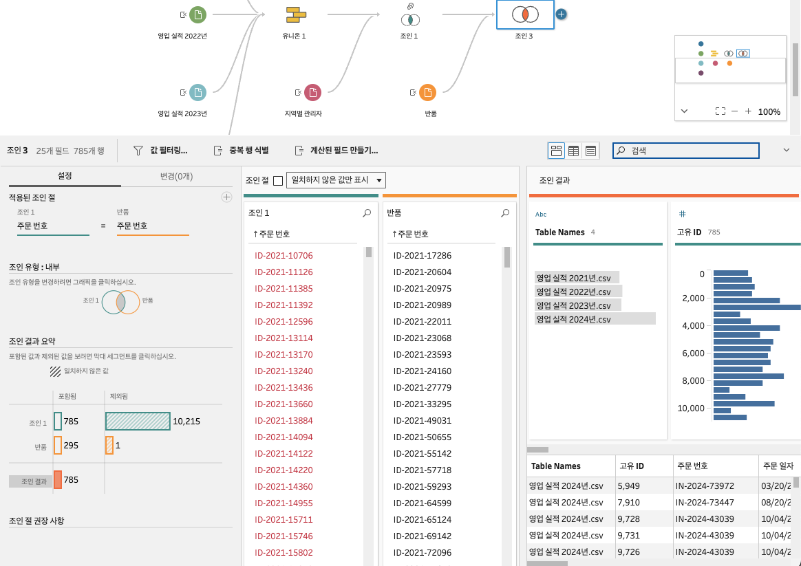

`반품 현황`을 다시 조인하면 기본 조인 유형은 내부 조인으로 잡히는 경우가 많습니다.

이 경우 반품된 주문만 남게 되므로, 전체 주문 데이터에 반품 여부를 붙이고 싶은 목적과 맞지 않습니다.

#### 4. 조인 유형 변경

따라서 조인 유형을 왼쪽 조인으로 바꿔야 합니다.

즉:

- 전체 주문 데이터는 유지하고
- 반품된 주문에만 반품 정보가 붙는 구조

를 만들어야 합니다.

실무에서 이 부분은 가장 흔한 조인 실수 중 하나입니다.  
조인 자체는 성공했지만, 조인 유형을 잘못 선택해 데이터가 의도치 않게 줄어드는 경우가 많기 때문입니다.

### 2-5. 필드 제거

조인까지 끝나면 정리 단계를 추가해 최종 데이터셋을 다듬습니다.

유니온 과정에서 자동 생성된 `Table Names` 같은 필드는 분석에 필요 없으면 제거합니다.

마찬가지로 조인 과정에서 생성된 `지역-1`, `주문 번호-1` 같은 보조 필드도 제거합니다.

실무적으로는 이 정리 단계가 꽤 중요합니다.

- 최종 데이터셋 구조를 단순하게 만들고
- Desktop에서 필드 탐색을 쉽게 하며
- 사용자가 헷갈릴 수 있는 중복 필드를 제거하기 때문입니다

즉, 전처리는 데이터를 붙이는 작업에서 끝나는 것이 아니라, "최종 사용자가 보기 좋은 스키마로 정리하는 단계"까지 포함합니다.

### 2-6. 데이터 출력

정리가 끝나면 출력(Output) 단계를 추가합니다.

출력 단계에서는:

- 파일
- 데이터베이스
- 기타 대상

등의 형식을 선택할 수 있습니다.

파일로 출력할 경우, 어떤 형식으로 저장할지도 고를 수 있습니다.

특히 `.hyper` 파일은 Tableau의 데이터 추출 전용 포맷으로, Desktop에서 빠르게 연결하고 활용하기 좋습니다.

이름과 경로를 지정한 뒤 흐름 실행을 누르면, 지정한 위치에 전처리 결과가 저장됩니다.
