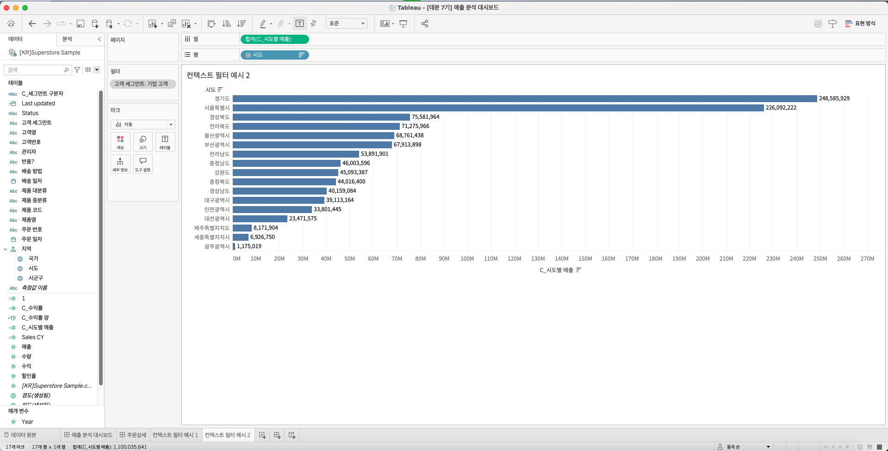
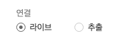
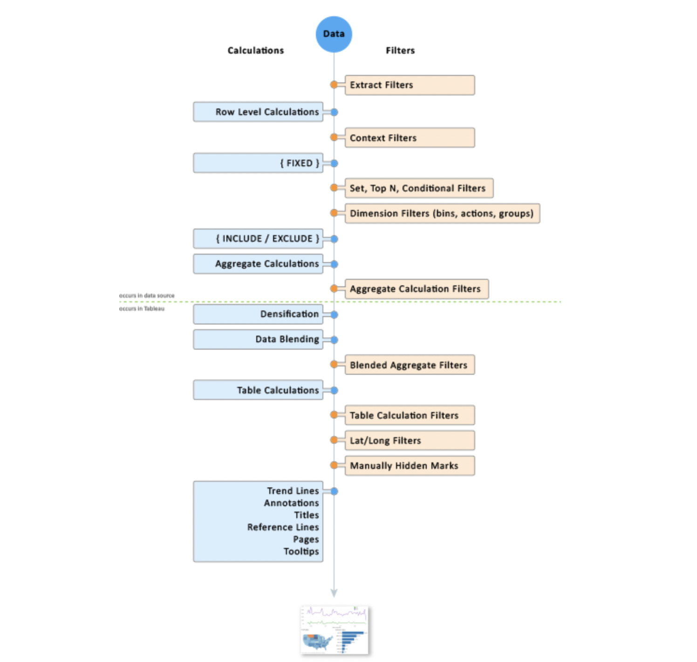
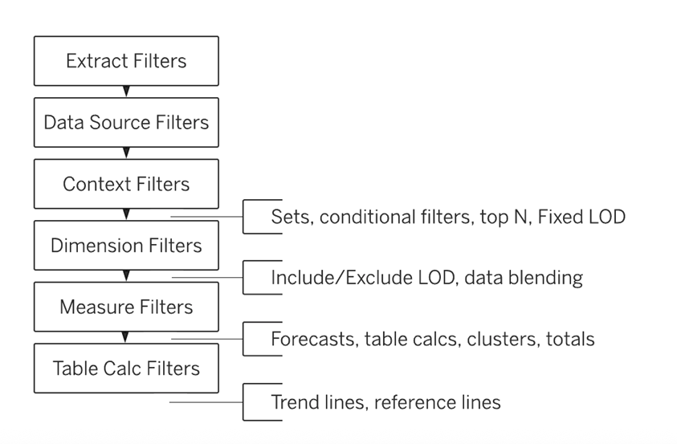

## 학습 목표

- Tableau에서 라이브(Live) 연결과 추출(Extract) 연결의 개념과 차이점을 이해하고, 분석 목적에 맞는 적절한 데이터 연결 방식을 선택할 수 있습니다.
- Tableau의 필터 적용 순서를 이해하고, 각 필터의 특징과 활용 시점을 설명할 수 있습니다.
- 라이브와 추출 연결의 장단점을 비교하여 데이터 신선도, 성능, 저장 공간, 활용 목적에 따른 선택 기준을 제시할 수 있습니다.

## 목차

1. 태블로 작업 순서와 라이브 vs 추출
2. 필터 적용 순서와 활용

## 1. 태블로 작업 순서와 라이브 vs 추출

### 1-1. 라이브 vs 추출



Tableau에서 데이터를 연결할 때 가장 먼저 결정해야 하는 것 중 하나가 `라이브(Live)`로 연결할지, `추출(Extract)`로 연결할지입니다. 이 선택은 단순한 접속 방식 차이를 넘어, 대시보드 응답 속도, 데이터 최신성, 서버 부하, 배포 방식까지 함께 결정합니다.

#### 1. 라이브(Live) 연결

- 데이터베이스와 실시간 연결을 유지하며 쿼리를 즉시 실행합니다.
- 대시보드에서 필터나 계산을 변경할 때마다 원본 데이터베이스에 직접 질의합니다.

특징은 다음과 같습니다.

- 항상 최신 데이터를 조회할 수 있습니다.
- 원본 DB의 성능과 네트워크 상태에 크게 의존합니다.
- 데이터 양이 많거나 쿼리가 복잡할수록 속도 저하가 발생할 수 있습니다.
- 별도의 추출 파일이 생기지 않으므로 저장 공간을 추가로 사용하지 않습니다.

#### 2. 추출(Extract) 연결

- 원본 데이터 일부 또는 전체를 `Hyper` 파일로 추출하여 로컬 또는 Tableau Cloud/Server에 저장합니다.
- 추출된 데이터를 기준으로 분석하므로 원본 DB와의 실시간 연결은 끊깁니다.

특징은 다음과 같습니다.

- Hyper 엔진을 사용하므로 응답 속도가 빠른 편입니다.
- 데이터 양이 많아도 비교적 안정적인 성능을 기대할 수 있습니다.
- 실시간성이 필요한 경우에는 부적합할 수 있으며, 새로고침 주기를 별도로 관리해야 합니다.
- 추출 파일을 저장할 공간이 필요합니다.

#### 3. 라이브 vs 추출 비교

| 구분 | 라이브 연결 | 추출 연결 |
| --- | --- | --- |
| 데이터 신선도 | 항상 최신 데이터 반영 | 추출 시점 이후 변경 사항은 반영되지 않음 |
| 성능 | DB와 네트워크 성능에 의존 | Hyper 엔진 기반으로 빠른 응답 |
| 저장 공간 | 별도 저장 불필요 | Hyper 파일 저장 필요 |
| 필터/계산 처리 | DB 처리 중심 | 추출 데이터 기준 로컬 처리 |
| 적합한 상황 | 실시간 모니터링, 즉시 반영 필요 | 속도 우선, 대용량 데이터, 네트워크 불안정 |

#### 4. 선택 기준

라이브 연결이 적합한 경우:

- 실시간 데이터 모니터링이 중요할 때
- 원본 DB 성능과 네트워크 환경이 안정적일 때
- 중앙 DB가 충분한 쿼리 부하를 감당할 수 있을 때

추출 연결이 적합한 경우:

- 데이터 크기가 크거나 분석 쿼리가 복잡할 때
- 대시보드 응답 속도를 우선할 때
- 오프라인 분석 또는 네트워크 의존성을 줄이고 싶을 때
- 데이터가 하루 1회, 주 1회처럼 일정 주기로만 갱신되어도 무방할 때

실무에서는 “항상 최신 데이터가 필요하다”는 이유만으로 라이브를 선택하는 경우가 많지만, 실제로는 10분, 1시간, 하루 단위 갱신만으로도 충분한 보고가 많습니다. 이때 라이브 연결을 고집하면 DB 부하와 대시보드 지연만 커질 수 있습니다. 반대로 추출은 빠르지만, 갱신 정책을 설계하지 않으면 “빠르지만 오래된 대시보드”가 되기 쉽습니다.

따라서 핵심은 `최신성 요구 수준`과 `성능 요구 수준`을 함께 판단하는 것입니다.

> 기준 질문:
> 이 대시보드는 “지금 이 순간” 바뀐 데이터를 반드시 보여줘야 하는가?

이 질문에 `예`라면 라이브를, `아니오`라면 추출을 우선 검토하는 것이 일반적으로 더 합리적입니다.



참고로 Tableau Public에 게시할 때는 `데이터 추출`만 사용할 수 있습니다. Tableau Public은 외부 데이터베이스에 대한 라이브 연결을 허용하지 않기 때문입니다.

### 1-2. 태블로 작업 순서




Tableau는 사용자가 화면에서 필터를 여러 개 올려둔다고 해서, 그 필터들을 모두 같은 시점에 처리하지 않습니다. 내부적으로는 정해진 순서에 따라 데이터를 줄이고, 집계하고, 계산합니다. 이 순서를 이해하지 못하면 “왜 필터를 걸었는데 값이 바뀌지 않지?” 혹은 “왜 Top N이 이상하게 나오지?” 같은 문제가 반복됩니다.

특히 `FIXED LOD`, `Top N`, `집합(Set)`, `측정값 필터`, `테이블 계산`은 적용 시점 차이 때문에 결과가 크게 달라질 수 있습니다.

## 2. 필터 적용 순서와 활용

### 2-1. Extract Filters (추출 필터)

- 적용 시점: 데이터 추출(`.hyper`) 단계
- 특징: 추출 파일에 불필요한 데이터를 아예 포함하지 않으므로 파일 크기와 성능 최적화에 가장 효과적입니다.

즉, 추출 필터는 “나중에 걸러내는 필터”가 아니라 “애초에 가져오지 않는 필터”입니다. 데이터 용량이 크고, 특정 기간이나 특정 국가 데이터만 필요하다면 가장 먼저 고려할 수 있는 필터입니다.



증분 새로고침은 Tableau 추출에서 `새로운 데이터만 추가`하는 최적화 기능입니다. 일반적으로 날짜 필드나 증가하는 ID 필드를 기준으로 설정합니다.

다만 중요한 한계가 있습니다.

- 새로운 행 추가에는 적합합니다.
- 기존 데이터의 수정 또는 삭제는 반영하지 못합니다.

그래서 실무에서는 증분 새로고침만 두기보다, 일정 주기로 `전체 새로고침`도 함께 수행하는 운영 정책이 필요합니다.

### 2-2. Data Source Filters (데이터 소스 필터)

- 적용 시점: 추출 이후, 데이터 소스 전체 수준
- 특징: 하나의 데이터 원본을 사용하는 여러 시트에 공통으로 반영됩니다.

이 필터는 “특정 워크시트용 필터”라기보다 “이 데이터 원본을 사용하는 모든 분석에 공통 적용할 기준”에 가깝습니다. 예를 들어 특정 사업부 사용자에게 자기 사업부 데이터만 보이게 하거나, 샌드박스/테스트 데이터를 제외하는 데 적합합니다.

### 2-3. Context Filters (컨텍스트 필터)

- 적용 시점: 다른 차원 필터보다 먼저 적용
- 특징: 이후 필터와 계산의 기준이 되는 임시 하위 집합(Context)을 만듭니다.

컨텍스트 필터는 단순히 “먼저 적용되는 필터”가 아닙니다. 더 정확히는, 나머지 필터들이 평가될 데이터 집합 자체를 다시 정의하는 역할을 합니다. 그래서 `Top N`, `조건 필터`, `집합`, `FIXED LOD`와 함께 사용할 때 특히 중요합니다.

#### Context 필터 사용 예시 1: Top N과 함께 사용할 때


예를 들어 “제품 중분류가 의자인 제품 중 상위 10개 제품명”을 보고 싶다고 하겠습니다.

- 열: 합계(매출)
- 행: 제품명
- 필터: 제품명(매출 기준 상위 10개), 시도

이때 시도 필터를 일반 차원 필터로만 두면, Top N 계산이 기대와 다르게 동작할 수 있습니다. 왜냐하면 Top N 계산이 시도 필터보다 먼저 평가될 수 있기 때문입니다.

따라서 `시도` 필터를 컨텍스트 필터에 추가하면, 먼저 시도 기준으로 데이터 집합을 줄인 뒤 그 안에서 상위 10개를 계산하게 됩니다.

#### Context 필터 사용 예시 2: FIXED LOD와 함께 사용할 때


예를 들어 `고객 세그먼트` 필터를 걸고도 시도별 매출 FIXED 결과가 필터에 맞춰 바뀌게 하고 싶다면, 고객 세그먼트 필터를 컨텍스트 필터로 올려야 합니다.

```tableau
// C_Fixed 시도별 매출
{ FIXED [시도] : SUM([매출]) }
```

`FIXED`는 기본적으로 일반 차원 필터의 영향을 받지 않습니다. 그래서 필터를 걸었는데도 FIXED 결과가 그대로인 경우가 생깁니다. 이런 상황에서 컨텍스트 필터는 FIXED가 계산되기 전에 데이터 집합을 먼저 제한해 주는 장치가 됩니다.

실무에서 많이 생기는 문제는 다음과 같습니다.

- “고객 세그먼트 필터를 걸었는데 FIXED 값은 왜 안 바뀌죠?”
- “서울만 보고 싶은데 Top 10 결과가 전국 기준으로 나옵니다.”

이 두 문제의 공통 해결 원리가 바로 `컨텍스트 필터를 기준 집합으로 먼저 만들기`입니다.

### 2-4. Dimension Filters (차원 필터)

- 적용 시점: 차원(Dimension) 값 기준 필터링
- 특징: 카테고리, 지역, 고객 세그먼트처럼 불연속형 필드의 값을 걸러냅니다.

차원 필터는 가장 일반적인 필터이지만, 계산 순서상 FIXED보다 뒤에 오는 경우가 많기 때문에 “보이는 값은 줄었는데 계산 결과는 그대로”처럼 보일 수 있습니다. 즉, 화면상 필터와 계산상 필터가 항상 같은 의미는 아닙니다.

또한 차원 필터는 INCLUDE/EXCLUDE LOD나 데이터 블렌딩에도 영향을 줄 수 있으므로, 단순한 시각적 필터로만 보면 안 됩니다.

### 2-5. Measure Filters (측정값 필터)

- 적용 시점: 집계된 측정값 결과 기준
- 특징: `SUM([매출]) > 1000000`처럼 집계 이후 결과를 걸러낼 때 사용합니다.

차원 필터는 “어떤 멤버를 포함할 것인가”를 정하는 반면, 측정값 필터는 “집계 결과가 조건을 만족하는가”를 기준으로 동작합니다.

예를 들어:

- 차원 필터: 서울특별시만 보기
- 측정값 필터: 합계(매출)이 1억 이상인 시도만 보기

둘은 비슷해 보여도 완전히 다른 레벨에서 계산됩니다. 측정값 필터는 집계가 끝난 뒤 적용되므로, 어떤 차원이 먼저 살아남았는지에 따라 결과가 달라질 수 있습니다.

### 2-6. Table Calculation Filters (테이블 계산 필터)

- 적용 시점: 뷰(View)에서 테이블 계산이 끝난 후
- 특징: 순위, 누계, 이동평균 같은 계산이 완료된 뒤 마지막으로 필터링합니다.

이 단계는 가장 늦게 적용되기 때문에, 데이터 자체를 줄이는 필터라기보다 `화면에 표시할 결과를 마지막에 정리하는 필터`에 가깝습니다.

예를 들어:

- 순위 계산 후 상위 10개만 보여주기
- 이동평균 계산 후 특정 구간만 남기기
- 누계 결과가 특정 임계값 이상인 구간만 보기

같은 `Top 10`처럼 보여도, Context Filter와 Table Calculation Filter는 완전히 다른 문제를 해결합니다.

- Context Filter 기반 Top N: 계산 기준이 되는 데이터 집합을 먼저 제한
- Table Calculation Filter 기반 Top N: 계산이 끝난 결과를 마지막에 표시만 제한

이 차이를 이해하지 못하면 같은 “상위 10개”인데도 결과가 다르게 보이는 이유를 설명할 수 없게 됩니다.

필터 적용 순서를 한 줄로 정리하면 다음과 같습니다.

1. Extract Filters
2. Data Source Filters
3. Context Filters
4. Dimension Filters
5. Measure Filters
6. Table Calculation Filters

이 순서는 단순 암기보다, “지금 내가 줄이고 있는 것은 원본 데이터인가, 집계 결과인가, 아니면 뷰 계산 결과인가”를 구분하는 기준으로 이해하는 것이 더 중요합니다.
