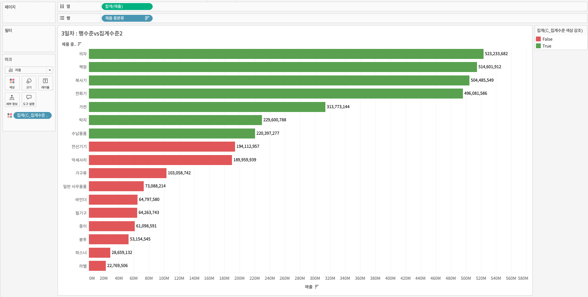

## 학습 목표

- 행 수준 계산과 집계 수준 계산의 차이를 구분할 수 있습니다.
- 같은 지표라도 계산 수준에 따라 결과가 달라지는 이유를 설명할 수 있습니다.
- 실무에서 계산 수준이 왜 중요한지 이해할 수 있습니다.

## 목차

1. 행 수준 계산
2. 집계 수준 계산
3. 행 수준 계산 vs 집계 수준 계산 시각화

## 1. 행 수준 계산


행 수준 계산은 데이터 소스의 각 행(Row)마다 계산이 수행되는 방식입니다.

- 데이터가 집계되기 전에 계산됩니다.
- 개별 레코드 기준으로 값이 먼저 계산됩니다.
- 이후 시각화 단계에서 합계, 평균 같은 집계가 이루어집니다.

예를 들어 아래 식은 행 수준 계산입니다.

```tableau
[수익] / [매출]
```

이 식은 각 주문 행마다 먼저 수익률을 계산한 뒤, 그 결과가 뷰에서 집계됩니다.

### 1-1. 행 수준 계산의 특징

- 원시 데이터 기준으로 계산됩니다.
- 세부 데이터마다 파생 값을 만들기 좋습니다.
- 조건 분기, 개별 행 변환, 개별 거래 기준 판단에 적합합니다.

## 2. 집계 수준 계산


집계 수준 계산은 데이터가 뷰에서 집계된 뒤 계산되는 방식입니다.

- `SUM`, `AVG`, `MIN`, `MAX` 같은 집계 함수를 사용합니다.
- 계산 기준은 개별 행이 아니라, 시각화에 표현된 집계 결과입니다.
- 뷰의 세부 수준(Level of Detail)에 따라 결과가 달라질 수 있습니다.

예를 들어 아래 식은 집계 수준 계산입니다.

```tableau
SUM([수익]) / SUM([매출])
```

이 식은 각 행의 수익률을 먼저 구하는 것이 아니라, 먼저 수익 합계와 매출 합계를 구한 뒤 마지막에 나누는 방식입니다.

### 2-1. 집계 수준 계산의 특징

- 집계된 값끼리 계산합니다.
- KPI, 평균 비교, 총합 대비 비율 계산에 적합합니다.
- 시각화 레벨이 바뀌면 결과도 달라질 수 있습니다.

### 2-2. 차이점 정리

| 구분 | 행 수준 계산 | 집계 수준 계산 |
| --- | --- | --- |
| 계산 시점 | 집계 전 | 집계 후 |
| 기준 데이터 | 개별 행 | 집계된 결과 |
| 용도 | 행별 파생 변수 생성 | KPI, 평균, 비율 계산 |
| 예시 | `[매출] * 0.1` | `SUM([매출]) / SUM([전체매출])` |

이 차이는 실무에서 매우 중요합니다.  
같은 "수익률"이라는 이름을 붙여도, 행 수준으로 계산한 뒤 평균을 낼 것인지, 집계 후 한 번에 계산할 것인지에 따라 값이 달라질 수 있기 때문입니다.

즉, 계산식의 문법보다 먼저 "내가 보고 싶은 값이 거래 단위 기준인지, 요약 단위 기준인지"를 먼저 정해야 합니다.

## 3. 행 수준 계산 vs 집계 수준 계산 시각화

다음 실습에서는 같은 수익률 지표를 두 방식으로 계산해 결과 차이를 비교합니다.


### 3-1. 행 수준 계산식

```tableau
// C_수익률 행수준 계산
[수익] / [매출]
```

### 3-2. 집계 수준 계산식

```tableau
// C_수익률 집계수준 계산
SUM([수익]) / SUM([매출])
```

### 3-3. 행 수준 계산 시


### 3-4. 집계 수준 계산 시



시각화 구성은 다음과 같습니다.

- 열: 합계(매출)
- 행: 제품 중분류
- 색상: `C_집계수준 색상 강조`

### 3-5. 색상 강조 계산식 예시

행 수준 색상 강조:

```tableau
// C_행수준 색상 강조
[매출] >= 1000000
```

집계 수준 색상 강조:

```tableau
// C_집계수준 색상 강조
SUM([매출]) >= 200000000
```

이 둘의 차이는 "조건을 어느 수준에서 평가하느냐"에 있습니다.

- 행 수준 조건은 각 거래 행마다 참/거짓을 먼저 판단합니다.
- 집계 수준 조건은 시각화에 집계된 값이 기준치를 넘는지를 판단합니다.

그래서 같은 `매출` 기준 조건처럼 보여도, 실제 결과는 전혀 다를 수 있습니다.

### 3-6. 실무에서 언제 문제가 되는가

이 부분은 실무에서 자주 오류가 나는 지점입니다.

- 개별 주문 기준 조건을 써야 하는데 집계 기준으로 계산한 경우
- 반대로 KPI 기준 집계를 봐야 하는데 행 수준 계산을 평균 내버린 경우
- 한 계산식 안에 행 수준 필드와 집계 필드를 섞어 써서 오류가 나는 경우

예를 들어 "수익률이 높은 제품군"을 보고 싶을 때:

- 행 수준 계산은 주문 하나하나의 수익률에 민감합니다.
- 집계 수준 계산은 제품군 전체 성과를 요약해서 보여줍니다.

즉, 질문이 "각 거래는 어땠는가"인지, "요약 성과는 어땠는가"인지에 따라 계산 수준을 달리 선택해야 합니다.

### 3-7. 대안과 확장

행 수준과 집계 수준을 섞어야 하는 복잡한 상황에서는 나중에 다룰 LOD(Level of Detail) 표현식이 필요해질 수 있습니다.

예를 들어:

- 고객 단위 평균 주문 금액
- 지역 단위 고정 수익률
- 필터와 무관하게 유지되는 기준값 계산

이런 경우 단순 `SUM`, `AVG`만으로는 원하는 결과를 안정적으로 얻기 어렵습니다.  
그래서 계산 수준을 정확히 이해하는 것이 이후 LOD 학습의 출발점이 됩니다.
