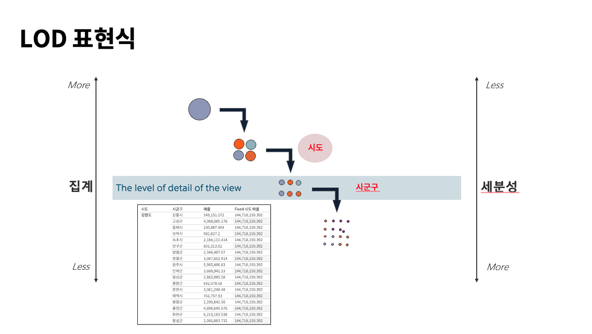

## 학습 목표

- LOD 표현식의 개념과 목적을 이해합니다.
- FIXED LOD를 활용한 기본 계산식을 작성할 수 있습니다.
- FIXED, INCLUDE, EXCLUDE의 차이를 구분할 수 있습니다.
- 일반 집계 함수와 LOD 표현식의 차이를 설명할 수 있습니다.

## 목차

1. LOD 표현식이란?
2. LOD 표현식의 세 가지 종류
3. LOD 표현식 활용
4. LOD가 실무에서 중요한 이유

## 1. LOD 표현식이란?



LOD Expressions(Level of Detail Expressions)은 Tableau에서 집계 수준을 직접 제어할 수 있게 해주는 기능입니다.

- 차트에 보이는 현재 집계 수준과 무관하게
- 사용자가 지정한 수준에서
- 별도의 계산 결과를 만들 수 있습니다

즉, LOD는 "현재 뷰가 아니라 내가 지정한 기준으로 먼저 집계하겠다"는 선언입니다.

이 개념이 중요한 이유는, 일반 집계 함수만으로는 해결되지 않는 질문이 많기 때문입니다.

예를 들어:

- 고객별 첫 구매일은?
- 시도별 총매출은?
- 현재 뷰가 제품 중분류여도 시도 기준 매출을 고정해서 보고 싶다

이런 질문은 현재 차트의 세부 수준과 별도로 계산 기준을 고정해야 하므로 LOD가 필요합니다.

## 2. LOD 표현식의 세 가지 종류

LOD 표현식에는 세 가지 키워드가 있습니다.

| 키워드 | 기준 | 뷰의 차원과의 관계 |
| --- | --- | --- |
| `FIXED` | 지정한 차원만 사용 | 뷰에 어떤 차원이 있든 무시 |
| `INCLUDE` | 뷰의 차원 + 지정한 차원 | 뷰보다 더 세밀한 수준에서 계산 후 다시 집계 |
| `EXCLUDE` | 뷰의 차원 - 지정한 차원 | 뷰보다 더 거친 수준에서 계산 |

작성 형태는 모두 같습니다.

```tableau
{ FIXED [차원] : 집계식 }
{ INCLUDE [차원] : 집계식 }
{ EXCLUDE [차원] : 집계식 }
```

세 키워드의 차이는 문법이 아니라 `기준을 어디에 두는가`에 있습니다.

- `FIXED`: 뷰가 바뀌어도 값이 흔들리지 않아야 할 때
- `INCLUDE`: 뷰에는 없는 더 작은 단위로 먼저 계산해야 할 때
  예: 뷰는 시도 단위인데 고객 단위 평균 주문 금액을 구하고 싶은 경우
- `EXCLUDE`: 뷰에 있는 특정 차원을 계산에서만 빼고 싶을 때
  예: 제품별로 나뉜 뷰에서 제품 구분 없는 전체 평균을 함께 보고 싶은 경우

이 책에서는 실무 사용 빈도가 가장 높은 `FIXED`를 중심으로 다룹니다.  
세 키워드는 필터 적용 순서에서도 위치가 다릅니다. 이 차이는 `7-3. 태블로 작업 순서`에서 이어서 설명합니다.

## 3. LOD 표현식 활용

### 3-1. FIXED 시도별 매출

```tableau
// C_FIXED 시도별 매출

{ FIXED [시도] : SUM([매출]) }
```

이 계산식은 현재 뷰가 무엇이든 상관없이 `시도` 단위로 매출 합계를 계산합니다.

즉:

- 차트에 제품 중분류가 보이더라도
- 계산은 먼저 시도 수준으로 고정됩니다

실무에서는 지역 단위 KPI를 고정해 비교할 때 자주 사용합니다.

### 3-2. 고객별 첫 구매 일자

```tableau
// C_고객별 첫 구매 일자

{ FIXED [고객명] : MIN([주문 일자]) }
```

이 계산식은 각 고객의 첫 구매일을 고정해서 계산합니다.

실무에서는 이를 바탕으로:

- 신규 고객 판별
- 고객 가입 후 첫 구매까지 걸린 시간
- 코호트 분석 기준일 생성

같은 확장 분석을 할 수 있습니다.

## 4. LOD가 실무에서 중요한 이유

LOD를 이해하지 못하면 다음 같은 문제가 자주 생깁니다.

- 차트 레벨이 바뀔 때 KPI 값이 함께 흔들림
- 특정 차원 기준으로 고정된 값을 유지해야 하는데 함께 재집계됨
- 평균, 비율, 첫 주문일 같은 기준값이 뷰에 따라 달라짐

즉, LOD는 단순한 고급 문법이 아니라, "어떤 수준에서 값을 계산할 것인가"를 명확히 고정하는 장치입니다.
