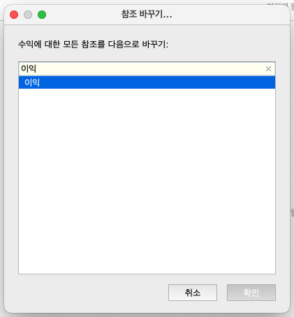
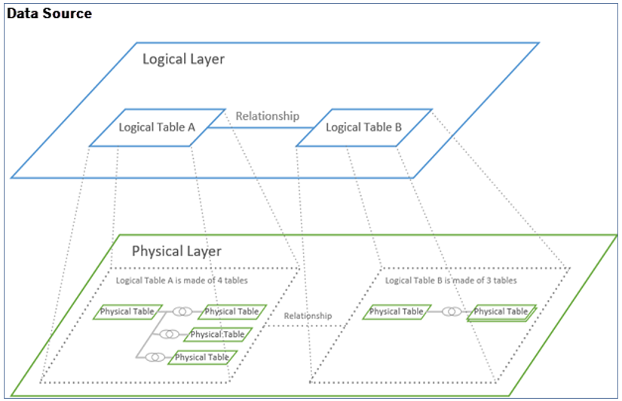
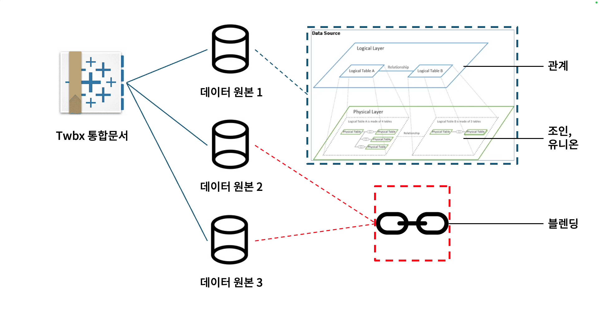
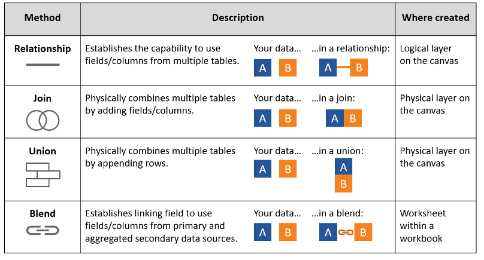

## 학습 목표

- Tableau의 데이터 결합 방식과 차이를 이해할 수 있습니다.
- 논리적 계층과 물리적 계층의 차이를 설명할 수 있습니다.
- 관계, 조인, 유니온, 블렌딩 중 상황에 맞는 방식을 선택할 수 있습니다.

## 목차

1. 논리적 계층과 물리적 계층
2. 데이터 결합 방식 비교
3. 관계 (Relationship)
4. 조인 (Join)
5. 유니온 (Union)
6. 블렌딩 (Blending)
7. 언제 무엇을 써야 할까?
8. 블렌딩으로 목표 매출과 실제 매출 비교

Tableau에서 데이터를 결합하는 방법은 하나가 아닙니다.  
겉으로 보면 모두 “테이블을 합치는 기능”처럼 보이지만, 실제로는 `언제 결합되는지`, `어느 레벨에서 결합되는지`, `집계가 어떻게 달라지는지`가 서로 다릅니다.

이 차이를 이해하지 못하면 다음과 같은 문제가 반복됩니다.

- 조인을 했더니 매출 합계가 갑자기 커짐
- 월별 목표 테이블을 붙였더니 주문 건수가 중복됨
- 서로 다른 파일을 합치고 싶은데 조인과 유니온을 혼동함
- 서로 다른 데이터 원본을 비교해야 하는데 관계와 블렌딩을 혼동함

즉, 데이터 결합은 단순 연결 기능이 아니라 `집계 결과와 성능을 함께 결정하는 모델링 선택`입니다.

## 1. 논리적 계층과 물리적 계층





Tableau의 데이터 모델은 크게 두 계층으로 나뉩니다.

- `논리적 계층(Logical Layer)`: 테이블 간 관계(Relationship)를 정의하는 상위 레이어
- `물리적 계층(Physical Layer)`: 조인(Join), 유니온(Union)으로 실제 테이블을 결합하는 하위 레이어

이 둘의 핵심 차이는 `테이블을 언제 하나로 보느냐`입니다.

- 논리적 계층은 테이블을 일단 분리해 둔 채, 시트에서 필드를 사용할 때 필요한 방식으로 연결합니다.
- 물리적 계층은 데이터 원본 단계에서 테이블을 실제로 합쳐, 이후 분석에서 하나의 테이블처럼 다룹니다.

| 구분 | 논리적 계층 (Logical Layer) | 물리적 계층 (Physical Layer) |
| --- | --- | --- |
| 개념 | 데이터 모델의 상위 레이어 | 데이터 모델의 하위 레이어 |
| 결합 방식 | 관계(Relationship) | 조인(Join), 유니온(Union) |
| 결합 시점 | 뷰에서 필드를 사용할 때 동적으로 결합 | 데이터 원본 단계에서 즉시 결합 |
| 테이블 상태 | 각 테이블을 논리 테이블로 유지 | 하나의 물리 테이블로 결합 |
| 장점 | 집계 수준 보존, 중복 최소화, 유연한 분석 | 결과 구조가 명확하고 전통적 SQL 방식과 동일 |
| 주의점 | 행 단위 계산이 필요한 경우 기대와 다를 수 있음 | 조인 중복, Null, 성능 저하 가능 |

## 2. 데이터 결합 방식 비교



Tableau에서 자주 쓰는 데이터 결합 방식은 네 가지입니다.

| 방법 | 설명 | 생성 위치 |
| --- | --- | --- |
| 관계 (Relationship) | 여러 테이블의 필드를 논리적으로 연결합니다. | 논리 계층(Logical Layer) |
| 조인 (Join) | 공통 키를 기준으로 테이블을 열(Column) 방향으로 물리 결합합니다. | 물리 계층(Physical Layer) |
| 유니온 (Union) | 같은 구조의 테이블을 행(Row) 방향으로 물리 결합합니다. | 물리 계층(Physical Layer) |
| 블렌딩 (Blending) | 기본 데이터 원본과 보조 데이터 원본을 시각화 단계에서 연결합니다. | 워크시트(Worksheet) |

겉보기에는 모두 결합이지만, 실제 원리는 다음처럼 다릅니다.

- 관계: “필요할 때 연결”
- 조인: “미리 옆으로 붙이기”
- 유니온: “미리 아래로 쌓기”
- 블렌딩: “시트에서 나중에 합쳐 보기”

## 3. 관계 (Relationship)

관계는 Tableau 2020.2 이후의 기본 데이터 모델링 방식입니다.  
핵심은 `테이블을 바로 합치지 않고, 연결 규칙만 정의해 둔다`는 점입니다.

### 3-1. 관계의 원리

- 테이블 간 연결 키를 지정합니다.
- 실제 쿼리는 시트에서 어떤 필드를 사용하는지에 따라 동적으로 생성됩니다.
- 필요하지 않은 테이블은 아예 쿼리에 포함되지 않을 수 있습니다.

즉, 관계는 SQL의 고정 조인을 미리 만드는 것이 아니라, `분석 맥락에 따라 가장 적절한 조인 쿼리를 나중에 생성하는 방식`입니다.

### 3-2. 관계가 유리한 경우

- 주문, 고객, 제품처럼 서로 다른 집계 수준의 테이블을 함께 분석할 때
- 한 워크북에서 다양한 질문을 다뤄야 할 때
- 데이터 중복 없이 모델을 유연하게 유지하고 싶을 때

### 3-3. 관계 사용 시 주의할 점

- 행 단위 계산을 전제로 한 모델에서는 결과가 직관과 다를 수 있습니다.
- 모든 필드를 하나의 상세 테이블처럼 다뤄야 하는 분석이라면 조인이 더 예측 가능할 수 있습니다.

## 4. 조인 (Join)

조인은 두 테이블을 공통 키 기준으로 하나의 테이블로 합치는 방식입니다.  
SQL의 `INNER JOIN`, `LEFT JOIN`, `RIGHT JOIN`, `FULL OUTER JOIN`과 같은 개념으로 이해하시면 됩니다.

### 4-1. 조인의 원리

- 결합하는 순간 하나의 물리 테이블이 생성됩니다.
- 이후 분석에서는 원래 두 테이블이 아니라, 합쳐진 결과만 다루게 됩니다.

### 4-2. 조인이 유리한 경우

- 분석 전에 반드시 단일 테이블 구조가 필요할 때
- 행 단위 계산이나 사용자 지정 SQL 관점으로 명확한 결과 테이블이 필요할 때
- 고객 속성, 제품 속성처럼 기준 정보 컬럼을 옆으로 붙일 때

### 4-3. 조인 시 주의할 점

- `1:N` 또는 `N:N` 관계를 잘못 조인하면 레코드가 불어나며 집계가 왜곡될 수 있습니다.
- 매출, 주문건수 같은 측정값이 중복되어 실제보다 크게 보일 수 있습니다.
- 키가 맞지 않으면 Null이 생기고, 조인 타입에 따라 누락 행이 발생할 수 있습니다.

실무에서 조인을 쓸 때 가장 먼저 확인할 질문은 다음입니다.

> 이 키는 양쪽 테이블에서 각각 몇 번 등장하는가?

## 5. 유니온 (Union)

유니온은 구조가 같은 여러 테이블을 행 방향으로 이어 붙이는 방식입니다.

### 5-1. 유니온의 원리

- 같은 의미의 컬럼을 기준으로 데이터를 아래로 쌓습니다.
- SQL 기준으로는 `UNION ALL`에 가깝습니다.
- 컬럼 구조가 다르면 필드가 분리되거나 Null이 생길 수 있습니다.

### 5-2. 유니온이 유리한 경우

- 월별, 분기별, 연도별 파일을 하나로 합칠 때
- 지역별로 따로 저장된 동일 양식 파일을 통합할 때
- 여러 시트/파일을 장기 추세 분석용 테이블로 만들 때

### 5-3. 실무에서 자주 생기는 문제

- 컬럼명이 조금만 달라도 서로 다른 필드로 인식됩니다.
- 데이터 타입이 다르면 후속 계산에서 오류가 날 수 있습니다.
- 어떤 파일은 컬럼이 빠져 있고 어떤 파일은 추가 컬럼이 있으면 Null이 발생합니다.

## 6. 블렌딩 (Blending)

블렌딩은 서로 다른 데이터 원본을 시각화 단계에서 연결하는 방식입니다.

### 6-1. 블렌딩의 원리

- 기본 데이터 원본(Primary)을 먼저 집계합니다.
- 보조 데이터 원본(Secondary)을 연결 필드 기준으로 맞춰 가져옵니다.
- 데이터 원본 자체를 하나로 합치는 것이 아니라 `집계된 결과를 시트에서 매칭`합니다.

즉:

- 조인: 행 레벨에서 먼저 결합
- 블렌딩: 시각화 집계 이후 연결

### 6-2. 블렌딩이 유용한 경우

- 서로 다른 데이터 원본을 빠르게 함께 써야 할 때
- 이미 별도 데이터 원본으로 만들어 둔 자산을 다시 모델링하기 어려울 때
- 목표값, 예산값, 외부 기준값을 비교용으로 붙일 때

### 6-3. 블렌딩 사용 시 주의할 점

- 보조 데이터 원본은 연결 필드 기준으로 집계되어 들어오기 때문에 행 레벨 상세 분석에는 한계가 있습니다.
- 기본 데이터 원본에 없는 차원은 보조 데이터 원본만으로 자유롭게 확장하기 어렵습니다.
- 최신 Tableau에서는 가능한 경우 관계를 우선 검토하는 것이 일반적입니다.

## 7. 언제 무엇을 써야 할까?

| 상황 | 추천 방식 | 이유 |
| --- | --- | --- |
| 주문, 고객, 제품처럼 서로 다른 상세 수준 테이블을 함께 분석 | 관계 | 집계 수준을 보존하면서 유연하게 분석 가능 |
| 속성 정보를 한 테이블에 명확히 붙여야 함 | 조인 | 결과 구조가 명확하고 행 단위 계산에 유리 |
| 연도별/월별 파일을 하나로 합쳐야 함 | 유니온 | 동일 스키마 데이터를 행 기준으로 결합 |
| 서로 다른 데이터 원본의 집계 결과를 비교 | 블렌딩 | 시각화 단계에서 빠르게 연결 가능 |

관계, 조인, 유니온, 블렌딩을 한 줄로 정리하면 다음과 같습니다.

- 관계: 기본 선택지
- 조인: 단일 물리 테이블이 필요할 때
- 유니온: 같은 형식 파일을 쌓을 때
- 블렌딩: 별도 데이터 원본을 시트에서 비교할 때

## 8. 블렌딩으로 목표 매출과 실제 매출 비교



블렌딩은 `데이터` 메뉴에서 혼합 관계를 설정해 사용할 수 있습니다.

예를 들어 `실제 매출 데이터`와 `연도별 목표 매출 데이터`가 별도 원본이라면, 연도 필드를 공통 키로 연결해 달성 여부를 분석할 수 있습니다.


이때 다음처럼 연도 필드를 연결합니다.

- 기본 데이터 원본: `KR Superstore Sample`
- 보조 데이터 원본: `목표 매출`
- 연결 필드: `년(주문 일자)` = `년도`


시트 구성 예시는 다음과 같습니다.

- 열: `SUM([매출])`, `SUM([목표 매출])`
- 행: `YEAR([주문 일자])`
- 색상: `목표 매출 달성 여부`

계산식 예시는 다음과 같습니다.

```tableau
// C_목표 매출 달성 여부
SUM([매출]) >= SUM([목표 매출].[목표 매출])
```
