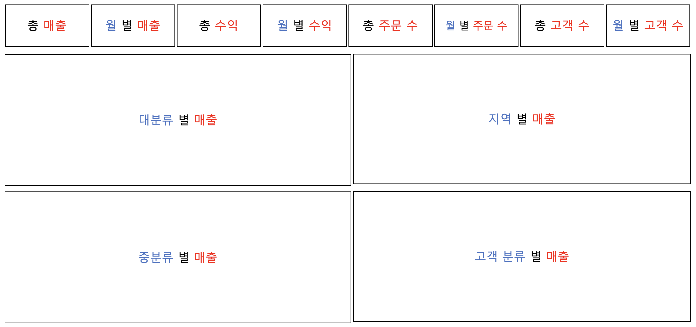
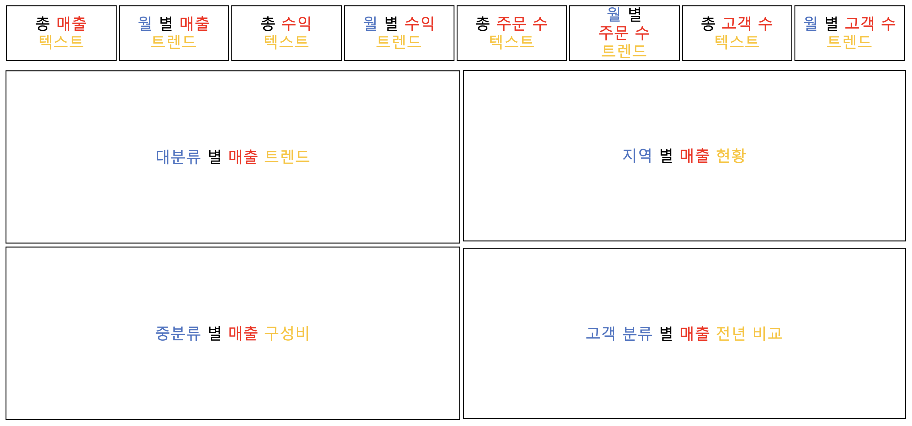
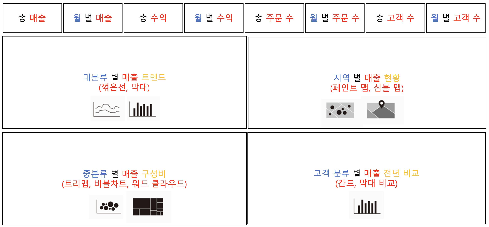
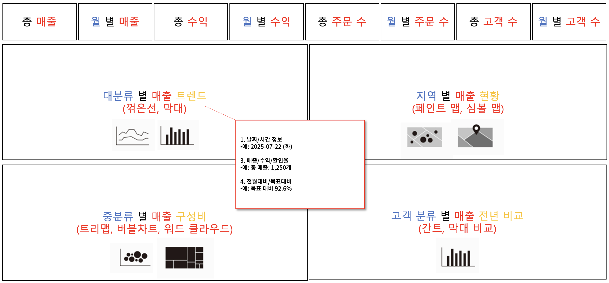
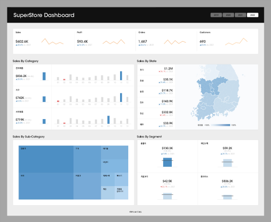
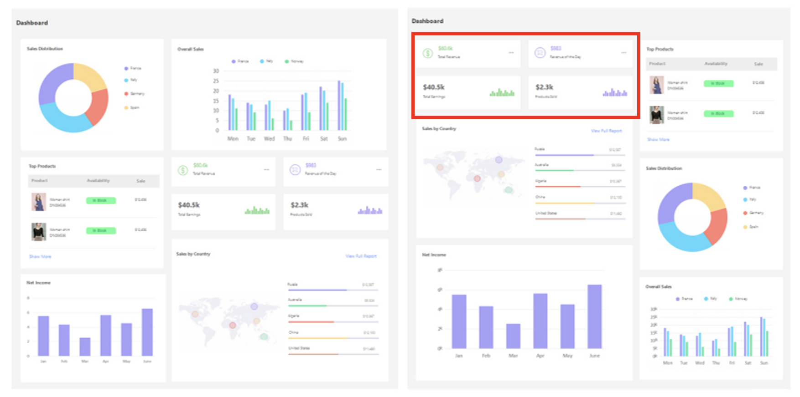
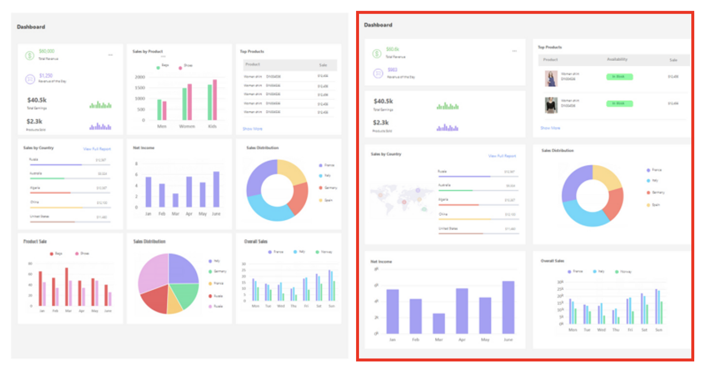
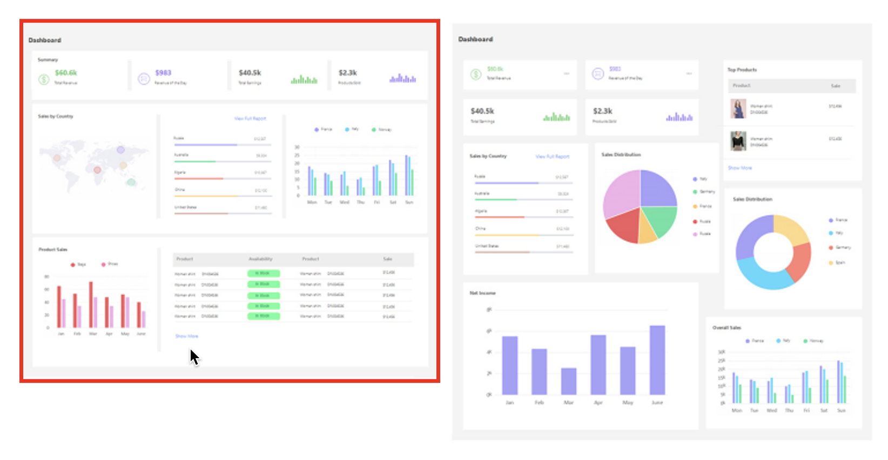
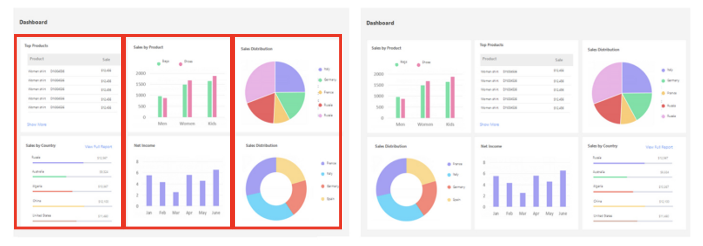
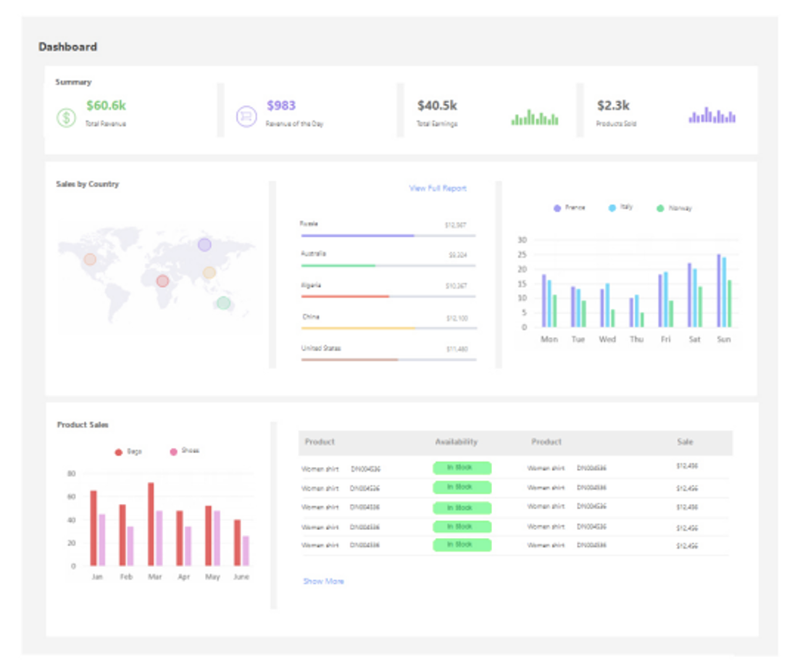

## 학습 목표

- 대시보드 제작 과정을 이해하고 실제 설계에 적용할 수 있습니다.
- AI 도구를 활용해 대시보드 기획 아이디어를 빠르게 도출할 수 있습니다.
- 대시보드 디자인 원칙을 이해하고 실제 화면 구성에 반영할 수 있습니다.

## 목차

1. 대시보드 화면 구성
2. 대시보드 디자인
3. 디자인 참고 사이트

## 1. 대시보드 화면 구성

대시보드는 차트를 많이 만드는 작업이 아니라, `질문을 화면 구조로 바꾸는 작업`입니다.  
그래서 좋은 대시보드는 차트 제작보다 먼저 `무엇을 물을 것인가`, `어떤 순서로 보여줄 것인가`, `어떻게 행동으로 이어지게 할 것인가`를 결정해야 합니다.

실무에서는 대개 다음 순서로 설계하는 것이 가장 안정적입니다.

1. 비즈니스 질문 정의
2. 화면 구조 설계
3. 표현 방식 결정
4. 차트 선정
5. 액션 설계
6. 실제 제작

이 순서를 거꾸로 가면 자주 생기는 문제가 있습니다.

- 차트는 많은데 메시지가 없음
- 필터와 기능은 많은데 사용 목적이 모호함
- 예쁘지만 실제 의사결정에는 도움이 되지 않음

즉, 대시보드 설계는 `시각화`보다 먼저 `문제 정의와 정보 구조화`가 선행되어야 합니다.

### 1-1. Business Question 던지기

대시보드의 출발점은 항상 `비즈니스 질문(Business Question)`입니다.

예를 들어 매출 대시보드를 만든다고 할 때, 막연히 “매출을 보여주는 화면”이라고 정의하면 너무 넓습니다.  
대신 다음처럼 구체적인 질문으로 바꾸는 것이 좋습니다.

- 어떤 제품이 가장 높은 매출을 기록하고 있는가?
- 시간 기준으로 매출 패턴은 어떻게 달라지는가?
- 지역별로 매출 차이가 두드러지는 곳은 어디인가?
- 고객 세그먼트별 매출 기여도는 어떤가?
- 상위 20% 고객이 전체 매출에서 차지하는 비중은 얼마인가?

이 질문들이 중요한 이유는 각각이 다음을 결정하기 때문입니다.

- 필요한 데이터 필드
- KPI 카드 필요 여부
- 시계열 차트 필요 여부
- 지역 비교 시각화 필요 여부
- Pareto 분석 또는 고객 기여도 분석 필요 여부

즉, 질문을 잘 정의하면 차트는 자연스럽게 따라옵니다.  
반대로 질문 없이 차트부터 만들면 “보여줄 것은 많은데 답은 없는 화면”이 되기 쉽습니다.

### 1-2. 화면 설계



질문이 정리되면 그다음은 `어떤 정보를 어떤 순서로 보여줄지`를 결정해야 합니다.

화면 설계 단계에서는 보통 다음을 먼저 정합니다.

- 상단에 어떤 핵심 KPI를 둘 것인가
- 중단에는 추세를 둘 것인가, 비교를 둘 것인가
- 하단에는 상세표나 보조 분석을 둘 것인가
- 필터는 왼쪽/오른쪽/상단 중 어디에 둘 것인가

실무에서는 먼저 손으로 간단히 스케치하거나, 도형 수준의 와이어프레임으로 레이아웃을 잡는 것이 효율적입니다.

이 단계에서 중요한 것은 “예쁘게 배치하는 것”보다 `사용자의 시선 흐름을 설계하는 것`입니다.

일반적으로는 다음 흐름이 자연스럽습니다.

- 상단: 핵심 요약
- 중앙: 추세 또는 비교
- 하단: 상세 설명 또는 예외 사례

즉, 사용자가 화면을 열었을 때 `지금 가장 중요한 숫자`를 먼저 보고, 그 다음에 `왜 그런지`를 읽어 내려가도록 만드는 것이 좋습니다.

### 1-3. 표현 방식 결정



같은 데이터라도 무엇을 강조할지에 따라 표현 방식이 달라집니다.

예를 들어 매출 데이터를 보여준다고 해도:

- 현재 상태를 강조하면 KPI 카드
- 기간 변화를 강조하면 선그래프
- 지역 차이를 강조하면 맵 또는 막대 차트
- 비중을 강조하면 누적 막대 또는 트리맵
- 순위를 강조하면 정렬된 막대 차트

처럼 표현 방식이 달라집니다.

이 단계에서 중요한 기준은 `데이터 형태`가 아니라 `전달하려는 메시지`입니다.

- 변화가 핵심인가?
- 비교가 핵심인가?
- 구성비가 핵심인가?
- 이상치 발견이 핵심인가?

즉, 표현 방식은 데이터를 꾸미는 선택이 아니라 `메시지를 전달하는 방식 선택`입니다.

### 1-4. 차트 선정



표현 방식이 정해지면 그에 맞는 차트를 고릅니다.

차트 선정에서 가장 흔한 실수는 “멋있어 보이는 차트”를 고르는 것입니다.  
실무에서는 보기 좋은 차트보다 `읽기 쉬운 차트`가 더 중요합니다.

예를 들어:

- 순위 비교: 막대 차트
- 시계열 변화: 선 차트
- 목표 대비 실적: 불릿 차트, 듀얼축, 기준선 활용
- 비중 비교: 누적 막대, 트리맵
- 상세 숫자 검토: 하이라이트 테이블, 텍스트 테이블

같은 방식이 일반적으로 더 해석이 쉽습니다.

즉, 차트 선정 기준은 “새로움”이 아니라 `해석 효율`이어야 합니다.

### 1-5. 액션 설계



대시보드가 단순 보고용을 넘어 분석용으로 쓰이려면 `액션(Action)` 설계가 중요합니다.

대표적인 액션은 다음과 같습니다.

- 마우스 오버 시 툴팁 제공
- 클릭 시 다른 시트 필터링
- 특정 마크 선택 시 상세정보 이동
- 버튼 클릭으로 시트 전환 또는 네비게이션

액션은 많이 넣는다고 좋은 것이 아닙니다.  
오히려 잘못 넣으면 사용자가 “무엇을 클릭해야 할지” 몰라 혼란스러워질 수 있습니다.

좋은 액션은 다음 조건을 만족합니다.

- 사용 목적과 직접 연결됨
- 동작 결과가 예측 가능함
- 너무 많은 클릭을 요구하지 않음
- 화면 흐름을 방해하지 않음

즉, 액션은 기능 추가가 아니라 `탐색 경험 설계`입니다.

### 1-6. 대시보드 제작



이제 앞에서 정의한 내용을 바탕으로 실제 Tableau 또는 설계 도구에서 화면을 제작합니다.

이때 중요한 원칙은 다음과 같습니다.

- 처음부터 완벽하게 만들려고 하지 않기
- 핵심 KPI와 주요 차트부터 먼저 배치하기
- 초안 상태에서 빠르게 피드백 받기
- 피드백을 바탕으로 구조를 다듬기

실무에서는 한 번에 완성하는 경우보다, `초안 → 검토 → 수정`을 여러 번 반복하면서 완성하는 경우가 더 많습니다.

즉, 대시보드 제작은 일회성 산출물이 아니라 `점진적 개선 과정`에 가깝습니다.

### 1-7. 설계 흐름 한 줄 정리

전체 흐름을 한 줄로 정리하면 다음과 같습니다.

> 질문을 정의하고, 화면을 설계하고, 표현 방식을 정하고, 차트를 고르고, 액션을 설계한 뒤, 실제 화면으로 구현한다.

이 순서를 머릿속에 두면 대시보드 제작이 훨씬 체계적으로 정리됩니다.

### 1-8. AI 도구를 활용한 대시보드 기획

최근에는 AI 도구를 활용해 대시보드 초기 아이디어를 빠르게 만드는 방식도 많이 사용합니다.  
특히 요구사항이 아직 모호하거나, 화면 구조를 빠르게 여러 안으로 비교해 보고 싶을 때 유용합니다.

이번 실습에서는 `Lovable`을 활용해 대시보드 기획 아이디어를 만들어 봅니다.

Lovable 사이트:

[Lovable](https://lovable.dev/)

#### 왜 AI 도구가 유용할까요?

대시보드 기획 초반에는 보통 다음이 어렵습니다.

- 무엇을 먼저 보여줘야 하는지
- 어떤 카드와 차트 조합이 적절한지
- 레이아웃을 어떻게 잡아야 하는지
- 사용자가 어떤 흐름으로 보게 할지

이때 AI 도구는 완성본을 대신 만들어 주는 도구라기보다, `초기 구조를 빠르게 제안해 주는 브레인스토밍 도구`로 활용하는 것이 좋습니다.

즉, AI는 정답을 주는 도구보다 `아이디어 후보를 빠르게 늘려 주는 도구`에 가깝습니다.

#### 프롬프트 예시

아래처럼 목적, 화면 요소, 포함할 필드, 원하는 분위기를 함께 적으면 결과 품질이 좋아집니다.

```markup
프로젝트 관리를 위한 대시보드를 설계해줘.
대시보드에는 주요 프로젝트 목록, 진행 상태(예: 진행중, 완료, 보류),
마감일, 담당자, 그리고 미션별 남은 일정(days left)을 포함해줘.
각 항목은 표 형태로 정리하고, 상태별 통계 차트와 월별 완료 프로젝트 그래프를 추가해줘.
전체적으로 직관적이고 한눈에 현황을 파악할 수 있게 레이아웃을 구성해줘.
```

예시 결과:

[mission-tracker-board.lovable.app](https://mission-tracker-board.lovable.app/)

#### AI 결과물을 그대로 쓰면 안 되는 이유

AI가 제안한 화면은 출발점으로는 유용하지만, 실무용으로 바로 쓰기에는 한계가 있습니다.

- 실제 데이터 구조와 맞지 않을 수 있습니다.
- KPI 우선순위가 사용자와 맞지 않을 수 있습니다.
- 보기엔 좋아도 운영 목적과 안 맞을 수 있습니다.
- 접근성, 폰트, 색상, 반응형 구조를 다시 손봐야 할 수 있습니다.

즉, AI 결과물은 `초안`으로는 좋지만, `검토 없이 확정본으로 쓰는 것`은 위험합니다.

#### AI를 잘 쓰는 실무 팁

- 업종과 사용자 역할을 함께 적기
- 포함할 지표를 구체적으로 적기
- 원하는 차트 유형 또는 레이아웃 스타일을 명시하기
- “한눈에”, “실시간”, “경영진용”, “분석용”처럼 사용 맥락을 넣기
- 결과를 본 뒤 사람이 정보 우선순위를 재정렬하기

즉, 좋은 프롬프트의 핵심은 기능 나열이 아니라 `사용 맥락과 의사결정 목적을 함께 주는 것`입니다.

## 2. 대시보드 디자인

대시보드 디자인은 보기 좋게 꾸미는 작업이 아니라, `정보를 더 빠르고 정확하게 이해하게 만드는 설계`입니다.

같은 데이터라도 디자인 원칙이 잘 반영되면 이해 속도가 빨라지고, 반대로 디자인이 어수선하면 좋은 분석도 전달력이 크게 떨어집니다.

여기서는 실무에서 특히 중요한 10가지 원칙을 정리합니다.

### 2-1. 계층



계층(Hierarchy)은 정보의 중요도에 따라 시각적 비중을 다르게 두는 원칙입니다.

- 가장 중요한 KPI는 크게
- 보조 정보는 작게
- 제목과 본문은 구분되게
- 핵심 지표와 설명 텍스트는 시선상 우선순위가 다르게

보이도록 설계해야 합니다.

왜 중요할까요?

사용자는 화면을 한 번에 다 읽지 않습니다.  
대신 크기, 색상, 위치를 바탕으로 “무엇이 먼저인지”를 빠르게 판단합니다.

즉, 계층이 없는 화면은 정보가 없는 화면이 아니라 `정보 우선순위가 없는 화면`입니다.

### 2-2. 단순성



단순성(Simplicity)은 복잡한 정보를 `복잡하지 않게 보이도록 만드는 힘`입니다.

- 불필요한 선 제거
- 과도한 장식 제거
- 중복 범례 제거
- 꼭 필요하지 않은 색상 축소
- 차트 수 최소화

가 대표적입니다.

단순성은 정보를 줄이는 것이 아니라, `핵심 외의 잡음을 줄이는 것`입니다.

실무에서 많은 대시보드가 어려워 보이는 이유는 데이터가 복잡해서가 아니라, 불필요한 시각 요소가 많기 때문입니다.

### 2-3. 일관성



일관성(Consistency)은 사용자가 화면 규칙을 빠르게 학습하게 해 줍니다.

예를 들어:

- 같은 종류의 KPI 카드는 같은 크기
- 같은 의미의 색상은 모든 시트에서 동일
- 제목 위치와 여백 규칙 통일
- 필터 위치와 스타일 통일

처럼 구성하면 사용자는 화면을 훨씬 편하게 읽을 수 있습니다.

반대로 같은 지표가 화면마다 다른 색이나 다른 형식으로 표현되면, 사용자는 내용을 이해하기 전에 규칙부터 다시 배워야 합니다.

### 2-4. 근접성



근접성(Proximity)은 관련 있는 정보를 가까이 배치하는 원칙입니다.

- KPI와 그 설명
- 필터와 해당 차트
- 요약 지표와 관련 상세 차트
- 같은 주제의 차트 묶음

은 서로 가깝게 두는 것이 좋습니다.

이 원칙이 중요한 이유는, 사람은 가까이 있는 요소를 같은 그룹으로 인식하는 경향이 있기 때문입니다.

즉, 근접성은 별도의 설명 없이도 `이 정보들이 서로 관련 있다`는 사실을 시각적으로 알려 줍니다.

### 2-5. 정렬

정렬(Alignment)은 화면의 안정감과 신뢰도를 높입니다.

- 카드의 시작선 맞추기
- 차트 제목 위치 통일
- 여백 기준선 맞추기
- 텍스트와 수치 정렬 통일

같은 작업만 해도 화면 품질이 크게 좋아집니다.

정렬이 맞지 않으면 사용자는 무의식적으로 “어수선하다”, “정리가 안 됐다”고 느끼게 됩니다.

즉, 정렬은 장식 요소가 아니라 `이해 피로도를 줄이는 기본 장치`입니다.

### 2-6. 여백



여백(Whitespace)은 비어 있는 공간이 아니라, 정보를 숨 쉬게 하는 공간입니다.

- 차트 사이 간격
- KPI 카드와 본문 사이 간격
- 제목과 내용 사이 간격
- 필터 영역과 분석 영역 사이 간격

을 적절히 두면 사용자는 화면을 훨씬 편하게 인식할 수 있습니다.

실무에서는 여백을 아깝다고 느껴 모든 공간을 채우려는 경우가 많지만, 오히려 그렇게 하면 정보 해석 속도가 느려집니다.

즉, 여백은 낭비가 아니라 `가독성을 위한 투자`입니다.

### 2-7. 색상

색상(Color)은 주목을 끌기 위한 강력한 수단이지만, 동시에 가장 쉽게 과해지는 요소이기도 합니다.

좋은 색상 사용 원칙은 다음과 같습니다.

- 강조 색상은 소수만 사용
- 같은 의미에는 같은 색상 사용
- 배경색은 과하지 않게
- 경고/위험/성공은 직관적인 의미 체계 유지
- 장식용 색보다 의미 전달용 색 중심 사용

예를 들어 빨간색을 어떤 곳에서는 “감소”, 어떤 곳에서는 “중요”, 어떤 곳에서는 “카테고리 A”로 쓰면 사용자가 혼란스러워집니다.

즉, 색상은 예쁘게 보이기 위한 수단이 아니라 `의미를 압축해서 전달하는 시각 언어`입니다.

### 2-8. 폰트

폰트(Font)는 대시보드의 분위기뿐 아니라 가독성과 배포 안정성에도 영향을 줍니다.

실무에서는 특수 폰트보다 `표준 폰트`를 우선 쓰는 것이 안전한 경우가 많습니다.  
특히 Tableau Public이나 Tableau Cloud처럼 배포 환경이 바뀌는 경우에는 지원 폰트 여부가 중요합니다.

일반적으로 안정적으로 고려할 수 있는 폰트 예시는 다음과 같습니다.

- Arial
- Calibri
- Courier New
- Georgia
- Meiryo UI
- Noto CJK Sans
- Noto Thai Sans
- Noto Thai Serif
- Poppins
- Roboto
- Tableau Fonts
- Times New Roman
- Trebuchet MS
- Verdana

폰트 선택에서 중요한 기준은 다음과 같습니다.

- 읽기 쉬운가
- 숫자와 한글이 잘 보이는가
- 배포 환경에서 깨지지 않는가
- 제목/본문/주석 간 위계가 명확한가

즉, 폰트는 개성을 드러내는 장치이기 전에 `정보 해석의 안정성을 보장하는 장치`입니다.

### 2-9. 숫자 형식

숫자 형식(Number Format)은 생각보다 사용자 경험에 큰 영향을 줍니다.

예를 들어:

- 어떤 곳은 `1,234,567`
- 어떤 곳은 `123만`
- 어떤 곳은 `1.2M`

처럼 섞여 있으면 사용자는 비교가 어려워집니다.

좋은 숫자 형식 원칙은 다음과 같습니다.

- 같은 레벨의 숫자는 같은 형식 사용
- 자릿수는 필요 이상 길지 않게
- `%`, `원`, `건`, `명` 등 단위를 명확히 표시
- 소수점은 꼭 필요할 때만 사용

즉, 숫자 형식은 데이터 정확도보다 낮은 우선순위 같아 보여도, 실제로는 `읽기 속도와 해석 정확도`를 크게 좌우합니다.

### 2-10. 레이블

레이블(Label)은 사용자가 차트를 더 빨리 이해하도록 돕는 설명 장치입니다.

- 제목
- 축 이름
- 범례
- 마크 레이블
- 주석

은 모두 넓은 의미의 레이블입니다.

좋은 레이블은 다음 특징을 가집니다.

- 짧고 명확함
- 중복되지 않음
- 해석에 필요한 최소 정보는 제공함
- 차트를 읽지 않아도 핵심 메시지를 짐작하게 함

즉, 레이블은 부가 설명이 아니라 `시각화 해석의 안내선`입니다.

### 2-11. 디자인 원칙은 따로가 아니라 함께 작동합니다

실제 화면에서는 계층, 단순성, 일관성, 근접성, 정렬, 여백, 색상, 폰트, 숫자 형식, 레이블이 각각 따로 작동하지 않습니다.  
서로 맞물리면서 하나의 사용 경험을 만듭니다.

예를 들어:

- 계층이 잘 잡히면 무엇을 먼저 봐야 할지 알 수 있고
- 정렬과 여백이 좋으면 피로도가 줄고
- 색상과 숫자 형식이 일관되면 해석 속도가 빨라지고
- 레이블이 좋으면 차트 해석 오류가 줄어듭니다.

즉, 좋은 디자인은 “꾸민 화면”이 아니라 `이해를 덜 힘들게 만드는 화면`입니다.

## 3. 디자인 참고 사이트

실무에서는 처음부터 모든 스타일을 혼자 떠올리기보다, 좋은 레퍼런스를 보고 방향을 잡는 것이 훨씬 효율적입니다.

### 3-1. UI/UX 레퍼런스

- [Pinterest](https://kr.pinterest.com/)

레이아웃, 카드 배치, 필터 위치, 컬러 분위기 같은 시각적 참고안을 빠르게 모을 때 유용합니다.

### 3-2. 컬러 팔레트

- [Color Hunt](https://colorhunt.co/palettes/popular)
- [WebGradients](https://webgradients.com/)
- [AI Colors | BairesDev](https://www.bairesdev.com/tools/ai-colors)

브랜드 컬러가 없는 개인 프로젝트나 포트폴리오 작업에서 팔레트 방향을 빠르게 잡는 데 도움이 됩니다.

### 3-3. 폰트

- [눈누](https://noonnu.cc/)

한글 폰트 레퍼런스를 찾거나 다운로드할 때 자주 활용됩니다.

### 3-4. 아이콘

- [Flaticon](https://www.flaticon.com/kr/)

대시보드의 필터 아이콘, 내비게이션 버튼, 주석 요소 등에 쓸 아이콘을 찾을 때 유용합니다.
