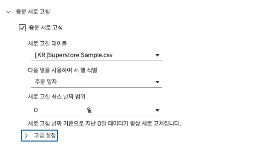
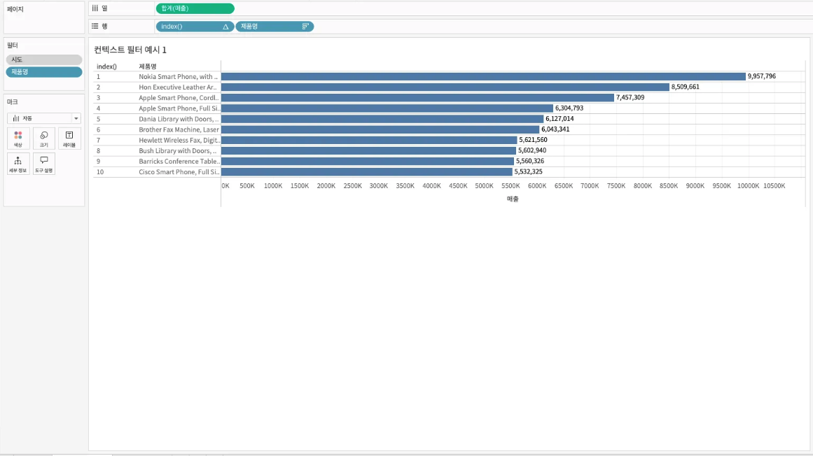

## 학습 목표

- Tableau의 작업 순서(Order of Operations)를 이해할 수 있습니다.
- 필터 적용 순서에 따라 결과가 달라지는 이유를 설명할 수 있습니다.
- 컨텍스트 필터가 필요한 대표 상황을 구분할 수 있습니다.

## 목차

1. 태블로 작업 순서
2. 필터 적용 순서
3. 컨텍스트 필터 활용

## 1. 태블로 작업 순서


Tableau는 사용자가 화면에서 필터를 여러 개 올려둔다고 해서, 그 필터들을 모두 같은 시점에 처리하지 않습니다. 내부적으로는 정해진 순서에 따라 데이터를 줄이고, 집계하고, 계산합니다. 이 순서를 이해하지 못하면 “왜 필터를 걸었는데 값이 바뀌지 않지?” 혹은 “왜 Top N이 이상하게 나오지?” 같은 문제가 반복됩니다.

특히 `FIXED LOD`, `Top N`, `집합(Set)`, `측정값 필터`, `테이블 계산`은 적용 시점 차이 때문에 결과가 크게 달라질 수 있습니다.

## 2. 필터 적용 순서

### 2-1. Extract Filters (추출 필터)

- 적용 시점: 데이터 추출(`.hyper`) 단계
- 특징: 추출 파일에 불필요한 데이터를 아예 포함하지 않으므로 파일 크기와 성능 최적화에 가장 효과적입니다.

즉, 추출 필터는 “나중에 걸러내는 필터”가 아니라 “애초에 가져오지 않는 필터”입니다. 데이터 용량이 크고, 특정 기간이나 특정 국가 데이터만 필요하다면 가장 먼저 고려할 수 있는 필터입니다.


증분 새로고침은 Tableau 추출에서 `새로운 데이터만 추가`하는 최적화 기능입니다. 일반적으로 날짜 필드나 증가하는 ID 필드를 기준으로 설정합니다.

다만 중요한 한계가 있습니다.

- 새로운 행 추가에는 적합합니다.
- 기존 데이터의 수정 또는 삭제는 반영하지 못합니다.

그래서 실무에서는 증분 새로고침만 두기보다, 일정 주기로 `전체 새로고침`도 함께 수행하는 운영 정책이 필요합니다.

### 2-2. Data Source Filters (데이터 소스 필터)

- 적용 시점: 추출 이후, 데이터 소스 전체 수준
- 특징: 하나의 데이터 원본을 사용하는 여러 시트에 공통으로 반영됩니다.

이 필터는 “특정 워크시트용 필터”라기보다 “이 데이터 원본을 사용하는 모든 분석에 공통 적용할 기준”에 가깝습니다.

### 2-3. Context Filters (컨텍스트 필터)

- 적용 시점: 다른 차원 필터보다 먼저 적용
- 특징: 이후 필터와 계산의 기준이 되는 임시 하위 집합(Context)을 만듭니다.

컨텍스트 필터는 단순히 “먼저 적용되는 필터”가 아닙니다. 더 정확히는, 나머지 필터들이 평가될 데이터 집합 자체를 다시 정의하는 역할을 합니다.

### 2-4. Dimension Filters (차원 필터)

- 적용 시점: 차원(Dimension) 값 기준 필터링
- 특징: 카테고리, 지역, 고객 세그먼트처럼 불연속형 필드의 값을 걸러냅니다.

### 2-5. Measure Filters (측정값 필터)

- 적용 시점: 집계된 측정값 결과 기준
- 특징: `SUM([매출]) > 1000000`처럼 집계 이후 결과를 걸러낼 때 사용합니다.

### 2-6. Table Calculation Filters (테이블 계산 필터)

- 적용 시점: 뷰(View)에서 테이블 계산이 끝난 후
- 특징: 순위, 누계, 이동평균 같은 계산이 완료된 뒤 마지막으로 필터링합니다.

필터 적용 순서를 한 줄로 정리하면 다음과 같습니다.

1. Extract Filters
2. Data Source Filters
3. Context Filters
4. Dimension Filters
5. Measure Filters
6. Table Calculation Filters

## 3. 컨텍스트 필터 활용

### 3-1. Top N과 함께 사용할 때



예를 들어 “제품 중분류가 의자인 제품 중 상위 10개 제품명”을 보고 싶다고 하겠습니다.

- 열: 합계(매출)
- 행: 제품명
- 필터: 제품명(매출 기준 상위 10개), 시도

이때 시도 필터를 일반 차원 필터로만 두면, Top N 계산이 기대와 다르게 동작할 수 있습니다. 왜냐하면 Top N 계산이 시도 필터보다 먼저 평가될 수 있기 때문입니다.

따라서 `시도` 필터를 컨텍스트 필터에 추가하면, 먼저 시도 기준으로 데이터 집합을 줄인 뒤 그 안에서 상위 10개를 계산하게 됩니다.

### 3-2. FIXED LOD와 함께 사용할 때



예를 들어 `고객 세그먼트` 필터를 걸고도 시도별 매출 FIXED 결과가 필터에 맞춰 바뀌게 하고 싶다면, 고객 세그먼트 필터를 컨텍스트 필터로 올려야 합니다.

```tableau
// C_Fixed 시도별 매출
{ FIXED [시도] : SUM([매출]) }
```

`FIXED`는 기본적으로 일반 차원 필터의 영향을 받지 않습니다. 그래서 필터를 걸었는데도 FIXED 결과가 그대로인 경우가 생깁니다. 이런 상황에서 컨텍스트 필터는 FIXED가 계산되기 전에 데이터 집합을 먼저 제한해 주는 장치가 됩니다.
