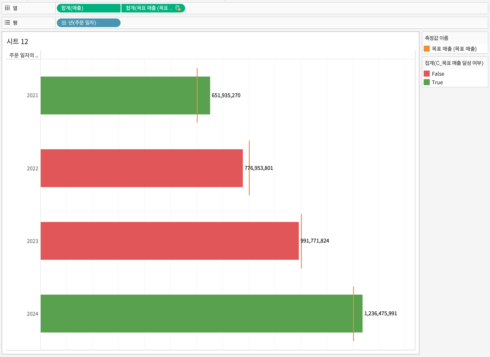
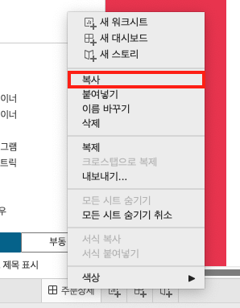
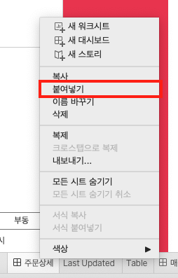
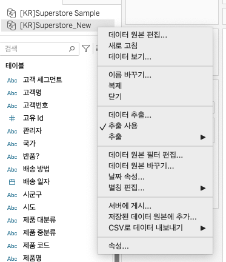
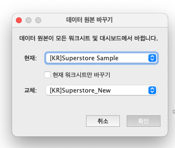

## 학습 목표

- 여러 Tableau 통합 문서를 하나로 합치는 방법을 이해할 수 있습니다.
- 기존 시각화를 유지한 채 데이터 원본을 교체하는 흐름을 익힐 수 있습니다.
- 필드 참조를 다른 필드로 바꾸는 상황과 사용법을 구분할 수 있습니다.

## 목차

1. 통합 문서 합치기
2. 데이터 원본 바꾸기
3. 참조 바꾸기

실무에서는 데이터를 새로 붙이는 것만큼이나, `이미 만들어 둔 시각화를 유지하면서 연결만 바꾸는 작업`이 중요합니다.

대표적인 상황은 다음과 같습니다.

- 팀원별로 만든 Tableau 통합 문서를 하나로 합쳐야 할 때
- 샘플 Excel 데이터로 만들던 분석을 실제 DB 연결로 교체할 때
- 전처리팀이 수정한 새 파일로 원본만 교체해야 할 때
- 컬럼명이 바뀌어 깨진 필드 참조를 빠르게 복구해야 할 때

## 1. 통합 문서 합치기

대시보드를 여러 명이 나눠 작업하면 각각 `.twb` 또는 `.twbx` 파일이 생깁니다.  
이때 결과를 하나의 통합 문서로 모으고 싶다면, 시트를 다시 만드는 대신 기존 통합 문서를 가져와 시트 단위로 복사하면 됩니다.

### 1-1. 통합 문서 가져오기

`파일(File)` 메뉴의 `통합 문서 가져오기(Import Workbook)`를 사용하면 다른 Tableau 통합 문서를 현재 파일 안으로 불러올 수 있습니다.

### 1-2. 시트 복사

가져온 통합 문서의 시트 탭에서 원하는 워크시트나 대시보드를 복사합니다.

### 1-3. 현재 통합 문서에 붙여넣기

붙여넣기를 하면 해당 시트가 현재 통합 문서로 들어옵니다.

## 2. 데이터 원본 바꾸기

데이터 원본 바꾸기는 기존 시트를 최대한 유지한 채, 연결된 데이터 소스만 다른 원본으로 교체하는 기능입니다.

### 2-1. 작업 순서

1. 현재 워크북에 새 데이터 원본을 추가로 연결합니다.
2. 상단 메뉴에서 `데이터(Data) > 데이터 원본 바꾸기(Replace Data Source)`를 선택합니다.
3. 현재 사용 중인 데이터 원본과 새로 교체할 데이터 원본을 지정합니다.
4. 확인을 누르면 기존 시트가 새 데이터 원본 기준으로 다시 연결됩니다.

### 2-2. 주의할 점

다음 조건이 맞지 않으면 일부 시트가 깨질 수 있습니다.

- 필드명 불일치
- 데이터 타입 불일치
- 차원/측정값 역할 차이
- 날짜/지리 역할 차이

## 3. 참조 바꾸기

참조 바꾸기는 데이터 원본 전체를 바꾸는 기능이 아니라, `특정 필드가 참조하는 대상을 다른 필드로 교체하는 기능`입니다.

대표적인 사용 상황은 다음과 같습니다.

- 전처리 이후 컬럼명이 바뀌었을 때
- 기존 필드가 삭제되어 에러가 발생할 때
- 비슷한 의미의 새 필드로 계산식과 시트를 빠르게 전환하고 싶을 때

### 3-1. 작업 순서

1. 에러가 나는 필드 또는 교체하려는 필드를 마우스 오른쪽으로 클릭합니다.
2. `참조 바꾸기(Replace References)`를 선택합니다.
3. 대체할 필드를 선택한 뒤 확인합니다.

### 3-2. 데이터 원본 바꾸기와의 차이

- 데이터 원본 바꾸기: 데이터 소스 전체를 교체
- 참조 바꾸기: 특정 필드의 연결만 교체
