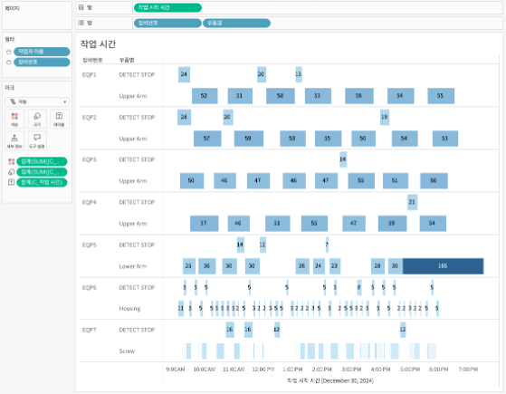

## 학습 목표

- 간트 차트의 개념과 활용 목적을 이해합니다.
- 작업 기간, 단계, 일정 흐름을 간트 차트로 표현할 수 있습니다.
- 막대 차트와 간트 차트의 차이를 설명할 수 있습니다.
- Tableau에서 간트 차트를 만드는 방법을 적용할 수 있습니다.

## 목차

1. 간트 차트란?
2. 간트 차트를 자주 쓰는 이유
3. Tableau에서 간트 차트 만드는 방법

## 1. 간트 차트란?

간트 차트는 작업의 시작 시점과 종료 기간을 막대 길이로 표현하여, 일정 계획과 진행 상태를 시간 축 기준으로 보여주는 차트입니다.

- 시작 시점과 종료 시점이 있는 데이터를 표현하기 좋습니다.
- 프로젝트 관리, 생산 일정, 주문 처리 단계 분석에 자주 사용합니다.
- 막대의 길이가 단순 크기 비교가 아니라 기간을 나타낸다는 점이 핵심입니다.

즉, 간트 차트는 “언제 시작했는가”와 “얼마나 오래 걸렸는가”를 동시에 보여주는 차트입니다.

## 2. 간트 차트를 자주 쓰는 이유

간트 차트는 프로젝트 일정, 작업 기간, 단계 간 겹침 여부를 확인할 수 있어 일정 관리와 진행 현황 파악에 효과적입니다.

실무에서는 다음과 같은 상황에서 특히 유용합니다.

- 프로젝트 단계별 진행 기간 비교
- 주문 접수부터 배송 완료까지 리드타임 분석
- 생산 공정별 소요 시간 비교
- 공장 장비 가동 시간 시각화

즉, 간트 차트는 "얼마나 큰가"보다 "언제 시작해서 얼마나 오래 걸렸는가"를 보여주는 데 강합니다.

## 3. Tableau에서 간트 차트 만드는 방법

이미지처럼 간트 차트는 `시작 시간`을 축에 두고, `작업명`을 행에 배치한 뒤, 마크 유형을 `간트 차트`로 바꾸고 `크기`에 작업 지속 시간을 넣어 만듭니다.

구성 순서는 다음과 같습니다.

1. `열`에 시작 시각 필드를 올립니다.
2. `행`에 설비명, 작업명 같은 차원을 순서대로 올립니다.
3. 마크 유형을 `간트 차트(Gantt Bar)`로 바꿉니다.
4. 계산된 지속 시간 필드(예: 종료 시각 - 시작 시각)를 `크기(Size)`에 넣습니다.
5. 필요하면 상태나 설비 구분 필드를 `색상(Color)`에 넣어 막대를 구분합니다.
6. 시간을 분 단위나 시 단위로 정리해 축 눈금을 읽기 쉽게 맞춥니다.

예시 화면 기준으로 보면 다음과 같습니다.

- `열`: 작업 시작 시간
- `행`: 설비명, 부속명
- `마크`: 간트 차트
- `크기`: 작업 시간 또는 시작-종료 차이 계산값

이 구조를 쓰면 각 작업이 `언제 시작했고`, `얼마나 오래 지속됐는지`를 동시에 읽을 수 있습니다.  
겹치는 막대가 많아지면 설비별로 행 계층을 먼저 나누고, 작업명을 그 아래 두는 방식이 가장 해석이 자연스럽습니다.
