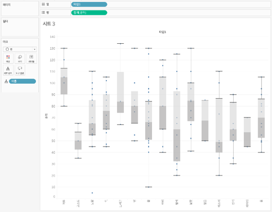

## 학습 목표

- 박스 플롯의 개념과 구성 요소를 이해합니다.
- 분포, 중앙값, 이상치를 박스 플롯으로 해석할 수 있습니다.
- 범주별 분포 비교에 박스 플롯이 적합한 이유를 설명할 수 있습니다.
- Tableau에서 박스 플롯을 만드는 방법을 적용할 수 있습니다.

## 목차

1. 박스 플롯이란?
2. 박스 플롯을 자주 쓰는 이유
3. Tableau에서 박스 플롯 만드는 방법

## 1. 박스 플롯이란?

박스 플롯은 데이터의 대략적인 분포와 개별적인 이상치를 동시에 보여줄 수 있으며, 서로 다른 데이터 뭉치를 쉽게 비교할 수 있도록 도와주는 시각화 기법입니다.

즉, 평균값 하나만 보여주는 차트와 달리 `중앙값`, `사분위수`, `이상치`, `분포 범위`를 함께 보여 주기 때문에 데이터가 어떻게 퍼져 있는지까지 읽을 수 있습니다.

- 중앙값
- 1사분위수(Q1)
- 3사분위수(Q3)
- 수염(whisker)
- 이상치(outlier)

이 요소들을 한 번에 보여주기 때문에 단순 평균보다 데이터 분포를 더 풍부하게 읽을 수 있습니다.

## 2. 박스 플롯을 자주 쓰는 이유

박스 플롯은 평균만으로는 확인하기 어려운 데이터 퍼짐 정도와 그룹 간 변동성 차이를 비교하는 데 적합합니다.

특히 다음 질문에 답할 때 유용합니다.

- 어느 범주의 변동성이 더 큰가?
- 중앙값 기준으로 어느 집단이 더 높은가?
- 이상치가 많은 집단은 어디인가?

실무에서는 평균이 비슷해도 분포가 완전히 다른 경우가 많습니다.  
이때 박스 플롯은 평균 막대 차트보다 훨씬 정확한 해석을 도와줍니다.

대표적인 활용 예시는 다음과 같습니다.

- 지역별 매출 분포 비교
- 고객 구매 금액 변동성 분석
- 부서별 개인의 성과 분산 확인

즉, 박스 플롯은 “누가 평균이 더 높은가”보다 “어디가 더 들쑥날쑥한가”를 보고 싶을 때 특히 강합니다.

## 3. Tableau에서 박스 플롯 만드는 방법

이미지처럼 박스 플롯은 `범주 차원`과 `측정값`을 먼저 배치한 뒤, 분석 패널 또는 표현 방식으로 박스 플롯을 추가해 만듭니다.

구성 순서는 다음과 같습니다.

1. `열` 또는 `행`에 비교할 범주 차원을 배치합니다.
2. 반대 축에 측정값을 올립니다.
3. `Show Me`에서 박스 플롯을 선택하거나, `분석(Analytics)` 패널에서 `박스 플롯`을 시트에 끌어옵니다.
4. 점(Mark)이 함께 보이도록 두면 개별 관측치와 이상치를 동시에 확인할 수 있습니다.
5. 필요하면 범주를 정렬해 분포 차이가 큰 그룹부터 보이도록 조정합니다.

예시 화면 기준 구성은 다음과 같습니다.

- `열`: 범주 차원
- `행`: 측정값
- `분석 패널`: 박스 플롯 추가
- `마크`: 개별 점 표시

이 방식의 장점은 하나의 화면에서 `중앙값`, `사분위수`, `이상치`, `분산`을 함께 볼 수 있다는 점입니다.  
표본 수가 너무 적으면 상자 모양이 왜곡될 수 있으므로, 실무에서는 건수 확인용 표나 라벨을 같이 두는 편이 안전합니다.
