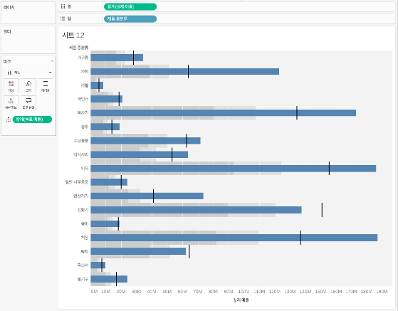

## 학습 목표

- 불릿 차트의 개념과 목적을 이해합니다.
- 실제값, 목표값, 기준 구간을 한 화면에서 비교할 수 있습니다.
- KPI 관리에 불릿 차트가 적합한 이유를 설명할 수 있습니다.

## 목차

1. 불릿 차트란?
2. 불릿 차트를 자주 쓰는 이유
3. Tableau에서 불릿 차트 만드는 방법

## 1. 불릿 차트란?

불릿 차트는 실제 성과 값을 기준선과 목표 구간 대비로 표현하여, KPI 달성 수준을 한눈에 평가할 수 있도록 설계된 성과 비교 차트입니다.

즉, 단일 지표의 현재 상태를 `실제값`, `목표값`, `성과 범위`와 함께 보여주기 때문에 대시보드형 성과 관리에 적합합니다.

- 실제값
- 목표값
- 성과 범위(낮음/보통/좋음)

이 세 요소를 한 번에 볼 수 있어 KPI 비교에 매우 효율적입니다.

## 2. 불릿 차트를 자주 쓰는 이유

불릿 차트는 숫자 하나만 보는 KPI 카드보다 `목표 대비 현재 수준`을 더 풍부하게 보여줍니다.

대표적인 활용 예시는 다음과 같습니다.

- 매출 목표 대비 실적 비교
- KPI 달성 수준 모니터링
- 부서별 성과 평가 표시

KPI 숫자만 보여주면 크기 비교는 되지만 목표 대비 상태를 직관적으로 읽기 어렵습니다.  
이때 불릿 차트는 숫자 하나보다 훨씬 빠른 판단을 돕습니다.

즉, 불릿 차트는 `성과가 좋은가/나쁜가`를 단순히 값으로 보는 것이 아니라, 기준선과 함께 비교하는 데 강합니다.

## 3. Tableau에서 불릿 차트 만드는 방법

이미지처럼 불릿 차트는 실제값 막대 위에 `목표선`, 배경의 `성과 구간`을 함께 두는 구조로 만듭니다.

구성 순서는 다음과 같습니다.

1. 비교할 범주 차원을 `행`에 배치합니다.
2. 실제 성과값을 `열`에 올려 기본 막대 차트를 만듭니다.
3. `분석(Analytics)` 패널에서 `참조선(Reference Line)`을 추가해 목표값을 표시합니다.
4. 같은 패널에서 `참조 구간(Reference Band)`을 추가해 낮음/보통/우수 같은 성과 구간을 표현합니다.
5. 실제값 막대 색은 진하게, 배경 구간은 연하게 두어 우선순위를 분리합니다.

예시 화면 기준 핵심 구성은 다음과 같습니다.

- `행`: 제품 중분류
- `열`: 실제 매출
- `참조선`: 목표값
- `참조 구간`: 성과 범위

이 구조를 쓰면 하나의 차트 안에서 `실적`, `목표`, `성과 수준`을 동시에 읽을 수 있습니다.  
기준 구간 색이 너무 강하면 실제값 막대보다 배경이 먼저 보이므로, 실무에서는 보조 역할에 머무르도록 연한 회색 계열을 쓰는 편이 좋습니다.
